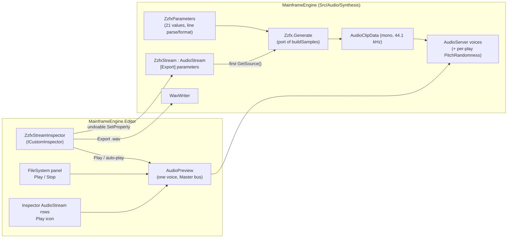

# Proposal: ZzFX sounds and the editor sound designer

**Milestone:** [M7 — Audio](../../milestones.md#m7--audio-) follow-up ("Audio preview in the editor") · **Status:**
proposed (design only, 2026-10-08) · **Depends on:** [Audio](../audio.md), [Editor → Inspector](../editor.md#inspector),
[Resource files and custom inspectors](../editor.md#resource-files-and-custom-inspectors) · **Related:**
[Future: editor](editor.md) ("Editor previews and handles")

## Problem

Prototypes need placeholder sounds (jump, coin, hit, laser, explosion) long before anyone opens a DAW. Today the only
in-engine route is hand-written sample maths fed to `AudioStream.FromSamples` (the Demo's `ClickToPlay2D.Blip()`),
which is slow to iterate on and impossible to tweak by ear. The usual answer, an sfxr-style web tool exporting `.wav`
files, loses the parameters: changing a sound means redoing it in the tool and re-exporting.

The editor also cannot make a sound at all: `EditorApp` runs with `Audio = new AudioOptions { Enabled = false }`
([EditorApp.cs:88-89](../../../MainframeEngine.Editor/Src/EditorApp.cs), "audio previews come later"), so there is no
way to listen to any `.wav`/`.ogg` in a project without running the game.

## Goals

- **ZzFX in the engine.** A C# port of [ZzFX](https://github.com/KilledByAPixel/ZzFX) 1.4.0 (MIT, Frank Force) that
  produces the same samples as the reference for the same parameters.
- **A ZzFX sound is an `AudioStream`.** A resource (`.mres`, or inline) holding the 21 ZzFX parameters, usable in every
  `AudioStream` slot (`AudioPlayer*.Stream`, `PlayOneShot`, exported fields) with no extra code. Samples are synthesised
  on first use.
- **Interop with the web designer.** Paste a ZzFX line (`zzfx(...[,,925,.04,.3,.6,1,.3,,6.27,-184,.09,.17])`) into a
  sound, copy a sound out as a line. A pasted sound sounds the same as it did in the browser.
- **A designer in the editor**, the custom inspector of the sound resource: every parameter as a slider, Play, auto-play
  on change, presets (pickup, laser, explosion, hit, jump, blip, power-up), Randomize, Mutate, a waveform view and
  Export `.wav`. Every edit is undoable and saved with the resource.
- **Editor audio previews everywhere:** a Play button for audio files in the FileSystem panel and for `AudioStream`
  slots in the inspector.

## Non-goals

- ZzFXM (the music tracker) or any sequencing. Sounds only.
- A general synthesiser or effect graph. ZzFX's parameter set is the whole model; SoundFlow's `SoundFlow.Synthesis`
  stays unused (game code never calls SoundFlow, and a music synth is not what placeholders need).
- Game-defined generator types. The new override hook is engine-internal (`private protected`); games that want their
  own procedural audio keep using `AudioStream.FromSamples`.
- Live re-synthesis while a voice plays, or per-frame parameter automation. Changing a parameter re-synthesises on
  the next play.
- Audio playback from `[Tool]` nodes in edit mode (see [Edit mode stays silent](#edit-mode-stays-silent)).
- Draggable range handles for audio in the viewport (the other half of the M7 row; separate work).

## Overview



## Engine

### The ZzFX port

`MainframeEngine/Src/Audio/Synthesis/Zzfx.cs` (new folder), a line-for-line port of `ZZFX.buildSamples` from ZzFX 1.4.0
with the MIT notice in the file header and a row in `THIRD_PARTY_NOTICES.md`.

```csharp
public static class Zzfx
{
    public const int SampleRate = 44100;       // zzfxR
    public const float MasterVolume = 0.3f;    // zzfxV: baked in, so pasted sounds match the browser's loudness
    public const float MaxSeconds = 10f;

    /// <summary>Mono samples for <paramref name="p"/>, randomness ignored (it is applied per play, like ZZFXSound).</summary>
    public static float[] Generate(in ZzfxParameters p);
}
```

- **Randomness is not baked in.** ZzFX 1.4's `ZZFXSound` builds the samples with `randomness = 0` and varies the
  playback rate on every play (`pitch + pitch * randomness * (random * 2 - 1)`). The port does the same: `Generate`
  is deterministic (the only `Math.random()` in `buildSamples` multiplies the start frequency by the randomness, which
  is 0 here), and the variation moves to [`PitchRandomness`](#per-play-pitch-randomness).
- **Maths in `double`**, as JavaScript does, stored as `float`. The biquad filter, bit crush, delay line, tremolo,
  repeat, pitch jump and the six shapes follow the reference exactly, including its quirks (the `tan` shape, the
  `sin(t³)` "noise" shape).
- **Length** is `attack + decay + sustain + release + delay` seconds. Anything over `MaxSeconds` is a load error
  (`LoadError`, logged once, silent stream) rather than a surprise multi-megabyte allocation. No clamping of the
  output: ZzFX does not clamp, and the mixer handles overs the same as for any file.

`ZzfxParameters` (a `record struct` in the same folder) holds the 21 values in ZzFX order and handles the line format:

- `static bool TryParse(string text, out ZzfxParameters p, out string? error)` accepts `zzfx(...[…])`, `zzfx(…)`,
  `[…]` or a bare list. Empty slots (`,,`) and missing trailing values take ZzFX's defaults; numbers are invariant
  culture, with or without a leading zero (`.3`).
- `string ToLine()` writes the shortest equivalent line: defaults become empty slots, trailing defaults are dropped,
  and numbers use the minimal round-trip form without a leading zero, like the web designer
  (`zzfx(...[,,925,.04,.3,.6,1,.3,,6.27,-184,.09,.17])`).

### `ZzfxStream`

`ZzfxStream : AudioStream` (`Src/Audio/Synthesis/ZzfxStream.cs`), registered by the generator like every resource and
listed in the editor's New Resource dialog. One `[Export]` property per ZzFX parameter, grouped with `[ExportGroup]` so
the generic inspector, which still shows inline sounds, reads in a sensible order:

| Group | Property (ZzFX name) | Type | Inspector range | ZzFX default |
|---|---|---|---|---|
| Sound | `Volume` (volume) | float | 0..5 | 1 |
| | *(randomness: the inherited `PitchRandomness`)* | float | 0..1 | 0.05 |
| | `Frequency` (frequency, Hz) | float | 0..20000 | 220 |
| | `Shape` (shape) | `ZzfxShape`: Sine, Triangle, Saw, Tan, Noise, Square | enum | Sine |
| | `ShapeCurve` (shapeCurve; Square: duty) | float | 0..5 | 1 |
| Envelope | `Attack`, `Decay`, `Sustain`, `Release` (seconds) | float | 0..3 | 0, 0, 0, 0.1 |
| | `SustainVolume` (sustainVolume) | float | 0..1 | 1 |
| Pitch | `Slide`, `DeltaSlide` | float | −10..10 | 0 |
| | `PitchJump` (Hz), `PitchJumpTime` (s) | float | −1000..1000, 0..1 | 0 |
| | `RepeatTime` (s) | float | 0..1 | 0 |
| Effects | `Noise`, `Modulation` (Hz), `BitCrush`, `Delay` (s), `Tremolo` | float | 0..5, −500..500, 0..1, 0..0.5, 0..1 | 0 |
| | `Filter` (Hz; positive = low-pass, negative = high-pass) | float | −10000..10000 | 0 |

Ranges only bound the sliders. The inspector clamps what you type, but loading and pasting never clamp, so a line from
the web designer with an out-of-range value plays exactly as it did there.

- **Defaults are ZzFX's defaults,** so a new `ZzfxStream` is ZzFX's default sound, the `.mres` stores only what differs
  (the serializer already omits defaults), and the line format round-trips.
- **`ZzfxStream` overrides the defaults it inherits:** `PitchRandomness` defaults to 0.05 (ZzFX's), `File` and
  `LoadMode` are unused (hidden by the custom inspector; the generic rows of an inline sound show them, harmlessly).
  `Loop`/`LoopStart`/`LoopEnd` work as for any stream.
- **Synthesis on first use.** `GetSource()` calls `Zzfx.Generate` and wraps the result in
  `AudioClipData.FromSamples` on the game thread, like a `Memory` decode. Players already preload their stream when
  they enter the tree, so the cost (well under a millisecond for a 1 s sound) lands at load, not on the first play.
  Every parameter setter drops the cached source. Voices that are playing keep the old `AudioClipData` (it is never
  mutated in place), so an edit while a sound plays cannot glitch it.
- **Not for per-frame changes.** Setting a parameter re-synthesises (and allocates) on the next play. The doc comment
  says so; the allocation gate is unaffected because nothing synthesises inside the frame loop unless game code
  changes parameters every frame.

Saved form (only non-default values, standard `.mres`):

```json
{
  "format": 2,
  "uid": "res_…",
  "type": "ZzfxStream",
  "props": { "ResourceName": "Coin", "Frequency": 925, "Attack": 0.04, "Sustain": 0.3, "Release": 0.6, "Shape": "Triangle", … }
}
```

### Changes to `AudioStream`

Small and backwards compatible (no scene format change; existing `.mscene`/`.mres` files load as before):

- `GetSource()`'s file branch moves into `private protected virtual AudioSource? CreateSource()`, which `ZzfxStream`
  overrides. `private protected` because `AudioSource` is internal; only engine types can be generators.
- `Invalidate()` becomes `private protected`, so subclasses can drop their source when a parameter changes.
- `Fail()` logs `File ?? ResourceName`; a `ZzfxStream` failure names the resource.

### Per-play pitch randomness

New on every `AudioStream`: `[Export(Range = "0,1,0.01")] float PitchRandomness` (default 0; `ZzfxStream`: 0.05). On
every voice start (players and `PlayOneShot`) `AudioServer` multiplies the voice's pitch by
`1 + PitchRandomness * (2u − 1)` for a uniform `u` in [0, 1). This is ZzFX's `randomness` with the meaning it has in
`ZZFXSound.play`, and it is useful for imported footsteps and impacts too (Godot's `AudioStreamRandomizer` pitch).

- The random source is a server-owned xorshift on the game thread: no allocation, no `System.Random` shared state.
  `AudioOptions.RandomSeed` (internal, tests) makes it deterministic.
- Applied once per voice start, before the existing pitch clamp (0.01–16) and doppler; `PitchScale` changes during
  playback multiply the varied base as they do today.

### `WavWriter`

`MainframeEngine/Src/Audio/Decoding/WavWriter.cs` (the decoders' folder, so the format lives in one place): writes
interleaved float samples as 16-bit PCM or 32-bit float WAV. It replaces the test helper
`AudioTestUtil.WriteWav` ([AudioTestUtil.cs:99](../../../Tests/MainframeEngine.Tests/Audio/AudioTestUtil.cs)), which
then calls it. The designer's Export uses 16-bit PCM, 44.1 kHz mono, which every DAW and tool reads.

## Editor

### Editor audio

`EditorApp` enables audio: `AudioOptions { Enabled = true }` with the engine's default bus layout. The project's bus
layout is deliberately not applied, so a project that mutes or ducks SFX cannot silence previews. With no device the
server falls back to the null device as it does for games: previews then "play" silently, and editor tests run as
before.

### Edit mode stays silent

Lifecycle callbacks run in edit mode ([SceneTree.EditMode](../../../MainframeEngine/Src/Scene/SceneTree.cs)), so once
the editor has an `AudioServer`, every `Autoplay` player in an open scene would start in `OnReady`. Rule: **audio nodes
are inert in edit mode.** `AudioPlayback` (shared by the three players) ignores `Play()` and `Autoplay` while
`Tree.EditMode` is set, and `AudioListener3D` does not take the listener. The editor plays sounds only through
`AudioPreview`, so opening a scene never makes noise. (Godot lets `[Tool]` scripts play audio in the editor; nobody has
asked for that here, and it can be added by exempting tool nodes later.)

### `AudioPreview`

`MainframeEngine.Editor/Src/Audio/AudioPreview.cs`, owned by `EditorWorkspace`: one preview voice at a time.

- `Play(AudioStream stream)` stops the current preview and calls `AudioServer.PlayOneShot(stream, bus: "Master",
  processMode: ProcessMode.Always)`: non-positional, so the edit camera and listener do not matter.
- `Toggle(stream)`, `Stop()`, `IsPlaying(stream)` drive the Play/Stop icon state. The workspace refreshes the icons
  when the voice ends (polled once per frame through `AudioServer.IsPlaying`; no events).
- Pressing **Play** (running the game) stops the preview.
- A stream that cannot load reports `LoadError` in the Output panel (it is already logged once) and the button stays
  "Play".
- For audio *files*, `AudioPreview` loads through `ResourceLoader.Load<AudioStream>` (import settings applied, shared
  cache), so previewing a 5-minute `.ogg` streams it rather than decoding it.

### Play everywhere

- **FileSystem panel:** audio files (`.wav .ogg .mp3 .flac`) and `.mres` files whose root type is an `AudioStream`
  get **Play / Stop** in the right-click menu. Double-clicking an audio file toggles its preview (today it only logs
  the file's size). A playing file shows the `icon-player-stop` badge in all three views.
- **Inspector `AudioStream` rows:** the resource row's icon buttons (Edit, Load, New, Clear) gain a Play/Stop icon
  button when the slot holds an `AudioStream`, with the tooltip "Play — preview this sound in the editor". This covers
  `AudioPlayer*.Stream`, exported `AudioStream` fields on game nodes and resources, and inline `ZzfxStream`s, whose
  generic rows are their (designer-less) editor.

### The designer: `ZzfxStreamInspector`

`[CustomInspector(typeof(ZzfxStream))]` in `MainframeEngine.Editor/Src/Inspector/ZzfxStreamInspector.cs`, the same
pattern as `AudioBusLayoutInspector`. It is used when a `ZzfxStream` is the inspected target: a `.mres` opened from
the FileSystem panel (double-click), or Edit on a slot holding a `.mres` sound. Inline sounds folded inside another
inspector keep the generic rows (custom headers are top-level only today). The header sits above the generated
parameter rows, which stay the slider UI:

```
┌ Inspector ─ Coin.mres ─────────────────────────────────────────┐
│ ▶ Play   ⟳ Auto-play   │  0.94 s · 44.1 kHz mono               │
│ ▁▂▅█▇▆▅▅▄▄▃▃▃▂▂▂▂▁▁▁▁▁▁▁▁▁▁▁▁▁▁▁▁                              │ waveform
│ [coin] [laser] [explode] [hit] [jump] [blip] [power-up]        │ presets
│ 🎲 Randomize   ✎ Mutate   ⧉ Copy ZzFX   📋 Paste ZzFX   ⤓ .wav │
├─ Sound ────────────────────────────────────────────────────────┤
│ Volume            ━━━━━━━━●━━━━━━━  1                          │ generated rows
│ Frequency         ━━━●━━━━━━━━━━━━  925                        │ (sliders, undo,
│ …                                                              │  merged drags)
```

All buttons are icon buttons with tooltips (editor convention); the labels above are only for the sketch.

- **Play / Stop** toggles `AudioPreview` for the inspected stream. **Auto-play** (toggle, on by default, remembered in
  `editor_layout.json`) replays the sound after every committed change: a slider release, a field commit, a preset,
  Randomize, Mutate, Paste, undo or redo. Slider drags do not replay on every tick, only on release.
- **Waveform:** 96 columns of min/max peaks over the generated samples, drawn as `div` bars sized in `dp` (no texture,
  themed by RCSS, cheap to rebuild). It is computed from the cached samples and rebuilt with the header after a change.
  The info text shows the length and format, or the `LoadError` (for example "longer than 10 s") in the notice style.
- **Presets** (`ZzfxPresets`, engine side so games and tests can use them): sfxr-style generators for pickup/coin,
  laser/shoot, explosion, hit/hurt, jump, blip/select and power-up. Each draws from parameter distributions tuned
  for its category, using a `System.Random` seeded per click. A preset replaces all parameters (keeps `ResourceName`).
- **Randomize** draws every parameter from a broad "sensible" distribution. **Mutate** nudges each non-default
  continuous parameter by up to ±10 % (`Shape` unchanged), which is the fastest way to explore around a sound you
  nearly like.
- **Copy ZzFX** puts `ToLine()` on the clipboard. **Paste ZzFX** reads the clipboard through `ZzfxParameters.TryParse`;
  invalid text shows the parse error in a `MessageDialog` and changes nothing.
- **Export .wav** opens `FilePickerDialog` in save mode (it already asks before overwriting), defaulting to
  `<sound folder>/<ResourceName>.wav`, and writes through `WavWriter`. The new file gets its `.meta` and UID from the
  asset database like any dropped-in file.
- **Undo:** every action that changes parameters is **one** history entry: a preset, Randomize, Mutate or Paste sets
  all 21 values through `IInspectorContext` as a single grouped action. Undo/redo restore the sound and, with
  Auto-play, replay it.

### `ICustomInspector.OnPropertyChanged`

Auto-play needs to hear about edits made by the *generated* rows, which bypass the custom inspector. A new default
interface method:

```csharp
/// <summary>After a committed change to <paramref name="target"/> (a row edit, undo, redo, or an action). Default: nothing.</summary>
void OnPropertyChanged(object target, ExportPropertyInfo? property, IInspectorContext context) { }
```

It is called once per history entry: after a text commit, a checkbox/dropdown change or a merged slider drag ends,
not per drag tick; `property` is null for grouped actions and undo/redo. Existing custom inspectors are unaffected
(default implementation).

## Error handling

| Situation | Behaviour |
|---|---|
| Sound longer than `Zzfx.MaxSeconds` | `LoadError`, logged once, silent; the designer shows the error instead of the waveform |
| NaN/∞ parameter (hand-edited `.mres`) | `TryParse` rejects them; the loader keeps them but `Generate` treats non-finite as the default and logs a warning once |
| Paste of an invalid line | `MessageDialog` with the parse error; no change |
| No audio device in the editor | null device; previews are silent, nothing fails |
| `.wav` export I/O error | `Workspace.Commands.ReportError`, partial file deleted |

## Testing

- **Reference vectors.** `build/zzfx-reference.mjs` (committed, Node, run by hand) runs the pinned ZzFX 1.4.0
  `buildSamples` over ~15 parameter sets (defaults, each shape, filter ±, bit crush, delay, repeat, pitch jump, the
  presets' corners) and writes `Tests/Content/Audio/zzfx-reference.json` (sample count + every 64th sample).
  `ZzfxTests` compares the port within 1e-5. Node is only needed to regenerate the vectors, not for `just test`.
- **Line format:** parse ↔ format round trips, empty slots, trailing defaults, leading-dot numbers, the `zzfx(...[])`
  wrappers, invalid input (error text asserted).
- **`ZzfxStream`:** a parameter change invalidates the source; a voice playing the old source is unaffected;
  `MaxSeconds` makes a `LoadError`; serialization stores only non-defaults and round-trips.
- **`PitchRandomness`:** with a fixed `RandomSeed` on the null device, voice pitches fall in `[1 − r, 1 + r]` and
  differ between plays; 0 leaves pitch exactly unchanged. Allocation gate: playing a `ZzfxStream` one-shot per frame
  allocates nothing after the first synthesis.
- **`WavWriter`:** write → `WavDecoder` read round trip (16-bit within one LSB, float exact). The existing tests switch
  to it.
- **Editor** (`Tests/MainframeEngine.Editor.Tests`): edit mode keeps `Autoplay` players silent (null device:
  no voice started); `AudioPreview` plays one voice at a time and stops on Play; designer actions (preset, Randomize,
  Mutate, Paste) are one undo entry each and restore exactly; `OnPropertyChanged` fires once per merged slider drag.
- **QA:** `Tests/QA/editor-walkthrough.qa` gains a step: create a `ZzfxStream` resource, apply a preset, export
  `.wav`, preview the file from the FileSystem panel (screenshot of the designer).
- **Demo:** `ClickToPlay2D` swaps its hand-written blip for a `ZzfxStream` (`Blip` preset), so the Demo shows the
  feature.

## Delivery

Three PRs, each releasable on its own:

1. **Engine:** `Zzfx`, `ZzfxParameters`, `ZzfxShape`, `ZzfxStream`, `ZzfxPresets`, `AudioStream.PitchRandomness` and
   the `CreateSource` hook, `WavWriter`, tests and reference vectors, `THIRD_PARTY_NOTICES.md`, the Demo blip.
2. **Editor audio:** audio on in `EditorApp`, edit-mode silence, `AudioPreview`, Play in the FileSystem panel and on
   inspector `AudioStream` rows.
3. **Designer:** `ZzfxStreamInspector`, `ICustomInspector.OnPropertyChanged`, editor tests, the QA step.

Docs, with the PRs: [audio.md](../audio.md) (Synthesis section, key types, `PitchRandomness`),
[editor.md](../editor.md) (audio previews, the designer, edit-mode audio rule, `OnPropertyChanged`), an ADR (next
number) for "ZzFX as the engine's sound generator; randomness as per-play pitch; edit mode is silent", the M7 milestone
row and [Future: editor](editor.md) (audio preview done), and this proposal's status.

## Open questions

- **Preview level.** Previews play at 0 dB on Master. If that proves loud next to a running game, add an Editor Settings
  "Preview volume" slider.
- **Designer for inline sounds.** Custom inspector headers only appear for the top-level target. If designing inline
  sounds matters, a "Save as .mres" action on the slot (already on the future-editor list) turns one into a file the
  designer opens. Nesting custom headers is not planned.
