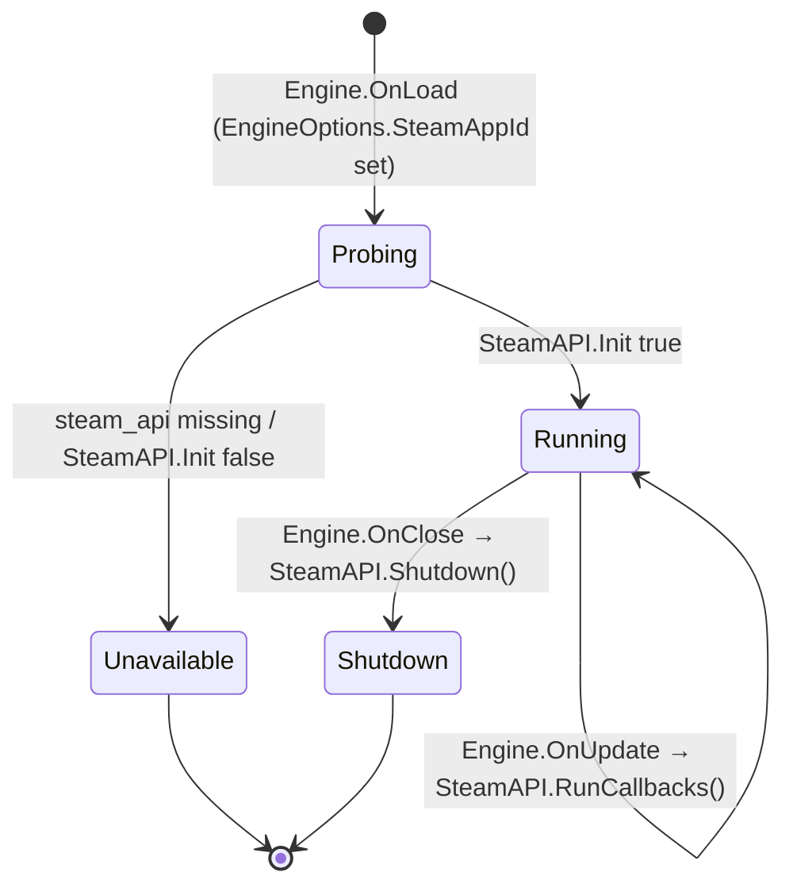

# Proposal: Steamworks Integration

**Milestone:** M5 · **Status:** ⬜ planned

## Problem

The Steam wrappers never run:

- `SteamManager` is a Unity leftover that compiles to `Initialized => false`.
- No `steam_api` native library ships, and callbacks are never pumped.
- The lobby code has bugs that would surface as soon as it ran.

See [Steamworks](../steamworks.md).

## Goals

- Steam starts only when available (Steam client running and the native library present), and the game
  continues without it otherwise (CLAUDE.md: "only activate if Steam is running").
- Callbacks are pumped once per frame from `Engine`.
- Lobbies work end to end, including invites and the ENet or Steam-sockets handoff.
- Avatars are available as Vulkan textures. Achievements persist.

## Proposed design

- Replace `SteamManager.cs` with a small engine-native `SteamManager` (no Unity, no preprocessor gate).
  Catch `DllNotFoundException` during init.
- `EngineOptions.SteamAppId` (nullable). In development, write `steam_appid.txt` next to the executable.
- Ship `steam_api64.dll`, `libsteam_api.so` and `libsteam_api.dylib` (from the Steamworks SDK, under
  its license) through a `runtimes/` folder. osx-arm64 depends on SDK support.
- Guard every wrapper with `Steam.Valid`.

### Lobby fixes

| Bug | Fix |
|---|---|
| Invite joins `Current` | join `callback.m_steamIDLobby` via `JoinLobbyAsync` |
| Create failure hangs | `TrySetException` / `TrySetResult(null)` |
| `SetResult` throws on a second enter | `TrySetResult`; check `m_EChatRoomEnterResponse` |
| Global `Callback<T>` for requests | `CallResult<T>` for `CreateLobby` and `RequestLobbyList` |
| `HostId` parse | `ulong.TryParse` |
| No timeouts | `CancellationToken` + timeout on all async calls |

### Transport handoff

Lobby metadata carries `connect = "enet:ip:port"` or `"steam:<steamId>"`. The
[networking transport](networking-replication.md) picks `EnetTransport` or `SteamSocketsTransport`.

### Avatars

`SteamUtils.GetImageRGBA` → `VkTexture` (from [GPU resource management](gpu-resource-management.md)).
Expose it to ImGui once the ImGui controller supports `TextureId`.

## Task list

- [ ] Engine-native `SteamManager` + init/pump/shutdown in `Engine`
- [ ] Native library packaging + `steam_appid.txt` for development
- [ ] Guard every wrapper with `Valid`
- [ ] Lobby fixes (table above) + `LobbyChatUpdate_t` member events
- [ ] `SteamAchievements.StoreStats` + `RequestCurrentStats`
- [ ] Avatars → textures; ImGui `TextureId` support
- [ ] Delete `SteamRemotePlay` or port it
- [ ] Update the README claims

## Open questions

- Is Steam Networking Sockets the primary transport for shipped builds?
- How do we handle osx-arm64 until Steamworks.NET ships arm64 assets?

## Related

[Milestones](../../milestones.md) · [Steamworks](../steamworks.md) · [Networking & replication](networking-replication.md)
