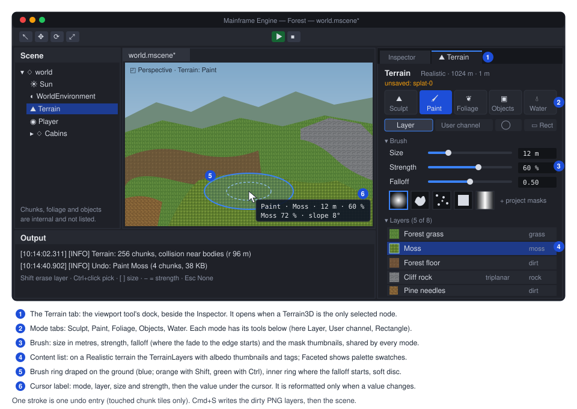

# Proposal: Terrain (Terrain3D, sculpt and paint tools, scatter, faceted and realistic profiles)

**Milestone:** [Gameplay toolkit](../../milestones.md#gameplay-toolkit-) (G8a) · **Status:** ⬜ planned ·
**Depends on:** [M6 physics](../physics.md) (trimesh collision), [M10 editor](../editor.md) (viewport, undo, save);
the Realistic profile also on [Rendering features](rendering-features.md) G6.1/G6.2 (PBR, IBL; Blinn-Phong fallback
until then) and G6.4 (index-only LODs) · **Related:** [Procedural trees](procedural-trees.md) (G8b:
`FoliageMaterial3D`, wind, `Tree3D` scatter), [Water](water.md) (G8c: renders the water layer),
[Forest showcase](forest-showcase.md) (G8d: the Realistic profile's first user),
[Editor viewport tools](editor-viewport-tools.md) (G7),
[ADR 0149](../../../memory/decisions/0149-terrain-trees-water-engine-features.md)



## Problem

The engine has no terrain. A 3D game today builds its ground from `MeshInstance3D` boxes or one hand-made mesh, and
has no way to sculpt, paint or scatter in the editor. This design was first written for a low-poly game built on the
engine, modelled on [TerraBrush](https://github.com/spimort/TerraBrush) (MIT). This proposal upstreams it as a
generic engine feature with two looks.

What exists, and what is missing:

- **Height fields.** `HeightMapShape3D` (`MainframeEngine/Src/Physics/3D/Shapes3D.cs:306-311`) is a trimesh
  ("Jitter2 has no native height field"), static only, centred, on a 1-unit grid, with one fixed diagonal
  (`GetFaces`, `:373`), and has no render side. `ConcavePolygonShape3D` (`:258`) adds one Jitter2 `TriangleShape` per
  face (`:280`; [physics.md](../physics.md#shape-resources--library-shapes)).
- **Vertices.** `MeshVertex` is a fixed 32 bytes: position, normal, UV
  (`MainframeEngine/Src/Rendering/Meshes/MeshVertex.cs:12-21`), with one vertex layout (`:45-49`). `MeshSurface` has
  no colours or custom data (`MainframeEngine/Src/Rendering/Resources/Mesh.cs:83-120`).
- **Materials.** 3D draws built-in materials only. Set 2 is one 80-byte block, one sampler and three images
  (`MainframeEngine/Content/Shaders/include/material.slang:24-29`,
  `MainframeEngine/Src/Rendering/Meshes/MeshRenderer.cs:158-171`).
  `OutlineMaterial3D` (`MainframeEngine/Src/Rendering/Resources/Material.cs:351`) shows how a built-in type adds a
  shader set (`MainframeEngine/Src/Rendering/Meshes/PipelineStateCache.cs:6-16`, ADR 0132). Lighting is Blinn-Phong
  (`MainframeEngine/Content/Shaders/include/lights.slang:99`).
- **Textures.** There is no texture-array resource, but the GPU side can make them: `GpuImageDesc.ArrayLayers`
  (`MainframeEngine/Src/Rendering/Vulkan/Memory/GpuImage.cs:8`), the shadow cascades
  (`MainframeEngine/Src/Rendering/Shadows/ShadowSystem.cs:581`) and the layer count of `GpuTexture.Create`
  (`MainframeEngine/Src/Rendering/Vulkan/Memory/GpuTexture.cs:84`, used for cubes at `:70`).
- **Texture updates.** `Texture2D.SetPixels` replaces the whole image
  (`MainframeEngine/Src/Rendering/Resources/Texture2D.cs:293`), `TextureGpu.Update` re-creates the GPU image on every
  change (`MainframeEngine/Src/Rendering/Meshes/MeshGpuResources.cs:148-170`) and `UploadImage` copies whole images
  (`MainframeEngine/Src/Rendering/Vulkan/Memory/UploadQueue.cs:96`). A painted map would be re-created every frame.
- **PNG.** The codec handles 8-bit RGB/RGBA only (`MainframeEngine/Src/Imaging/Png.cs:206-208`). Heights need 16.
- **Instancing.** Batching is automatic (ADR 0015), but every instance is a node and the shared `InstanceBuffer` is
  rewritten every frame (`MainframeEngine/Src/Rendering/Meshes/InstanceBuffer.cs:5-11`): about 0.19 ms of CPU per
  10,000 instances ([materials-and-meshes.md → Performance](../materials-and-meshes.md#performance)), before node
  costs. Foliage needs hundreds of thousands. There is no `MultiMesh`.
- **Editor.** No API lets a tool own the viewport while a node is selected: input goes to the gizmo and picking
  (`MainframeEngine.Editor/Src/Viewport/ViewportController.cs:285`), and `EditorSession.Save` writes only the scene
  (`MainframeEngine.Editor/Src/Session/EditorSession.cs:340-357`), so a tool has no hook to write its images.

## Goals

- `Terrain3D` + `TerrainData`: a square heightmap terrain with its layers as PNG files next to the scene, chunked
  meshes, collision built from the render triangles, exact queries and an analytic raycast.
- Two profiles, picked when the data is created: **Faceted** (flat palette colours, 2 m facets, today's renderer) and
  **Realistic** (smooth normals, 0.5–1 m spacing, chunk LOD, PBR texture layers with splat weights).
- A runtime paint API for games (surface, user channels, foliage, objects) with 0 B per frame and sub-rect uploads.
- A generic editor viewport-tool API (`IEditorViewportTool`) and a Terrain dock with Sculpt, Paint, Foliage,
  Objects and Water modes, brushes, per-stroke undo and a save hook.
- `MultiMesh` + `MultiMeshInstance3D` (Godot's API subset) for foliage and other mass instancing.
- Prerequisites as engine features in their own right: `Texture2DArray`, a second vertex stream
  (`MeshSurface.Colors`/`Custom0`), 16-bit grey PNG, `Texture2D.SetPixelsRect`.
- The Faceted profile ships first, on the Blinn-Phong renderer.

## Non-goals

- Streaming, zones or world partition. One terrain per scene, loaded whole (Realistic maps up to 2 km at 1 m).
- Holes, caves, overhangs, voxel terrain. Tunnels are meshes.
- A camera-centred clipmap or GPU height sampling (TerraBrush's approach). Heights stay on the CPU for queries.
- Runtime erosion or procedural generation tools beyond the brushes. Import a 16-bit PNG from another tool instead.
- Custom terrain shaders. The two materials are built-in types (ADR 0149).
- Water rendering, rivers and flow ([Water](water.md), G8c). This proposal owns the water *layer* only.
- Tree generation and wind ([Procedural trees](procedural-trees.md), G8b).

## Design

### Coordinates, grid and chunks

- **Origin at the map corner.** Terrain-local X and Z run from 0 to `SizeMeters`. World = `GlobalPosition` + local.
  Rotation and scale on the node are ignored, with an editor configuration warning.
- **Height vertices** sit at `(i·Spacing, h(i, j), j·Spacing)`, `i, j` in `0..N` with `N = SizeMeters / Spacing`.
- **Cells** are squares of `CellSize` (`[u, u+1) × [v, v+1)` cells). Surface, splat, user and foliage maps have one
  texel per cell. Images: column x runs along +X, row y along +Z, row 0 first.
- **Chunks** are `ChunkQuads × ChunkQuads` quads. Neighbours repeat their shared edge vertices from the same heights,
  so edges match bit for bit. `ChunkQuads` must be even and divide `N` (validated on load).

| Knob | Faceted default | Realistic default | Notes |
|---|---|---|---|
| `SizeMeters` | 512 | 1024 | max 1024 (Faceted), 2048 (Realistic) |
| `Spacing` | 2 m | 1 m | Realistic 0.5–1 m; ≤ 2049 × 2049 vertices |
| `CellSize` | 1 m | = `Spacing` | Faceted cells are half a quad, for crisper paint edges |
| `ChunkQuads` | 16 (32 m) | 64 (64 m at 1 m) | 256 chunks either way at the defaults |
| `HeightMin`/`HeightMax` | −16 / +48 m | −64 / +192 m | 16-bit decode range (1 mm / 4 mm steps) |
| `Diagonal` | `Checkerboard` | `Checkerboard` | below |

`Profile`, `SizeMeters`, `Spacing`, `CellSize` and `ChunkQuads` are fixed once the data is created. To change them,
import a resampled heightmap into new data.

**The diagonal rule.** Each quad `(i, j)` splits along a fixed diagonal. `Checkerboard` gives diamond facets that look
the same in every direction and keep ramps symmetric; `Uniform` uses diagonal A everywhere (as `HeightMapShape3D`).
Chunk origins are multiples of an even quad count, so local and global parity agree and every chunk shares one index
pattern.

| Quad | Diagonal | Triangles (counter-clockwise from above) |
|---|---|---|
| `Uniform`, or `Checkerboard` with `(i + j)` even | A: `(i+1, j)`–`(i, j+1)` | `(00, 01, 10)`, `(10, 01, 11)` |
| `Checkerboard` with `(i + j)` odd | B: `(i, j)`–`(i+1, j+1)` | `(00, 11, 10)`, `(00, 01, 11)` |

`HeightAt` interpolates on the triangle that contains the point (fractions `fx, fz` in the quad): A with
`fx + fz ≤ 1` gives `h00 + (h10−h00)·fx + (h01−h00)·fz`, otherwise `h11 + (h01−h11)·(1−fx) + (h10−h11)·(1−fz)`; B
with `fx ≥ fz` gives `h00 + (h10−h00)·fx + (h11−h10)·fz`, otherwise `h00 + (h01−h00)·fz + (h11−h01)·fx`. This is
exact on the drawn LOD 0 triangle. It is not nearest-pixel (TerraBrush) and not bilinear, which would disagree with
the surface by up to half a quad's twist.

### Data and files

`TerrainData : Resource` (`terrain.mres`, JSON like any resource, ADR 0011) holds the knobs above, `Profile`,
`Surfaces` (Faceted) or `Layers` (Realistic), `UserChannels`, `FoliageTypes`, `ObjectTypes`, the water settings
(`MaxWaterDepth`, default 1.2 m), `Material` (inline), `CollisionLayer`/`CollisionMask` (1, 0), `CollisionMode` and
`CastShadows`. It holds no pixels: those are images in its folder. A new terrain's folder is `<scene>_terrain/` next to
the scene, for example `Content/Scenes/world_terrain/`.

| File | Profile | Format, size | Contents |
|---|---|---|---|
| `terrain.mres` | both | JSON | the knobs and resource lists |
| `heightmap.png` | both | 16-bit grey, (N+1)² | `h = HeightMin + v / 65535 · (HeightMax − HeightMin)` |
| `surface.png` | Faceted | RGBA8, cells | R = surface id; G, B, A reserved (0) |
| `splat-0.png`, `splat-1.png` | Realistic | RGBA8, cells | weights of layers 0–3 and 4–7 (sum 255) |
| `user.png` | both | RGBA8, cells | four game-defined channels |
| `water.png` | both | RGBA8, (N+1)² | R = depth fraction; G, B flow (reserved for G8c); A reserved |
| `foliage-0.png`, `foliage-1.png` | both | RGBA8, cells | density of foliage types 0–3 and 4–7 |
| `objects.mres` | both | JSON | `ScatterObjectList`: `NextId` + instances `{Id, Type, X, Z, Yaw, Scale}` |
| `*.png.meta` | both | sidecar | linear, no mipmaps, nearest, clamp (`TextureImportSettings`) |

- Only dirty layers are written (temp file, then rename) on scene save; layers at their defaults are not written, and a
  missing file loads as its default, so a new folder works with only `terrain.mres`.
- **Heights are quantised at once.** Every height written is rounded to the 16-bit step, so save and load give back
  the same floats and the editor and the game stand on the same ground.
- **User channels** replace game-specific layers. `TerrainUserChannel { Name, Kind, Legend }`: `Kind = Value` blends
  (a cut-grass state, wetness, snow cover) and `Kind = Id` paints crisp ids (named areas, with a legend of names and
  editor colours). What a channel means is game data.
- **Ids are append-only.** Surface, layer, foliage-type and object-type indices are stored in images and lists, so
  they are never reordered or reused.

### `Terrain3D`, chunks and collision

`Terrain3D : Node3D` (`[EditorIcon("mountain")]`) is an engine type, so its enter and ready callbacks also run in edit
mode (ADR 0127). It has no per-frame callback of its own.

- **Chunks** are internal `TerrainChunk3D : GeometryInstance3D` children with no `Owner`, so the scene writer skips
  them (`MainframeEngine/Src/Serialization/SceneWriter.cs:227`) and a viewport click selects the terrain
  (`EditedScene.SelectableFor`, `MainframeEngine.Editor/Src/Session/EditedScene.cs:80`). Each overrides
  `GetRenderMesh` as `Sprite3D` does (`MainframeEngine/Src/Scene/Nodes3D/GeometryInstance3D.cs:181`), so the normal
  mesh renderer culls, sorts, shadows and ID-picks them. One `ArrayMesh` per chunk with chunk-local positions;
  UV = terrain-local XZ ÷ `SizeMeters`. A height edit rewrites the chunk's arrays in place and re-uploads it.
- **Collision** is one internal `StaticBody3D` per chunk with a `ConcavePolygonShape3D` whose faces are exactly the
  chunk's LOD 0 triangles: same heights, same diagonal, same winding. `HeightMapShape3D` is not used: its diagonal and
  origin differ, and it is a trimesh anyway. Collision is rebuilt at the end of an editor stroke for the touched
  chunks, and at once after a runtime `SetHeights`. Static shapes exist in edit mode, so physics rays work there.
- **Collision modes.** Jitter2 makes one shape per triangle. Faceted at 512 m is 131k triangles; Realistic at 1 km
  and 1 m is 2.1M, too many to keep. `CollisionMode.All` (default up to 0.6M triangles, so 512 m at 1 m) builds
  every chunk. `CollisionMode.NearBodies` (default above) keeps chunk shapes only within `CollisionRadius` (96 m) of
  a moving body, from a pool, built on the fixed tick before the step. The moving-body bounds come from a new read call in
  `Src/Physics`, so no Jitter2 code leaves it. `Terrain3D.Raycast` stays exact everywhere; physics ray queries far from
  bodies are an [open question](#open-questions).

### Queries and the runtime API

```csharp
public enum TerrainProfile : byte { Faceted, Realistic }
public enum TerrainDiagonal : byte { Checkerboard, Uniform }
[Flags] public enum TerrainLayers : ushort
{ None = 0, Height = 1, Surface = 2, User = 4, Foliage = 8, Water = 16, Objects = 32 }

[EditorIcon("mountain")]
public sealed class Terrain3D : Node3D
{
    public const int WaterSurface = 255;
    [Export] public TerrainData? Data { get; set; }
    [Export(Range = "0.25,4,0.05")] public float LodBias { get; set; } = 1f;   // Realistic chunk LOD

    // Queries: world space, metres; outside the map they clamp to the edge. Main thread, 0 B.
    public bool Contains(float x, float z);
    public float HeightAt(float x, float z);                     // exact on the LOD 0 triangle
    public Vector3 NormalAt(float x, float z);                   // that triangle's face normal (what physics sees)
    public Vector3 SmoothNormalAt(float x, float z);             // interpolated vertex normal (placement, shading)
    public int SurfaceAt(float x, float z, bool ignoreWater = false); // id / strongest layer / WaterSurface
    public float LayerWeightAt(int layer, float x, float z);     // Realistic, 0..1
    public byte UserChannelAt(int channel, float x, float z);
    public float WaterDepthAt(float x, float z);                 // metres above the bed; 0 when dry
    public bool Raycast(Vector3 origin, Vector3 direction, float maxDistance, out TerrainHit hit);

    // Paint: clamp, mark the layer dirty, queue a sub-rect upload, raise Changed. 0 B.
    public void PaintSurface(Vector2 centerXZ, float radius, int surface, float strength = 1f);
    public void SetUserChannel(int channel, Vector2 centerXZ, float radius, byte value);
    public void SetFoliageDensity(int type, Vector2 centerXZ, float radius, float density);
    public void GetHeights(Rect2I vertices, Span<float> destination);
    public void SetHeights(Rect2I vertices, ReadOnlySpan<float> heights);
    public void GetCells(TerrainLayers layer, int image, Rect2I cells, Span<uint> destination);  // packed RGBA
    public void SetCells(TerrainLayers layer, int image, Rect2I cells, ReadOnlySpan<uint> source);

    // Scattered objects (below): Objects, TryGetObject(id), GetObjectNode(id), RemoveObject(id), ObjectTypeIndex(name).

    public event Action<TerrainChange>? Changed;
}

public readonly record struct TerrainHit(Vector3 Position, Vector3 Normal, float Distance);
public readonly record struct TerrainChange(TerrainLayers Layers, Rect2I Cells, Rect2I Chunks, bool FromUndo);
```

- **`Raycast`** clips the ray to the terrain box, walks chunks with a 2D DDA (each chunk's min/max box rejects most),
  then quads, testing the quad's two triangles. A vertical ray reads `HeightAt` directly. It replaces TerraBrush's
  0.1 m CPU ray march, and the editor's brush picking uses it.
- **`PaintSurface`** covers the cells whose centre is within `radius`. Faceted: `strength` below 1 is a coverage; a
  cell is painted only where a 4 × 4 ordered-dither threshold at its global coordinates is under `strength`, so
  repeated calls do not creep. Realistic: the layer's weight moves toward 1 by `strength` and the other seven are
  scaled to keep the sum at 255.
- **`Changed`** is raised synchronously with a struct payload. Foliage, objects, water (G8c) and game caches listen.
- Writes in Play are not undoable and not saved; the scene's images keep the authored state. A game that saves
  terrain changes stores them itself ([Save games](save-and-settings.md)).

### GPU uploads

`Texture2D.SetPixelsRect(x, y, width, height, ReadOnlySpan<byte> source, int sourceStride)` (new) copies a rectangle
into the CPU pixels and widens a pending dirty rectangle; the terrain passes its whole map with its stride, so there
is no scratch buffer. `TextureGpu.Update` then uploads only that rectangle into the existing image (a new
`UploadQueue.UploadImageRegion` with offset, extent and layer) and keeps `Generation`, so descriptor sets stay valid.
Writes in one frame merge into one copy: a 1 m runtime brush uploads a few dozen bytes, a 128 m editor brush at most
64 KB. Size or format changes still re-create the image.

### Load, rebuild and budget

`OnReady` decodes the layer files (`Data.EnsureLoaded()`), builds the GPU maps for `Data.Material`, the chunk meshes,
collision, then foliage and objects. Replacing `Data` (inspector, undo) tears down and rebuilds; a palette or layer
change updates the material only. Every change applies live, with no "Update terrain" button. `OnExitTree` frees the
chunks; the layers stay in the cached resource, so unsaved edits survive a code reload.

| What | Budget (reference desktop) |
|---|---|
| Steady-state frame, nothing changing | 0 B managed; no terrain CPU work |
| `SetUserChannel` every physics tick | 0 B, < 0.02 ms, one sub-rect upload per frame |
| `HeightAt`, `NormalAt`, `SurfaceAt`, `UserChannelAt` | < 50 ns each, 0 B |
| `Raycast` across the whole map | < 20 µs, 0 B |
| Editor stroke tick, 20 m brush | < 2 ms (≤ 4 chunk rebuilds and uploads) |
| Load, Faceted 512 m (256 meshes, 256 bodies) | < 400 ms |
| Load, Realistic 1 km at 1 m (256 meshes with LODs, collision near bodies) | < 1.5 s |
| Memory, Realistic 1 km at 1 m | heights 4 MB, maps ≈ 24 MB, chunk meshes ≈ 70 MB (CPU + GPU, `MeshVertex`) |

### Faceted profile: `TerrainMaterial3D`

A built-in material, added like `OutlineMaterial3D` (ADR 0132): `ShaderSetId.MeshTerrain` = the standard
`Mesh/Mesh.vk.vert.slang` + a new `Mesh/Terrain.vk.frag.slang`, on the existing set 2 layout. Per fragment:

1. **Facet normal** `normalize(cross(ddx(worldPos), ddy(worldPos)))`, flipped up: the exact face normal, with shared
   vertices (289 per chunk, not 1,536); it is also the geometric normal for the shadow offset.
2. **Surface cell** with a texel fetch of the surface map (albedo slot): the 1 m cell containing the fragment (`Cell`,
   default; matches `SurfaceAt`), or the cell at the triangle's centroid (`Triangle`, coarser low-poly edges).
3. **Palette:** `TerrainMaterial3D.SetPalette(ReadOnlySpan<TerrainSurface>)` packs a 32 × 2 sRGB texture (normal
   slot): row 0 each surface's `Color`, row 1 its `StripeColor`, alpha = "has bands". A texture, not a uniform block,
   so no new set layout is needed. Unused ids are magenta.
4. **Optional bands and tint.** Surfaces with a stripe colour show world-aligned two-tone bands (`StripeWidth`,
   `StripeAngleDegrees`; lawns, crop rows), box-filtered so they fade to the average instead of shimmering far away.
   `TintChannel` (−1 = off) names a user channel (emission slot) that tints toward `TintColor` and gates the bands
   (`BandStart`): long grass that turns banded when cut, scorched ground, wet sand.
5. **Editor overlays** behind flag bits: an Id-channel tint in legend colours, and a soft brush disc on the ground.
6. **Lighting** through `shadeLightsBlinnPhong` exactly as `StandardMaterial3D` (matte: specular 0.05, shininess 8).
   Flat palette colours look the same under PBR, so this profile does not wait for G6.

The 80-byte parameter block keeps its C# layout and is reinterpreted, as the outline packs its width into `flags.w`;
`include/terrain.slang` documents the fields. Casters and the ID pass need no change (opaque, position only).

### Realistic profile

#### Smooth normals and chunk LOD

- Vertex normals come from central differences of the full heightmap, so neighbouring chunks agree at their seams.
- **LOD scheme: geomipmapping with skirts.** Each chunk keeps its LOD 0 vertices; coarser levels (every 2nd, 4th,
  8th, 16th vertex: 5 levels for 64-quad chunks) are index lists over the same vertices. A ring of skirt vertices
  hangs below the chunk edge by the coarsest level's error plus a margin, and every level's indices include the
  skirt, so a chunk can sit next to any level without cracks or stitching.
- **Selection** is G6.4's: chunks store their levels as `MeshSurface.Lods` (index-only `MeshLod`), each with
  `Error` = the largest height difference between the level and LOD 0 over the chunk. `MeshRenderer` picks the
  coarsest level whose projected error is ≤ 1 px (`Terrain3D.LodBias` feeds the instance's `LodBias`), and shadow
  casters draw the camera's level. If the Realistic profile lands before G6.4, G8a.13 builds G6.4.1–G6.4.2 first
  (the same code).
- **Why not CDLOD.** CDLOD morphs vertices in the vertex shader from a height texture: smooth transitions, but a new
  vertex shader, a height texture next to the CPU heights, and casters and the ID pass that would need it too.
  Geomipmapping keeps the standard vertex shader and every existing pass, reuses the G6.4 data and sort-key bits,
  and at a 1 px error threshold the pops are below a pixel. LOD cross-fade stays a G6 non-goal.
- **Collision and queries stay at full resolution** (LOD 0). A far chunk at LOD 3 differs from its collision by less
  than a pixel on screen. Every level keeps the LOD 0 vertex normals, so distant lighting keeps the detail.

#### `TerrainLayer` and `TerrainSplatMaterial3D`

```csharp
public sealed class TerrainLayer : Resource                  // up to 8 per terrain; index = splat channel
{
    [Export] public string Name { get; set; } = "";
    [Export] public string Tag { get; set; } = "";             // game key for SurfaceAt (footsteps, friction)
    [Export] public Texture2D? Albedo { get; set; }            // sRGB
    [Export] public Texture2D? Normal { get; set; }            // OpenGL convention, linear
    [Export] public Texture2D? Orm { get; set; }               // occlusion R, roughness G, metallic B (glTF packing)
    [Export] public Texture2D? Height { get; set; }            // optional; packed into the albedo array's alpha
    [Export(Range = "0.25,64,0.05")] public float TilingMeters { get; set; } = 4f;
    [Export(Range = "0,1,0.01")] public float HeightBlendContrast { get; set; } = 0.2f;
    [Export] public bool Triplanar { get; set; }               // rock: project on steep slopes
    [Export] public bool AntiTiling { get; set; } = true;
}

```

`TerrainSplatMaterial3D : Material` has `LayerTextureSize` (1024), `TriplanarStartDegrees`/`EndDegrees` (35°/45°),
`DetailDistance` (60 m), `FarDistance` (150 m), `FarTilingScale` (4), `MacroStrength` (0.15) and an optional
`MacroColor` map. It packs the layers into three `Texture2DArray`s at load (albedo + height in A, normal, ORM), each
with a mip chain, and binds the two splat maps as a two-layer array. Per fragment:

1. **Weights.** Sample both splat maps (bilinear) and keep the four strongest of the eight weights (two in the far
   band). Sampling all eight would cost 24+ fetches before triplanar.
2. **Height blending.** With `hᵢ` from the albedo alpha: `wᵢ' = max(hᵢ + wᵢ − (maxⱼ(hⱼ + wⱼ) − contrastᵢ), 0)`,
   normalised, so gravel fills the gaps between cobbles instead of fading over them.
3. **Anti-tiling.** Hex-tiling (Mikkelsen 2022, "Practical Real-Time Hex-Tiling", JCGT): three rotated, offset
   samples per lookup blended on a hex grid, in the near band and on `AntiTiling` layers only.
4. **Triplanar** for `Triplanar` layers where the slope is between the start and end angles and beyond; elsewhere one
   planar sample with an analytic tangent frame (UV = world XZ, so T = +X and B = +Z, no derivative frame).
5. **Distance:** the near band does all of the above; the far band two layers with planar samples at
   `FarTilingScale`; between `DetailDistance` and `FarDistance` both are computed and blended (a dynamic branch, so
   only the transition band pays twice). `MacroStrength` noise and `MacroColor` break up repetition at every distance.
6. **Lighting** with `PbrSurface` through G6.1's `shadeLightsPbr` and G6.2's IBL.

**Blinn-Phong fallback (before G6.1 lands).** The profile works on today's renderer: weights, height blending, normal
maps, triplanar and hex-tiling are all fragment work. Lighting goes through `shadeLightsBlinnPhong`, with AO
multiplying the albedo, roughness `r` mapped to `Specular = 0.5·(1 − r)²` and `Shininess = 2/max(r⁴, 0.002) − 2`,
and metallic ignored. There is no image-based light, so it looks flatter than the target. The Realistic golden is
re-recorded when G6.2 switches it to PBR.

#### Its own pipeline and descriptor set

`TerrainSplatMaterial3D` does not fit the 3-image set 2, so it gets `ShaderSetId.MeshTerrainSplat`
(`Mesh/Mesh.vk.vert.slang` + `Mesh/TerrainSplat.vk.frag.slang`), its own set 2 layout, a second pipeline layout in
`MeshRenderer` (sets 0 and 1 shared) and its own descriptor allocator. Draws sort by pipeline first, so the layout
switches once per frame. Casters and the ID pass are unchanged.

| Set 2 (terrain splat) binding | Contents |
|---|---|
| 0 | `TerrainSplatParams` UBO: per-layer tiling, contrast and flags; bands; macro; terrain size |
| 1, 2 | samplers: linear repeat with anisotropy (layers); linear clamp (maps) |
| 3, 4, 5 | `Texture2DArray`: albedo + height, normal, ORM (8 layers) |
| 6 | `Texture2DArray`: splat weights (2 layers) |
| 7 | `MacroColor` or a 1 × 1 fallback |

Fragment-stage budget ([G6 binding budget](rendering-features.md#binding-budget): ≤ 16 sampled images and ≤ 16
samplers per stage, ≤ 4 sets): shadows 6 images / 6 samplers, frame set with every G6 feature 4 / 1, terrain 5 / 2:
**15 images, 9 samplers, 3 sets**. Before G6: 11 and 8. Set 3 stays free.

### Prerequisite engine features

None of these exist today (a search for each name in `MainframeEngine/Src`, `MainframeEngine.Editor/Src` and
`MainframeEngine/Content/Shaders` finds nothing):

| Feature | What it adds | Users |
|---|---|---|
| 16-bit PNG | `Png.WriteGray16(stream, w, h, ReadOnlySpan<ushort>)`, `Png.ReadGray16` (also reads 8-bit grey and 16-bit RGB/RGBA via R; refuses interlaced, as `ReadRgba8` does) | heightmaps, import from other tools |
| `Texture2D.SetPixelsRect` | the dirty rectangle and in-place region upload (above) | every painted map; G8c flow maps |
| `Texture2DArray` | resource (Godot's name): `FromPixels(w, h, layers, rgba)`, `FromImages(Texture2D[])` (same size required), `SetLayerPixels`, `SetPixelsRect(layer, …)`, colour space, mipmaps; `GpuTexture.Create2DArray` over the existing private `Create` | splat material |
| Second vertex stream | `MeshSurface.Colors` (`Color[]`, stored RGBA8) and `MeshSurface.Custom0` (`Vector4[]`), Godot's `ARRAY_COLOR`/`ARRAY_CUSTOM0`; binding 2, 20 B per vertex, present only when either is set; `VertexLayoutId.MeshInstancedStream2`; `StandardMaterial3D.VertexColorUseAsAlbedo` | grass (wind weight, AO), G8b trees; `MeshVertex` stays 32 B and casters still read binding 0 only |
| Viewport-tools API | `IEditorViewportTool` and its host (next section) | the Terrain dock; G8c `River3D` editing |
| `MultiMesh` | below | foliage, object scatter in MultiMesh mode, G8b impostors |

### Editor: `IEditorViewportTool`

All in `MainframeEngine.Editor/Src/Viewport/` (new files `IEditorViewportTool.cs`, `ViewportTools.cs`,
`ViewportToolHost.cs`). A tool takes over the viewport while a node of its type is the only selected node, like
Godot's `EditorPlugin._handles`/`_forward_3d_gui_input`.

```csharp
public interface IEditorViewportTool
{
    bool Handles(Node node);                                  // e.g. node is Terrain3D (even with no Data)
    void Activate(IViewportToolContext ctx, Node node);
    void Deactivate();
    ViewportToolResult OnInput(in ViewportToolInput input);   // Consumed: no gizmo, no pick
    void DrawOverlay(IViewportOverlay overlay);               // rings, lines (OverlayLines / DebugLines)
    string? DockDocument { get; }                             // RmlUi document, bound to the "viewport_tool" model
    void SaveExternalData();                                  // on scene save, before the scene file is written
}

public enum ViewportToolResult : byte { Pass, Consumed }
public readonly struct ViewportToolInput { /* Kind (Press, Release, Motion, Wheel, KeyDown, KeyUp, Cancel), Button,
    Key, WheelDelta, MousePixel, RayOrigin, RayDirection (EditorCamera.Ray), Modifiers (Shift, Alt, Command), InView,
    Captured */ }
public interface IViewportToolContext { EditedScene Scene { get; } UndoRedo History { get; } EditorCamera Camera { get; }
    RmlDataModel? DockModel { get; } void SetCursorLabel(string? text); void SetStatus(string? text); }

[AttributeUsage(AttributeTargets.Class, Inherited = false)]
public sealed class EditorViewportToolAttribute(Type nodeType) : Attribute
{
    public Type NodeType { get; } = nodeType;
    public string Title { get; init; } = "";                  // dock tab title
    public string Icon { get; init; } = "";                   // editor icon atlas name
}
```

- **Activation** follows the selection: one instance per tab per tool type, kept until the tab closes so the save
  hook reaches a tool that was deactivated. The node's gizmo is hidden while its tool is active. Every tool has a
  None state (Esc) that passes all input, so clicks pick as usual.
- **Routing** in `ViewportController.OnInput`, after dialogs and camera drags: reserved navigation never reaches a
  tool (Alt+left, middle, right, the plain wheel, any key with Command), then a captured tool drag, then the tool,
  then the gizmo and picking, then workspace shortcuts. A consumed left press captures the mouse until release; an
  interrupted capture sends `Cancel`, and the tool commits what it already applied. Keys reach the tool only while
  the pointer is over the view. `ViewportToolInput` is a readonly struct passed by `in`: routing allocates nothing.
- **Dock:** the right dock gets a tab strip, **Inspector | Terrain**, sharing the inspector's rectangle. The host
  creates the `viewport_tool` data model before the document loads (RmlUi binds on load) and disposes it on
  deactivation. Icon buttons have `data-tooltip`s (the editor's icon lint).
- **Undo** goes through the tab's `UndoRedo` (ADR 0082): a stroke is applied live and committed once on release with
  `Commit(action, alreadyApplied: true)` (`MainframeEngine.Editor/Src/Undo/UndoRedo.cs:94`), the gizmo's pattern
  (`ViewportController.cs:642`). Actions reference the node, never the tool, so Cmd+Z works after deselecting.
- **Save hook:** `EditorSession.Save` calls `SaveExternalData()` on every tool instance of the tab before
  `SceneSaver.Save` (`EditorSession.cs:357`). A throwing tool fails the save: the scene file is not written and the
  tab stays dirty, so a new scene never points at old data. Autosave goes through the same path.
- **Discovery** scans for `[EditorViewportTool]` the way `CustomInspectors` scans for `[CustomInspector]`
  (`MainframeEngine.Editor/Src/Inspector/InspectorModel.cs:198-204`), reset on code reload.

**Overlap with G7.** [Editor viewport tools](editor-viewport-tools.md) (G7) adds `IHandleProvider` point handles
(G7.3), box selection (G7.4) and Simulate (G7.5), not a tool that owns the viewport. The two meet in five places, and
whichever lands first builds the shared piece: one attribute scan for `[CustomInspector]`, `[HandleProvider]` and
`[EditorViewportTool]`; one drag/cursor label element in `viewport.rml`; the routing order (a captured tool drag
comes before `DragKind.Handle` and `DragKind.Box`, and a tool's node shows no handles); single selection only (G7.1's
multi-node gizmo applies when no tool is active); and Simulate deactivates tools until Stop. This API could be
listed as G7.6; it is specified here because the terrain is its first user.

### The Terrain dock

`TerrainEditorTool` (`[EditorViewportTool(typeof(Terrain3D), Title = "Terrain", Icon = "mountain")]`,
`MainframeEngine.Editor/Src/Terrain/`) is one tool with modes; every mode shares the brush, ring, label, stroke and
undo. A terrain with no `Data` shows only **Create terrain data** (profile, size and spacing; writes the folder and
`terrain.mres`, sets `Data` through an undoable property action).

| Mode tab (icon) | Tools | Content list |
|---|---|---|
| Sculpt (`mountain`) | Raise, Lower, Smooth, Flatten, Set height, Ramp | — |
| Paint (`brush`) | Surface (Faceted) or Layer (Realistic); User channel | surfaces as swatches, or layers with albedo thumbnails; user channels |
| Foliage (`plant-2`, new) | Paint density | foliage types with counts |
| Objects (`cube`) | Scatter, Single | object types with counts |
| Water (`droplet`) | Depth, with Level | — |

**Brush.** An alpha mask (built-in circle and square, or a greyscale PNG: five masks regenerated by us under
TerraBrush's names, plus a project's own in `Content/Editor/TerrainBrushes/`), with:

| Setting | Range | Default | Notes |
|---|---|---|---|
| Size | 1–256 m | 16 m | diameter in metres |
| Strength | 1–100 % | Sculpt 25 %, Paint 100 % | remembered per mode group |
| Falloff | 0–1 | 0.5 | fraction of the radius where a smoothstep fade to the edge begins; multiplies the mask |
| Slope limits | 0–90° | off | samples outside are skipped |
| Spacing | 5–100 % | 25 % | stamps along the path, not one per frame; leftover distance carries over |

`w = mask · falloff · strength · slopePass` per sample. Stamps are spaced along the drag and capped at 32 per frame,
so results do not depend on the frame rate (TerraBrush stamps once per frame). Height modes repeat at 10 Hz while the
mouse is held still; paint modes converge in one pass and do not.

**Sculpt.** Each stamp reads its rectangle with `GetHeights`, computes from that copy (no in-place order bias) and
writes once with `SetHeights`. Raise and Lower add `±w·0.5 m` then a light smooth; Smooth lerps to the 5-point mean;
Flatten holds the first stamp's weighted mean for the whole stroke; Set height lerps to a target (Ctrl+click picks it,
Ctrl+wheel steps ±1 m, Ctrl+Alt+wheel ±0.1 m); Ramp takes two clicks and lerps a band one brush wide between the two
heights, with two edge smoothing passes and a grade label. Shift turns Raise, Lower, Flatten and Set height into
Smooth.

**Paint.** Faceted surfaces are crisp: a cell takes the id where `mask ≥ max(1 − strength, 0.05)`, with an optional
dithered Scatter edge; Shift paints a chosen eraser surface. Realistic layers blend weights toward the chosen layer
and renormalise; Shift is the eraser layer. User channels lerp (`Value`) or write crisp ids (`Id`, mask ≥ 0.5); Shift
writes 0. A Rectangle shape (snapped to cells) fills all paint modes. Ctrl+click picks what is under the cursor.

**Cursor.** A 48-point ring draped on the terrain (lifted 5 cm, no depth test) plus an inner ring where the falloff
starts; blue, orange when Shift inverts, green while Ctrl picks. The material draws a soft disc on the ground. The
cursor label (`SetCursorLabel`) shows mode, size, strength and context ("h 3.4 m · slope 12°"), reformatted only when
a value changes. Hotkeys while the pointer is over the view: `[`/`]` size, `-`/`=` strength, X/Z axis lock, Esc
steps out (ramp start, axis lock, then None).

**Undo of layer rectangles.** `TerrainEdit.Begin(layers)` (engine) records, the first time a stroke touches a chunk,
that chunk's tile of every recorded layer from a pool: heights (`ChunkQuads + 1`)², cells `ChunkQuads`² per image.
`End()` rebuilds collision for the touched chunks and returns before and after tiles. `TerrainEditAction :
IDiscardableAction` (editor) holds them Deflate-compressed (a typical stroke < 100 KB, not whole images as
TerraBrush), writes them back on undo and redo, rebuilds meshes and collision, uploads the rectangles and raises
`Changed` with `FromUndo`, so foliage and objects follow. One stroke, ramp or rectangle is one history entry.
`SaveExternalData` calls `Data.SaveLayers()`.

### Scatter

#### `MultiMesh` and `MultiMeshInstance3D`

```csharp
public sealed class MultiMesh : Resource                          // MainframeEngine/Src/Rendering/Resources/ (new)
{
    [Export] public Mesh? Mesh { get; set; }
    [Export] public int InstanceCount { get; set; }               // resizing clears the transforms
    [Export] public int VisibleInstanceCount { get; set; } = -1;  // -1 = all; draws [0, n)
    public void SetInstanceTransform(int index, in Transform3D transform);
    public Transform3D GetInstanceTransform(int index);
    public void SetTransforms(ReadOnlySpan<Transform3D> transforms, int start = 0);   // bulk (Mainframe addition)
    [Export] public Aabb CustomAabb { get; set; }                 // default: computed from the instances
    public Aabb GetAabb();
}

[EditorIcon("stack-2")]
public class MultiMeshInstance3D : GeometryInstance3D { [Export] public MultiMesh? Multimesh { get; set; } }
```

- A `MultiMeshInstance3D` is **one render item**, frustum-culled as one world AABB. Each `MultiMesh` owns a
  **persistent device-local instance buffer** in the existing `MeshInstanceData` layout
  (80 B, `MeshVertex.cs:28-42`), updated only when transforms change, through staging at frame start. Nothing is
  rewritten per frame. One instanced draw per surface with `instanceCount = VisibleInstanceCount`, so every existing
  material and the caster and ID pipelines work unchanged. When G6.3 claims the padding for colour, multimeshes get it.
- Shadows follow `CastShadows`; picking selects the node. Small multimeshes serialise their transforms; terrain
  multimeshes are built at load and never saved (no `Owner`). Not in v1: per-instance custom data, 2D, GPU culling.

#### `FoliageType` and deterministic placement

| `FoliageType` field | Default | Notes |
|---|---|---|
| `Name`, `Mesh`, `Material` | — | `Material` overrides the mesh's; Realistic grass uses `FoliageMaterial3D` (G8b) |
| `DensityPerCell` | 1.0 | instances per cell at full density |
| `Jitter`, `RandomYaw` | 0.5, true | offset within the cell (fraction), rotation about up |
| `ScaleMin`/`ScaleMax` | 0.8 / 1.25 | uniform |
| `AlignToNormal`, `SinkMeters` | 0.3, 0.03 | tilt toward `SmoothNormalAt`; push the base into the ground |
| `SlopeMaxDegrees`, `HeightMin`/`HeightMax` | 40°, off | placement limits |
| `AutoSurfaces`, `AutoDensity` | none, 0 | grows on these surfaces/layers without painting |
| `ChannelCutoff` | off | (channel, value): absent where a user channel is at or above the value (cut grass) |
| `FullDensityDistance`, `MaxDistance` | 40 m, 80 m | thinning band |
| `CastShadows` | false | |

`effective = 0` in water, above the slope or height limits, or past the channel cutoff; otherwise
`max(painted, AutoDensity on AutoSurfaces)`. An internal `TerrainFoliage3D` child keeps one `MultiMeshInstance3D` per
(chunk, type). Building a chunk walks its cells in **one fixed shuffled order** shared by all chunks; per cell
`n = DensityPerCell · effective` gives `floor(n)` instances plus one if `hash01(seed, type, cell, 0) < frac(n)`; offset,
yaw, scale and tilt come from further `hash01` values (SplitMix64, no `System.Random`). The same images always give
the same instances, and any prefix of a chunk's list is an even sample of the whole chunk.

- **Distance thinning with no line.** `TerrainFoliage3D` is the terrain's only per-frame callback. Per chunk it sets
  `VisibleInstanceCount = count · f`, `f` = 1 up to `FullDensityDistance` falling to 0.15 at `MaxDistance` (written
  only on > 2 % change), and hides chunks beyond. Single instances drop out across a 40 m band rather than at an edge.
  With `FoliageMaterial3D`, instances also shrink to nothing over their last 15 % of distance, ordered by a
  per-instance hash, so nothing pops.
- **Build radius.** Only chunks within `MaxDistance + one chunk` of the camera are built, from a pool of buffers,
  nearest first, at most two per frame (also for edits: `Changed` queues touched chunks). Realistic grass at four
  clumps per square metre would be millions of instances over a 1 km map; built near the camera it is a few hundred
  thousand.
- **Faceted** foliage is low-poly tufts and flowers from primitives with `StandardMaterial3D` (no wind).
  **Realistic** grass is a procedural clump mesh (`GrassMesh.Clump`, writing wind weight and AO into `Custom0` as G8b does)
  drawn with `FoliageMaterial3D` (G8b), which reads the shared `WorldEnvironment` wind.

#### `ScatterObjectType` and `ITerrainObject`

Objects that need collision, scripts or removal (rocks, stumps, trees, crates) are an explicit list with stable ids in
`objects.mres`, not implicit presence images (TerraBrush), so a saved id always means the same object.

`ScatterObjectType` has `Name` (the stable key games pass to `ObjectTypeIndex`), `Scenes` (`PackedScene` variants;
variant = `hash(Id) % Scenes.Length`), `SpacingMeters` (4 m) and `Jitter` (0.4, at most 0.45 so occupancy is exact),
`RandomYaw`, `ScaleMin`/`ScaleMax`, `AlignToNormal`, `SinkMeters`, `SlopeMaxDegrees`, `AvoidWater` and `RenderMode`
(`Nodes` or `MultiMesh`).

- **Painting.** Scatter: each grid node in the brush gets an instance when `mask · strength > hash01(type, node)` and it
  has none yet, so repainting adds nothing; Shift removes the chosen type (or all). Single: one click, one instance.
  Undo stores the added and removed records; undo restores removed instances with their original ids, and `NextId`
  never moves back.
- **Spawning.** In `Nodes` mode each instance is its scene, instantiated under an unowned `Objects/c<chunk>`
  container (not saved), at `(X, HeightAt − SinkMeters, Z)`. If the scene root implements
  `ITerrainObject { int TerrainObjectId { get; set; } Terrain3D? Terrain { get; set; } }`, both are set before it
  enters the tree. Y is not stored, so on every `Height` or `Water` change the touched chunks' instances are moved
  onto the new ground.
- **`MultiMesh` mode** for forests: the scene's meshes are flattened into per-chunk multimeshes, and each chunk gets
  one unowned `StaticBody3D` with every instance's collision shapes (a trunk capsule each). No node per instance, so
  10,000 trees cost 256 bodies, not 10,000 scenes. `RemoveObject` swap-removes the instance and rewrites its chunk;
  `GetObjectNode` returns null. G8b's impostors plug in as the meshes' far LOD.
- **`RemoveObject(id)`** removes the instance from the live list, frees its node (or rewrites its chunk) and raises
  `Changed`. 0 B. In `Nodes` mode keep to about 2,000 objects; the dock turns the count red above that.

### The water layer

`water.png` holds a depth fraction `d` per height vertex. The bed (rendered, collided, `HeightAt`) is
`h − d·MaxWaterDepth`; the water surface is `h`; `WaterDepthAt = d·MaxWaterDepth` interpolated on the same triangle, so
`HeightAt + WaterDepthAt` is the surface exactly. This is TerraBrush's model. `SurfaceAt` returns
`Terrain3D.WaterSurface` where the depth is above 0 (the bed's surface with `ignoreWater`). Foliage is absent in water;
objects with `AvoidWater` are not placed there.

The **Water mode** lerps `d` toward a target depth. **Level** (on by default) moves `h` toward a picked water level
with the same weight, so a pond painted into a dip comes out flat and full. Shift removes water; Ctrl+click picks the
level. Undo records `Water | Height`. G8c reads the layer and `Changed` to build and draw the water surface, and may
use G and B for flow; this proposal draws nothing on top of the bed.

### Attribution

The design is modelled on TerraBrush (MIT, © 2023 spimort): the layers as images next to the scene written on save,
the tool set and dock, Shift to invert and Ctrl to pick, the foliage and object definition fields, and the water depth
model. No TerraBrush source or art is copied. Its octree MultiMesh code (BSD-2) and its anti-tiling (from Zylann's
HTerrain, MIT) are not used. Left out on purpose: the camera-centred clipmap and zones, whole-texture re-uploads,
stamping once per frame, the 0.1 m ray march, nearest-pixel heights, `HeightMapShape3D` per zone, the manual "Update
terrain" button, whole-image undo, EXR heights, and the hole, snow, lock, colour and interaction-point tools. Hex-tiling
is written from Mikkelsen's paper. If any third-party code or asset is ported later (TerraBrush's brush masks, a
hex-tiling sample), its notice goes into `THIRD_PARTY_NOTICES.md` and the file gets a header like
`MainframeEngine/Src/Audio/Synthesis/Zzfx.cs:1-14`. The engine's `docs/design/terrain.md` credits TerraBrush either way.

## Testing

- **Unit** (`Tests/MainframeEngine.Tests/Terrain/` and beside the features):
  - `TerrainGridTests`: `HeightAt` equals vertex heights, is continuous across quad and chunk edges and lies on each
    triangle's plane for both diagonals; `NormalAt` is the face normal; queries clamp; `Raycast` agrees with
    `HeightAt` within 1e-4 m for random, grazing, vertical, from-below and missing rays.
  - `PngGray16Tests` (round trip, a fixture from another encoder, 8-bit grey and 16-bit RGBA in, interlaced refused);
    `TerrainDataIoTests` (exact save/load, idempotent quantising, defaults, dirty-only writes, RGB kept under zero
    alpha, validation); `SplatPaintTests` (weights sum to 255; `SurfaceAt` is the strongest layer).
  - `ChunkLodTests` (level errors are the real deviations, skirts cover every edge, winding, selection and
    `LodBias`); `FoliageBuilderTests` (bit-identical twice, density 0.5 → 50 % ± 3 %, even prefixes, exclusions);
    `ObjectPlacementTests`; `MultiMeshTests`; `Texture2DArrayTests`; `MeshStream2Tests`; and
    `TexturePartialUploadTests` on the render host (sub-rect uploads equal a full upload; `Generation` unchanged).
- **Headless tree:** `Terrain3DTests`: 256 unowned, unsaved chunks; collision faces equal LOD 0 render triangles bit
  for bit; `Changed` rectangles; `CollisionMode.NearBodies` builds chunks around a moving body and releases them;
  `RemoveObject` and `ITerrainObject` id hand-off before `OnReady`; a sphere rests at `HeightAt + r`.
  Editor (`Tests/MainframeEngine.Editor.Tests/`): `ViewportTools/` with a `MarkerPlacerTool` (discovery, routing,
  capture and `Cancel`, lifecycle, undo, save order and failure); `Terrain/` (brush sampling and falloff, stroke
  spacing at any event rate, every sculpt op, ramp, paint rules, rectangle fill, undo bit-exact per layer,
  `CodeReloadKeepsUnsavedTerrainLayers`).
- **Render goldens** (`Tests/MainframeEngine.RenderTests/SceneTests.cs`, moltenvk and lavapipe): `terrain-faceted`
  (hill and ramp facets, four surfaces, bands, a box shadow beside a `StandardMaterial3D` plane), `terrain-realistic`
  (four layers with height blending, a triplanar cliff, near/far bands, chunk LODs with skirts at a grazing view;
  recorded on Blinn-Phong, re-recorded at G6.2), `multimesh` (10,000 instances match 10,000 nodes, one draw, culled
  as a whole), and an editor golden of the brush ring and dock.
- **Allocation gate:** 600 frames flying over a Realistic terrain with foliage thinning and build-radius churn, and a
  scripted `SetUserChannel` brush every physics tick: 0 B after warm-up.
- **Benchmarks** (`Tests/MainframeEngine.Benchmarks`, added to `baseline.json`): 1M `HeightAt`, 10,000 raycasts, a
  chunk rebuild, both loads, a foliage chunk build.
- **QA:** `Tests/QA/editor-walkthrough.qa` creates terrain data, sculpts, paints, undoes and saves.

## Acceptance

- In the editor, a `Terrain3D` gets data from the dock; sculpting, painting, foliage, objects and water work with the
  brush ring, per-stroke undo and redo, and Cmd+S writes only the changed PNGs, byte-identical after reopening.
- A character stands exactly on the drawn triangles in both profiles; physics, `HeightAt` and `Raycast` agree.
- Faceted shows crisp palette facets on today's renderer; Realistic shows height-blended, anti-tiled layers with no
  cracks between LODs, on Blinn-Phong first and PBR after G6.2.
- Painting at runtime uploads only sub-rectangles and allocates nothing; the gates and goldens are green.
- Docs: a new `docs/design/terrain.md` (crediting TerraBrush); `materials-and-meshes.md`, `physics.md`, `editor.md`,
  `shaders.md`, `testing.md`, `scene-graph-and-nodes.md`; ADRs for the viewport-tools API, `MultiMesh` and the terrain.

## Task list

G8a.1–G8a.10 are the Faceted profile, on today's Blinn-Phong renderer. G8a.11–G8a.16 are the Realistic profile.

1. **G8a.1 Image plumbing.** `Png.WriteGray16`/`ReadGray16`; `Texture2D.SetPixelsRect`, `UploadImageRegion` and the
   in-place `TextureGpu.Update`; tests.
2. **G8a.2 Viewport-tools API.** `IEditorViewportTool`, discovery, host, routing, overlay wrapper, cursor label,
   dock tab strip, save hook in `EditorSession.Save`; `MarkerPlacerTool` tests and editor golden; ADR; `editor.md`.
3. **G8a.3 Terrain core.** `TerrainData` (profiles, knobs, validation, layer I/O), `Terrain3D`, grid math, chunks,
   collision (`All`), queries, `Raycast`, paint API, user channels, `Changed`, `TerrainEdit`; unit and headless tests;
   benchmarks.
4. **G8a.4 `TerrainMaterial3D`.** Slang shader, palette, bands and channel tint, overlays; `terrain-faceted` golden.
5. **G8a.5 Terrain dock and Sculpt.** Create terrain data, brushes and falloff, stroke spacing, the six sculpt tools,
   ring and label, hotkeys, `TerrainEditAction`; editor tests; QA steps.
6. **G8a.6 Paint.** Surfaces, user channels, rectangle fill, eraser and pick; tests.
7. **G8a.7 `MultiMesh`.** Resource, node, persistent buffer, culling, casters; `multimesh` golden; benchmark; ADR.
8. **G8a.8 Foliage.** `FoliageType`, Foliage mode, placement, thinning, build radius; tests; allocation gate.
9. **G8a.9 Objects.** `ScatterObjectType`, `objects.mres`, `ITerrainObject`, Objects mode, `Nodes` and `MultiMesh`
   render modes, re-heighting, `RemoveObject`; tests.
10. **G8a.10 Water layer.** Bed lowering in meshes, collision and queries; `WaterDepthAt`; Water mode with Level;
    tests. (G8c renders it.)
11. **G8a.11 Second vertex stream.** `MeshSurface.Colors`/`Custom0`, binding 2, `VertexColorUseAsAlbedo`; tests. It
    has no terrain dependency and moves earlier if G8b starts first.
12. **G8a.12 `Texture2DArray`.** Resource, importer from images, per-layer mips and sub-rect uploads, inspector
    preview; tests.
13. **G8a.13 Realistic core.** Profile creation, smooth normals, geomipmap levels with skirts on G6.4 LODs (building
    G6.4.1–G6.4.2 if needed), `CollisionMode.NearBodies`; `ChunkLodTests`; load and memory benchmarks.
14. **G8a.14 `TerrainSplatMaterial3D`.** Own set layout and pipeline layout, `TerrainLayer`, array packing, weights,
    height blending, hex-tiling, triplanar, near/far bands, macro variation, Blinn-Phong fallback;
    `terrain-realistic` golden.
15. **G8a.15 Realistic editing.** Layer painting with thumbnails, splat sub-rect uploads; switch the profile to
    `shadeLightsPbr` and re-record the golden once G6.1/G6.2 land.
16. **G8a.16 Realistic grass.** `GrassMesh.Clump`, `FoliageMaterial3D` foliage (after G8b), distance shrink;
    forest-scale benchmark; docs.

## Open questions

1. **Realistic LOD scheme.** Geomipmapping with skirts (proposed) or CDLOD with vertex morphing? **Default:**
   geomipmapping; it reuses G6.4 and every existing pass. Revisit CDLOD if pops show in G8d.
2. **Collision on large maps.** Per-chunk trimesh near moving bodies, or a heightfield proxy in `Src/Physics` that
   makes triangle contacts on demand? And in `NearBodies` mode `DirectSpaceState.RayCast` misses unbuilt chunks.
   **Default:** trimesh near bodies, plus a registration in `Src/Physics` so ray queries also test terrains
   analytically and report the terrain's collision body.
3. **Compact terrain vertex.** An 8-byte vertex (height + octahedral normal, XZ from the index) would cut chunk memory
   by four but needs its own vertex shader and caster pipeline. **Default:** `MeshVertex` in v1; measure at 2 km.
4. **Splat layout.** Two RGBA8 weight maps (8 layers) or an index + weight map (up to 16 layers, 4 per texel)?
   **Default:** 8 layers.
5. **Anti-tiling method.** Hex-tiling or stochastic texturing (Heitz and Neyret)? **Default:** hex-tiling; it keeps
   the texture's contrast and needs no precomputed histogram.
6. **Texture compression.** Three RGBA8 arrays of 8 layers at 1024² with mips are about 128 MB of GPU memory.
   **Default:** RGBA8 now (`LayerTextureSize` 512 halves it twice); BC7/ASTC with the M12 KTX2 work.
7. **Several terrains per scene** (tiles that stitch). **Default:** one per scene in v1; several `Terrain3D` nodes work
   but do not share edges or LOD.
8. **Brush masks.** Regenerate TerraBrush's five masks under the same names, or copy them under MIT with a notice?
   **Default:** regenerate; they are simple shapes.

## Related

- [Procedural trees](procedural-trees.md) (G8b), [Water](water.md) (G8c), [Forest showcase](forest-showcase.md) (G8d),
  [ADR 0149](../../../memory/decisions/0149-terrain-trees-water-engine-features.md)
- [Rendering features](rendering-features.md) (G6: PBR, IBL, LOD, binding budget),
  [Editor viewport tools](editor-viewport-tools.md) (G7: handles, box selection, simulate)
- [Physics](../physics.md), [Materials & meshes](../materials-and-meshes.md), [Shaders](../shaders.md),
  [Editor](../editor.md), [Scene serialization](../scene-serialization.md),
  [Save games and settings](save-and-settings.md) (G4)
