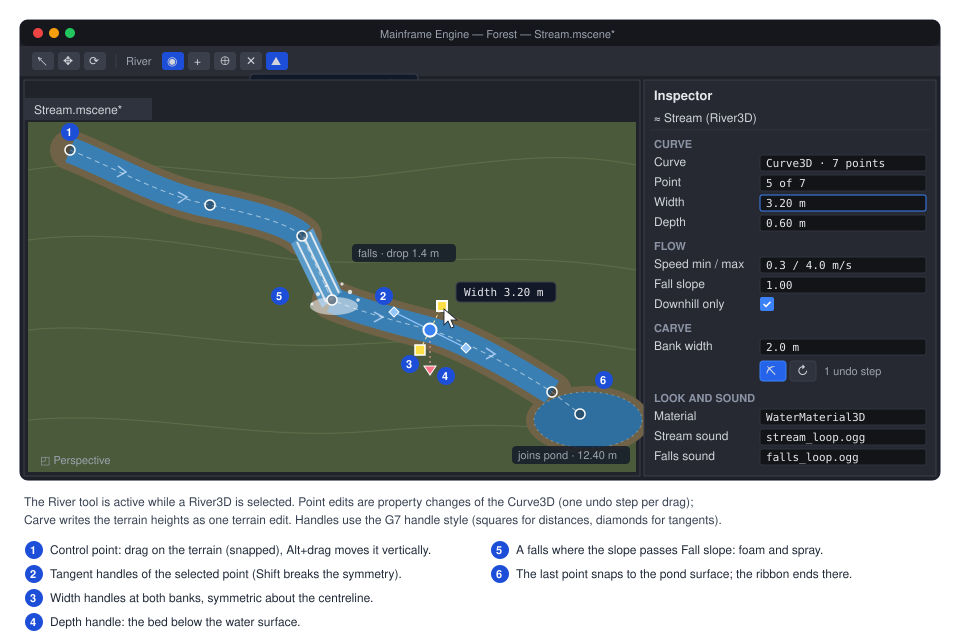
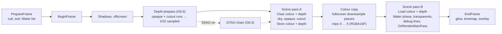

# Proposal: Water (ponds and lakes, River3D streams, WaterMaterial3D)

**Milestone:** [Gameplay toolkit](../../milestones.md#gameplay-toolkit-) (G8c) · **Status:** ⬜ planned ·
**Depends on:** [Terrain](terrain.md) (G8a: `Terrain3D`, the water layer, the edit API, `MeshSurface.Custom0`,
`IEditorViewportTool`), [Rendering features](rendering-features.md) (G6.1 PBR and G6.2 IBL for `WaterMaterial3D`;
G6.3 particles for spray; G6.6's depth prepass), [Shaders](../shaders.md)
([ADR 0144](../../../memory/decisions/0144-slang-shader-language.md)) · **Related:**
[Procedural trees](procedural-trees.md) (G8b: the shared wind), [Forest showcase](forest-showcase.md) (G8d: streams,
fog), [Editor viewport tools](editor-viewport-tools.md) (G7: handle style), [Mobile core](mobile.md) (TBDR rules),
[Audio](../audio.md), [ADR 0149](../../../memory/decisions/0149-terrain-trees-water-engine-features.md)

## Problem

The engine has no water: no water surface or material, no flowing water and no way to ask "is this point in water?".
What a water feature would build on is partial:

- **No curves.** A search of `MainframeEngine/` and `MainframeEngine.Editor/` for `Curve3D`, `Path3D` and
  `PathFollow3D` finds nothing, and there is no 1D `Curve` either (G6.3 plans one for particle scale).
- **Transparency is one blended list.** `AlphaMode.Blend` is "drawn back to front after the opaque pass, no depth
  writes, casts no shadow" (`MainframeEngine/Src/Rendering/Resources/Material.cs:9-19`, `:107-119`). The mesh renderer
  sorts blended surfaces by depth (`MainframeEngine/Src/Rendering/Meshes/MeshRenderer.cs:646-647`) and draws them
  last (`:731-732`, `MainframeEngine/Src/Servers/RenderServer.cs:475-497`). A translucent sheet is the best water this
  allows.
- **Built-in 3D materials only.** The shader sets are `MeshLit`, `MeshObjectId` and `MeshOutline`
  (`MainframeEngine/Src/Rendering/Meshes/PipelineStateCache.cs:6-16`). There is no 3D `ShaderMaterial`; new looks are
  built-in materials (the ADR 0132 pattern, restated by ADR 0149).
- **Nothing to sample behind a surface.** The scene pass clears depth and discards it (`Clear/DontCare`,
  [Vulkan renderer → render passes](../vulkan-renderer.md#render-passes)). The frame is `PrepareFrame`, `BeginFrame`,
  shadows, offscreen, one scene pass (`MainframeEngine/Src/Core/Engine.cs:511-541`). No pass leaves scene depth or a
  copy of the scene colour for a later draw. `RenderTarget` can keep a sampleable depth
  (`MainframeEngine/Src/Rendering/Vulkan/RenderTarget.cs:24-29`), but only `SubViewport` uses it. Refraction, depth
  colour, soft shorelines and foam need one or both.
- **The sky does not reflect.** Sky images are 8-bit with one mip ([sky.md](../sky.md#gpu-resources)); IBL arrives
  with G6.2.
- **Shader inputs.** The frame set carries time (`frame.clip.z`) and a `linearizeDepth` helper
  (`MainframeEngine/Content/Shaders/include/frame.slang:17`, `:23`). The vertex is a fixed 32 B
  (`MainframeEngine/Src/Rendering/Meshes/MeshVertex.cs:13`), so per-vertex water data waits for G8a's optional
  `MeshSurface.Custom0` stream.
- **Gameplay and audio.** `CharacterBody3D.Velocity` (`MainframeEngine/Src/Physics/3D/CharacterBody3D.cs:40`) and
  `AudioPlayer3D` (`MainframeEngine/Src/Audio/Nodes/AudioPlayer3D.cs:17`, a point source) exist, and the audio server
  exposes the listener (`MainframeEngine/Src/Audio/AudioServer.cs:242`). Nothing slows a character in water or places
  a sound along a stream.

Painted ponds were first designed for a low-poly game built on the engine, modelled on
[TerraBrush](https://github.com/spimort/TerraBrush) (MIT): a water depth layer lowers the terrain bottom while the
surface stays at the painted height. G8a upstreams the layer. This proposal defines what it means and how it renders in
both terrain profiles, then adds flowing water and a water material.

## Goals

- **Ponds and lakes** from the terrain's water layer (`water.png`, `WaterDepthAt`) with per-chunk water meshes: a
  flat translucent palette sheet for the Faceted profile on today's renderer, `WaterMaterial3D` for Realistic.
- **`River3D`:** a spline stream with a minimal `Curve3D` resource. It generates a ribbon, carves its bed as one
  undoable terrain edit, derives flow speed from slope, forms small falls, ends cleanly in a pond, and has a gizmo.
- **`WaterMaterial3D`:** a built-in Slang material: flow-advected normals, absorption and scattering, refraction,
  Fresnel, sky/IBL reflection with optional SSR, foam, sun specular, optional caustics, soft edges.
- **`SceneTextures`:** a depth prepass (shared with G6.6 SSAO) and a mipmapped copy of the opaque colour, with costs,
  a mobile story and a defined fallback.
- **Queries:** `WaterDepthAt`, `SurfaceHeightAt` and `FlowAt` over every water body; wading and underwater helpers.
- **Audio:** a stream sound that follows the river's nearest point, plus falls loops, at 0 B per frame.
- Per-frame code allocates nothing; frames without visible water are bit-identical to today's.

## Non-goals

- Oceans, FFT or Gerstner waves, vertex displacement, tessellation, shallow-water simulation.
- Interactive ripples (TerraBrush's ripple buffer), wakes, a splash system (games spawn particles).
- Swimming, drowning, an engine buoyancy node ([decisions](#decisions)).
- Underwater rendering beyond detection; planar reflections, reflection probes, refraction of transparent surfaces.
- Compute shaders (the engine has none; everything here is raster passes).
- Painted flow on lakes in the core steps (the layer reserves channels for it).

## Design

| Piece | Kind | Ships in | Renders with |
|---|---|---|---|
| Pond and lake meshes | internal `MeshInstance3D` per terrain chunk with water | G8c.1 | Faceted: `StandardMaterial3D` (Blend); Realistic: `WaterMaterial3D` |
| `Curve3D` | resource | G8c.2 | — |
| `River3D` | node, `IWaterBody3D` | G8c.3–G8c.5 | Faceted: the palette sheet, flat-shaded; Realistic: `WaterMaterial3D` |
| `SceneTextures` | per-view render resources | G8c.6 | — |
| `WaterMaterial3D` | built-in material, `ShaderSetId.Water` | G8c.7–G8c.8 | — |
| `WaterQueries` | `World3D.Water` | G8c.1, G8c.3 | — |

### Ponds and lakes from the terrain water layer

**The model** is the contract G8a and G8c share. `water.png` is RGBA8 with one texel per height vertex: R is the depth
fraction `d` (0 dry … 255 = `MaxWaterDepth`), G and B are reserved for painted flow (TerraBrush keeps flow there), A is
reserved. At a height vertex with heightmap value `h`:

| Quantity | Value |
|---|---|
| Terrain bottom (rendered, collided, `HeightAt`, `NormalAt`, `Raycast`) | `h − d × MaxWaterDepth` |
| Water surface | `h` (the mesh sits `ShoreDrop` lower, below) |
| `Terrain3D.WaterDepthAt` | `d × MaxWaterDepth`, interpolated on the same render triangle as `HeightAt` |

Both terms are linear on the same triangle, so `HeightAt + WaterDepthAt` is the water surface everywhere, exactly. G8a
applies the lowering once, in its chunk mesh builder, collision faces and queries, so they cannot disagree. A pond is
flat only where `h` is flat: G8a's Water mode has a **Level** option (on by default) that moves `h` toward a picked
level while it paints depth, so a pond painted into a dip fills to the brim. `MaxWaterDepth` and its default live in
`TerrainData`'s water settings (G8a).

**The water mesh.** `Terrain3D` keeps one internal, unowned, unsaved `MeshInstance3D` per chunk that has water, rebuilt
on every change that touches that chunk's `Water` or `Height` layer.

- Triangles: the chunk's render triangles (same diagonal rule) where **any** vertex has `d > 0`.
- Vertices at `h − ShoreDrop`. At a dry shore vertex the bank is at `h` and the water just below it, so the shoreline
  is a clean cut with no z-fighting. `ShoreDrop` is 0.05 m (Faceted) and 0.02 m (Realistic, where soft edges hide it).
- `Custom0` per vertex (G8a's stream): `x` column depth in metres, `yz` flow in m/s (0 until painted flow exists),
  `w` foam. `WaterMaterial3D` reads `x` when `SceneTextures` is off.
- **Faceted:** unshared vertices, so each triangle keeps its flat normal. One shared `StandardMaterial3D` with
  `Transparency = AlphaMode.Blend`, the palette's `water` swatch at `WaterAlpha` 0.65, a strong specular, back faces
  culled. No new shader. The bed is painted with the terrain's surface paint and reads as shallow water through it.
- **Realistic:** shared vertices (smooth normals) and `WaterMaterial3D`.
- `TerrainData`'s water settings gain `WaterMaterial` (`Material?`; null picks the profile default).
- Cost: one triangle per wet terrain triangle; a 64 × 64 m lake at 0.5 m spacing is 32k triangles in a few chunk draws.
  If G8a's Realistic chunks have LOD levels, the water mesh is built per level the same way.

Scatter (G8a) skips `WaterDepthAt > 0`; to skip river channels too it tests the world query
([gameplay queries](#gameplay-queries)).

### `Curve3D`

A resource with Godot's `Curve3D` API subset plus two per-point values Godot does not have, `Width` and `Depth`. Points
are cubic Bézier anchors; `in` and `out` are control offsets relative to the point, as in Godot.

```csharp
public sealed class Curve3D : Resource                        // new, MainframeEngine/Src/Resources/Curve3D.cs
{
    [Export] public float BakeInterval { get; set; } = 0.2f;  // Godot's bake_interval (metres)
    public int PointCount { get; }
    public void AddPoint(Vector3 position, Vector3 @in = default, Vector3 @out = default, int index = -1);
    public void RemovePoint(int index);
    public void ClearPoints();
    // Get/SetPointPosition, Get/SetPointIn, Get/SetPointOut, Get/SetPointTilt (Godot),
    // Get/SetPointWidth (default 1) and Get/SetPointDepth (default 0) (extensions)
    public Vector3 Sample(int index, float t);                // Bézier on one segment
    public float GetBakedLength();
    public ReadOnlySpan<Vector3> GetBakedPoints();
    public Vector3 SampleBaked(float offset, bool cubic = false);
    public Transform3D SampleBakedWithRotation(float offset, bool cubic = false, bool applyTilt = false);
    public float SampleBakedWidth(float offset);              // extension
    public float SampleBakedDepth(float offset);              // extension
    public float GetClosestOffset(Vector3 toPoint);
    public Vector3 GetClosestPoint(Vector3 toPoint);
}
```

- **Storage:** one internal `[Export] float[] Points`, 12 floats per point (position, in, out, tilt, width, depth): a
  compact JSON array, in the style ADR 0011 uses for mesh arrays. Setters call `Touch()`, which raises
  `Resource.Changed` (`MainframeEngine/Src/Resources/Resource.cs:45`).
- **Baking** is lazy (a dirty flag) and follows Godot: segments subdivide until the chord error is under the interval,
  then resample at equal arc length with cumulative distances. Tilt, width and depth interpolate with smoothstep between
  anchors. Baked arrays grow only when the point count grows.
- **Sampling** is a binary search over the distances; `GetClosestOffset` projects onto each baked segment. Neither
  allocates. Godot's up vectors are left out ([decision 8](#decisions)).
- **Determinism:** baking uses only `+ − × ÷` and `MathF.Sqrt`, which IEEE 754 rounds correctly and the .NET JIT never
  contracts into FMAs, so a curve bakes to the same bits on x64 and arm64. The carve relies on this.

### `River3D`

```csharp
[EditorIcon("ripple", Family = EditorIconFamily.Space3D)]     // Tabler "ripple", added to the icon atlas
public class River3D : Node3D, IWaterBody3D                   // new
{
    [Export] public Curve3D? Curve { get; set; }              // anchor Y = water surface height
    [Export] public Material? Material { get; set; }          // null: WaterMaterial3D, or the Faceted terrain's sheet
    [Export] public bool Faceted { get; set; }                // flat-shaded ribbon
    // Shape, Flow, Carve and Sound groups: see the table below
    [Export] public string CarveId { get; set; } = "";        // set by the first carve; names its record
    public bool CarveTerrain();                               // false when no Terrain3D lies under the river
    public bool Recarve();                                    // restore the last carve's heights, then carve again
    public bool Uncarve();
    [Signal] public event Action? Regenerated;
}
```

| Group | Exports (defaults) |
|---|---|
| Shape | `SectionLength` 1 m, `CrossSegments` 4, `UvLength` 4 m (flow per UV.v repeat), `EnforceDownhill` on |
| Flow | `MinSpeed` 0.3 m/s, `MaxSpeed` 4 m/s, `SpeedPerSqrtSlope` 6, `SlopeWindow` 6 m, `FallSlope` 1, `FallMinHeight` 0.3 m, `PlungeDepth` 0.4 m |
| Carve | `BankWidth` 2 m, `ShoreLift` 0.05 m |
| Sound | `StreamSound`, `StreamVolumeDb` −6, `FallsSound`, `FallsVolumeDb` −3, `Bus` (master), `MaxFallSounds` 4 |

The river regenerates when the curve raises `Changed` or a Shape or Flow export changes, in the editor and in games;
nothing is generated per frame. Generation is plain C# in `RiverBuilder` (internal, testable without a GPU) and reuses
its arrays while the section count does not grow. Its internal, unowned, unsaved children are one `MeshInstance3D`
(the ribbon), a `GpuParticles3D` per falls (G6.3) and the `AudioPlayer3D`s.

#### Ribbon mesh

1. Bake the curve. With `EnforceDownhill`, clamp the baked surface heights so they never rise along the flow
   (`y[i] = min(y[i], y[i−1])`); the curve itself is not changed.
2. Place cross-sections every `SectionLength` of arc length, plus one at each falls lip and base.
3. Each section has a horizontal right vector `normalize(tz, 0, −tx)` from the tangent (the previous one where the
   tangent is vertical) and `CrossSegments + 1` vertices across the width at the surface height, at `x` from −1 to 1.
4. Vertex data: normal up (or flat per triangle when `Faceted`); **UV.u = 0 … 1 across** (left to right bank) and
   **UV.v = arc length / `UvLength` along the flow**; `Custom0` = column depth `depth(s) × (1 − x²)`, flow (tangent XZ
   × `speed(s)` × `(1 − 0.6x²)`, slower at the banks) and foam.
5. One `ArrayMesh` surface. A 500 m stream at the defaults is 501 sections × 5 vertices.

`WaterMaterial3D` samples its normal map in world XZ, not ribbon UV, so a river and the pond it feeds tile alike. The
ribbon UV drives foam streaks and the falls sheet.

#### Flow speed from slope

On the clamped heights, `slope(s) = (y(s − W/2) − y(s + W/2)) / W` with `W = SlopeWindow`, then
`speed(s) = clamp(MinSpeed + SpeedPerSqrtSlope × √slope, MinSpeed, MaxSpeed)`. The square root follows Manning's
open-channel formula (speed grows with the square root of the slope) without asking for roughness coefficients. A 1 %
slope flows at about 0.9 m/s, a 10 % slope at about 2.2 m/s. Above 2 m/s foam ramps in (`w` up to 0.6) as rapids.

#### Falls

A falls is a run of the clamped profile whose drop per horizontal metre exceeds `FallSlope`, with a total drop of at
least `FallMinHeight`. The ribbon replaces the run with a level surface to the **lip**, a **jet** (a vertical section
along `x = v·t`, `y = −½·g·t²` from the lip speed `v`, compressed horizontally if it would land past the base, sections
every 0.25 m, foam 1, double-sided) and a **plunge** (foam fading over one river width; the carve deepens the bed).
Spray is a `GpuParticles3D` at the base (white blended billboards, `Amount = clamp(8 × drop × width, 8, 64)`), so it
arrives with G6.3; without it the falls still render.

#### Carving the terrain bed

`CarveTerrain()` writes the channel through G8a's edit API as **one** edit, `TerrainEdit.Begin(TerrainLayers.Height)`
… `End()`, which rebuilds collision for the touched chunks. The editor wraps it in one `TerrainEditAction` (G8a), so
Undo restores the heights bit for bit. Games may call it at run time for procedural levels.

For every height vertex inside the river's bounds (expanded by the widest half width plus `BankWidth`), in row-major
order:

1. Find the nearest baked segment through the river's grid: arc offset `s`, signed lateral distance `r`, and the
   interpolated half width `hw`, depth `D` and clamped surface height `y`.
2. **Channel** (`|r| ≤ hw`, `x = |r| / hw`): `h = y + ShoreLift − (D + ShoreLift) × (1 − x²)`. The bed meets the
   surface just inside the ribbon's edge (at about 96 % of the half width for `D` = 0.6 m): a clean shoreline cut, as
   `ShoreDrop` gives ponds.
3. **Bank** (`hw < |r| ≤ hw + BankWidth`): `h = lerp(y + ShoreLift, original, smoothstep((|r| − hw) / BankWidth))`,
   raising low ground and cutting through high ground.
4. **Plunge pools:** within `hw` of a falls base, `h −= PlungeDepth × (1 − (d / hw)²)`.

**Carve records.** Carving current heights again would stack a second channel on the first. The first carve therefore
stores the original heights of the touched rectangle as `<scene>_terrain/carve_<CarveId>.png` (R16, rectangle and range
in a `.meta` sidecar), written by the terrain's `SaveExternalData` hook (G8a). `Recarve()` restores the rectangle and
carves the current curve into a new record; `Uncarve()` only restores. Each is one edit. Sculpting inside an old channel
is lost on re-carve, and the inspector says so.

**Determinism.** The carve is a pure function of the baked curve, the settings and the original heights, with correctly
rounded operations, a fixed loop order and no parallel reduction: the same bits on every OS and CPU (tested).

#### Joining a pond

The ribbon stops at the first section whose centre lies over another water body (the world query, so a pond, lake or
another `River3D` works). Bisection along `s` finds the crossing; the last section goes there at that body's surface
height. Flow tapers to 0 over the last 3 m and a light foam band (`w` 0.2) hides the seam. Both surfaces use world-XZ
normals with zero flow at the joint, so the ripples line up. If the clamped river arrives below the pond surface, the
inspector warns ("the river ends 0.3 m below the pond").

#### Editor



`River3DTool` implements G8a's `IEditorViewportTool` and is active while one `River3D` is selected:

- **Control points** (circles) drag on the terrain with snapping on (to `HeightAt − 0.3 m`, so the carve makes a
  channel); Alt+drag moves vertically. **Add** (or Ctrl+click) appends a point, **Insert** splits the nearest segment,
  Delete removes the selected point. Toolbar actions are icon buttons with tooltips.
- **Tangent handles** (diamonds) of the selected point, symmetric unless Shift is held, as in Godot's Path3D editor.
- **Width handles** (squares at both banks, symmetric) and a **depth handle** below the point, in G7's handle style
  with its drag label ("Width 3.20 m").
- **Carve** and **Re-carve** are inspector icon buttons; Uncarve is in the overflow menu.
- **Undo:** a drag is one step (a snapshot of `Curve3D.Points` before and after); a carve is one step.

The selected river's centreline and cross-sections draw through `SceneViewport.OverlayLines`.

### `WaterMaterial3D`

```csharp
public sealed class WaterMaterial3D : Material                // new, built-in; ShaderSetId.Water
{
    [Export] public Texture2D? NormalMap { get; set; }        // null: the built-in procedural normal map
    [Export] public Texture2D? FoamTexture { get; set; }      // null: built-in procedural foam
    [Export] public Texture2D? CausticsTexture { get; set; }  // null: no caustics
    [Export] public Vector3 Absorption { get; set; } = new(0.45f, 0.09f, 0.06f);   // per metre, linear RGB
    // the groups below; setters Touch() like every material
}
```

| Group | Exports (defaults) |
|---|---|
| Surface | `NormalScaleNear` 3 m, `NormalScaleFar` 11 m (rotated, slower), `NormalStrength` 1, `Roughness` 0.06 |
| Flow | `FlowCycle` 1.6 s, `FlowScale` 1, `WindDrift` 0.05 |
| Colour | `Absorption`, `ScatterColor` sRGB (0.05, 0.22, 0.24), `ScatterStrength` 0.6 |
| Refraction | `RefractionStrength` 0.04, `RefractionRoughness` 0.15 |
| Reflection | `ReflectionStrength` 1, `ScreenSpaceReflections` on (quality from `rendering.waterSsr`) |
| Foam | `FoamScale` 2 m, `ShoreFoamDistance` 0.4 m, `FoamStrength` 1 |
| Caustics | `CausticsScale` 3 m, `CausticsStrength` 0.5, `CausticsMaxDepth` 3 m |
| Edges | `SoftEdgeDistance` 0.15 m |

The parameters fit a 112 B material UBO in set 2.

#### Fragment shader

`Water/Water.vk.frag.slang`, helpers in `include/water.slang`, in order:

1. **Flow-advected normals** (the two-phase flow-map technique; Vlachos, "Water Flow in Portal 2", SIGGRAPH 2010).
   Flow is the vertex flow × `FlowScale` plus G8b's shared wind × `WindDrift`. With `t = time / FlowCycle +
   noise(worldXZ)`, phases `p0 = frac(t)` and `p1 = frac(t + 0.5)` offset the UVs by `−flow × p × FlowCycle` and blend
   with weights `1 − |2p − 1|`; the noise hides the common pulse. Two layers (near and far scale) of one normal map give
   four taps, combined with a whiteout blend.
2. **Water column.** With `SceneTextures`: the prepass depth at the pixel gives the bed's view position, and the column
   along the ray is `bedDistance − surfaceDistance`. Without: see [the fallback](#without-scenetextures).
3. **Refraction.** Offset the screen UV by `normal.xz × RefractionStrength × saturate(column)`, re-read depth there, and
   keep the unoffset UV if the offset sample is in front of the surface (no leaking of foreground objects). Sample the
   colour copy at mip `RefractionRoughness × maxMip × saturate(column / 2 m)`: deeper water blurs more.
4. **Caustics** (optional): project the bed position along the sun direction to the surface, take the minimum of two
   crossing-scrolled samples, add `× sun colour × shadow × CausticsStrength` to the refracted colour, faded out at
   `CausticsMaxDepth`. Terrain and other bed materials need no change.
5. **Absorption and scattering** (Beer–Lambert): `T = exp(−Absorption × column)`, `water = refracted × T +
   ScatterColor × ScatterStrength × ambient × (1 − T)`, with `ambient` G6.2's diffuse IBL along up.
6. **Reflection:** G6.2's radiance cube along the reflected vector at the mip for `Roughness`, replaced by SSR where it
   hits. Schlick Fresnel with F0 = 0.02 (IOR 1.33): `colour = lerp(water, reflection × ReflectionStrength, F)`.
7. **Sun specular:** G6.1's GGX light loop (`shadeLightsPbr`) at `Roughness`, with shadows.
8. **Foam:** `1 − saturate(column / ShoreFoamDistance)` (which also rings rocks and logs that break the surface) plus
   the vertex foam (falls, rapids, mouths) masks the flow-scrolled foam texture, lit as diffuse white.
9. **Soft edges:** blend toward the unrefracted copy over `SoftEdgeDistance` of column, so shorelines have no hard line.
10. **Back faces** (camera under the surface): refraction and absorption only.

**SSR** is an option for water only (a G6 non-goal that G8c picks up): a view-space linear march along the reflected
ray against the prepass depth with binary refinement (16 + 4 steps at `Low`, 32 + 6 at `High`, 0.3 m thickness),
sampling the colour copy's mip 0. Hits fade near screen edges, for rays toward the camera and with distance, and blend
into the IBL by confidence. `rendering.waterSsr` is `Off` | `Low` | `High`, default `Low`.

#### Pipeline, phase and bindings

- **Shader set `Water`:** `Water/Water.vk.vert.slang` (the mesh vertex code through a shared include, plus the
  `Custom0` stream) and `Water/Water.vk.frag.slang`. Water casts no shadows; picking uses the `MeshObjectId` set.
- **A water phase.** `MaterialRenderState` gains a phase (`Opaque`, `Water`, `Transparent`), and `MeshViewDraws` a
  `Water` list sorted by material, then front to back. With `SceneTextures` water writes depth, outputs alpha 1 (it
  composes the refraction itself) and draws first after the opaque half of the scene pass, so particles and glass sort
  correctly against it. Transparent surfaces under water are not refracted (as in Godot).
- **Bindings.** `SceneTextures` bind in **set 3**, only in the water pipeline layout, so opaque pipelines keep G6's
  count; set 3 stays free for skinning (G1b), which water never uses. The fragment-stage budget is ≤ 16 sampled
  images, ≤ 16 samplers and ≤ 4 sets ([mobile checklist item 10](mobile.md#mobile-ready-plumbing-checklist)):

| Set | Images | Samplers |
|---|---|---|
| 0 frame (after G6): radiance cube, BRDF LUT, AO, decal atlas | 4 | 1 shared linear-clamp, mipmapped |
| 1 shadows | 6 | 6 |
| 2 water material: normal map, foam, caustics (1×1 fallbacks) + UBO | 3 | 1 repeat |
| 3 `SceneTextures`: prepass depth (read with `Load`), colour copy (set 0's sampler) + 16 B UBO | 2 | 0 |
| **Total** | **15** | **8** |

One normal map sampled at two scales, rather than two textures, leaves one image of headroom.

#### Without `SceneTextures`

A specialization constant selects the fallback when the view has no `SceneTextures` (`rendering.sceneTextures = Off`,
or a tier that disables it):

- no refraction, caustics or SSR; the surface is alpha-blended (`alpha = 1 − T`) and still writes depth;
- **absorption from distance only:** the column is the vertex column depth (painted or carved) divided by the cosine of
  the view angle, so deep water and grazing views still darken;
- shore foam from the same vertex depth; normals, Fresnel, IBL reflection and sun specular are unchanged.

It is the low-tier look, not an error path, and has a render golden of its own.

**Default textures.** The built-in normal map, foam and caustics are generated in C# on first use (tileable, 256²,
deterministic, cached per process): summed tileable noise, Worley cells and a Voronoi edge pattern. No texture files and
no licences to track (ADR 0149: CC0 or procedural).

### `SceneTextures`

What lies behind a surface, for draws after the opaques: G6.6's depth prepass and a mipmapped copy of the opaque
colour. They are created per view, lazily, only for views that draw a `Water` phase surface (or run SSAO, for the
depth), so frames without water stay bit-identical to today's.



1. **Depth prepass:** G6.6's `RenderServer.RenderPrepass`, run when SSAO **or** `SceneTextures` needs it. If G8c lands
   first, G8c.6 builds that step as G6.6 specifies it.
2. **Scene pass split.** On frames whose view draws water, `RenderMain` ends the scene pass after the opaque and cutout
   runs (and the visuals with `RenderPriority < 0`), storing colour and depth. A second render pass, `ScenePassLoad`
   (colour `Load/Store`, depth `Load/DontCare`), is compatible with the scene pass (same formats and sample counts), so
   every scene pipeline works in both halves. Each half ends with `RenderTarget.End`'s explicit barrier, which MoltenVK
   needs between encoders.
3. **Colour copy:** fullscreen-triangle passes like `GlowEffect`
   (`MainframeEngine/Src/Rendering/Post/GlowEffect.cs:14`). The first reads the scene target into mip 0 (`texelFetch`
   at full size, bilinear at half); each further pass halves the previous mip, up to 6 mips. A fragment copy needs no
   `TRANSFER_SRC` usage on the scene target and ports to M11's backends unchanged. Per-mip views and framebuffers live
   in an internal `MipChainTarget`.
4. **Scene pass B** loads colour and depth and draws the `Water` list (sampling set 3), the transparents, the debug
   lines and the legacy `OnRenderMainPass` hook.

`SubViewport` HDR targets get the same split, so the editor shows water as the game does.

**Costs at 1920 × 1080** (2.07 Mpx; × 4 at 4K). Memory is per view, one copy shared by both frames in flight (ordered
by the passes' dependencies, like the scene target):

| Item | Memory | Bandwidth per frame |
|---|---|---|
| Prepass depth (D32) | 8.3 MB (none extra with SSAO on) | 8.3 MB written, plus the opaque vertex work again |
| Pass split | — | ≈ 33 MB colour and 17 MB depth of extra store and load on tile-based GPUs; ≈ 0 on desktop GPUs, where attachments live in memory anyway |
| Colour copy, `Full` (RGBA16F, 6 mips) | 22.1 MB | ≈ 44 MB (read 16.6, write 16.6, mips ≈ 11) |
| Colour copy, `Half` | 5.5 MB | ≈ 24 MB |
| Water sampling | — | up to ≈ 30 MB when water fills the screen |

At 60 fps the `Full` path moves about 5 GB/s at worst: small for a desktop GPU (200+ GB/s), large for a phone
(25–35 GB/s in total).

**Mobile and MoltenVK.** On tile-based GPUs the split is the costly part: it stores and reloads HDR colour and depth
mid-frame and, on frames with water, rules out M12's merged scene + tonemap pass
([mobile.md → rendering](mobile.md#rendering)); those frames take M12's two-pass path. The copy cannot be memoryless.
On MoltenVK each half and each copy pass is its own Metal encoder, kept in order by the explicit barriers above. Per
[checklist item 8](mobile.md#mobile-ready-plumbing-checklist), every new attachment states its load and store intent,
and the prepass depth is the only new stored depth.

**Settings and degradation.** `rendering.sceneTextures` in `project.mfproj` (`Off` | `Half` | `Full`, default `Full`)
with a cost note ([checklist item 9](mobile.md#mobile-ready-plumbing-checklist)). The mobile tier table gains a row:
`Off` on Low and Medium, `Half` on High, `rendering.waterSsr` `Off` on every tier. With `Off` there is no prepass
(unless SSAO), no split and no copy, and water uses [the fallback](#without-scenetextures): no refraction, absorption
from distance only.

### Gameplay queries

Every water body registers with `World3D.Water` when it enters the tree: each `Terrain3D` with a water layer, each
`River3D`, and any game type that implements the interface.

```csharp
public interface IWaterBody3D
{
    Aabb WaterBounds { get; }                                  // world space
    bool TrySample(Vector3 position, out WaterSample sample);  // false when the XZ position is not over this body
}

public readonly record struct WaterSample(float SurfaceHeight, float ColumnDepth, Vector3 Flow);

public sealed class WaterQueries                                // World3D.Water (new)
{
    public bool TrySample(Vector3 position, out WaterSample sample);   // the highest surface wins on overlap
    public float WaterDepthAt(Vector3 position);     // bed-to-surface column depth in metres; 0 when dry
    public float SurfaceHeightAt(Vector3 position);  // float.NaN when dry
    public Vector3 FlowAt(Vector3 position);         // surface velocity in m/s; zero when dry or still
    public float ImmersionAt(Vector3 position);      // surface height − position.Y; ≤ 0 above the water or dry
    public bool IsUnderwater(Vector3 position, float margin = 0.05f);
    public static float WadeSpeedScale(float immersion, float start = 0.3f, float full = 1.2f, float minScale = 0.4f);
}
```

- **Terrain:** `TrySample` uses G8a's `WaterDepthAt` and `HeightAt` (surface = bed + depth); flow is 0 until painted.
  `Terrain3D.WaterDepthAt` itself stays as G8a defines it (terrain layer only).
- **Rivers:** a uniform grid of 4 m cells maps to baked-segment ranges, built at regeneration. A query projects onto
  the candidate segments for `s` and `r`; the point is in the river when `|r| ≤ hw(s)`. Flow uses the mesh's lateral
  profile.
- Main thread only, like physics queries, and allocation-free. A world has a handful of bodies, so the registry is a
  list tested against `WaterBounds` first.

**Wading.** `WadeSpeedScale` eases from 1 at `start` immersion to `minScale` at `full`. A character controller, such as
G8d's `FirstPersonController`:

```csharp
public override void OnPhysicsProcess(float delta)
{
    var water = GetWorld3D()!.Water;
    var scale = WaterQueries.WadeSpeedScale(water.ImmersionAt(GlobalPosition));
    Velocity = _wish * (WalkSpeed * scale) + water.FlowAt(GlobalPosition) * FlowPush;   // FlowPush ≈ 0.3
    MoveAndSlide();
}
```

**Underwater camera.** `IsUnderwater(camera.GlobalPosition)` is the detection; water draws back faces, so the surface
is visible from below. Underwater fog and engine buoyancy are settled in [decisions](#decisions); the samples above are
what a game needs to float a `RigidBody3D` from `OnPhysicsProcess`.

### Audio

`River3D` plays `StreamSound` through one internal `AudioPlayer3D` (`Loop = true`, the river's `Bus`), started only in
games (edit mode is silent).

- Each frame (`OnProcess`) it finds the arc offset closest to the listener (`AudioServer.Listener3D`) through the
  river's grid and moves the player to the centreline there, pushed toward the listener by up to the half width: beside
  a wide river, the near bank is heard.
- The position moves at most 30 m/s, so where two bends are equally near the sound glides instead of jumping.
- Volume follows the local speed: `StreamVolumeDb + clamp(20·log10(speed / 1 m/s), −6, +6)` dB; rapids are louder.
- `FallsSound` loops at falls bases: up to `MaxFallSounds` players, reassigned every 0.25 s to the falls nearest the
  listener, with volume from drop × width.
- It is struct math and property sets on existing players: 0 B per frame (allocation-gated). Doppler stays off.

### Code layout

| Path (new) | Contents |
|---|---|
| `MainframeEngine/Src/Resources/Curve3D.cs` | `Curve3D` and its baking |
| `MainframeEngine/Src/Scene/Nodes3D/Water/` | `River3D`, `RiverBuilder` (ribbon, flow, falls), `RiverCarver`, `RiverGrid`, `WaterQueries`, `IWaterBody3D`, `WaterSample` |
| G8a's terrain folder | `TerrainWaterMesh`, the water settings' `WaterMaterial` |
| `MainframeEngine/Src/Rendering/Resources/WaterMaterial3D.cs` | the material and its GPU parameters |
| `MainframeEngine/Src/Rendering/Water/` | `SceneTextures`, `MipChainTarget`, `WaterTextures` (procedural defaults) |
| `MainframeEngine/Content/Shaders/Water/` | `Water.vk.vert.slang`, `Water.vk.frag.slang`, `SceneColorDownsample.vk.frag.slang` |
| `MainframeEngine/Content/Shaders/include/` | `water.slang` (flow, absorption, foam, SSR), `scene_textures.slang` (set 3) |
| `MainframeEngine.Editor/Src/Water/` | `River3DTool`, the River3D inspector section (Carve, Re-carve, Uncarve) |

Shaders compile through the Slang build (ADR 0144); `just shaders` refreshes the `.spv` files and `shaders.lock`.

## Testing

- **Unit (`Tests/MainframeEngine.Tests/Water/`):**
  - `Curve3DTests`: Bézier values against hand-computed ones; a quarter circle's baked length within 0.1 %;
    `SampleBaked` at the ends and past them; closest offset and point; width and depth interpolation; `Points` round
    trip; `Changed` on every setter; sampling allocates nothing; a fixed curve's baked points match a committed hash.
  - `RiverBuilderTests`: section count; UV.u 0 … 1 across, UV.v equal to arc length / `UvLength`; smooth or flat
    normals; `Custom0` flow along the tangent and slower at the banks; the downhill clamp; speed from slope.
  - `RiverFallsTests`: a 1 m step over 0.5 m makes one falls (lip, jet, plunge) that lands at the base; a gentle slope
    makes none.
  - `RiverCarveTests` (a G8a `TerrainData` in memory): channel profile and shoreline; bank continuity; plunge pools;
    `Recarve` twice equals once; `Uncarve` and undo restore bit for bit; a committed hash matches on every OS.
  - `RiverMouthTests`: the ribbon ends at a pond's shoreline at its surface height; flow tapers to 0; the low-mouth
    warning.
  - `WaterQueriesTests`: `HeightAt + WaterDepthAt` equals the surface at random points; rivers inside, outside and at
    the edge; overlaps; `NaN` when dry; `FlowAt`, `ImmersionAt`, `IsUnderwater`, `WadeSpeedScale`; no allocation.
  - `TerrainWaterMeshTests`: a triangle is wet exactly when one of its vertices is; vertices at `h − ShoreDrop`; dry
    chunks have no node; nodes are unowned and unsaved.
  - `WaterMaterial3DTests`: defaults, UBO packing, `.mres` round trip; `WaterTextures` tile and are deterministic.
  - `RiverAudioTests`: the emitter is at the closest centreline point, clamped to the banks and rate-limited; falls
    players go to the nearest falls; 0 B per frame.
- **Render tests** (goldens for `moltenvk` and `lavapipe`; `--fixed-fps` keeps `frame.clip.z` deterministic):
  `water-pond-faceted` (on today's renderer), `water-pond` (Realistic: refraction, absorption, shore foam, soft edges,
  caustics), `water-river` (a carved stream with a falls into a pond), `water-fallback` (the same with
  `rendering.sceneTextures = Off`), `water-ssr`. Every existing golden stays bit-identical: views without water skip
  the prepass, split and copy.
- **Validation gate:** each scene with no warnings, including a resize with `SceneTextures` on and an editor
  `SubViewport` with water.
- **Allocation gate:** a 200-point river with falls, a pond, a moving camera and listener: 0 B per frame.
- **Benchmarks** (`baseline.json`): `RiverBuilder.Build500m`, `RiverCarver.Carve500m`, `WaterQueries.FlowAt10k`.
- **Editor QA** (`Tests/QA`): add a `River3D` over a terrain, add and drag points, drag a width handle, Carve, Undo,
  Re-carve, save, reload and compare.

## Acceptance

- A pond painted on a Faceted terrain shows a flat translucent palette sheet with a clean shoreline; on a Realistic
  terrain it shows `WaterMaterial3D`. Rendering, collision and `HeightAt` agree on the lowered bed.
- A `River3D` drawn in the editor generates a ribbon, carves its channel as one undoable edit, flows faster on steeper
  ground, forms a falls with foam (and spray once G6.3 exists) and ends cleanly in a pond.
- `WaterMaterial3D` shows flowing ripples, refraction, depth colour, sky reflection, sun glints and shore foam; SSR and
  caustics work when enabled; with `SceneTextures` off it falls back without errors.
- `World3D.Water` answers depth, surface height and flow for ponds and rivers; a character slows while wading.
- The stream sound follows the listener along the river; falls loops play at the falls.
- Frames without water are bit-identical; validation and allocation gates are green; the water pipeline stays within
  16 sampled images and samplers per stage and 4 sets.
- Docs updated as each step ships: a new `docs/design/water.md`, [materials-and-meshes.md](../materials-and-meshes.md)
  (`WaterMaterial3D`, the water phase), [vulkan-renderer.md](../vulkan-renderer.md) and
  [color-pipeline.md](../color-pipeline.md) (`SceneTextures`, the split), [shaders.md](../shaders.md),
  [audio.md](../audio.md), [testing.md](../testing.md), [mobile.md](mobile.md) (the tier row), and a new ADR for
  `SceneTextures` and the scene pass split.

## Task list

Ponds on Faceted first, then `River3D` geometry, then `WaterMaterial3D` after `SceneTextures`.

1. **G8c.1 Pond meshes (Faceted).** `TerrainWaterMesh` (wet triangles, `ShoreDrop`, `Custom0`), the palette sheet,
   `TerrainData.WaterMaterial`; `World3D.Water`, `IWaterBody3D` and `WaterQueries` for terrain water; tests; render
   test `water-pond-faceted`. Needs G8a's water layer and lowering.
2. **G8c.2 `Curve3D`.** Resource, baking, sampling, closest point, `Points` storage, inspector display; tests.
3. **G8c.3 `River3D` geometry.** `RiverBuilder` (ribbon, downhill clamp, flow from slope, falls, pond join),
   `RiverGrid`, river queries, the Faceted look; tests; benchmark.
4. **G8c.4 River editing and carving.** `River3DTool` (points, tangents, width and depth handles, snap, undo),
   `RiverCarver` with carve records, Carve/Re-carve/Uncarve, the `ripple` icon; editor tests; QA step.
5. **G8c.5 River audio.** Stream emitter and falls loops; tests; allocation gate.
6. **G8c.6 `SceneTextures`.** The prepass (G6.6's step), `ScenePassLoad` and the split, the `MipChainTarget` copy,
   per-view lazy creation, `rendering.sceneTextures`, the mobile tier row; validation and "no water, no change" checks.
   Built on the M11 step 1 encoder API, like G6.6 ([decision 1](#decisions)).
7. **G8c.7 `WaterMaterial3D` core.** `ShaderSetId.Water`, the water phase and list, set 2 and set 3 layouts, flow
   normals, absorption and scattering, refraction, Fresnel, IBL reflection, sun specular, foam, soft edges, back faces,
   the fallback, `WaterTextures`; Realistic ponds and rivers switch to it; render tests `water-pond`, `water-river`,
   `water-fallback`. Needs G6.1, G6.2 and G8c.6.
8. **G8c.8 Extras.** Caustics, SSR and `rendering.waterSsr`, falls spray (G6.3), wind drift (G8b's wind); render test
   `water-ssr`.
9. **G8c.9 Docs and hand-off.** `docs/design/water.md`, the doc updates in Acceptance, the ADR; streams and a pond in
   G8d's `Examples/Forest`.

## Decisions

Decided by the user on 2026-10-08, who accepted every default, and recorded in
[ADR 0149](../../../memory/decisions/0149-terrain-trees-water-engine-features.md). Each entry keeps the question it
settled; **Decision:** is what to build.

1. **`SceneTextures` before or after M11 step 1?** It adds a prepass, a pass split and copy passes, the kind of change G6
   parks behind M11 step 1 for SSAO. **Decision:** follow G6's rule. G8c.1–G8c.5 and the fallback look need neither, so
   ponds and streams ship on today's renderer while the split waits. **Superseded (2026-10-09,
   [ADR 0163](../../../memory/decisions/0163-post-processing-stages-prepass-motion-vectors.md)):** Brogan asked for SSAO
   and TAA ahead of M11, so the shared depth prepass exists now ([Post-processing](../post-processing.md)); water's
   `SceneTextures` (the colour copy and pass split) can build on it.
2. **Prepass or depth copy?** With SSAO off, copying pass A's depth (one fullscreen pass) is cheaper than a second
   geometry pass. In a forest of alpha-tested foliage, a prepass followed by an equal-depth main pass (G6's prepass
   reuse question) saves more fragment work than it costs. **Decision:** the prepass, one code path shared with G6.6;
   revisit with G6's prepass-reuse decision.
3. **Auto-carve on release?** It keeps the channel in sync but writes the terrain and an undo step on every drag.
   **Decision:** off; Carve and Re-carve are explicit, and the inspector shows "curve changed since the last carve".
4. **Painted lake flow.** A flow brush in the Water mode writing the layer's G and B channels (TerraBrush's flow tool).
   **Decision:** later, when a game needs moving lake water; `Custom0.yz` already carries flow.
5. **Buoyancy.** An engine `Buoyancy3D` node (sample points, force from immersion, drag toward the flow) or a
   documented sample. **Decision:** a sample in `docs/design/water.md`; a node once two projects need one.
6. **Underwater fog.** **Decision:** not in G8c (ponds and streams are wading depth); if the showcase needs it, G8d's fog
   gets an underwater override driven by `IsUnderwater`.
7. **Animated Faceted water.** Bobbing vertices or stepped palette tints for the low-poly sheet. **Decision:** static;
   it keeps G8c.1 shader-free.
8. **`Curve3D` up vectors.** Godot's `up_vector_enabled` matters for roads and rails, not rivers. **Decision:** keep tilt
   in the data; add up vectors when a road or path node needs them.

## Related

- [Terrain](terrain.md) (G8a), [Procedural trees](procedural-trees.md) (G8b), [Forest showcase](forest-showcase.md)
  (G8d), [ADR 0149](../../../memory/decisions/0149-terrain-trees-water-engine-features.md)
- [Rendering features](rendering-features.md) (G6), [Rendering backend abstraction](rendering-backend-abstraction.md)
  (M11), [Mobile core](mobile.md) (M12), [Editor viewport tools](editor-viewport-tools.md) (G7)
- [Vulkan renderer](../vulkan-renderer.md), [Color pipeline](../color-pipeline.md), [Sky](../sky.md),
  [Materials & meshes](../materials-and-meshes.md), [Engine lifecycle](../engine-lifecycle.md),
  [Shaders](../shaders.md), [Audio](../audio.md), [Physics](../physics.md)
