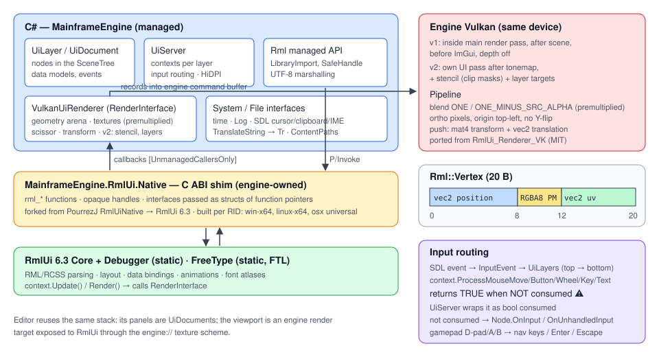
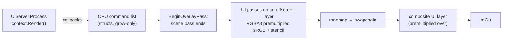
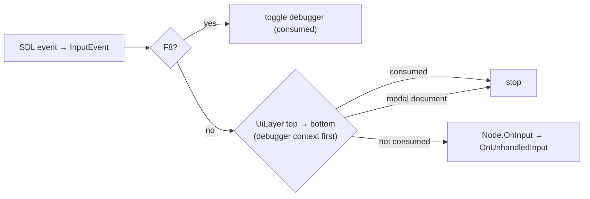

# Game UI (RmlUi)

## Purpose

HTML/CSS-style game UI: documents (`.rml`) and style sheets (`.rcss`) laid out by [RmlUi](https://github.com/mikke89/RmlUi)
**6.3**, bound to C# state, fed the engine's input and rendered on the engine's Vulkan device after the tonemap. The
same stack is the [editor's](editor.md#ui) UI. Milestone M8 ([Milestones](../milestones.md#m8--game-ui-rmlui-)).

| Layer | Where | What |
|---|---|---|
| Native shim | [`Native/RmlUi/`](../../Native/RmlUi/) | `mfrmlui`: flat C ABI (121 functions, ABI 1.0) over RmlUi + FreeType — [Native libraries](natives.md), [ADR 0002](../../memory/decisions/0002-rmlui-native-shim.md) |
| Managed binding | [`Src/UI/Rml/`](../../MainframeEngine/Src/UI/Rml/) | `RmlCore`, `RmlContext`, `RmlDocument`, `RmlElement`, `RmlEvent`, `RmlDataModel`, `RmlRenderInterface`, … |
| Renderer | [`Src/UI/Rendering/`](../../MainframeEngine/Src/UI/Rendering/) | `VulkanUiRenderer` (Vulkan), `NullUiRenderer` (headless) |
| Engine | [`Src/UI/`](../../MainframeEngine/Src/UI/) | `UiServer`, `UiLayer`, `UiDocument`, `UiElement`, input map, hot reload |
| Content | [`Content/UI/`](../../MainframeEngine/Content/UI/) | bundled fonts, the widget library (`widgets/`) |



## Quick start

```csharp
public sealed class Hud : UiDocument
{
    private Player _player = null!;
    private RmlDataModel _model = null!;

    public Hud() => Source = "Content/UI/hud.rml";

    protected override void OnReady()
    {
        _player = GetNode<Player>("../../Player");
        _model = CreateDataModel("hud")
            .Bind("health", _player, static p => p.Health)        // owner as state: no closure
            .Event("pause", () => Tree!.Paused = true);           // data-event-click="pause"
        GetElementById("quit")!.Click += _ => Tree!.Root.QueueFree(); // loads the document
    }

    protected override void OnProcess(in GameTime t) => _model.Dirty("health"); // or only when it changes
}

// Scene: a UiLayer (one RmlUi context) with documents below it.
var layer = new UiLayer { Name = "Hud", Layer = 0 };
layer.AddChild(new Hud());
Root.AddChild(layer);
```

```html
<!-- Content/UI/hud.rml -->
<rml>
<head>
  <link type="text/rcss" href="/Content/UI/widgets/widgets.rcss"/>
</head>
<body class="hud" data-model="hud">
  <div class="panel">Health {{ health }}</div>
  <progress class="health" data-attr-value="health / 100"/>
  <button data-event-click="pause">Pause</button>
  <button id="quit">Quit</button>
</body>
</rml>
```

The engine registers the `UiServer` when `EngineOptions.EnableUi` is on (default). Author sizes in **`dp`** (they follow
the layer's scale mode); `px` are framebuffer pixels.

## Managed binding (`MainframeEngine.UI.Rml`)

| Type | Role |
|---|---|
| `RmlNative` | Every export as `[LibraryImport("mfrmlui")]` with blittable signatures only (handles `nint`, strings NUL-terminated UTF-8 `byte*`, callbacks `delegate* unmanaged[Cdecl]`): source-generated direct calls, no marshalling stubs or allocations |
| `RmlCore` | `EnsureLibrary` (loads the library, checks the ABI: equal major, minor ≥ 0; clear `RmlException` when missing or incompatible), `Initialise(system, file)`, `Shutdown`, fonts, cache clearing, `ProcessPendingReleases` |
| `RmlHandle` (+ `RmlContextHandle`, `RmlDataModelHandle`, `RmlRenderInterfaceHandle`) | `SafeHandle`s over the owned objects, tracked weakly. Released exactly once on the RmlUi thread; a handle whose owner was collected undisposed is queued and released by the UI server (RmlUi is never called from the finalizer thread). Contexts and data models RmlUi destroys itself (shutdown, context destroy) are invalidated, not released twice. Disposing a context or data model **from inside an RmlUi callback** (a click handler freeing its layer, a data event removing its document) is deferred until the dispatch returns (`RmlCore.IsInCallback`; drained at the start of the next UI frame) |
| `RmlContext` | Size, dp ratio, `Update`/`Render`, documents, root/hover/focus elements, **input methods returning `true` = consumed** (RmlUi's raw `Process*` returns the opposite; the shim resolves it once), data models (`DataModels`). Code reload: when a game assembly unloads, `UiServer.ReleaseCodeOf` disposes models whose bindings still call or hold its code (recorded at bind time, collectible assemblies only), updates each context so documents closed since the last frame are destroyed, and releases queued handles ([projects](project-and-gamehost.md#game-assemblies-and-code-reload)) |
| `RmlDocument`, `RmlElement` | Borrowed handles as `readonly struct`s: tree, query selectors (span overloads write into caller buffers), attributes, classes, properties, inner RML, form values, focus/click, bounds, listeners |
| `RmlEvent`, `RmlVariant`, `RmlDictionary`, `RmlDataEvent` | Callback-scoped borrowed objects as **`ref struct`s**, so they cannot outlive the callback |
| `RmlEventListener` | An attached listener; `Detached` fires exactly once (removed, or element destroyed) |
| `RmlDataModel` | Typed bindings (below) |
| `RmlRenderInterface`, `RmlSystemInterface`, `RmlFileInterface` | Abstract/virtual C# interfaces; the static `[UnmanagedCallersOnly]` trampolines find the object through a `GCHandle` in `user_data`, and catch and log every exception — nothing unwinds into RmlUi |
| `RmlDebugger` | The RmlUi visual debugger |

**Strings without allocation.** `RmlUtf8Arg` encodes arguments into a 256-byte stack buffer (pooled array above that);
outputs use the caller-buffer pattern into stack memory, and only the final `string` allocates. Hot paths have span
overloads (`RmlEvent.IsType("click"u8)`, `RmlElement.GetValue(Span<char>)`, `RmlVariant.Set(ReadOnlySpan<char>)`).

### Data binding

```csharp
model.Bind("health", () => player.Health);                                // getter (closure)
model.Bind("volume", settings, static s => s.Volume, static (s, v) => s.Volume = v); // two-way, no closure
model.Event("buy", e => Buy(e.GetArgument(0).GetInt32()));                  // data-event-click="buy(item.id)"
model.BindList("items", inventory, ItemType);                               // data-for="it : items"
model.BindStruct("player", () => player, PlayerType);                       // {{ player.hp }}
model.Dirty("health");                                                      // views update on the next Update
```

- Scalars: `bool`, `int`, `uint`, `long`, `float`, `double`, `string`, 32-bit enums. Conversion goes through
  `RmlValue<T>` with `typeof(T)` checks the JIT folds, so value types never box.
- Lists and structs use the shim's dynamic variables (`mfrmlui_data_model_bind_variable`): every value is a 64-bit node
  token (`element index + 1` in bits 16..47, `member index + 1` in bits 0..15). `RmlStructType<T>` describes members
  once (`.Member("name", static i => i.Name)`); lists may hold scalars or structs of scalars (deeper nesting is not
  supported yet). Lists are read live: change them and call `Dirty`. A list may shrink between updates: rows past the
  new end resolve to "none" while RmlUi drops their elements, without warnings.
- The `Bind(name, owner, static getter, static setter)` overloads are what a future `[UiBindable]` source generator
  can emit without closures.
- Every binding holds a `GCHandle` freed by the shim's release callback, exactly once, when the model is removed, its
  context destroyed or RmlUi shut down.

## `UiServer`, `UiLayer`, `UiDocument`

| Type | Role |
|---|---|
| `UiServer` ([UiServer.cs](../../MainframeEngine/Src/UI/UiServer.cs)) | `IFrameServer` + `IInputServer` registered by `Engine`. Owns RmlUi (init, shutdown), the render interface, fonts (every `.ttf`/`.otf` in `Content/UI/fonts`), the system and file interfaces, one context per layer, input routing, hot reload, the debugger (F8), `engine://` textures (`RegisterTexture`), the `Translator` hook ([Localization](localization.md#game-ui-rmlui)) |
| `UiLayer : Node` ([UiLayer.cs](../../MainframeEngine/Src/UI/UiLayer.cs)) | One RmlUi context sized to the framebuffer. `[Export] Layer` (draw/input order), `Visible`, `ScaleMode` (`Dpi` default: 1 dp = `UiServer.ContentScale` — the display's pixels per point, or the fixed `EngineOptions.ContentScale`; `Pixels`; `ReferenceResolution`: framebuffer ÷ `ReferenceResolution`, smaller axis). Games typically use HUD (0), menus (10), overlay (100) |
| `UiDocument : Node` ([UiDocument.cs](../../MainframeEngine/Src/UI/UiDocument.cs)) | `[Export] Source` (or inline `Rml`), `Visible`, `Modal`, `AutoFocus`; `[Signal] Loaded`, `Reloaded`; `CreateDataModel`, `GetElementById`, `QuerySelector`, `Show`/`Hide`, `Reload`. Must be below a `UiLayer` |
| `UiElement` ([UiElement.cs](../../MainframeEngine/Src/UI/UiElement.cs)) | A cached element wrapper with C# events (`Click`, `DoubleClick`, `MouseDown/Up/Over/Out`, `Change`, `Submit`, `Focused`, `Blurred`, `KeyDown/Up`, `On(type, …)`); native listeners attach only for subscribed types. Every access looks the element up again by id, so a wrapper follows elements the DOM replaces (inner RML, `data-for`, `data-if`) and reports invalid — never dangling — once removed |

**Lazy loading.** A document loads on first element access or, at the latest, when the server prepares the next frame.
So `CreateDataModel` in `OnReady` (children are ready before parents, documents enter after their layer) runs before
the document binds `data-model`. A model created after loading reloads the document at the next frame. The document
closes when the node leaves the tree; its models are removed.

**Frame.** `UiServer.Process` (after the tree's process step): release queued handles, advance UI time by the frame
delta (deterministic with `FixedDeltaTime`), publish IME composition, repeat held gamepad navigation, apply hot
reloads, size every visible layer's context to the framebuffer and set its dp ratio, prepare documents, `Update` each
context, then — unless the engine will skip the frame — `Render` each context (lowest layer first, the debugger last)
into the renderer's command list.

## Rendering (`VulkanUiRenderer`)



- **Recording.** RmlUi's callbacks, issued during `UiServer.Process`, append `UiCommand` structs (geometry draw, shader
  draw, clip mask, push/pop layer, composite, save layer); state (scissor, transform, stencil test value) is captured
  per command and resources are resolved to buffers/descriptor sets at record time, so a release before the replay
  cannot redirect a draw. Filters and gradient parameters are copied into the frame's list.
- **Replay** happens inside `IVulkanContext.BeginOverlayPass` through the new `IOverlayRenderer` hook
  ([IOverlayRenderer.cs](../../MainframeEngine/Src/Rendering/Vulkan/IOverlayRenderer.cs)): `RecordOffscreen` after the
  scene pass ends (UI passes), `RecordOverlay` after the tonemap and before ImGui (one fullscreen premultiplied
  composite). Frames with no UI commands record nothing.
- **Colour.** Documents are authored in sRGB and blended in sRGB space, like a browser: layers are `R8G8B8A8_UNORM`
  holding premultiplied sRGB-encoded values, and the composite writes them unchanged into the UNORM swapchain view, so
  exposure and ACES never touch the UI (`#3366cc` lands as `#3366cc`, checked by a render test). On an sRGB-only
  swapchain the composite linearises (`OverlayEncodesSrgb`). See [Color pipeline](color-pipeline.md).
- **Geometry** lives in `UiGeometryArena`: persistently mapped host-visible chunk buffers (1 MiB, larger meshes get
  their own) sub-allocated with the allocator's `FreeListBlock`; each allocation is vertices (aligned to a whole
  20-byte `Rml::Vertex`) then 32-bit indices, so a draw is one `vkCmdDrawIndexed(count, 1, firstIndex,
  vertexOffset, 0)` and buffers rebind only on a chunk change. RmlUi compiles geometry once and re-renders it by
  handle (geometry caching); ranges are freed only after the frames that may read them complete.
- **Textures.** Images load through the UI file interface (StbImageSharp), are **premultiplied on load** and get a mip
  chain; generated textures (font atlases) arrive premultiplied. Both are `GpuTexture`s (`R8G8B8A8_UNORM`) through
  the upload queue — created during `Process`, between frames, so nothing waits on the GPU. Untextured geometry binds a
  1×1 white texture. `engine://name` resolves to a registered `GpuTexture` or `RenderTarget` colour attachment
  (`UiServer.RegisterTexture`); the shader encodes sRGB-format and float sources and premultiplies straight alpha
  (`UiTextureConversion`), and render targets are followed across resizes.
- **Transforms.** RCSS transforms (3D included) multiply a pixel projection (y down, no flip; z mapped into [0, 1]
  for RmlUi's ±10 000 range), pushed as a `mat4` with a `vec2` translation.
- **Clip masks** (`overflow: hidden` with `border-radius`, clipping under transforms): a shared stencil attachment
  (`S8_UINT` when supported, else a packed depth/stencil format) and RmlUi's GL3 scheme — `Set` clears the scissored
  region to 0 and writes 1, `SetInverse` clears to 1 and writes 0, `Intersect` increments; geometry tests
  `EQUAL` against the current value.
- **Layers, filters and shaders**, ported from RmlUi's GL3 backend: `PushLayer` clears a new layer (the stencil is
  shared and kept), `CompositeLayers` copies the source into a filter target, runs the filters, then draws it onto the
  destination (blend or replace, scissor and clip mask honoured). Filters: `opacity`, `blur` (repeated half-resolution
  downscale + separable 7-tap Gaussian + upscale, sampling limited to the region), `drop-shadow`, colour matrices
  (`brightness`, `contrast`, `invert`, `grayscale`, `sepia`, `hue-rotate`, `saturate`), `mask-image`
  (`SaveLayerAsMaskImage`). `SaveLayerAsTexture` (box-shadow) renders the region into a new texture. Shaders: linear,
  radial, conic gradients and their repeating forms (≤ 16 stops; parameters in a dynamic-offset uniform ring per frame
  slot). Shaders: [`Content/Shaders/UI/`](../../MainframeEngine/Content/Shaders/UI/).
- **Passes.** Layer passes (colour + stencil: clear-all at frame start, clear-colour for a pushed layer, load to
  resume) and filter passes (colour only: discard on first use, then load) all end in `SHADER_READ_ONLY_OPTIMAL`; 17
  pipelines are built once against them and the overlay pass. Targets are swapchain-sized and rebuilt on resize.
- **Synchronisation.** Every UI pass starts with a pipeline barrier (colour/stencil writes → reads/writes, sampling),
  and one more orders the last UI pass before the overlay composite. The passes' external subpass dependencies say the
  same, but **MoltenVK does not turn them into Metal synchronisation for sub-allocated images**: without the barriers a
  layer resumed after a filter pass read stale data and later draws vanished. `vkCmdClearAttachments` is a driver draw
  on MoltenVK that changes the encoder's stencil reference, so cached dynamic state is invalidated after it
  ([ADR 0050](../../memory/decisions/0050-ui-offscreen-layer-and-overlay-hook.md)).
- **Lifetime.** Releases (geometry ranges, descriptor sets) are tagged with the frame that may still use them and
  collected once its fence has been waited on; `GpuTexture`/`GpuImage`/framebuffers go through the deletion queue.
  Texture descriptor sets come from growable pools with `FREE_DESCRIPTOR_SET`. A command list is replayed at most
  once: a render without a new update (frame-rate cap) re-composites the base layer it already produced instead of
  replaying references to resources released since. A hidden UI (`Visible = false`) still replays lists that save
  layers into textures (box-shadows), and if a frame is skipped after RmlUi saved a layer, the renderer asks RmlUi to
  regenerate its textures.
- `NullUiRenderer` hands out handles without a GPU, so layout, data binding and input work headless (unit tests).

## Input routing



`SceneTree.PushInput` offers every event to the registered `IInputServer`s first (new in M8; the UI server is the
only one); a consumed event never reaches `OnInput`/`OnUnhandledInput` ([ADR 0051](../../memory/decisions/0051-ui-input-first.md)).

| Input | Behaviour |
|---|---|
| Mouse move/buttons/wheel | Window points × pixels-per-point → context pixels; wheel `-y` (RmlUi scrolls down for positive). Consumed only over interactive elements (`pointer-events: none` on a HUD body lets the game keep the mouse elsewhere). A press keeps the mouse with whoever took it until release: one the game took crosses the HUD (camera drags), one the UI took (a slider drag) stays with the UI even when released over the world. Raw/disabled cursor mode skips the UI. Lower layers get a mouse-leave when a higher one takes the pointer |
| Keys | Silk keys → `Rml::Input::KeyIdentifier` (`UiInputMap`), modifiers tracked from key events. Unhandled keys propagate; a **focused text field takes every key**; the release of a key the UI consumed is consumed too |
| Text | Silk's `KeyChar` (UTF-16; surrogate pairs joined) → `ProcessTextInput` (UTF-8 on the stack). Control characters arrive as keys |
| IME | `ActivateKeyboard` places SDL's text-input rectangle at the caret (the OS draws the candidate window); an SDL event watch publishes `SDL_TEXTEDITING` as `UiServer.Composition`/`CompositionChanged`; committed text arrives as text input. Inline composition rendering needs `TextInputContext` in the shim (ABI 1.1) |
| Clipboard, cursor | SDL clipboard; RCSS `cursor` names → SDL system cursors |
| Gamepad | D-pad and left stick (press 0.6, release 0.4, repeat after 0.4 s every 0.1 s) → arrow keys, A/Start → Return (clicks the focused element), B → Escape. RmlUi 6.3's `nav-*` properties (`nav: auto` spatial navigation) work; when nothing is focused, the first direction focuses the first tab-able element |
| Modal | A visible modal document consumes all input for its layer and everything below, including the game |

## Development tools

- **Hot reload** (`UiServerOptions.HotReload`, default on in Debug): a `FileSystemWatcher` on `Content/UI` and every
  source content folder; changes are debounced (150 ms) and applied on the main thread — `.rcss` re-reads style sheets
  keeping the DOM, `.rml` reloads documents (data models are C# state and survive; `UiElement` subscriptions are
  re-attached by id), images and fonts release textures. A document that failed to load is retried.
  `UiServer.HotReloadEnabled` reports whether the watcher is on, and `UiServer.HotReloaded` (`Action<UiReloadKind,
  string?>`) is raised on the main thread after every reload with its kind and the last changed file (null for a manual
  `Reload(kind)`); unlike `UiDocument.Reloaded` it also fires for style-sheet-only reloads, so a game can show a reload
  counter.
- **Source content folders.** Debug builds record their project's `Content` folder
  (`[AssemblyMetadata("MainframeContentSource", …)]`); `UiServerOptions.SourceDirectoriesOf(assembly)` returns those
  that exist, and `UiFileInterface` checks them before the output's `Content/`, so edits apply without a rebuild. The
  engine adds its own (widgets) automatically.
- **Debugger:** F8 (`UiServerOptions.DebuggerKey`, `UiServer.DebuggerVisible`) shows RmlUi's visual debugger in its own
  context on top, inspecting the top visible layer.
- **ImGui** stays the developer overlay: `Engine.DevOverlayVisible`, toggled with F12 (`EngineOptions.DevOverlayVisible`).

## Widget library

[`Content/UI/widgets/`](../../MainframeEngine/Content/UI/widgets/): link `/Content/UI/widgets/widgets.rcss`.

| Widget | Markup |
|---|---|
| Button | `<button>`, `.primary`, `.disabled` |
| Slider | `<input type="range" min max step value>` |
| Checkbox / radio | `<input type="checkbox">`, `<input type="radio" name>` |
| Dropdown | `<select><option>…</select>` |
| Text field | `<input type="text">`, `type="password"`, `<textarea>` |
| Progress bar | `<progress value="0..1">`, `.health` |
| Panel | `.panel`, `.panel-title`; window template `mf-panel` (`<link type="text/template" href="/Content/UI/widgets/panel.rml"/>`, `<body template="mf-panel">`; the document `<title>` fills the draggable title bar) |
| HUD helpers | `body.hud` (`pointer-events: none`, full screen), `.stat` (monospace), `.row`/`label.caption` |

Interactive controls set `pointer-events: auto`, `tab-index: auto` and `nav: auto`. `demo.rml` shows them all
(the Sandbox's "Widgets" button; the `ui-widgets` golden).

**Fonts** (OFL 1.1, [ADR 0052](../../memory/decisions/0052-bundled-ui-fonts.md)): Lato Latin regular/bold/italic
(`font-family: LatoLatin`) and Roboto Mono (`"Roboto Mono"`), in `Content/UI/fonts/` with their licences.

## Localization

Documents are translated through the engine's gettext catalogs (`UiServerOptions.TextTranslator`, default `Tr`; M9):
every `.rml` source passes `RmlLocalization.PrepareDocument` (translated `title`/`placeholder`/button `value`
attributes, `class="no-tr"` opt-out), text nodes go through `UiServer.Translator` (RmlUi's `TranslateString`), data-view
templates are translated once so bound values never are, and on a locale change the server loads the locale's
fallback fonts (`FontFallbackTable`) and reloads every loaded document at the start of its next `Process` — never
inside an RmlUi callback, so a language dropdown can switch the language it lives in. Strings are extracted with
`mf-l10n extract --rml`. See [Localization](localization.md#game-ui-rmlui).

## Sandbox

The Sandbox's HUD ([`hud.rml`](../../MainframeEngine.Sandbox/Content/UI/hud.rml),
[`SandboxHud`](../../MainframeEngine.Sandbox/Src/Nodes/SandboxHud.cs)) shows frame stats and two-way bindings to live
scene state (exposure, spin speed, max FPS, language, sun and coloured lights, VSync), the scene's translated welcome
banner, and buttons for the widget demo, the ImGui developer overlay, the credits and quitting; it is translated into
Spanish and the `qps` pseudo-locale. See [Sandbox](sandbox.md).

## Testing

- **Binding** (`Tests/MainframeEngine.Tests/UI/RmlBindingTests.cs`, serial collection — RmlUi is process-global): ABI
  check and rule, init/shutdown/reinit, contexts, documents from memory, element queries/attributes/classes/values,
  listeners and detach, exceptions swallowed at the boundary, consumed vs propagated input, `nav-*` focus navigation,
  scalar/list/struct/event bindings, GCHandle release, the translate hook, document reload, the debugger, **0 B over 200
  frames** with dirtied bindings.
- **Server** (`UiServerTests.cs`, headless): lazy loading with `OnReady` models, layers, routing (mouse capture, modal,
  text fields, gamepad), F8, hot reload (documents, style sheets, recovery), the widget template, **0 B over 200 HUD
  frames**; `UiHelperTests.cs`: key/gamepad/stick maps, reload batching and the watcher, premultiplication, blur
  parameters, source-folder overrides, dp ratios, cursors.
- **Render** (`Tests/MainframeEngine.RenderTests/UiRenderTests.cs`, goldens): `ui-hud` (HUD over the lit scene; the
  opaque swatch is checked to be exactly `#3366cc`), `ui-effects` (clip masks, rotated clip, gradients, box-shadow,
  blur, drop-shadow, grayscale, opacity, mask-image, backdrop blur), `ui-text`, `ui-widgets`, determinism and swapchain
  recreation. The `sandbox` allocation gate carries the HUD (bindings dirtied every frame): 0 B per frame.
- **Localization** (`UiLocalizationTests.cs`, headless): translation at load and after a locale switch, `no-tr`,
  bound values untranslated, deferred switching from a click handler, fallback fonts, 0 B over 200 translated HUD frames.
- **Benchmarks** (`UiBenchmarks`): update of a 500-element document idle (~9 µs) and with 500 dirtied bindings
  (~260 µs), full relayout (~190 µs), one render's ~1 000 callbacks into C# (~43 µs); all 0 B.

## Known issues

- Inline IME composition (underlined preedit inside the field) needs the shim to expose RmlUi's `TextInputContext`
  (ABI 1.1); today the OS shows the composition in its candidate window.
- Box-shadow textures larger than the window are clipped by RmlUi and then stretched over the shadow quad (RmlUi logs
  "Results may be clipped").
- Data-bound lists hold scalars or one level of struct; nested lists/structs need a richer token scheme.
- No MSAA on UI layers (RmlUi's GL3 backend uses 2×); edges rely on RmlUi's own antialiased geometry.
- The `shader` decorator's custom shaders (e.g. RmlUi's "creation" sample) are not supported; unknown filters and
  shaders log a warning and are skipped.
- World-space UI panels, a custom font engine/HarfBuzz shaping and RTL text are non-goals for M8.

## Related docs

[Milestones](../milestones.md) · [Native libraries](natives.md) · [Color pipeline](color-pipeline.md) ·
[GPU resources](gpu-resources.md) · [Scene graph & nodes](scene-graph-and-nodes.md#input) ·
[ImGui & debug tools](imgui-and-debug-tools.md) · [Editor](editor.md) · [Localization](localization.md)
