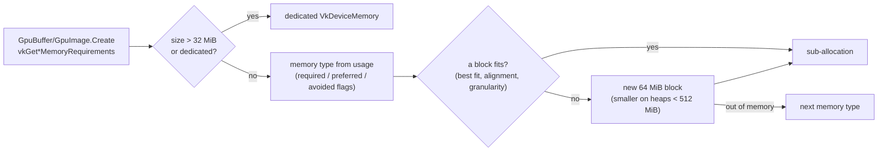
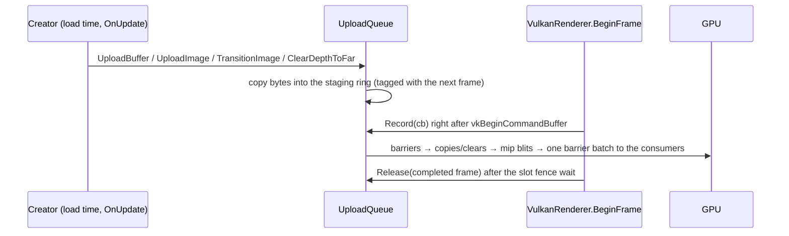

# GPU Resources

## Purpose

How the engine gets device memory, fills it, and gives it back: one in-house allocator, one upload
queue, one deletion queue, RAII wrappers for buffers, images and textures, and the caches every
pipeline goes through (pipeline cache, shader modules). Everything here lives in
[`Rendering/Vulkan/Memory`](../../MainframeEngine/Src/Rendering/Vulkan/Memory/) and
[`Rendering/Vulkan`](../../MainframeEngine/Src/Rendering/Vulkan/), is owned by `VulkanRenderer`, and is
reached through `IVulkanContext` (`Allocator`, `Uploads`, `Deletions`, `Pipelines`, `Shaders`).

Before M3 every buffer and image called `vkAllocateMemory` (the shadow system alone made ~50
allocations; drivers cap the count, often at 4096), every upload was a one-time submit followed by
`vkQueueWaitIdle`, and every `Dispose` called `vkDeviceWaitIdle`. Now the multi-light test scene
runs on 3 `VkDeviceMemory` objects, no upload waits on the queue, and nothing but swapchain
recreation and shutdown waits for the device.

## Key types

| Type | File | Role |
|---|---|---|
| `GpuAllocator` | [GpuAllocator.cs](../../MainframeEngine/Src/Rendering/Vulkan/Memory/GpuAllocator.cs) | Sub-allocates device memory; stats |
| `FreeListBlock` | [FreeListBlock.cs](../../MainframeEngine/Src/Rendering/Vulkan/Memory/FreeListBlock.cs) | internal — best-fit free list inside one block (pure, unit-tested) |
| `GpuAllocation`, `GpuMemoryUsage`, `GpuResourceKind` | [GpuAllocation.cs](../../MainframeEngine/Src/Rendering/Vulkan/Memory/GpuAllocation.cs) | A range of memory; how it is used; linear vs optimal |
| `UploadQueue`, `StagingRing` | [UploadQueue.cs](../../MainframeEngine/Src/Rendering/Vulkan/Memory/UploadQueue.cs), [StagingRing.cs](../../MainframeEngine/Src/Rendering/Vulkan/Memory/StagingRing.cs) | Staging ring + batched copies recorded at frame start |
| `DeletionQueue`, `GpuDeletion` | [DeletionQueue.cs](../../MainframeEngine/Src/Rendering/Vulkan/Memory/DeletionQueue.cs) | Destroys objects when their frames have finished |
| `GpuBuffer`, `GpuImage` (+ `GpuImageDesc`), `GpuTexture` (+ `TextureColorSpace`, `TextureSampling`) | [GpuBuffer.cs](../../MainframeEngine/Src/Rendering/Vulkan/Memory/GpuBuffer.cs), [GpuImage.cs](../../MainframeEngine/Src/Rendering/Vulkan/Memory/GpuImage.cs), [GpuTexture.cs](../../MainframeEngine/Src/Rendering/Vulkan/Memory/GpuTexture.cs) | RAII wrappers; `Dispose` defers to the deletion queue |
| `FormatInfo` | [FormatInfo.cs](../../MainframeEngine/Src/Rendering/Vulkan/Memory/FormatInfo.cs) | Texel sizes, sRGB/UNORM pairs, aspects |
| `PipelineCache` | [PipelineCache.cs](../../MainframeEngine/Src/Rendering/Vulkan/PipelineCache.cs) | The persisted `VkPipelineCache` |
| `ShaderModuleCache` | [ShaderModuleCache.cs](../../MainframeEngine/Src/Rendering/Vulkan/ShaderModuleCache.cs) | One `VkShaderModule` per `.spv` |
| `PipelineBuilder`, `PipelineState`, `BlendMode` | [PipelineBuilder.cs](../../MainframeEngine/Src/Rendering/Vulkan/PipelineBuilder.cs) | internal — pipeline/descriptor boilerplate with the engine's conventions |
| `RenderTarget` | [RenderTarget.cs](../../MainframeEngine/Src/Rendering/Vulkan/RenderTarget.cs) | Offscreen colour + depth targets — see [Color pipeline](color-pipeline.md#render-targets) |
| `RendererDebugWindow` | [RendererDebugWindow.cs](../../MainframeEngine/Src/Rendering/Vulkan/RendererDebugWindow.cs) | ImGui readout of all of the above |

The wrappers are named `Gpu*` rather than the proposal's `Vk*`: the codebase aliases
`VkBuffer = Silk.NET.Vulkan.Buffer` in many files, and a type of that name in the `MainframeEngine`
namespace would conflict with every alias (CS0576).

## Allocator

Decision: in-house, no VMA binding ([ADR 0005](../../memory/decisions/0005-in-house-gpu-allocator.md)).

| Rule | Detail |
|---|---|
| Blocks | 64 MiB `VkDeviceMemory` per memory type (heap/8 on small heaps, halved down to the request on `OUT_OF_DEVICE_MEMORY`). One empty block per type is kept; further empty blocks are freed. |
| Dedicated | Requests over 32 MiB, or `dedicated: true`, get their own memory, freed immediately on `Free`. |
| Placement | `FreeListBlock`: sorted region list, **best fit**, offsets aligned to the request, free neighbours **coalesced** on free. O(regions) per call, no allocation once grown. |
| Granularity | `bufferImageGranularity`: a linear resource (buffer, linear image) and an optimal-tiling image never share a granularity page; padding goes in where they would. |
| Memory type | `GpuMemoryUsage`: `DeviceLocal` (prefer DEVICE_LOCAL, avoid HOST_VISIBLE), `Dynamic` (HOST_VISIBLE + COHERENT, prefer DEVICE_LOCAL — uniform rings, streamed vertices), `Staging` (host-coherent, avoid DEVICE_LOCAL), `Readback` (host-coherent, prefer HOST_CACHED). Best score among allowed types; if that type's heap is exhausted the next type is tried. |
| Mapping | Host-visible blocks are mapped once, persistently; `GpuAllocation.MappedPointer` is the CPU address of the allocation. Only coherent memory is used, so no flushes. |
| Stats | `Totals` and `GetMemoryTypeStats(i)` are O(1) counters (allocations, blocks, dedicated, reserved and used bytes) — `RendererDebugWindow` shows them every frame without allocating. |
| Threading | Not thread-safe: render thread only (the creating thread; asserted in Debug builds). |

## Upload queue

- **Staging ring** (`StagingRing`, 32 MiB, persistently mapped): allocations are tagged with the frame
  that copies them and reclaimed when that frame's fence has signalled. Uploads larger than half the
  ring, or that do not fit, use a temporary staging buffer released through the deletion queue.
- **Recording**: everything pending is recorded at the start of the next frame's command buffer, before
  the shadow pass: one `UNDEFINED → TRANSFER_DST` batch (whose source stages are the readers, so a
  re-upload waits for earlier frames' reads), the copies and clears, mip chains (blits,
  when `GpuImage.MipLevels > 1`), then one batch to the final layouts (`SHADER_READ_ONLY_OPTIMAL` for
  textures, `DEPTH_STENCIL_READ_ONLY_OPTIMAL` for shadow maps) and a memory barrier for buffer
  consumers. Resources created at load time or in `OnUpdate`/`OnImGui` are ready for that frame.
- **Mid-frame creation**: a resource created while a frame is being recorded cannot join that command
  buffer; the wrappers call `FlushIfRecording()`, which submits the pending work in a one-shot command
  buffer and waits on its **fence** (`SubmitAndWait`). Nothing in the engine calls `vkQueueWaitIdle`.

## Deletion queue

`Dispose` on every renderer-owned object (`GpuBuffer`, `GpuImage`, `GpuTexture`, `RenderTarget`, sky,
grid, Spine renderer, ImGui controller, shadow system, frame context) enqueues `GpuDeletion`s instead of
waiting for the device. An entry released while frame *N* records is tagged *N*; one released between
frames (load time, `OnUpdate`) is tagged with the next frame, which records the upload queue's pending
copies that may still reference it. It is destroyed (handle first, then its memory) once that frame's
slot fence has been waited on — at the start of frame *N* + `MaxFramesInFlight`. Frame numbers, not slot indices, so objects released between a
submit and the next acquire wait for the right fence. Swapchain recreation (device idle) collects
everything; renderer disposal flushes the queue before freeing the allocator.

## Wrappers

| Wrapper | Create | Notes |
|---|---|---|
| `GpuBuffer` | `Create(ctx, size, usage, GpuMemoryUsage)`, `CreateStatic<T>(ctx, data, usage)` | Mapped buffers: `Write<T>`, `MappedSpan`; device-local: `Upload` (upload queue). `Descriptor(offset, range)`. |
| `GpuImage` | `Create(ctx, GpuImageDesc)` | Optimal tiling, initial layout UNDEFINED, default view over every layer and mip (`ViewType`, optional `ViewFormat` with MUTABLE_FORMAT). `CreateView(...)` for faces/layers (owned). |
| `GpuTexture` | `Create2D`, `CreateCube`, `Load(path)` (StbImageSharp, `ContentPaths`) | RGBA8 in `TextureColorSpace.Srgb` (`R8G8B8A8_SRGB`) or `Linear` (`R8G8B8A8_UNORM`), optional generated mips, own sampler; `Descriptor` for a combined image sampler. |

## Pipeline cache

`PipelineCache` wraps the device's `VkPipelineCache`; every engine pipeline is created through it
(`PipelineBuilder` and the shadow system call `CreateGraphicsPipeline`). It is loaded at startup and
written back (temp file + rename) when the renderer is disposed.

| | |
|---|---|
| File | `pipelines-<vendor>-<device>-<driverVersion>-<pipelineCacheUUID>.bin` — a driver update or another GPU starts a new file instead of feeding the driver foreign data |
| Directory | `$MAINFRAME_PIPELINE_CACHE_DIR` (`off` disables), else `~/Library/Caches/MainframeEngine` (macOS), `%LOCALAPPDATA%\MainframeEngine\Cache` (Windows), `$XDG_CACHE_HOME/mainframe-engine` or `~/.cache/mainframe-engine` (Linux) |
| Validation | The `VkPipelineCacheHeaderVersionOne` header must match the device (vendor, device, UUID); data the driver rejects is dropped; I/O errors are logged, never fatal |
| Stats | `LoadedBytes` (0 on a cold start) — the render tests check a second run loads the first run's file |

The render-test host keeps its cache under `artifacts/render-tests/pipeline-cache`. A state-hash
cache of `VkPipeline` objects (shared by materials) is part of the M3 materials work.

`ShaderModuleCache.Get(path)` loads each `.spv` once (resolved through `ContentPaths`, so the same file
under two spellings is one module) and keeps it until the renderer is disposed.

## Known issues

- Node-side shapes (`ShapeBase`, `Box3d`, `Quad`) still allocate their own memory, upload with
  `vkQueueWaitIdle` and dispose with `vkDeviceWaitIdle`; they move onto these types with the
  materials/mesh rewrite of `Src/Nodes`.
- No defragmentation, aliasing or async-compute uploads (non-goals).

## Related docs

[Vulkan renderer](vulkan-renderer.md) · [Color pipeline](color-pipeline.md) · [Shaders](shaders.md) ·
[Testing](testing.md) · [Future: materials & meshes](future/materials-and-meshes.md)
