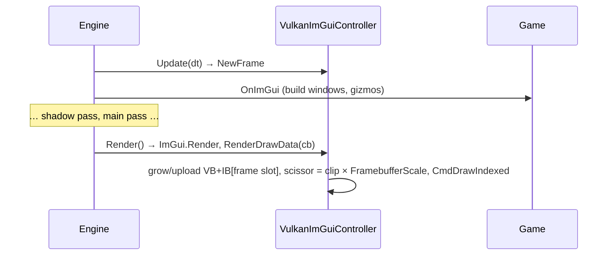

# ImGui & Debug Tools

## Purpose

Developer-facing tools: the ImGui Vulkan backend, console logging, and the ImGui-drawn gizmos
(world axes, light icons).

## `VulkanImGuiController`

File: [Rendering/Vulkan/VulkanImGuiController.cs](../../MainframeEngine/Src/Rendering/Vulkan/VulkanImGuiController.cs)
(internal). Created by `Engine.OnLoad` and disposed by `Engine.OnClose`.

| Aspect | Detail |
|---|---|
| Frame | `Update(dt)` sets `DisplaySize` (window points) and `DisplayFramebufferScale` (pixels ÷ points, 2 on Retina) and calls `ImGui.NewFrame()` during the Update event. `Render()` calls `ImGui.Render()` and records the draw data inside the main render pass. Every `NewFrame` is paired: `Engine` calls `DiscardFrame()` (→ `ImGui.EndFrame()`) when no frame is rendered (swapchain rebuild, minimised), and `Update` closes a still-open frame first when several updates run per render. |
| Font | `GpuTexture`, `R8G8B8A8Unorm` (coverage is data), uploaded by the upload queue, Linear/Repeat sampler, `SetTexID(1)` |
| Visibility | The developer overlay: `Engine.DevOverlayVisible` (F12 toggles; `EngineOptions.DevOverlayVisible` sets the start state). While hidden, `OnImGui` is not called and the ImGui frame is discarded |
| Pass | Drawn **after the tonemap** in the overlay pass, on top of the game UI (RmlUi, [Game UI](game-ui.md)) (`Render` calls `IVulkanContext.BeginOverlayPass`): colours are sRGB-authored and land in the UNORM swapchain unchanged, so ImGui looks exactly as before the HDR pipeline (verified by the `color-pipeline` render test). See [Color pipeline](color-pipeline.md#swapchain). |
| Renderer window | `RendererDebugWindow.Draw(Renderer)`: exposure slider, swapchain encoding, GPU allocator totals and per-memory-type usage, staging ring, deletion queue, pipeline cache; allocation-free |
| Descriptors | Set 0, binding 0 `CombinedImageSampler` (fragment). One pool, one set. |
| Push constant | 16 B `{ vec2 scale; vec2 translate }` (vertex) |
| Vertex | stride 20: `pos` RG32F, `uv` RG32F, `col` RGBA8 UNORM. Indices are `uint16`. |
| Pipeline | No cull, no depth, blend `SrcAlpha/OneMinusSrcAlpha` for color and `One/OneMinusSrcAlpha` for alpha. Dynamic viewport and scissor. Viewport **not** Y-flipped. |
| Buffers | Per frame slot, host-mapped, grown to `max(required, 1 MB or 2× current)` |
| HiDPI | Viewport covers the swapchain (pixels); clip rectangles are converted to pixels with `FramebufferScale` and clamped to the extent for the scissor. Mouse positions from SDL are in points, matching `DisplaySize`. With a fixed `EngineOptions.ContentScale`, `DisplaySize` is the framebuffer ÷ that scale, `DisplayFramebufferScale` is the scale, and mouse positions are converted from OS points. |
| Input | Silk mouse and keyboard forwarded through static handlers: navigation keys, letters, digits, F1–F12, modifiers |

### Known issues

- `TextureId` is ignored: every draw binds the font set, so `ImGui.Image` with game textures is not
  supported. User callbacks are skipped too.
- The font atlas is rasterised at 1×, so text on Retina is scaled up (correct size, slightly soft).
- The blend comment says "pre-multiplied", but the color blend is straight alpha.
- Punctuation and numpad keys are not mapped.

## `Log`

File: [Debugging/Log.cs](../../MainframeEngine/Src/Debugging/Log.cs). `public static class Log`.

| API | Prefix | Color |
|---|---|---|
| `Debug(msg)` | `[Debug]` | grey |
| `Info(msg)` | `[INFO]` | blue |
| `Warning(msg)` | `[WARN]` | yellow |
| `Error(msg)` | `[ERROR]` | red |
| `Fatal(Exception)` | `[FATAL]` | red |

- Each line is `[HH:mm:ss.fff]<color> message`. With `Level.Verbose`, the caller's `[file:line member]`
  is appended. All methods capture caller info through `[CallerMemberName]`, `[CallerFilePath]` and
  `[CallerLineNumber]`.
- `Log.LogLevel` is a public settable `[Flags]` property. It defaults to everything except `Verbose`.
- ANSI codes are disabled when `Console.IsOutputRedirected`.
- There is no file sink, and no `[Conditional]` stripping of Debug logs in Release.
- Networking and Steam code bypass `Log` (`Console.WriteLine` and `Trace`).

## Gizmos

| Tool | File | What it draws |
|---|---|---|
| `ScreenGizmoBatch` | [Rendering/Gizmos/ScreenGizmoBatch.cs](../../MainframeEngine/Src/Rendering/Gizmos/ScreenGizmoBatch.cs) | Screen-space lines, circles, arrows, glyphs (framebuffer pixels), drawn after the tonemap |
| `LightGizmos.Draw` | [Rendering/Gizmos/LightGizmos.cs](../../MainframeEngine/Src/Rendering/Gizmos/LightGizmos.cs) | Light icons, range rings, spot cones, sun arrows (`RenderServer.ShowLightGizmos`) |
| `AxisGizmo.Draw` | [Rendering/Gizmos/AxisGizmo.cs](../../MainframeEngine/Src/Rendering/Gizmos/AxisGizmo.cs) | Top-right world-axis widget (X red, Y green, Z blue), depth-sorted (`RenderServer.ShowAxisGizmo`) |

## Related docs

[Engine lifecycle](engine-lifecycle.md) · [Lighting](lighting.md) · [Demo](demo.md)
