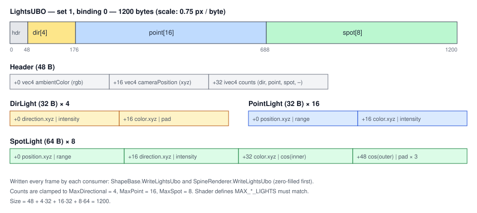

# Lighting

## Purpose

CPU-side light descriptions plus a fixed-size uniform layout consumed by lit shaders (meshes and
Spine). The lighting model is forward Blinn-Phong with shadow attenuation, or PBR (Cook-Torrance GGX + Lambert,
[ADR 0150](../../memory/decisions/0150-pbr-shading-and-sky-ibl.md)) for `ShadingMode.Pbr` materials, with ambient light
and reflections from the sky's image-based lighting (occluded, and joined by baked bounce light, where a
[light probe volume](#light-probes) is baked), and distance + height fog. In scenes, lights are nodes
(`DirectionalLight3D`, `OmniLight3D`, `SpotLight3D`; see [Scene graph & nodes](scene-graph-and-nodes.md#servers-and-render-nodes))
that wrap these light objects and register them with their world's `LightEnvironment`
(`SceneViewport.World3D.Lights`); `WorldEnvironment.AmbientColor` sets the ambient term, `AmbientEnergy` scales it and
`AmbientSource` (`Color` by default, or `Sky`) picks where it comes from.

## Key types

| Type | File | Fields (defaults) |
|---|---|---|
| `Light` (abstract) | [Light.cs](../../MainframeEngine/Src/Lighting/Light.cs) | `Position`, `Color = (1,1,1)` (sRGB; `LinearColor` is converted when set), `Intensity = 1`; shadows: `CastsShadows = true`, `ShadowResolution` (per type), `ShadowBias = 0.5`, `ShadowNormalBias = 1.5` (texels), `ShadowOpacity = 1` (Godot's `shadow_opacity`, ADR 0123) |
| `DirectionalLight` | [DirectionalLight.cs](../../MainframeEngine/Src/Lighting/DirectionalLight.cs) | `Direction = normalize(-0.5,-1,-0.3)`. `Position` is used only by the gizmo. `ShadowResolution = 2048` (per cascade), `CascadeCount = 4`, `CascadeSplitLambda = 0.75`, `MaxShadowDistance = 100`, `CascadeBlend = 0.1` |
| `PointLight` | [PointLight.cs](../../MainframeEngine/Src/Lighting/PointLight.cs) | `Range = 10`, `ShadowResolution = 512` (cube face) |
| `SpotLight` | [SpotLight.cs](../../MainframeEngine/Src/Lighting/SpotLight.cs) | `Direction = -Y`, `Range = 20`, `InnerConeAngle = 15°`, `OuterConeAngle = 30°` (half-angles), `ShadowResolution = 1024` (atlas tile) |
| `LightEnvironment` | [LightEnvironment.cs](../../MainframeEngine/Src/Lighting/LightEnvironment.cs) | `AmbientColor = DefaultAmbientColor = (0.22,0.22,0.25)` (sRGB; ≈ 0.04 linear) |

### `LightEnvironment`

| Limit | Value |
|---|---|
| `MaxDirectional` | 4 |
| `MaxPoint` | 16 |
| `MaxSpot` | 8 |

- `AddLight(Light)` routes the light by its runtime type. Unknown subclasses are ignored.
  `RemoveLight(Light)` removes it (light nodes do both on enter/exit); `Count` counts every light.
- Lists (`DirectionalLights`, `PointLights`, `SpotLights`) are `internal`.
- Lights beyond the limits are silently dropped when the UBO is written.
- Light gizmos are `LightGizmos.Draw(ScreenGizmoBatch, camera, viewport, lights, scale)`
  (`Rendering/Gizmos/`), queued by `RenderServer.RenderMain` for the root viewport while
  `RenderServer.ShowLightGizmos` is on: point lights as a dot with range rings, spot lights as cones, and
  directional lights as an arrow (projected along the light direction) plus sun icon. Points behind the camera are
  skipped.

`LightEnvironment` owns **no GPU resources**. The lights UBO is written through the shared
`internal LightEnvironment.WriteUbo(Span<byte>, in Vector3 cameraPosition)` (size `LightEnvironment.UboSize`):
once per frame (and view) into the shared set 0 by `FrameContext`, read by every lit pipeline (meshes, Spine).
Unit tests pin the layout.

## Lights UBO

std140, **1200 bytes** = `48 + 4×32 + 16×32 + 8×64`. Colours are written **linear** (`Light.LinearColor`,
ambient converted when set). Spine and future scene pipelines read it from the per-frame shared set 0,
binding 1 (`FrameContext`, written once per frame); shapes still bind their own copy as set 1, binding 0.
Shaders get the struct from `include/lights_data.slang` (no shadow set needed: the fog and the sky shaders read it) and
the shading loops from `include/lights.slang`. The render server sets `LightEnvironment.AmbientEnergy` and
`EnvironmentFlags` from the world's `WorldEnvironment` before each view writes the block.



| Offset | Field | Packing |
|---|---|---|
| 0 | `vec4 ambientColor` | rgb = ambient colour × `AmbientEnergy`, w = `AmbientEnergy` (scales the sky's irradiance) |
| 16 | `vec4 cameraPosition` | xyz, w = environment flags as a float (`kEnv*` in `lights_data.slang`: 1 sky diffuse, 2 sky reflections, 4 no reflections) |
| 32 | `ivec4 counts` | x = dir, y = point, z = spot |
| 48 | `DirLight dir[4]` | `{dir.xyz, intensity}`, `{color.xyz, shadowOpacity}` |
| 176 | `PointLight point[16]` | `{pos.xyz, range}`, `{color.xyz, intensity}` |
| 688 | `SpotLight spot[8]` | `{pos.xyz, range}`, `{dir.xyz, intensity}`, `{color.xyz, cos(inner)}`, `{cos(outer), shadowOpacity, pad×2}` |

## Shading model

`lights.slang` (`shadeLightsBlinnPhong(base, N, Ngeo, worldPos, specular, shininess)`; `Ngeo` is the geometric normal the shadow lookups offset along), used by `Mesh.vk.frag` with the material's specular strength and
shininess and by `SpineLit.vk.frag` through `shadeLights` (strength 0.3, exponent 32):

```
result = ambient · base
       + Σ_lights  color · intensity · (diffuse + 0.3 · pow(max(N·H, 0), 32)) · base · atten · spot · shadow
```

`ambient` is `iblDiffuse(N)` (`include/environment.slang`): the ambient colour, or the sky's irradiance when the world's
`AmbientSource` is `Sky` and the sky has been captured. With screen-space ambient occlusion (below) `Mesh.vk.frag` uses
the overload with the AO: `ambient · base · ssao`, and every light × `ssaoDirect(ssao)`.

| Term | Formula |
|---|---|
| Attenuation (point/spot) | `clamp(1 − d / range, 0, 1)²` |
| Spot cone | `clamp((cosθ − cosOuter) / max(cosInner − cosOuter, 1e-4), 0, 1)` |
| Shadow | the light's shadow code picks its map; see [Shadow system](shadow-system.md#sampling-and-filtering) |

### PBR

`shadeLightsPbr(PbrSurface s, float3 Ngeo, float3 worldPos)` (`lights.slang`), with `PbrSurface { albedo, metallic,
roughness, ao, N }`. Every lit 3D shader of the later G8 lanes (foliage, terrain, water) calls it.

| Term | Formula |
|---|---|
| Roughness | perceptual `r` clamped to ≥ 0.045; α = r², a2 = α² |
| D (GGX) | `a2 / (π · ((N·H)² (a2 − 1) + 1)²)` |
| Visibility (Smith height-correlated) | `0.5 / (N·L √((N·V)² (1 − a2) + a2) + N·V √((N·L)² (1 − a2) + a2))` |
| F (Schlick) | `F0 + (1 − F0)(1 − V·H)⁵`, `F0 = lerp(0.04, albedo, metallic)` |
| Direct light | `(albedo (1 − metallic)(1 − F) + π · D · Vis · F) · radiance · N·L` |
| Ambient | `(iblDiffuse(N) · albedo (1 − metallic) + iblSpecular(R, r) · (F0 · A + B) · so) · ao`, (A, B) = `iblBrdf(N·V, r)`; without SSAO `ao` = `s.ao`, `so` = 1 |

Light units are the Blinn-Phong ones: Lambert's 1/π is folded into the light (a light of energy 1 lights a white diffuse
surface at normal incidence to 1), so the specular lobe carries the π. `radiance` is colour × intensity × attenuation ×
spot cone × shadow, with the same shadow lookups, shadow opacity and cascade tint as Blinn-Phong.

### Screen-space ambient occlusion

`PostProcessProfile.SsaoEnabled` (on `WorldEnvironment.PostProcess`; [ADR 0165](../../memory/decisions/0165-ssao-gtao.md); GTAO, see
[Post-processing → SSAO](post-processing.md#ssao)) puts a per-pixel AO image at set 0 binding 5; without it the binding
is a white 1×1 image. The lit shaders read it at their fragment (`ambientOcclusionAt(SV_Position)`,
`include/ambient_occlusion.slang`) and pass it to the overloads that take `ssao`:
`shadeLightsBlinnPhong(…, ssao)`, `shadeLightsPbr(s, Ngeo, worldPos, ssao)`.

| Term | Formula | Setting (Godot name) |
|---|---|---|
| Ambient (`ao` above) | `ssaoCombine(m, ssao)` = `lerp(min(m, ssao), m · ssao, t)`, `m` the material's AO (ORM red, foliage vertex AO) | `SsaoAoChannelAffect` = t (0: the darker of the two) |
| Reflections (`so` above) | `min(1, Lagarde(N·V, ssao, α) / ssao)`, Lagarde and de Rousiers 2014: smooth surfaces seen face-on lose more | — |
| Direct light | × `ssaoDirect(ssao)` = `1 + (ssao − 1) · k` on every light's shadow term | `SsaoLightAffect` = k (default 0) |

`FrameData.AmbientOcclusion` carries k and t for the main view (0 otherwise). Without SSAO the image is 1 and k, t are 0,
so every factor is exactly 1 (or `m`) and the shaders produce the frames they produced before (bit-identical goldens).
Which shaders use it: `Mesh.vk.frag` (opaque and cutout; blended surfaces are not in the depth prepass, so the AO under
them is the background's and they skip it), `Foliage.vk.frag` (also its translucency, × `ssaoDirect`),
`TerrainSplat.vk.frag`, and `Water.vk.frag` for the light scattered in the water body only (the AO under water is the
bed's). Spine and the overloads without `ssao` are unchanged.

### Light probes

`LightProbeVolume` ([ADR 0170](../../memory/decisions/0170-light-probe-volume.md), G8e.1; Unreal's volumetric lightmap
plus sky light occlusion) is baked global illumination for a region: a grid of probes, each storing how much of the sky
it sees in every direction and the light bounced to it. Every lit surface in the world samples it, so the shade under a
canopy loses most of the sky and takes the colour of what surrounds it, and reflections there are occluded too. Code in
[`Src/Lighting/Probes/`](../../MainframeEngine/Src/Lighting/Probes/).

| Type | What |
|---|---|
| `LightProbeVolume` (node, `[Tool]`) | `Size` (32 × 16 × 32 m, centred on the node, axis-aligned), `Layout` (`Box`, `TerrainFollowing`), `ProbeSpacing` (2 m; Y unused when terrain-following), `LayerHeights` (terrain-following: up to eight heights above the ground, 0.3–27 m), `Terrain` (empty: the first `Terrain3D`), `RaysPerProbe` (256), `Bounces` (3), `Energy` (1, scales the bounce), `SkyOcclusion` (1; 0 = the sky everywhere, as without a volume), `OcclusionTint` (white), `Data`, `BakeWhenStale` (false). `Bake()`, `BakeInBackground()`, `CancelBake()`, `IsBakeCurrent()`, `CurrentBakeHash()`, the `Baked` signal |
| `LightProbeData` (resource) | the bake: the grid (`ProbeGrid`), `BakeHash`, `RaysPerProbe`, `Bounces`, and a `.probes` binary next to the `.mres` (`DataFile`; float32 ground heights, float16 coefficients, LFS). `Save(path)`, `Sample(position, coefficients)` (the shaders' trilinear lookup on the CPU), `ToTexture()` |
| `ProbeBakeSettings`, `ProbeBakeResult` | rays, bounces, bounce rays, seed, the back-face fraction that marks a probe invalid (25 %), blur, threads; the result's data, time, probe, invalid-probe and ray counts |
| `GeometryInstance3D.GIMode` | Godot's `gi_mode`: `Static` (default) instances occlude and bounce in the bake; `Disabled` and `Dynamic` do not. Every lit surface samples the probes whatever its mode |
| `SphericalHarmonics`, `ShL2Rgb` | SH L1 projection and cosine convolution; the sky as SH L2 RGB for the bake |

**What a probe stores.** Sixteen numbers: the sky visibility as SH L1 (the fraction of the sky seen in each direction,
through the canopy's transmittance; kept apart from the sky's colour, so a new sky needs no re-bake), and the bounce
radiance as SH L1 RGB (sun and sky off terrain, bark, leaves, meshes and water, multi-bounce). On the GPU the volume is
one `RGBA16F` `Texture3D` of `CountX × (5 · CountY) × CountZ` texels: five slabs stacked along Y (sky, red, green, blue,
and the ground height under each column), sampled with the slabs' texel centres clamped so the hardware filter never
blends two slabs.

**The bake** (`ProbeBaker`, CPU, every core, deterministic for a seed whatever the thread count): the scene becomes
ray-traceable proxies (`ProbeBakeSceneBuilder`): the terrain's height field with a min–max pyramid, trees and
`TreeScatter`s as branch capsules plus a 0.5 m leaf-density grid (Beer–Lambert, leaves passing their
`FoliageMaterial3D.Translucency` of the light behind them, as the foliage shader does), `Static` meshes' triangles in a
BVH, water as its surface (albedo 0.05). Albedos are the materials' colours × their textures' alpha-weighted mean. Per
probe, `RaysPerProbe` Fibonacci directions with a per-probe rotation:

1. **Visibility:** each ray's transmittance to the sky, projected onto SH L1. A probe whose rays hit back faces more
   than 25 % of the time is inside geometry and takes its valid neighbours' mean (dilation), so trilinear filtering
   needs no weights.
2. **Bounce** passes: each ray's first solid hit, or a leaf that scatters it; its radiance is albedo × (sun × N·L × the
   sun's transmittance + sky × the nearest probe's visibility + the nearest probe's bounce of the previous pass).
3. **Blur:** [1 2 1] along each axis.

`BakeHash` hashes everything the bake reads (proxies, materials, sun, sky, grid and settings); `CurrentBakeHash()`
fingerprints the same inputs without building proxies (≈ 40 ms for the Forest). A missing or stale bake renders as if
there were no volume; with `BakeWhenStale` the volume bakes in the background once its siblings are ready and logs a
warning. **Baking:** the editor's Bake Lighting button on the volume's inspector (background, cancellable; saves
`<scene>-lighting.mres` next to the scene, or over the existing data, as one undoable change of `Data`), `Bake()` in
code, or `--bake-lighting` on a game (`GameSession.BakeLighting`: bakes every volume of the start scene, saves under
`--project`'s folder, quits; works with `--headless`).

**Shading** (`include/probes.slang`, `include/indirect.slang`). Set 0 binding 6 holds the volume
(`FrameContext.ProbeVolumeBinding`), `FrameData.probe*` the grid (origin, 1/spacing, layout, counts, energy, layer
table, occlusion strength and tint). With a volume bound (`probesActive()`), `shadeLightsPbr` and `shadeLightsBlinnPhong`
replace the sky ambient term:

| Term | With probes |
|---|---|
| Where | `worldPos + Ngeo · 0.3 · spacing + V · 0.1`: off the surface and towards the eye, so a probe behind a wall or under the ground is never the nearest |
| Sky visibility | the SH L1 sky convolved with the cosine lobe at N, 0..1 |
| Sky light | `probeSkyLight(v)` = v + (1 − v) · (1 − `SkyOcclusion`) · `OcclusionTint`: the visible sky, plus the share of the blocked sky the strength leaves, tinted (under a canopy, light its leaves scatter in place of the sky) |
| Bent normal | N leaned towards GTAO's bent normal where SSAO ran (small scale), then towards the probe's open-sky direction × 0.5 (large scale) |
| Diffuse | `(iblDiffuse(bent) · skyLight + bounce(N) · Energy) · multiBounceAo(ao, albedo)`, Jimenez et al. 2016's multi-bounce fit on the material/SSAO AO, so bright leaves and moss do not go grey |
| Specular | the sky reflection × the specular occlusion (the visibility along R, widened towards the diffuse one with roughness, with `SkyOcclusion` applied) + the bounce seen along R where the sky is blocked |
| Foliage | the leaf's back side passes `Translucency` × the probes' light around −N (a canopy out of the sun still glows from below); the vertex canopy AO (`Custom0.w`) keeps 40 % of its strength (`kCanopyAoWithProbes`), the probes carry the canopy's occlusion |
| Volumetric fog | the march's sky ambient × `probeOpenSky(p)` (the mean visibility, strength and tint), looked up every fourth step |

Without a volume the binding is a 1×1×1 zero texture, `probeOrigin.w` is 0, and every path is the one before ADR 0170
(bit-identical goldens). Only the world's first visible volume with data is bound (a second logs a warning); the render
server uploads it when it first draws the world and again when its data changes (`Texture3DGpu`), and binds it per view
like the sky maps, so sub-viewports and editor tabs show their own world's probes. Per-frame cost: no allocation; four
(box) or five (terrain-following) fetches per lit pixel.

**The Forest** commits its bake (`Content/Scenes/forest-lighting.mres` + `.probes`, 4.3 MB in LFS): terrain-following
over the 256 m valley at 2 m, eight layers to 27 m (129 × 8 × 129 = 133 128 probes, a 5.3 MB texture), 192 rays, two
bounces, `Energy` 2.4, `SkyOcclusion` 0.5, a pale green `OcclusionTint`, and `BakeWhenStale` (the valley is generated at
load, so a generator change re-bakes in the background, about a minute, until the bake is committed again with
`--bake-lighting --project Examples/Forest`). See [Forest → Light probes](forest.md#light-probes).

### Image-based lighting fallbacks

The ambient helpers (`include/environment.slang`) fall back without a captured sky: `iblDiffuse` returns the ambient
colour, `iblSpecular` a uniform environment of the ambient colour (or nothing when `ReflectedLightSource` is
`Disabled`). See [Sky → Image-based lighting](sky.md#image-based-lighting) and `BrdfLut` for the split-sum table.

### Fog

`include/fog.slang`: `applyFog(color, worldPos)` for surfaces and `applySkyFog(color, dir)` for the sky, from
`FrameData.fogColor` / `fogParams` (`WorldEnvironment.Fog*`). Both return the colour unchanged while fog is off
(`fogColor.a == 0`, the default).

- Density at height y is `FogDensity · exp(−FogHeightDensity · max(y − FogHeight, 0))`: uniform below the fog height,
  thinning above it. The optical depth along the camera ray is integrated exactly (the antiderivative of the density),
  so the fog is right with the camera inside or above it. `amount = 1 − exp(−depth)`.
- Sun scatter (Godot's `fog_sun_scatter`) adds `dir[0].color · intensity · max(V · toSun, 0)⁸ · FogSunScatter` to the fog
  colour.
- **The sky** gets only height fog: the ray to infinite height through the thinning fog, so the horizon fades into the
  fog and the zenith keeps most of its colour. Uniform fog (height density 0) leaves the sky clear (it would otherwise
  turn the whole sky to fog). The sky lighting capture is unfogged.
- `Mesh.vk.frag` fogs opaque and blended surfaces after emission.

## Shadows

Every light casts shadows unless `CastsShadows` is false. The shadow system decides which map each light gets:

- the first shadowed directional light: cascades (a light that is hidden and shown again is appended to the end of its
  list, so re-showing a directional light can change which one gets the cascades);
- other directional and spot lights: atlas tiles;
- the first four shadowed point lights: cubes.

The lights UBO is unchanged; the shadow set's codes map each light index to its map. The light nodes export the
settings (`CastsShadows`, `ShadowResolution`, `ShadowBias`, `ShadowNormalBias`, `ShadowOpacity`; on `DirectionalLight3D` also
`ShadowCascades`, `ShadowSplitLambda`, `ShadowMaxDistance`, `ShadowCascadeBlend`). Scenes save them when they differ
from the defaults. `ShadowOpacity` (Godot's `shadow_opacity`, [ADR 0123](../../memory/decisions/0123-godot-shadow-opacity.md))
lightens the shadow: `lights.slang` uses `lerp(1, shadow, opacity)` for directional and spot lights. See
[Shadow system](shadow-system.md).

## Usage

```csharp
// Scene tree: a light node drives a DirectionalLight from its transform (direction = global -Z).
var sun = new DirectionalLight3D { Position = new(0, 5, 0), Energy = 0.9f };
sun.LookAt(sun.Position + Vector3.Normalize(new(0, -0.5f, -1)));
Root.AddChild(sun);   // registered in Root.World3D.Lights while visible; synced after process when it moves

// Tree-less: a LightEnvironment by hand.
var lights = new LightEnvironment();
lights.AddLight(new DirectionalLight { Direction = Vector3.Normalize(new(0, -0.5f, -1)), Intensity = 0.9f });
node.Draw(camera, lights);                                   // main pass
shadowSystem.RenderShadows(lights, draw2D, drawPoint);       // shadow pass (no camera fit, no culling)
```

## Invariants

- The light limits come from `Content/Shaders/limits.json` (generated `ShaderLimits` / `include/limits.slang`).
- The UBO layout must match the shader `LightsUBO` struct byte for byte.

## Known issues

- Lights over the limit are dropped silently, with no warning.
- Point lights ignore `ShadowOpacity` (their UBO entry has no free slot; ADR 0123).
- Directional gizmo arrows are not projected through the camera.
- PBR has no `MetallicSpecular`, per-material `AoLightAffect` or multi-scattering energy compensation yet; without a
  probe volume specular occlusion comes only from SSAO (not from the material's AO) and there is no bent normal.
- Light probes (ADR 0170) are static: one sun direction per bake; a moved boulder or a sun far from the baked one makes
  the bake stale (it then renders without probes, or re-bakes with `BakeWhenStale`). No probe debug view or "indirect
  only" view mode yet; the volume is axis-aligned (rotation ignored); the sky irradiance stays a cube (the SH L2 move is
  not needed while set 0 has five images); dynamic objects sample the probes but do not occlude them.
- Fog has no aerial perspective or volumetric part (froxels wait for compute, ADR 0149).

## Related docs

[Shadow system](shadow-system.md) · [Shaders](shaders.md) ·
[Materials & meshes](materials-and-meshes.md) · [Color pipeline](color-pipeline.md)
