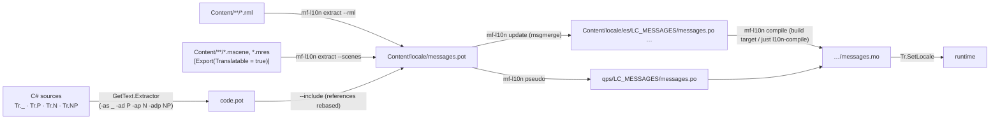

# Localization

## Purpose

Every player-facing string — C# code, RmlUi documents and scene properties — can be translated with the standard
gettext workflow (`.pot` → `.po` per language → `.mo`), so translators can use Poedit, Weblate or Crowdin. The
language switches at run time without a restart, plurals follow each language's rules, messages can carry a
context, and a pseudo-locale (`qps`) exposes untranslated and truncated text.

The runtime is the engine's `Tr` API over **GetText.NET 10.0.1** (MIT, pinned), which parses `.mo` catalogs and
evaluates their `Plural-Forms`. Everything around it is in-house: catalog management and lookups, the RML and
scene extractors, the pseudo-locale and a `.mo` compiler (`mf-l10n`), so neither builds nor CI need GNU gettext.
Decisions: [GetText.NET with engine-owned catalogs](../../memory/decisions/0060-gettext-net-engine-owned-catalogs.md),
[catalog layout and locale chain](../../memory/decisions/0061-catalog-layout-and-locale-chain.md),
[in-house .mo compiler](../../memory/decisions/0062-in-house-mo-compiler.md),
[the `Tr` API](../../memory/decisions/0063-tr-api-and-format-safety.md),
[RML translation contract](../../memory/decisions/0064-rml-translation-contract.md),
[translatable scene strings](../../memory/decisions/0065-translatable-scene-strings.md),
[pseudo-locale](../../memory/decisions/0066-pseudo-locale-qps.md).

## Key types

| Type | File | Notes |
|---|---|---|
| `Tr`, `LocaleChangedEventArgs` | [Localization/Tr.cs](../../MainframeEngine/Src/Localization/Tr.cs) | lookups, locale switching, `LocaleChanged` |
| `LocalizationOptions` | [Localization/LocalizationOptions.cs](../../MainframeEngine/Src/Localization/LocalizationOptions.cs) | domain, folder, source locale, fallbacks, logging |
| `LocaleId` | [Localization/LocaleId.cs](../../MainframeEngine/Src/Localization/LocaleId.cs) | normalisation (`pt-BR` → `pt_BR`), chains, cultures, display names |
| `TranslationSet`, `TranslationEntry` (internal) | [Localization/TranslationSet.cs](../../MainframeEngine/Src/Localization/TranslationSet.cs) | merged catalogs of one chain |
| `TrInterpolatedStringHandler` | [Localization/TrInterpolatedStringHandler.cs](../../MainframeEngine/Src/Localization/TrInterpolatedStringHandler.cs) | `Tr._($"Score: {score}")` |
| `RmlLocalization`, `RmlTextRun` | [Localization/RmlLocalization.cs](../../MainframeEngine/Src/Localization/RmlLocalization.cs) | RML parser shared by extractor and runtime |
| `ITextTranslator`, `TextTranslator` | [Localization/ITextTranslator.cs](../../MainframeEngine/Src/Localization/ITextTranslator.cs) | the contract the game UI calls |
| `FontFallbackTable`, `LocaleFontSet` | [Localization/FontFallbackTable.cs](../../MainframeEngine/Src/Localization/FontFallbackTable.cs) | per-locale fonts (`.mres`) |
| `AutoTranslateMode`, `Node.Atr`/`AtrN`/`OnLocaleChanged` | [Scene/Node.Localization.cs](../../MainframeEngine/Src/Scene/Node.Localization.cs) | scene strings |
| `mf-l10n` | [Tools/MainframeEngine.L10n/](../../Tools/MainframeEngine.L10n/) | extract, merge, update, pseudo, compile, check, stats |
| `build/Localization.targets` | [build/Localization.targets](../../build/Localization.targets) | `.po` → `.mo` at build time |

## Workflow



| Recipe | What it runs |
|---|---|
| `just l10n-extract` | builds the Demo, runs the GetText.NET extractor over `Examples/Demo/Demo/Src`, `mf-l10n extract` (RML + scenes + the C# template), `update` (every `.po`) and `pseudo` (qps, Latin-1 accents for fonts limited to Latin-1) |
| `just l10n-compile` | `mf-l10n compile --dir …/Content/locale`: refreshes the committed `.mo` next to each `.po` |
| `just l10n-check` | fails when a committed `.mo` is missing or stale, or a translation breaks its placeholders; with GNU `msgfmt` on PATH it also runs `msgfmt -c` and requires byte-identical output |
| `just l10n-stats` | coverage per locale |

- The extractor is the `GetText.NET.Extractor` 10.0.1 **local tool** ([.config/dotnet-tools.json](../../.config/dotnet-tools.json);
  `dotnet tool restore`). It matches calls by method name only, so the aliases are `_`, `P`, `N`, `NP`, and only
  string literals (or interpolated strings) at the call site are extracted. It writes references relative to the
  template's own path; `mf-l10n extract --include` rebases them onto `--root`.
- New languages: `mf-l10n update --pot … --dir … --create fr,pt_BR` writes a catalog with the CLDR
  `Plural-Forms` for the language (about 40 languages tabled; others get the English rule to edit).
- `update` is an exact-match `msgmerge`: messages follow the template, translations and translator comments are kept,
  a message that gained or lost a plural keeps its old text marked `fuzzy`, translated messages that left the
  template become obsolete `#~` entries, and an obsolete entry whose message returns gets its translation back. There is no fuzzy matching of edited msgids (use `msgmerge` if wanted:
  the files are standard).

### Build step

[build/Localization.targets](../../build/Localization.targets) (imported by the Demo's launcher; every game imports it the same way)
compiles every `Content/locale/<locale>/LC_MESSAGES/<domain>.po` to `obj/<Configuration>/locale/…/.mo` with
`mf-l10n` (built first through a project reference with `ReferenceOutputAssembly=false`), incrementally per
catalog, and copies the results to the output as `Content/locale/…/<domain>.mo`. A translation that breaks its
placeholders or plural count fails the build with file and line. `.po`/`.pot` never reach the output. When the tool
cannot run (`-p:CompileLocales=false`, or its output is missing) the build warns (`MFL10N001`) and ships the
committed `.mo` files instead — the same pattern as the [shader pipeline](shaders.md).

### The `.mo` compiler

`mf-l10n compile` reproduces GNU `msgfmt` byte for byte (verified by a unit test against `msgfmt` 1.0 for catalogs
of 0–257 messages with contexts, plurals and UTF-8, and by `just l10n-check --msgfmt`): revision 0, little-endian,
messages sorted by msgid bytes, untranslated/fuzzy/obsolete messages dropped (a fuzzy header is kept, `--use-fuzzy`
keeps fuzzy messages), strings NUL-terminated after the tables, and the `hashpjw` hash table (32-bit, folding bits 28–31; a regression test covers a carry out of bit 31) with
gettext's sizing
(next odd prime ≥ 4n/3, at least 3) and double hashing. `MoFormat.Read` reads either byte order and verifies that the
hash table finds every message.

Locale folders must already have their normalised names (`pt_BR`, not `pt-BR`; the runtime only looks there and
Linux paths are case-sensitive), or `compile`/`check` fail. Before writing, `compile` checks every compiled
translation (fuzzy entries are skipped unless `--use-fuzzy`): the `Plural-Forms` count must match `msgstr[n]`;
`csharp-format` messages must be valid composite formats that use no argument index the source lacks (dropping one
only warns, `--strict` makes warnings fatal); RML text must keep exactly the source's `{{ data expressions }}`.

## Runtime API

```csharp
using MainframeEngine.Localization;

label   = Tr._("Settings");                                  // gettext
title   = Tr.P("menu", "Open");                              // pgettext: msgctxt "menu"
status  = Tr.N("{0} enemy left", "{0} enemies left", n);     // ngettext: n is {0}
coins   = Tr.NP("hud", "{0} coin in {1}", "{0} coins in {1}", n, bag);
score   = Tr._("Score: {0}", score);                          // format overloads: no boxing
hello   = Tr._($"Hello, {player}!");                          // looks up "Hello, {0}!"

Tr.SetLocale("es");                       // or "pt-BR", "pt_BR"; raises Tr.LocaleChanged
Tr.LocaleChanged += (_, e) => Log.Info($"{e.PreviousLocale} -> {e.Locale}");
```

- **Lookups never allocate.** `Tr._(string)` returns the catalog's string or the msgid itself (untranslated text shows
  the source). Context lookups compose `ctx\u0004id` on the stack and use `Dictionary.GetAlternateLookup` over spans.
  Measured: hit 3.6 ns, miss 2.9 ns, context hit 15 ns, 0 B; the render-test allocation gate does lookups every frame.
- **Format safety.** Overloads with arguments treat the message as a .NET composite format and format with
  `Tr.Culture`. Each translated form's `CompositeFormat` is parsed once and cached. A translation that is not a valid
  format, needs more arguments than the call passes, or whose specifier an argument rejects falls back to the
  source format (logged once); a broken source is returned unformatted. Lookups never throw. Overloads without
  arguments never format, so literal braces need no escaping there. Generic overloads (`_<T0>`, up to three
  arguments; `params ReadOnlySpan<object?>` beyond) do not box.
- **Plurals.** Each catalog's `Plural-Forms` (GetText.NET's AST evaluator) picks the form; `n` is always `{0}` and
  further arguments start at `{1}`. An empty form, or no translation, falls back to the source (`singular` when
  `n == 1`, else `plural`).
- **Interpolated strings** bind to `TrInterpolatedStringHandler`, which rebuilds the composite format the extractor
  writes (`{0,5:N2}`, literal braces re-escaped) and formats with the captured values. Convenient, but it boxes and
  allocates; hot paths use the format overloads or cache.
- **Missing translations** are logged once per message and locale (`LocalizationOptions.LogMissingTranslations`,
  on in Debug builds of the engine), never while the current language is the source language; bad translated
  formats are logged once as warnings.
- Lookups are thread-safe (immutable sets swapped atomically). Switch locales on the main thread. A throwing
  `LocaleChanged` listener or `OnLocaleChanged` override is logged and does not stop the other notifications.

### Catalogs and the locale chain

- Files: `{LocaleDirectory}/{locale}/LC_MESSAGES/{Domain}.mo`, default `Content/locale/<locale>/LC_MESSAGES/messages.mo`
  (resolved with [`ContentPaths`](build-and-platforms.md)). Locale folders use gettext names (`pt_BR`, `zh_Hans_CN`).
- `SetLocale("pt_BR")` loads every catalog of the chain **`pt_BR → pt → FallbackLocales… → SourceLocale (en)`**
  (a locale of the source language, such as `en_GB`, skips the fallbacks: its missing messages show the source text,
  never a fallback's translation) that exists and merges them into one immutable set (first catalog wins per message; each message keeps its own
  catalog's plural rule). The source locale needs no catalog. A corrupt catalog is logged and skipped. Switching
  between two 2 000-message catalogs costs about 2 ms (benchmark `SwitchLocale`).
- **Projects:** `project.mfproj`'s `localization` section (`defaultLocale`, `sourceLocale`, `fallbacks`, `directory`,
  `domain`) becomes `EngineOptions.Localization`/`Locale` through `ProjectSettings.ToEngineOptions()`; `GameHost`'s
  `--locale` overrides the default ([projects](project-and-gamehost.md#projectmfproj)). Games built from the `mfgame`
  template import `build/Localization.targets` with `LocaleContentRoot=../Content`.
- **Code reload:** unloading a game assembly (`GameAssemblyLoader`) drops `Tr.LocaleChanged` and `SceneTree.LocaleChanged`
  handlers of game code that never unsubscribed (logged as warnings); translatable-property metadata goes with the
  type registration.
- **Startup** (`Engine` constructor → `Tr.Configure(EngineOptions.Localization ?? new(), EngineOptions.Locale)`):
  `EngineOptions.Locale` (player settings) if catalogs exist for its chain (itself, its parents or `FallbackLocales`),
  otherwise the OS UI language under the same rule, otherwise the source locale; invalid names are ignored, so a bad
  saved setting cannot stop the game. `Tr.SetLocale` itself accepts any valid name (no catalog: source text). `Tr.GetAvailableLocales()` lists the source locale plus every
  folder with a catalog; `LocaleId.DisplayName` gives menu names (`español`, `Pseudo-locale (qps)`).
- `Tr.Culture` is the locale's `CultureInfo` for formatting; the process `CurrentCulture`/`CurrentUICulture` are not
  changed (parsing code stays culture-stable).
- Not used: GetText.NET's `CatalogManager` (it keys its cache on `CurrentCulture` while `Catalog` defaults to
  `CurrentUICulture`) and `Catalog.GetString` (24 B per call).

## Scene strings

```csharp
public sealed class WelcomeBanner : Node
{
    [Export(Translatable = true)] public string Title { get; set; } = "";
    public string DisplayTitle { get; private set; } = "";

    protected override void OnReady() => DisplayTitle = Atr(Title);
    protected override void OnLocaleChanged() => DisplayTitle = Atr(Title);
}
```

- `[Export(Translatable = true)]` marks player-facing text (`string`, `string[]`, `List<string>`; anything else is
  error **MFG010**). The generator sets `ExportHints.Translatable`; `NodeTypeInfo.TranslatableProperties` lists them
  (base types first). The stored value is always the source text (the msgid): saving never writes a translation.
- `Node.AutoTranslateMode` (`Inherit` / `Always` / `Disabled`, exported; the root translates) decides whether
  `Node.Atr(message, context)` and `AtrN` translate. Changing it re-runs `OnLocaleChanged` on the subtree.
- On `Tr.SetLocale` every live `SceneTree` (tracked weakly) calls `Node.OnLocaleChanged` on its nodes, parents first,
  then raises `SceneTree.LocaleChanged`. While the tree is ticking this is deferred to the end of the frame; when the
  locale changed on another thread it is applied at the start of the tree's next `Tick`. Nodes translate in
  `OnReady` too (entering a tree is not a locale change).
- `mf-l10n extract --scenes` reads `.mscene`/`.mres` JSON and extracts translatable values of nodes, nested-instance
  properties and overrides (typed through the instanced scene file), and inline resources, with `#:` references to
  the value's line and `#.` comments naming the node path and property. Instanced scene paths resolve against
  `--root`, else against the folders above the scene file (so `--root` may be the repository root). It learns which properties are translatable
  from `TypeRegistry` (engine types, plus game assemblies passed with `--assembly`); `--translatable Type.Property`
  adds more. Types it does not know are reported.

## Game UI (RmlUi)

The [game UI](game-ui.md)'s `UiServer` translates every document through `UiServerOptions.TextTranslator` (an
`ITextTranslator`, default `TextTranslator.Current`, i.e. `Tr`; `null` turns UI localization off). RmlUi only sends
**text nodes** to its `TranslateString` callback, and only the text — no element — so the work is split:

1. **Document sources** — `UiFileInterface.DocumentPreprocessor` (set to `ITextTranslator.PrepareDocument` →
   `RmlLocalization.PrepareDocument`) rewrites every `.rml` the file interface serves (documents and templates) and
   every in-memory `UiDocument.Rml`: it translates the `title` and `placeholder` attributes and `value` of
   `<input type="submit|button">` (RmlUi never sends attributes to `TranslateString`), and prefixes text nodes inside
   `no-tr` elements with `RmlLocalization.OptOutMarker` (U+FDD0, a Unicode noncharacter).
2. **Text nodes** — `UiServer.Translator` (`UiTranslator(ReadOnlySpan<byte> utf8, RmlStringSink output)`) calls
   `ITextTranslator.TryTranslateMarkup` → `Tr.TranslateMarkup(utf8, out var text)` and, on true, `output.Set(text)`
   (RmlUi gets 1); otherwise RmlUi keeps the text. Marked runs (opted out) come back without the marker, untranslated
   and without a lookup.
   **Data-bound text**: RmlUi sends a data view's template (`Health {{ health }}`) through `TranslateString` when it
   creates the text node, and then **every substituted text** (`Salud 72`) again whenever a bound value changes. The
   server therefore translates a run containing `{{` once and returns it with the opt-out marker in front (a `no-tr`
   template keeps the marker `PrepareDocument` gave it): the data view copies the marker into every substituted text,
   which comes back unmarked without a lookup. So bound values are never translated (a player named "Play" stays
   "Play"), never logged as missing, and a frame of HUD updates allocates nothing (the `showcase` allocation gate runs
   the HUD in Spanish). The data view replaces the marked template on the context's first update, before rendering.
3. **Locale changes** — `ITextTranslator.LocaleChanged` only flags the server (it may fire on any thread, or inside an
   RmlUi callback such as a language dropdown's data binding). At the start of the next `UiServer.Process` — after the
   queued handle releases, before any context updates — the server loads the faces of the `FontFallbackTable`
   (`UiServerOptions.FontFallbackTablePath`, default `Content/locale/fonts.mres`) for the new `LocaleChain` as fallback
   faces, drops the template cache and reloads every loaded document from its source. Data models and `UiElement`
   subscriptions survive the reload; call `Dirty`/`DirtyAll()` on models whose strings come from `Tr` or from
   `Node.Atr` (for example in the document's `OnLocaleChanged`).
4. **Panel titles** — RmlUi translates `<head><title>`; `UiDocument` writes that already-translated title into the
   `mf-panel` title bar with the opt-out marker, so it is not looked up a second time.

```csharp
// The core of what the UiServer installs (UiServer.TranslateText, which also marks data-view templates as above);
// replace UiServer.Translator to customise.
ui.Translator = static (utf8, sink) =>
{
    if (!Tr.TranslateMarkup(utf8, out var text))
        return false;
    sink.Set(text.AsSpan());
    return true;
};
```

**Matching rules** (one parser, `RmlLocalization.Scan`, for extraction and runtime, so msgids always match):

- Translated: text nodes (including `<head><title>`, which RmlUi also sends to `TranslateString`), and the attributes
  above (a `<textarea>`'s `placeholder` too). Not translated: other `head` content, `style`, `script` and `textarea`
  content, comments, CDATA, processing instructions, and runs with no letter outside `{{ … }}` (`{{score}}`, `100%`).
  Unquoted attribute values are quoted when translated.
- The msgid is the text with entities decoded (`&amp; &lt; &gt; &quot; &apos; &nbsp;`, numeric), whitespace runs
  collapsed to one space and trimmed. Inline markup splits a paragraph into separate messages
  (`Press <b>Start</b> now` → `Press`, `Start`, `now`), exactly as RmlUi translates each text node.
- Translations are plain text, entity-encoded on the way out, so a translation can never inject markup (RmlUi would
  otherwise parse a translation containing `<` as RML). Outer whitespace of the original run is kept as one space.
- `class="no-tr"` opts an element and everything inside it out of extraction and translation.
- Contexts and plurals are not available in RML text; build such strings in C# and bind them through a data model.

**Fonts**: `FontFallbackTable` (a `.mres` resource, by convention `Content/locale/fonts.mres`) lists
`DefaultFonts` and per-locale `LocaleFontSet`s (`ja` → Noto Sans JP, …). `Resolve(chain)` returns the sets matching the
chain (most specific first) then the defaults, without duplicates. RmlUi cannot unload one face, so faces accumulate
over a session; fallback faces only supply missing glyphs, so they never change how other text looks.

## Pseudo-localization

`mf-l10n pseudo --pot … --dir …` writes `qps/LC_MESSAGES/messages.po` (and `--compile` its `.mo`): every message is
accented (`Settings` → `[Šéţţîñĝš ~~]`), padded by about 30% (`--expansion`), and bracketed. Format items
(`{0:N2}`), escaped braces, `{{ data }}` expressions, `%s` sequences and outer whitespace are kept. `--charset latin1`
only uses Latin-1 accents (`[Séttîñgs ~~]`) for fonts limited to Latin-1. In `qps`, strings that bypass translation appear without brackets, and clipped brackets show truncation.

## Demo

The [Demo](demo.md) ships `en` (source), `es` (hand-written) and `qps` in `Examples/Demo/Content/locale`
(`just l10n-extract` reads `Examples/Demo/Demo/Src`, the Demo's `Content` and the engine's `MainframeEngine/Content/UI`
widgets; `just l10n-check` runs in CI). Its RmlUi panels are translated by the UI server; the tab titles are
`Tr._(...)` literals in `DemoNav`, re-translated on `OnLocaleChanged`. The nav bar's **language picker** (a `data-for`
`<select>` over `Tr.GetAvailableLocales()`) switches at run time. `--locale es` starts in Spanish.
`Tests/Content/locale` is a separate, small Spanish catalog for the render tests' allocation gate and the editor
tests; the `mf-l10n` recipes do not manage it.

## Testing

Unit tests ([Tests/MainframeEngine.Tests/Localization/](../../Tests/MainframeEngine.Tests/Localization/), collection
`LocalizationState` because `Tr` is process-wide): catalog loading and the fallback chain, contexts, Polish and Russian
plurals, format safety, interpolated strings, allocation-free lookups, locale switching events and startup locale;
RML scanning, `TranslateMarkup`, `no-tr` and `PrepareDocument`; node re-translation (immediate, deferred during a tick,
cross-thread); `.po` parse/write round trips, `.mo` write/read with hash-table checks, GetText.NET reading our output,
byte equality with GNU `msgfmt` (skipped when it is not installed); placeholder checks; pseudo-locale; extraction
from RML/scene/resource/C# fixtures (the C# test runs the real extractor via `dotnet tool run`); and an end-to-end
`mf-l10n` run on a fixture project (extract → update → translate → compile → check → pseudo → stats → runtime).
Generator test: MFG010. Game UI ([UiLocalizationTests](../../Tests/MainframeEngine.Tests/UI/UiLocalizationTests.cs), headless
`UiServer`): text and attributes translated at load and again after a locale switch (data models survive), `no-tr`,
in-memory documents and panel titles, bound values never translated, a switch from inside a click handler deferred to
the next frame, fallback fonts following the locale, no translator, and **0 B over 200 translated HUD frames** with
missing-translation logging on.
Benchmarks: `LocalizationBenchmarks` in [baseline.json](../../Tests/MainframeEngine.Benchmarks/baseline.json).

## Not done yet

- Editor (M10): Localization panel (extract, merge, coverage via `mf-l10n stats`), preview-locale dropdown, warnings
  for RML text or translatable properties missing from `messages.pot`.
- RTL layout and shaping, localized textures/audio, per-locale number/date formatting beyond `CultureInfo`.
- Translation contexts for scene strings and RML.

## Known issues

- A text node with `{{` that is not inside a data model (a broken binding) shows its template text with the
  invisible opt-out marker in front.
- RmlUi passes `<textarea>` content to `TranslateString` although it is never extracted: in a non-source locale with
  missing-translation logging on, the content is logged once as missing.
- `update` matches msgids exactly; an edited source string loses its translation (kept as an obsolete entry).
- A constant interpolated string with escaped braces (`$"{{x}}"`, no holes) compiles to a plain string, so its
  runtime msgid (`{x}`) differs from the extracted one (`{{x}}`); write such strings as normal literals.
- Locale switches reload catalogs from disk on the calling thread (~2 ms per 2 000 messages).
- The GetText.NET extractor matches any method named `_`, `P`, `N` or `NP` with a string literal; avoid those names
  for unrelated methods in scanned source folders.

## Related docs

[Scene serialization](scene-serialization.md) · [Scene graph & nodes](scene-graph-and-nodes.md) ·
[Game UI](game-ui.md) · [Editor](editor.md) · [Shaders](shaders.md) ·
[Demo](demo.md) · [Milestones](../milestones.md)
