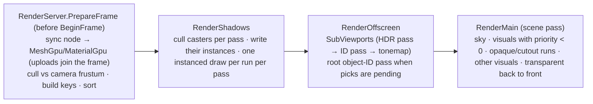

# Materials & Meshes

## Purpose

How geometry is described and drawn: `Mesh` resources (explicit `ArrayMesh`es and generated primitives),
`StandardMaterial3D`, `Texture2D`, and the nodes that place them (`MeshInstance3D`, `Sprite3D`). The render
server never draws these one by one. Every frame it culls them, sorts them, and draws each run of equal
pipeline + material + mesh as **one instanced draw**. A shared, state-hashed pipeline cache means a thousand
materials with the same fixed-function state cost one `VkPipeline`. The same machinery renders shadow casters,
the object-ID picking pass and offscreen `SubViewport`s.

Before M3, every `ShapeBase` (`Box3d`, `Quad`) built its own pipeline, descriptor pool and UBOs. It uploaded the
1200-byte lights UBO per object and drew a flat colour. Those types are gone: old scenes load them as
`MeshInstance3D`s (see [Compatibility](#compatibility)).

Decisions: [ADR 0013 Assimp for import](../../memory/decisions/0013-assimp-for-model-import.md),
[0014 Blinn-Phong now, PBR later](../../memory/decisions/0014-blinn-phong-now-pbr-later.md),
[0015 instanced batching](../../memory/decisions/0015-instanced-batching-instance-buffer.md),
[0016 normal maps without tangents](../../memory/decisions/0016-normal-maps-without-tangents.md),
[0017 on-demand object-ID pass](../../memory/decisions/0017-on-demand-object-id-pass.md),
[0018 removed node types](../../memory/decisions/0018-removed-node-types-upgrade.md),
[0019 one sampler per material](../../memory/decisions/0019-one-sampler-per-material.md),
[0150 PBR shading and sky image-based lighting](../../memory/decisions/0150-pbr-shading-and-sky-ibl.md),
[0151 vertex streams, MultiMesh, visibility ranges and foliage wind](../../memory/decisions/0151-vertex-streams-multimesh-visibility-foliage-wind.md).

## Key types

| Type | File | Role |
|---|---|---|
| `Mesh`, `MeshSurface`, `ArrayMesh` | [Rendering/Resources/Mesh.cs](../../MainframeEngine/Src/Rendering/Resources/Mesh.cs) | Geometry: surfaces (submeshes) with positions, normals, UVs, indices and a default material; `Bounds` (AABB); `Version` |
| `PrimitiveMesh`, `BoxMesh`, `PlaneMesh`, `QuadMesh`, `SphereMesh`, `CylinderMesh`, `CapsuleMesh` | [PrimitiveMeshes.cs](../../MainframeEngine/Src/Rendering/Resources/PrimitiveMeshes.cs) | Generated on first use from a few exported parameters (Godot names and defaults); `FlipFaces`, `Material` |
| `MeshGeometry`, `MeshBuilder` | [MeshGeometry.cs](../../MainframeEngine/Src/Rendering/Resources/MeshGeometry.cs) | Smooth normals; consistent triangle winding for the generators |
| `Material`, `StandardMaterial3D`, `MaterialRenderState`, `AlphaMode`, `CullMode`, `ShadingMode` | [Material.cs](../../MainframeEngine/Src/Rendering/Resources/Material.cs) | Surface shading; the state that selects a pipeline |
| `FoliageMaterial3D`, `FoliageBackFace` | [FoliageMaterial3D.cs](../../MainframeEngine/Src/Rendering/Resources/FoliageMaterial3D.cs) | Leaves, grass, bark: vertex wind, cutout, translucency (ADR 0151) |
| `Texture2D`, `TextureImportSettings` | [Texture2D.cs](../../MainframeEngine/Src/Rendering/Resources/Texture2D.cs) | Images; import settings from `.meta` (see [Asset pipeline](asset-pipeline.md)) |
| `Texture2DArray`, `Texture2DArrayGpu` (internal) | [Texture2DArray.cs](../../MainframeEngine/Src/Rendering/Resources/Texture2DArray.cs) | Layers of one size on a `2D_ARRAY` image (ADR 0151) |
| `MultiMesh` | [MultiMesh.cs](../../MainframeEngine/Src/Rendering/Resources/MultiMesh.cs) | Many transforms of one mesh (ADR 0151) |
| `GeometryInstance3D`, `MeshInstance3D`, `Sprite3D` | [Scene/Nodes3D/GeometryInstance3D.cs](../../MainframeEngine/Src/Scene/Nodes3D/GeometryInstance3D.cs) | Nodes; `MaterialOverride`, `CastShadows`, `ObjectId`, `VisibilityRangeBegin/End` |
| `MultiMeshInstance3D`, `MultiMeshGpu` (internal) | [MultiMeshInstance3D.cs](../../MainframeEngine/Src/Scene/Nodes3D/MultiMeshInstance3D.cs), [MultiMeshGpu.cs](../../MainframeEngine/Src/Rendering/Meshes/MultiMeshGpu.cs) | Draws a `MultiMesh` from a persistent instance buffer |
| `MeshVertex`, `MeshVertexExt`, `MeshInstanceData`, `VertexLayouts` | [Rendering/Meshes/MeshVertex.cs](../../MainframeEngine/Src/Rendering/Meshes/MeshVertex.cs) | 32-byte vertex; 20-byte second stream; 80-byte instance; vertex input layouts |
| `Aabb`, `Frustum` | [Aabb.cs](../../MainframeEngine/Src/Rendering/Meshes/Aabb.cs) | Bounds, transformed bounds, frustum culling |
| `PipelineKey`, `PipelineStateCache`, `ShaderSetId` | [PipelineStateCache.cs](../../MainframeEngine/Src/Rendering/Meshes/PipelineStateCache.cs) | State-hash cache of mesh pipelines |
| `DrawSortKey`, `DrawList<T>` | [DrawList.cs](../../MainframeEngine/Src/Rendering/Meshes/DrawList.cs) | 64-bit sort keys; reusable sorted lists |
| `MeshRenderer` (internal) | [MeshRenderer.cs](../../MainframeEngine/Src/Rendering/Meshes/MeshRenderer.cs) | GPU copies (ref-counted), culling, sorting, instance writes, draws, shadow casters |
| `MeshGpu`, `MaterialGpu`, `TextureGpu` (internal) | [MeshGpuResources.cs](../../MainframeEngine/Src/Rendering/Meshes/MeshGpuResources.cs) | Per-resource GPU state |
| `InstanceBuffer`, `MaterialDescriptorAllocator` (internal) | [InstanceBuffer.cs](../../MainframeEngine/Src/Rendering/Meshes/InstanceBuffer.cs) | Per-frame-slot instance ring; material set pools |
| `PickResult`, `PickHandle`, `ObjectIdPicker` | [ObjectIdPicker.cs](../../MainframeEngine/Src/Rendering/Meshes/ObjectIdPicker.cs) | GPU picking |
| `SubViewport`, `SubViewportCompositor` | [Scene/SubViewport.cs](../../MainframeEngine/Src/Scene/SubViewport.cs), [SubViewportCompositor.cs](../../MainframeEngine/Src/Rendering/Meshes/SubViewportCompositor.cs) | Offscreen views |

## Resources

### Meshes

A `Mesh` has one or more `MeshSurface`s. Each surface is an indexed triangle list (counter-clockwise front faces)
with:

- position, normal and UV arrays, one entry per vertex;
- an optional default `Material`.

Missing normals are generated smooth (area-weighted) at upload, and missing UVs are zero. `Validate()` reports bad
data, and a mesh that fails validation is logged and skipped.

Version tracking:

- `Mesh.Version` changes on any edit, including edits to an `ArrayMesh`'s surfaces. The renderer then re-uploads
  the mesh on the next frame.
- After editing a surface's arrays in place, call `MeshSurface.NotifyChanged()`.

Primitive meshes serialize only their parameters. They regenerate when a parameter changes. All primitives use
these conventions:

- Y is up and front faces are counter-clockwise.
- The UV origin is top-left, matching Vulkan image rows and glTF.
- Shapes are centred on the origin.

| Primitive | Parameters (defaults) | Vertices |
|---|---|---|
| `BoxMesh` | `Size` (1,1,1) | 24 (one UV square per face) |
| `PlaneMesh` | `Size` (2,2) in XZ facing +Y, `SubdivideWidth/Depth` | (w+2)(d+2) |
| `QuadMesh` | `Size` (1,1) in XY facing +Z, `CenterOffset` | 4 |
| `SphereMesh` | `Radius` 0.5, `Height` 1 (ellipsoid when ≠ 2r), `RadialSegments` 64, `Rings` 32, `IsHemisphere` | (rings+1)(radial+1) |
| `CylinderMesh` | `TopRadius`/`BottomRadius` 0.5, `Height` 2, `RadialSegments` 64, `Rings` 4, `CapTop/CapBottom` | side grid + caps |
| `CapsuleMesh` | `Radius` 0.5, `Height` 2 (caps included), `RadialSegments` 64, `Rings` 8 per hemisphere | 2(rings+1)(radial+1) |

The generators add triangles through `MeshBuilder`, which orients each triangle to agree with its vertex normals.
The unit tests check the winding, outward normals, counts and bounds of every primitive.

### Vertex streams (ADR 0151)

A surface can carry two optional per-vertex arrays (Godot's `ARRAY_COLOR` and `ARRAY_CUSTOM0`). Both serialize like
the other arrays (JSON float arrays in `.mscene`/`.mres`) and must be empty or one per position (`Validate`).

| Array | Meaning | Missing |
|---|---|---|
| `Colors` (`Vector4[]`, RGBA 0..1, authored in sRGB) | Lit materials multiply their albedo by it (alpha too) | opaque white |
| `Custom0` (`Vector4[]`) | Free data. Foliage reads x = wind weight (0 at the trunk base, 1 at the tips), y = branch level / 4 (1 = leaf), z = wind phase 0..1, w = ambient occlusion | zero |

- A mesh with a stream on any surface uploads a **second vertex buffer** covering all its vertices:
  `MeshVertexExt`, 20 bytes per vertex (RGBA8 unorm colour, then float4 custom0), bound at **binding 2**. Surfaces
  without streams get the defaults in it. A mesh drawn with a material that always reads it (`FoliageMaterial3D`)
  gets the buffer on demand (`MeshGpu.EnsureStreams`), filled with defaults.
- `MeshVertex` stays 32 bytes and `PrimitiveMesh`es never have streams. Shadow casters read binding 0 only, except
  the foliage casters.
- Lit surfaces with a stream draw with `VertexLayoutId.MeshInstancedExt` (part of `PipelineKey`):
  `Mesh/MeshExt.vk.vert` passes the colour (sRGB → linear) at location 3, and `Mesh.vk.frag` multiplies the albedo by
  it when **specialization constant 1** (`kVertexColor`) is set. Every other pipeline sets it to 0, and
  `Mesh.vk.vert`/`MeshOutline.vk.vert` write a constant white that is never read, so surfaces without streams shade
  bit-exactly as before. Outlines and the ID pass never read the stream.

### StandardMaterial3D

The shading is Blinn-Phong by default ([ADR 0014](../../memory/decisions/0014-blinn-phong-now-pbr-later.md)), unshaded,
or PBR (`ShadingMode.Pbr`, [ADR 0150](../../memory/decisions/0150-pbr-shading-and-sky-ibl.md): Cook-Torrance GGX + Lambert,
ambient and reflections from the sky, see [Lighting](lighting.md#pbr)). Blinn-Phong stays the default so existing scenes
look the same; Godot's default (PBR) waits for the G6.2 serialization migration. Like every colour in the engine,
colours are authored in sRGB and converted to linear when packed.

| Group | Properties |
|---|---|
| Albedo | `AlbedoColor` (alpha too), `AlbedoTexture` (× colour) |
| Normal map | `NormalTexture` (tangent space, OpenGL/glTF convention: +Y up), `NormalScale` |
| Specular | `Specular` (strength, default 0.3), `Shininess` (exponent, default 32): the old shape shader's values; Blinn-Phong only |
| PBR | `Metallic` (0), `Roughness` (perceptual, 1), `AmbientOcclusion` (1), `OrmTexture` (linear: R occlusion, G roughness, B metallic, glTF's and Godot's ORM packing; multiplies the three values); `ShadingMode.Pbr` only |
| Emission | `EmissionColor`, `EmissionEnergy` (can exceed 1: HDR), `EmissionTexture` |
| Transparency | `Transparency`: `Opaque`, `Cutout` (discard below `AlphaCutoff`), `Blend` (straight alpha, back to front, no depth write, casts no shadow) |
| Rendering | `ShadingMode` (`BlinnPhong`, `Unshaded`, `Pbr`), `CullMode` (`Back`, `Front`, `Disabled`), `DoubleSided` (cull nothing, back faces lit with the flipped normal), `RenderPriority` (transparent order) |
| UV | `UvScale`, `UvOffset` |

Each property setter bumps `Material.Version`. On the next frame the renderer:

- re-uploads the parameter UBO;
- rewrites the descriptor set if a texture changed;
- re-resolves the pipelines if `RenderState` changed.

`StandardMaterial3D.Default` (white, lit, opaque) is used when a surface has no material. Other `Material`
subclasses (apart from `OutlineMaterial3D` and `FoliageMaterial3D`, below) are not supported by the renderer yet:
they draw with the default material and log a warning once.

### Next passes and OutlineMaterial3D (ADR 0132)

- **`Material.NextPass`** (Godot's `next_pass`): a material drawn after this one over the same surfaces. Chains are
  followed for up to `Material.MaxPassChain` (8) materials, so a cycle stops there. Changing any `NextPass` bumps
  `Material.ChainGeneration`, which makes nodes re-resolve their chains.
- **`OutlineMaterial3D`**: Godot's common inverted-hull outline shader as a built-in material.
  - Properties: `Color` (sRGB) and `Width` (render-target pixels).
  - Front faces are culled and it is unshaded and blended, like the Godot shader, which writes `ALPHA`. It casts no
    shadow.
  - `Mesh/MeshOutline.vk.vert` pushes each vertex along its clip-space normal by `Width` pixels, using Godot's
    formula (the model-view 3×3, not the normal matrix). The surface drawn before it hides everything but the rim.
  - Hard-edged meshes show gaps at their corners: each face's vertices move along that face's own normal. Godot's
    shader does the same.

### FoliageMaterial3D (ADR 0151)

A built-in material for leaves, grass and bark, following the `OutlineMaterial3D` pattern: its own shader set
(`ShaderSetId.MeshFoliage`: `Foliage/Foliage.vk.vert` + `.frag`), the `StandardMaterial3D` set-2 layout, and always the
`MeshInstancedExt` vertex layout.

| Group | Properties |
|---|---|
| Albedo | `AlbedoColor`, `AlbedoTexture` (× colour × vertex colour) |
| Normal map | `NormalTexture`, `NormalScale` |
| Alpha | `AlphaCutout` (default on; off for bark), `AlphaCutoff` (0.5) |
| Lighting | `BackFace` (`Flip` the normal, `Keep` it for custom canopy normals, `Cull`), `Translucency` (0..1, default 0.5), `ShadingMode` (`BlinnPhong`, `Unshaded`; PBR follows lane A1), `Roughness` (0.8) |
| Wind | `WindStrength` (scales the world's wind, 1), `WindBranchBend` (1) |

- **Wind** (`include/wind.slang`, `windOffset`): the world's wind from `WorldEnvironment` (`frame.wind`,
  `frame.windParams`) and the time `frame.clip.z`. `Engine` sets `FrameContext.Time` to the summed tree deltas,
  wrapped every hour, so `--fixed-fps` runs are deterministic (frame N is N / 60 s in the render tests).
  - **Flutter**, a port of Ez Tree's leaf shader: `0.5 sin(ωt + o) + 0.3 sin(2ωt + 1.3o) + 0.2 sin(5ωt + 1.5o)`, with
    `o = 2π · simplex3(worldPos / noise scale)` (ashima webgl-noise) and ω = 2π · `WindFrequency`. It moves leaves
    only (`Custom0.y` ≥ 0.999), more towards the tip (`1 − uv.v`), along the wind plus a turbulence share sideways:
    up to `kLeafFlutter` = 0.12 m per unit of strength.
  - **Branch bend** (not in Ez Tree): a lean downwind of up to `kBranchBend` = 0.35 m × `Custom0.x²`, oscillating
    slowly (0.37 ω) with the phase `Custom0.z`.
  - The noise is sampled in world space, so instances of one mesh sway out of step. Normals are not bent.
- **Fragment**: cutout against `AlphaCutoff`, the back-face mode, then `foliageLight(...)` (`shadeLightsBlinnPhong`
  with a highlight derived from `Roughness`, the ambient term darkened by `Custom0.w`; a w of 0 means no AO data)
  plus `foliageTranslucency(...)`: the first directional light shining through the leaf where it hits the other side,
  brighter towards the light, shadowed like the light. `foliageLight` is the one place to switch to PBR.
- **Parameters** share the 80-byte block (`include/foliage.slang`): `emission` = (translucency, wind strength, branch
  bend, 0), `params` = (specular, shininess, cutoff — 0 when not cut out, normal scale), `flags.z` = back-face mode + 1.
- **Shadows**: foliage casters always bind the material (set 1 of the cutout layouts) and run
  `Shadows/Shadow2DFoliageInstanced` / `ShadowPointFoliageInstanced`, which call the same `windOffset`. The caster
  layouts cannot see `frame`, so the renderer pushes the wind, wind parameters and time (48 bytes) at push-constant
  offset 0 before the first foliage run of a pass (the instanced casters never read that range; point casters keep
  the light at offset 64). Opaque foliage (bark) has a cutoff of 0, so the shared alpha test never discards.

### Texture2D

Images load through `ResourceLoader` with their `.meta` import settings (see
[Asset pipeline](asset-pipeline.md#textures)). A texture's colour space can depend on its usage. With
`colorSpace: auto`, the renderer uploads it once per colour space its users need:

- `R8G8B8A8_SRGB` for albedo and emission slots;
- `R8G8B8A8_UNORM` for normal maps.

`ImportSettings` set `Srgb` or `Linear` force one space. Uploads go through the upload queue, and when
`Mipmaps` is set the mip chain is generated on the GPU by blits. Each upload gets its own sampler: filter, wrap,
and anisotropy, clamped to `IVulkanContext.MaxSamplerAnisotropy`. The renderer enables `samplerAnisotropy` when the
device has it.

Textures created in code (`FromPixels`, `FromEncoded`) are not saved with scenes. Only file-backed textures
persist, as references.

### Texture2DArray (ADR 0151)

Layers of RGBA8 images of one size, sampled as one texture (Godot's `Texture2DArray`), for the terrain's splat
layers (wave 2):

- built with `Texture2DArray.FromImages(IReadOnlyList<Texture2D>)` (decoded; every image must be the size of the
  first), `FromImages(width, height, IReadOnlyList<byte[]>)` or `new Texture2DArray(width, height, layers, rgba)`;
- `GetLayerPixels`, `SetLayerPixels` (bumps `Version`: the whole array re-uploads), `ImportSettings` (colour space
  with `Auto` = sRGB for colour use, mipmaps, filter, wrap, anisotropy);
- on the GPU: `GpuTexture.Create2DArray` (one image, `ArrayLayers` = layers, a `2D_ARRAY` view, mips blitted for every
  layer). `Texture2DArrayGpu` is the `TextureGpu`-shaped helper (`Update()` uploads on a version change) that the
  material binding it owns. No material binds one yet;
- runtime-only: the pixels are not saved with scenes.

## Nodes

| Node | Draws | Notes |
|---|---|---|
| `GeometryInstance3D` | — | Base: `MaterialOverride` (all surfaces), `MaterialOverlay` (drawn over every surface, with its next passes), batched by the server (never calls `Draw`), `ObjectId` = `NodeId` |
| `MeshInstance3D` | `Mesh` | Primitives, imported models, procedural meshes |
| `Sprite3D` | a `QuadMesh` sized `Texture` px × `PixelSize` | `Modulate`, `Shaded` (default unshaded), `DoubleSided` (default true), `AlphaCut` (`Disabled` = blend, `Discard` = cutout), `Offset`. Billboarding is not supported yet |
| `MultiMeshInstance3D` | every instance of its `Multimesh` | One render item; see [MultiMesh](#multimesh-adr-0151) |

Every `GeometryInstance3D` has Godot's **visibility range** (`VisibilityRangeBegin`, `VisibilityRangeEnd`, 0 =
unbounded): the instance draws, in the main pass and the shadow passes, only while the distance from the view's
camera to the centre of its world AABB is in [begin, end). Margins and fading are not implemented. The counter
`MeshDrawStats.OutOfRange` counts the skipped instances.

### MultiMesh (ADR 0151)

`MultiMesh` (a resource) holds one `Mesh` and many transforms; `MultiMeshInstance3D.Multimesh` draws it:

- `InstanceCount` (resizing resets every transform to identity), `VisibleInstanceCount` (-1 = all; draws the first
  n), `SetInstanceTransform`/`GetInstanceTransform`, the bulk `SetTransforms(ReadOnlySpan<Transform3D>, start)`, and
  `Transforms` (serialized). `GetAabb()` is the mesh's bounds under every drawn transform, cached per version.
- A `MultiMeshInstance3D` is **one render item**: frustum-culled by the world AABB of all its instances, one draw
  item per surface (never merged with other items), one instanced draw per surface with `instanceCount` = the drawn
  instances, materials resolved as for `MeshInstance3D`.
- Its instances live in a **persistent device-local buffer** (`MultiMeshGpu`) in the 80-byte `MeshInstanceData`
  layout, in world space (instance transform × node transform) with the node's object id. It is rebuilt only when
  the multimesh's version, the node's transform or the mesh's bounds change: a new buffer replaces the old one,
  which the deletion queue frees after frames in flight. A static multimesh costs one comparison per frame. A
  moving node re-uploads every frame it moves. The buffer belongs to the node: two nodes sharing a `MultiMesh` have
  one each.
- Shadow casters draw the same buffer instanced (one run per surface per pass); the object-ID pass writes the node's
  id for every instance, so picking selects the node.
- Instances with a negative-determinant transform are not drawn mirrored (only the node's transform picks the
  winding). No per-instance colour or custom data yet.

A node's material for surface *i* is resolved in this order: `MaterialOverride`, then the mesh surface's material,
then `StandardMaterial3D.Default`.

GPU references are resolved when the node is first drawn, and again when the following change:

- its mesh object, or the mesh's upload generation;
- its override or overlay;
- any material's next pass (`Material.ChainGeneration`);
- a subclass stamp (Sprite3D).

**Extra passes** (`GeometryInstance3D.GpuExtraPasses`) are resolved with the materials:

1. each surface material's next-pass chain;
2. then the overlay and its chain, over every surface.

An extra pass becomes a draw item in the opaque or transparent list, chosen by its own material's state. Its pipeline
tests depth less-or-equal, so it lands exactly on the surface drawn before it. Extra passes cast no shadow, and the
object-ID pass skips them.

The references are released when the node is freed, or at server shutdown.

## Frame

### Build (`MeshRenderer.Prepare`, once per view per frame)

For every `GeometryInstance3D` in the world's `GeometryList` that is visible in the tree and has a mesh:

1. **Sync**: compare against the node's resolved references. When they differ, acquire the new `MeshGpu` and
   `MaterialGpu`s and release the old ones (reference-counted, shared across nodes). Each mesh and material is then
   refreshed at most once per frame: re-upload on a version change, rewrite the material set if one of its textures
   was re-uploaded.
2. **Shadow casters**, main view only: one entry per surface whose material casts shadows, with its world bounds.
   The key is (cull mode, mirrored, cutout material, mesh, surface). Casters are not culled against the camera but
   against each shadow pass (see [Shadow system](shadow-system.md#caster-culling)).
3. **Cull**: transform the mesh `Aabb` by the model matrix (Arvo's method), then test it against the camera
   `Frustum` (planes from the view-projection, Vulkan's [0, 1] depth).
4. **Keys**: one draw item per surface (`DrawSortKey`).
   - **Opaque/cutout**: `[pipeline 12 bits][material 20][mesh 20][surface 12]`.
   - **Transparent**: `[render priority 8][inverted view depth 32][pipeline 12][material 12]`. This sorts
     back to front within a priority.
5. **Sort**: sort `(key, index)` pairs with `Span.Sort`. Only keys and indices move. The `DrawList`s grow and are
   reused, so a steady-state build allocates nothing.

The per-instance mirrored flag (negative determinant) selects a pipeline whose front face is clockwise. This keeps
culling and `gl_FrontFacing` right under negative scale.

### Record

- **Preparation epoch**: `PrepareFrame` starts a new epoch, so a frame that `BeginFrame` skipped (swapchain
  recreation) never leaves stale lists for the next frame.
- **Instances**: on first use in a frame, the view's opaque and transparent instances are written to the frame
  slot's `InstanceBuffer`, in sorted order. Each instance is an 80-byte `MeshInstanceData`: the model matrix and
  the object id.
  - The `InstanceBuffer` is persistently mapped and bump-allocated from zero each frame.
  - If a frame needs more room, it switches to a buffer twice the size. The old buffer stays valid for the draws
    already recorded from it, through the deletion queue.
  - The ID pass and the colour pass share the same instances.
- **Draws**:
  - Set 0 (frame) and set 1 (shadows) are bound once; set 2 (the material) whenever the material changes.
  - Each run of equal (pipeline, material, mesh, surface) becomes one `vkCmdDrawIndexed` with
    `instanceCount = run length` and `firstInstance = base + index`.
  - Mesh vertex and index buffers (and the second stream at binding 2, when the mesh has one) are bound when the mesh
    changes, and the instance buffer once at binding 1. A multimesh item binds its own instance buffer and draws all
    its instances from 0; the view's buffer is rebound for the next run.
- **Shadows**: per shadow pass, `CullShadowCasters` keeps the casters inside the light's frustum (and range) and
  writes their instances; `DrawShadowCasters` records one draw per run of equal (cull, mirrored, cutout material,
  mesh surface). `ShadowSystem.GetInstancedCasterPipeline(point, cull, mirrored, cutout)` builds the pipelines:
  positions at binding 0, the model matrix at binding 1; cutout casters also read the UV and alpha-test against
  their material (set 1 of the cutout layout). See [Shadow system](shadow-system.md#caster-culling).

### Pipelines (`PipelineStateCache`)

`PipelineKey` = (shader set, vertex layout, alpha mode, effective cull, mirrored, depth write, render pass).
`PipelineKey.ForMaterial` derives it from a material's `MaterialRenderState`:

- double-sided resolves to `Disabled`;
- blend turns depth writes off;
- for the ID shaders, blend counts as opaque and depth writes are always on.

`GetOrCreate` creates a pipeline on the first request through the persisted `VkPipelineCache`. Each pipeline gets
a dense id for the sort keys, and the pipelines live until disposal. Lookups don't allocate. Each `MaterialGpu`
caches its 32 entries (the 4 shader sets × [surface, extra pass] × [normal, mirrored] × [no stream, stream]), so
steady-state frames don't even hash.

`PipelineKey.ExtraPass` marks next-pass and overlay pipelines, whose depth compare is less-or-equal instead of less.

| Shader set | Shaders | Render pass |
|---|---|---|
| `MeshLit` | `Mesh/Mesh.vk.vert` + `Mesh/Mesh.vk.frag` (alpha mode = specialization constant 0) | the scene pass; offscreen HDR targets are render-pass compatible |
| `MeshObjectId` | `Mesh/Mesh.vk.vert` + `Mesh/MeshId.vk.frag` | a prototype of the object-ID target pass (all ID targets are compatible) |
| `MeshOutline` | `Mesh/MeshOutline.vk.vert` + `Mesh/Mesh.vk.frag` (`OutlineMaterial3D` in colour passes) | the scene pass |
| `MeshFoliage` | `Foliage/Foliage.vk.vert` + `Foliage/Foliage.vk.frag` (`FoliageMaterial3D`; always `MeshInstancedExt`) | the scene pass |

`MeshLit` with `VertexLayoutId.MeshInstancedExt` uses `Mesh/MeshExt.vk.vert` and sets specialization constant 1
(vertex colour) of `Mesh.vk.frag`.

### Descriptor sets

| Set | Contents | Owner |
|---|---|---|
| 0 | b0 camera (`FrameData`), b1 lights UBO, b2 radiance cube, b3 irradiance cube, b4 BRDF LUT (the sky's image-based lighting, [Sky](sky.md#image-based-lighting)) | `FrameContext` (per frame slot and view) |
| 1 | shadow uniforms + maps (`ShadowSystem` or the fallback) | shadows |
| 2 | material: b0 parameters UBO (96 B, device-local), b1 one `sampler`, b2–b5 albedo/normal/emission/ORM `texture2D` (1×1 fallbacks; the ORM one is linear white) | `MaterialGpu` |
| binding 1 (vertex) | per-instance model matrix + object id | `InstanceBuffer`, or a `MultiMeshGpu` |
| binding 2 (vertex) | the second stream: RGBA8 colour + float4 custom0 | `MeshGpu.Streams` |

The material set uses a single `sampler` with separate `texture2D`s. Before M4 the shadow set held 15 samplers and this kept the
fragment stage within MoltenVK's limit of 16 samplers
([ADR 0019](../../memory/decisions/0019-one-sampler-per-material.md)). The fragment stage now uses 13 images and 10
samplers (shadows 6 combined, material 1 sampler + 4 images, sky lighting 3 combined), within the G6 budget of 16 and 4
sets ([rendering-features.md](future/rendering-features.md#binding-budget)). The sampler is that of the material's
first texture. A material's set is never updated in place, because frames in flight may still bind it. Instead, a
new set is written, and the old one is freed by `MaterialDescriptorAllocator` once its frame has completed. The
allocator's pools are freeable and their live counts are exact.

## Shaders

- `Mesh.vk.vert` builds the model matrix from the instance attributes (the C# rows are the rows of the Slang matrix: row-major layout, `mul(v, M)`). The
  normal matrix is the **cofactor** of the upper 3×3, multiplied by the sign of the determinant: it handles
  non-uniform scale and mirroring without an inverse.
- `include/material.slang` holds the material set, the UV transform, albedo and emission lookups, and
  `materialNormal`. That function reconstructs a tangent frame from screen-space derivatives of position and UV,
  solving dP/du and dP/dv with the 2×2 inverse of the UV Jacobian. No vertex tangents are needed, and mirrored UVs
  and the flipped viewport keep their handedness ([ADR 0016](../../memory/decisions/0016-normal-maps-without-tangents.md)).
- `Mesh.vk.frag` takes these steps in order:
  1. Cutout `discard` (only in cutout pipelines).
  2. Flips the normal on back faces of double-sided materials.
  3. Lights, by `flags.y`: `shadeLightsBlinnPhong` with the material's specular and shininess; `shadeLightsPbr` with
     a `PbrSurface` from the albedo, `materialOrm` (values × the ORM texture, `SampleGrad` like the other maps) and the
     mapped normal; or unshaded.
  4. Adds emission.
  5. Fog: `applyFog(color, worldPos)` (`include/fog.slang`; a no-op while the world's fog is off), opaque and blended.
  6. Writes alpha only for blend pipelines.
- `MeshId.vk.frag` writes the object id as `uint` and keeps the cutout discard.
- `lights.slang`: `shadeLights` (Spine) = `shadeLightsBlinnPhong(…, 0.3, 32)`. `counts.w = 1` disables shadow-map
  sampling for a view (offscreen worlds).

## Picking (object IDs)

`RenderServer.PickAsync(x, y)` returns a `Task<PickResult>` (`ObjectId`, `Node`, `Hit`) for a pixel of the main
view: framebuffer pixels, origin top-left. `RequestPick` and `TryGetPickResult` are the polling form, and
`SubViewport.PickAsync`/`RequestPick` pick within an offscreen view.

1. Each viewport has an `ObjectIdPicker`. The first frame with requests renders an **object-ID pass** into an
   `R32_UINT` + depth `RenderTarget` the size of the view. The pass draws the view's mesh draws with the
   `MeshObjectId` pipelines, and id 0 means nothing.
2. Up to 64 requested pixels are copied into the frame slot's readback buffer, after an explicit
   colour-write → transfer-read barrier (`RenderTarget.End`; MoltenVK does not honour the pass's outgoing dependency
   between encoders). A `TRANSFER → HOST` barrier makes them visible to the CPU after the fence.
3. `PrepareFrame` completes the requests once `DeletionQueue.CompletedFrame` passes that frame, about two frames
   later. It resolves each id through `SceneTree.Find(NodeId)`.

The frame never waits. Tasks complete on the render thread, at the start of `PrepareFrame`, after every result has
been gathered: continuations run inline on the main thread and may pick again or change the tree. The root view
renders the ID pass only on frames with pending picks. A `SubViewport` renders it every frame when `ObjectIds` is
set, for editor hover. A view whose colour updates are disabled still answers picks: the frame renders only its ID
pass. A view without a camera answers every pick with a miss.

## Offscreen views (`SubViewport`)

`SubViewport` is a `SceneViewport` node, so its children live in its own `World3D`, with its own cameras, lights
and environment. While it is inside a tree with `UpdateMode != Disabled` (`Once` renders a single frame), the
render server renders it after the shadow pass and before the main pass. It uses frame view *k* of the
`FrameContext`: own camera, lights and extent.

| Target | Format | Use |
|---|---|---|
| `SceneImage` (+ `DepthImage`) | `R16G16B16A16_SFLOAT` + scene depth format (sampleable) | HDR colour; render-pass compatible with the main scene pass, so every scene pipeline (sky, grid, Spine, meshes) draws into it |
| `ColorImage` | `R8G8B8A8_UNORM` | tonemapped (exposure, ACES) and sRGB-encoded by `SubViewportCompositor`, ready for UI; publish its render target once with `UiServer.RegisterTexture(name, viewport.ColorTarget!)` and show it as `` |
| `ObjectIdImage` | `R32_UINT` + depth | picking (`ObjectIds` or pending picks) |

**Transparent background and readback (ADR 0136).**
- `TransparentBg` clears the HDR target to transparent black, and the tonemap keeps the scene's alpha (push-constant
  bit 1; every other view stays opaque). The result is objects over a transparent background.
- `CaptureImage(Action<FrameCapture>)` copies `ColorImage` (sRGB-encoded RGBA8) to a readback buffer after the view's
  next render (`SubViewportCapture`, like the object-ID picker's readback). The image arrives on the main thread once
  the frame's fence has signalled, which takes a frame or two.
- Godot's `get_texture().get_image()`; used for item icons. The LDR image gains `TRANSFER_SRC` usage.

There is one set of shadow maps. It belongs to the main world, so offscreen worlds are lit without shadows
(`counts.w`) — unless the main world has no visuals and a rendering `SubViewport` sets `Shadows`: the first such view
then gets the shadow maps for its own world and camera (the editor's view). Up to
`FrameContext.MaxViews - 1` (7) offscreen views render per frame.

## Compatibility

`Box3d` and `Quad` were removed. `RemovedNodeTypes` upgrades their scene entries when a scene loads:

- `Box3d` becomes a `MeshInstance3D` with a `BoxMesh` and a `StandardMaterial3D` with its `Color`.
- `Quad` becomes a `MeshInstance3D` with a back-facing `QuadMesh` (`FlipFaces`, which matches the old −Z quad)
  and a material with `CullMode.Disabled`.

The remaining properties (transform, `CastShadows`, …) apply as usual, and saving writes the new types. Games can
register upgrades for their own retired types.

## Performance

Measured on an Apple M5 with MoltenVK:

- **10 000 `MeshInstance3D`s**, one mesh and one material, with a shadow-casting sun:
  - 2 colour draws (the boxes and the floor) and up to 2 shadow draws per cascade.
  - 8.3 ms per frame (≈120 fps, the display rate with VSync off) in both Debug and Release, with validation off.
  - **0 B** of managed allocation per frame (render test `TenThousandInstancesAllocateNothingPerFrame`).
- **CPU side** ([baseline.json](../../Tests/MainframeEngine.Benchmarks/baseline.json)), for 10k instances:
  - `MeshDrawListBenchmarks.BuildAndSortOpaque10k` ≈ 0.14 ms (cull + key + sort);
  - `WriteInstances10k` ≈ 0.05 ms;
  - 0 B allocated.

## Testing

- **Unit tests** ([Tests/…/Rendering/Meshes](../../Tests/MainframeEngine.Tests/Rendering/Meshes/),
  [Scene/MeshSerializationTests.cs](../../Tests/MainframeEngine.Tests/Scene/MeshSerializationTests.cs),
  [Scene/ModelImportTests.cs](../../Tests/MainframeEngine.Tests/Scene/ModelImportTests.cs)):
  - the primitive generators;
  - `Aabb` and `Frustum`;
  - material state, keys and hashing;
  - pipeline-cache hits (with a fake factory) and allocation-free lookups;
  - sort order and allocation-free sorting;
  - `.mscene`/`.mres` round trips of meshes, materials and textures (with `.meta` settings), vertex streams,
    `FoliageMaterial3D`, multimeshes and visibility ranges;
  - vertex-stream packing and defaults, foliage state and parameters, `MultiMesh` (`MultiMeshTests`), visibility
    ranges, `Texture2DArray` (CPU side);
  - removed-type upgrades, and missing types keeping their resources;
  - the glTF import.
- **Render tests** (MoltenVK goldens):
  - `materials`: textured, cutout, normal map, emissive, mirrored, blend;
  - `gltf`: the imported model, also mirrored;
  - `instances`: 1 000 boxes in 2 draws, self-checked;
  - `pbr`: a grid of PBR spheres (metallic 1 / 0.5 / 0 × roughness 0 … 1) under the procedural sky with sky lighting,
    self-checked (the sky was captured; bakes per frame); the same scene with a turning sun is an allocation gate;
  - `fog`: distance + height fog with sun scatter, and the sky fading into it;
  - `picking`: picks in the main view and a `SubViewport`, self-checked, with the view shown through a `UiDocument` ``;
  - the 10k allocation gate and the 10k frame-time test (< 16.7 ms enforced in Release);
  - ADR 0151 ([ForestFeatureTests.cs](../../Tests/MainframeEngine.RenderTests/ForestFeatureTests.cs)):
    `vertex-colors` (a hue panel, a corner-coloured box, a custom0-only panel matching a plain one, vertex alpha cut
    out); `multimesh` (1 000 boxes in one draw, a partial multimesh, a hidden and a shown visibility range, a pick of
    an instance, a mipmapped `Texture2DArray` upload; self-checked); `foliage-wind` (cut-out leaf cards in one
    multimesh and a stream-less bark column at t = 1.5 s, a sun and a point light with swaying shadows; the still
    run must differ); allocation gates for 50 000 multimesh instances and the foliage scene; 50 000 instances cost
    the CPU no more than one (within 1 ms, Release).
  - The pre-M3 `lit-shapes`, `multi-light` and `spine` goldens still match after the port to `MeshInstance3D`.

## Known issues

- Blended surfaces cast no shadow (cutout materials cast alpha-tested shadows since M4).
- No skinning, morph targets, LODs or GPU-driven culling (shadow casters are culled per pass on the CPU).
- PBR is opt-in (`ShadingMode.Pbr`); imported glTF materials stay Blinn-Phong (their metallic/roughness/occlusion are not
  imported yet). No `MetallicSpecular`, per-channel texture selection or `AoLightAffect` yet (G6.1).
- `Sprite3D` has no billboard mode.
- Only `StandardMaterial3D`, `OutlineMaterial3D` and `FoliageMaterial3D` are rendered. Custom shaders and other
  material types come later.
- Foliage wind does not bend normals, and the object-ID pass draws foliage unswayed.
- Visibility ranges have no margins or fade.
- Spine, the grid and the sky do not appear in the object-ID pass.
- Each `Sprite3D` owns its quad mesh and material, so sprites are not batched together. To batch many, share a
  `MeshInstance3D` with a `QuadMesh` and one material.
- Entries upgraded from removed types (`Box3d`/`Quad`) skip `[SerializedMigration]`s of their replacement type.
- Offscreen views have no shadows while the main world draws anything (one set of shadow maps; `SubViewport.Shadows`).
- Mesh data in `.mscene`/`.mres` is JSON arrays (ADR 0011). Imported models are not re-serialized: scenes
  reference the model file.

## Related docs

[GPU resources](gpu-resources.md) · [Asset pipeline](asset-pipeline.md) · [Shaders](shaders.md) ·
[Shadow system](shadow-system.md) · [Color pipeline](color-pipeline.md) ·
[Scene graph & nodes](scene-graph-and-nodes.md) · [Scene serialization](scene-serialization.md) ·
[Testing](testing.md)
