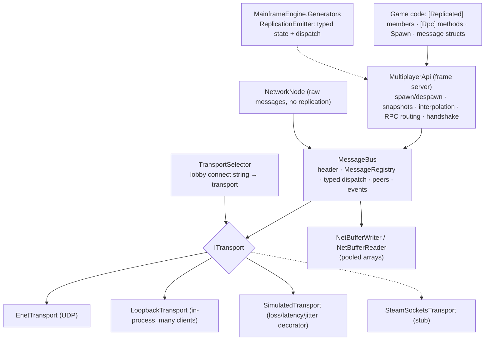
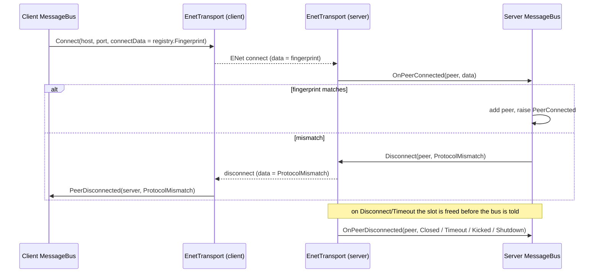

# Networking

## Purpose

Multiplayer for Mainframe games: typed messages between a server and its clients over UDP (ENet) or in-process
loopback, and on top of them **server-authoritative node replication** (M5): spawning scenes on clients by
`PackedScene` UID, `[Replicated]` members sent as delta snapshots and interpolated on clients, `[Rpc]` methods with
authority checks, and the connection lifecycle (handshake, timeouts, kicks). The Sandbox has a `--server` /
`--client <host>` demo. Steam Networking Sockets are designed in but stubbed until Steam natives ship (see
[Steamworks](steamworks.md)).

## Layers



## Key types

All types live in `MainframeEngine.Networking`, except `NetworkNode`, which is in `MainframeEngine`.

| Type | File | Role |
|---|---|---|
| `MessageBus` | [Messages/MessageBus.cs](../../MainframeEngine/Src/Networking/Messages/MessageBus.cs) | Send, broadcast, poll, dispatch; peer list; events; `NetStats` |
| `MessageRegistry` | [Messages/MessageRegistry.cs](../../MainframeEngine/Src/Networking/Messages/MessageRegistry.cs) | Type ↔ id (`ushort`), protocol version, `Fingerprint` |
| `MessageHeader`, `MessageContext`, `MessageHandler<T>` | [Messages/MessageHeader.cs](../../MainframeEngine/Src/Networking/Messages/MessageHeader.cs) | 7-byte header; what a handler receives |
| `ITransport`, `ITransportListener`, `NetChannel`, `DisconnectReason` | [Transport/ITransport.cs](../../MainframeEngine/Src/Networking/Transport/ITransport.cs) | Transport abstraction |
| `EnetTransport` | [Transport/EnetTransport.cs](../../MainframeEngine/Src/Networking/Transport/EnetTransport.cs) | ENet server (`Listen`) or client (`Connect`) |
| `LoopbackTransport` | [Transport/LoopbackTransport.cs](../../MainframeEngine/Src/Networking/Transport/LoopbackTransport.cs) | In-process server endpoint with any number of clients (`CreateServer` + `ConnectClient`, or `CreatePair`): single-player listen server, tests, benchmarks |
| `SteamSocketsTransport` | [Transport/SteamSocketsTransport.cs](../../MainframeEngine/Src/Networking/Transport/SteamSocketsTransport.cs) | **Stub**: documents the design, `TryListen`/`TryConnect` return false |
| `NetBufferWriter`, `NetBufferReader` | [Buffers/](../../MainframeEngine/Src/Networking/Buffers/) | Span-based serialization over `ArrayPool<byte>` arrays |
| `NetBufferPool` | [Buffers/NetBufferPool.cs](../../MainframeEngine/Src/Networking/Buffers/NetBufferPool.cs) | Internal, thread-safe pool of writers and readers |
| `INetworkTransferable` | [Transfer/INetworkTransferable.cs](../../MainframeEngine/Src/Networking/Transfer/INetworkTransferable.cs) | `NetworkWrite(writer)` / `NetworkRead(reader)`: the message payload contract |
| `PeerId` | [PeerId.cs](../../MainframeEngine/Src/Networking/PeerId.cs) | `ulong`; never reused within a transport |
| `NetworkNode` | [Nodes/NetworkNode.cs](../../MainframeEngine/Src/Nodes/NetworkNode.cs) | Owns a server and/or client bus, pumps them every frame in `OnProcess` (or `Poll()`) |
| `NetworkUtils` | [Utils/NetworkUtils.cs](../../MainframeEngine/Src/Networking/Utils/NetworkUtils.cs) | Local/public IP, regions, server ids |
| `MultiplayerApi` | [Replication/MultiplayerApi.cs](../../MainframeEngine/Src/Networking/Replication/MultiplayerApi.cs) (+ `.Server`, `.Client`, `.Rpc`) | Replication for one `SceneTree`: start/stop, `Spawn`, `SetAuthority`, `Kick`, events, `Stats`; `Engine.Multiplayer` |
| `ReplicatedAttribute`, `RpcAttribute`, `RpcMode` | [Replication/ReplicationAttributes.cs](../../MainframeEngine/Src/Networking/Replication/ReplicationAttributes.cs) | Mark members and methods (namespace `MainframeEngine`) |
| `ReplicationTypeInfo`, `RpcInfo`, `ReplicationRegistry` | [Replication/ReplicationTypeInfo.cs](../../MainframeEngine/Src/Networking/Replication/ReplicationTypeInfo.cs), [ReplicationRegistry.cs](../../MainframeEngine/Src/Networking/Replication/ReplicationRegistry.cs) | Generated per-type networking shape; registry + `Fingerprint` |
| `ReplicatedState` | [Replication/ReplicatedState.cs](../../MainframeEngine/Src/Networking/Replication/ReplicatedState.cs) | Base of the generated per-type state (shadow values, change ticks) |
| `InterpolationBuffer<T>`, `NetLerp`, `NetCodec` | [Replication/](../../MainframeEngine/Src/Networking/Replication/) | Client sample ring; blends; typed codec overloads used by generated code |
| `NetworkStats`, `PeerNetworkStats` | [Replication/NetworkStats.cs](../../MainframeEngine/Src/Networking/Replication/NetworkStats.cs) | Bandwidth and replication counters |
| `SimulatedTransport`, `NetworkConditions` | [Transport/SimulatedTransport.cs](../../MainframeEngine/Src/Networking/Transport/SimulatedTransport.cs) | Seeded bad-network decorator |
| `NetworkAddress`, `ITransportFactory`, `TransportSelector` | [Transport/TransportSelector.cs](../../MainframeEngine/Src/Networking/Transport/TransportSelector.cs) | `enet:` / `steam:` / `loopback:` addresses and the lobby handoff |
| `Node.NetworkId`, `NetworkAuthority`, `IsNetworkAuthority`, `Multiplayer` | [Scene/Node.Network.cs](../../MainframeEngine/Src/Scene/Node.Network.cs) | Per-node networking view |

## Usage

Raw typed messages (no replication). For replicated nodes use [`MultiplayerApi`](#replication), which runs its own
bus; game messages can share it through `MultiplayerApi.Messages` and `MultiplayerApi.Bus`.

```csharp
// Shared by server and client: same types, same order (or explicit ids).
public struct Chat : INetworkTransferable
{
    public string Text;
    public readonly void NetworkWrite(NetBufferWriter w) => w.Write(Text);
    public void NetworkRead(NetBufferReader r) => Text = r.ReadString();
}

var node = new NetworkNode();
node.Messages.Register<Chat>();

var server = node.StartServer(NetworkUtils.DefaultPort, maxClients: 8);
server.PeerConnected += peer => server.Send(peer, new Chat { Text = "welcome" });
server.Subscribe((in MessageContext ctx, in Chat chat) => server.Broadcast(chat, NetChannel.Reliable, except: ctx.Sender));

var client = node.StartClient("127.0.0.1", NetworkUtils.DefaultPort);
client.Subscribe((in MessageContext ctx, in Chat chat) => Log.Info(chat.Text));
// every frame (OnProcess, or node.Poll() without a tree): Poll (dispatch) then Flush, for both buses
```

Without a node, build the bus yourself: `new MessageBus(EnetTransport.Listen(port, max), registry)`, or
`EnetTransport.Connect(host, port, registry.Fingerprint)`, then call `Poll()` and `Flush()` every frame.

## Replication

`MultiplayerApi` replicates one `SceneTree`. The server is authoritative for all replicated state; per-node
**authority** (`Node.NetworkAuthority`) only decides which client may call that node's `Authority` RPCs (e.g. its
player's input). See [ADR 0040](../../memory/decisions/0040-replication-source-generated-delta-snapshots.md) and
[ADR 0041](../../memory/decisions/0041-server-authoritative-per-node-authority.md).

### Declaring networked nodes

```csharp
public sealed class Player : Node3D
{
    [Replicated(Interpolate = true)]                       // blended on clients
    public Vector3 NetPosition { get => Position; set => Position = value; }

    [Replicated] public int Health { get; set; } = 100;     // snaps when it changes
    [Replicated] public string DisplayName = "";            // fields work too

    [Rpc(RpcMode.Authority)]                                 // the owning client → server
    public void Move(Vector3 input) => NetPosition += input * Speed;

    [Rpc(RpcMode.Server, CallLocal = true)]                  // server → every client (and the server)
    public void Hit(int damage) { /* play an effect */ }

    [Rpc(RpcMode.AnyPeer, Reliable = false)]                 // anyone; check Multiplayer!.RemoteSender
    public void Wave() { }
}

player.RpcMove(input);            // generated senders: server → all clients, client → server
player.RpcHitTo(peer, 10);        // one peer
```

- **Members:** properties (public/internal getter and setter) or fields of `bool`, integers, `float`, `double`,
  `decimal`, `char`, `string`, enums, `Vector2/3/4`, `Quaternion`, `System.Drawing.Color`, `Transform3D/2D`, `PeerId`,
  or structs implementing `INetworkTransferable` **and** `IEquatable<T>` (change detection must not box). At most 64
  per declaring type; a member may also be `[Export]`. `Interpolate` is for `float`, `double`, `Vector2/3/4` and
  `Quaternion` (slerp). Engine properties such as `Node3D.Position` are replicated through a forwarding property, as
  above.
- **RPCs:** public/internal, non-generic, `void`, by-value parameters of the same types. `RpcMode.Server` (server →
  clients only), `Authority` (default: the node's authority, or the server), `AnyPeer`. `Reliable` (default) or the
  unreliable channel; `CallLocal` also runs it on the caller. During the call, `Multiplayer.RemoteSender` is the
  caller (`ServerPeerId` for the server). Calling `Rpc…` on a node that is not networked runs `CallLocal` methods
  only.
- **Generated code** (`MainframeEngine.Generators`, `ReplicationEmitter`, file `MainframeEngine.Replication.g.cs`): per
  type a `ReplicatedState` subclass with one typed shadow field per member, `Capture` (compare with the node via
  `EqualityComparer<T>.Default`, stamp changed members with the tick), masked `Write`/`Read`, an
  `InterpolationBuffer<T>` per interpolated member; a `ReplicationTypeInfo` with typed RPC dispatchers registered from
  a `[ModuleInitializer]`; and a `<Type>RpcExtensions` class with `Rpc<Method>` / `Rpc<Method>To` in the type's
  namespace. No partial classes are needed. Diagnostics: MFG007 (invalid member or type), MFG008 (invalid RPC),
  MFG009 (more than 64 members).
- **Inheritance:** each declaring type has its own state; a node of type `C : B : A` carries the states of `A`, `B`,
  `C` in that order. RPC wire ids are the base types' RPCs first, then the type's own, in declaration order.

### Running it

```csharp
// Both ends: the same spawnable scenes, in the same order (indices go on the wire, UIDs into the fingerprint).
var mp = engine.Multiplayer;                       // or MultiplayerApi.Attach(tree) for your own tree
var playerScene = mp.RegisterScene("Content/Scenes/Player.mscene");

// Server
mp.Host(7777, maxClients: 8);                      // or StartServer(any accepting ITransport)
mp.PeerJoined += peer => mp.Spawn<Player>(playerScene, parent: level, authority: peer);

// Client
mp.Connect("203.0.113.5", 7777);                  // or StartClient(transport), or TryConnect(lobby connect string)
mp.ConnectedToServer += () => Log.Info($"joined as {mp.LocalPeerId}");
```

- **Spawn** (`Spawn(scene, parent, authority)`, server only) instantiates a registered scene, adds it under `parent`
  (default: the current scene) and returns it; configure it in the same frame, the spawn message goes out at the end
  of the frame with the state at that time. The scene root and every **networked descendant** (a node whose type
  has replicated members or RPCs, including nodes of nested scene instances) get consecutive network ids in
  depth-first tree order, which the client recomputes from the same scene. `parent` is a networked node, or a node at
  the same absolute path on clients (e.g. the level both load).
- **Despawn:** free the node (`QueueFree`/`Free`, or `MultiplayerApi.Despawn`). At the end of the frame the server
  sends one despawn for a root (its descendants go with it) or for a freed descendant; a node removed and re-added in
  the same frame stays networked. Clients free their copies. Spawned and freed in the same frame: nothing is sent.
- **Late join:** a client completing the handshake gets every live spawn, in id order (parents first), with full
  state; descendants despawned since are marked absent and freed on arrival.
- **Authority:** `SetAuthority(node, peer)` (server; descendants too by default) is replicated. `IsNetworkAuthority`
  is true on the owning peer (the server for server-owned nodes) and for nodes that are not networked.
- **Events:** `PeerJoined`, `PeerLeft`, `ConnectedToServer`, `Disconnected(reason)`, `NodeSpawned`, `NodeDespawned`,
  `RpcRejected(peer, node, rpc)`.

### Frame and tick

```mermaid
sequenceDiagram
    participant T as SceneTree.Tick
    participant M as MultiplayerApi
    T->>M: ProcessFrame (start of process): Poll — handshakes, spawns, snapshots, RPCs; client: advance clock, interpolate
    T->>T: physics, process, deferred frees, transform sync
    T->>M: IFrameServer.Process (end of frame)
    Note over M: server: despawns, timeouts, net tick (30 Hz accumulator): capture changes,<br/>flush spawns, one snapshot per client · client: ack/heartbeat at the server's rate, timeouts · Flush
```

The network tick is its own fixed rate (`TickRate`, default 30 Hz, 1–255), independent of rendering and physics.
Receiving at the start of the frame means RPCs and snapshots are applied before nodes process; sending at the end
captures the frame's final state. `SceneTree.ProcessDeltaTime` gives the receive hook the frame's delta.

### Delta snapshots

```mermaid
sequenceDiagram
    participant S as Server
    participant C as Client
    S->>C: Spawn{ids, scene index, parent, name, authority + full state} (reliable)
    loop every net tick
        S->>S: Capture: changed members stamped with the tick
        S->>C: Snapshot{tick: members changed after C's acked tick} (unreliable)
        C->>C: apply (or buffer for interpolation); stale/duplicate ticks discarded
        C->>S: Ack{newest fully applied tick} (unreliable, also the heartbeat)
    end
    S->>C: Despawn{id} (reliable)
```

- Each snapshot entry is `netId (varint) · length (u16) · per state: change mask (varint) + changed values`, ending
  with id 0. Because a snapshot carries *everything changed since the client's last acknowledged tick*, loss,
  reordering and duplication are harmless: a later snapshot is a superset, older ones are discarded. Unchanged nodes
  are not sent; an idle snapshot is 8 bytes (header + terminator) and doubles as the server's heartbeat.
- A client acknowledges a snapshot only when it could apply all of it. An entry for an id above every spawn it has
  received means that spawn (reliable channel) has not arrived yet; skipping it and not acknowledging makes the server
  resend those changes. Lower unknown ids were despawned (or freed locally) and are skipped.
- Spawn state is captured with tick 0, so snapshots do not resend it. A late joiner's acknowledged tick starts at the
  server's current tick (its spawns carry everything captured so far).
- The server records when it sent each tick; acknowledgements give each client's round-trip time.

### Interpolation

Clients show interpolated members `InterpolationDelay` (default 0.1 s, about three snapshots) in the past:

- The client estimates the server tick: it advances with frame time at the server's rate and is pulled 10 % towards
  every snapshot's tick (an error over one second of ticks snaps and clears the buffers). `RenderTick` = estimate −
  delay.
- `InterpolationBuffer<T>` keeps the last 32 samples per member. Between two samples it blends (`NetLerp`, slerp for
  rotations). Snapshots only carry changed members, so a member absent from snapshots was still: when it changes
  again, the buffer first inserts a *hold* sample at the previous snapshot tick, so motion resumes from the right
  moment rather than drifting from when it stopped.
- Past the newest sample: if a newer snapshot came without the member, it holds; otherwise data is late and it
  **extrapolates** along the last velocity for at most `MaxExtrapolation` (default 0.25 s), then stops.
- Spawn state applies immediately; `Interpolation = false` snaps every snapshot.

### Handshake, timeouts and leaving

1. Transport connect with the message registry fingerprint (protocol version + message types); a mismatch is refused
   with `ProtocolMismatch` (see [Connection lifecycle](#connection-lifecycle)).
2. The client sends `Hello{replication fingerprint}`: `ReplicationRegistry.Fingerprint` (every networked type's
   schema hash, sorted by name) mixed with the spawnable scene UIDs. A mismatch is refused with `ProtocolMismatch`.
3. The server answers `Welcome{peer id, tick rate, tick}`, sends the late-join spawns and raises `PeerJoined`; the
   client sets `LocalPeerId` and raises `ConnectedToServer`.
4. **Timeouts:** no hello within `HandshakeTimeout` (5 s) → `Timeout`; a client silent (no acks) or a server silent
   (no snapshots) for `PeerTimeout` (10 s) → `Timeout`.
5. **Kick:** `Kick(peer, reason = Kicked)`.
6. **Leaving:** the server raises `PeerLeft` and frees the nodes the client had authority over
   (`DespawnOwnedOnDisconnect`, default) or hands them back to the server. A client that disconnects (or is
   disconnected) frees every node the server spawned and raises `Disconnected(reason)`. `Stop()` on a server keeps
   its nodes as plain, non-networked nodes.

### Bad networks and the lobby handoff

- `SimulatedTransport(inner, NetworkConditions { Loss, Duplication, Latency, Jitter }, seed, clock)` degrades what an
  endpoint sends with a seeded RNG: loss and duplication only on the unreliable channel, latency and jitter on both
  (reliable packets stay in order). The replication tests run with 10–30 % loss, jitter and duplication and assert
  convergence.
- `NetworkAddress` parses `enet:host:port` (`enet:[::1]:7777`), `steam:<steamId>` and `loopback:<name>`. A Steam
  lobby's `connect` metadata (`SteamLobbyInfo.ConnectAddress`, or `SteamLobby.CreateLobbyAsync(…, connectAddress:)`)
  holds a `;`-separated list, best first. `MultiplayerApi.TryConnect(connectString)` hands it to a `TransportSelector`
  (default: ENet + Steam sockets; add `ITransportFactory`s such as `LoopbackTransportFactory`), which opens the first
  address whose transport works here. With Steam sockets stubbed, `steam:…;enet:…` falls through to ENet. See
  [ADR 0043](../../memory/decisions/0043-lobby-connect-strings-transport-selection.md).

### Bandwidth stats

`MultiplayerApi.Stats` (`NetworkStats`): bytes sent/received, bytes per second over the last second, snapshots
(sent or applied), discarded snapshots, last snapshot size, spawns, despawns, RPCs sent/received/rejected, networked
nodes. `GetPeerStats(peer)` (server): ready, acknowledged tick, bytes and snapshots sent to that client, last snapshot
size, smoothed round-trip time. The Sandbox demo shows them in its ImGui window and logs.

## Wire format

Every packet is one message: a header followed by the payload.

| Field | Type | Notes |
|---|---|---|
| `protocolVersion` | byte | `MessageRegistry.ProtocolVersion`; a mismatch is dropped (`MessageDropReason.ProtocolMismatch`) |
| `messageId` | ushort | from `MessageRegistry`; at most `MaxMessages` (4096), because dispatch indexes an array by id |
| `tick` | uint | `MessageBus.Tick` of the sender (e.g. the server tick of a snapshot) |
| payload | bytes | the message's `NetworkWrite` |

All values are little-endian. The multiplayer layer registers its own messages at the top 16 ids
(`MessageRegistry.MaxMessages - 16` = 4080 and up: hello, welcome, spawn, despawn, snapshot, ack, RPC, authority), so
game messages registered in order (0, 1, 2…) never collide with them.

| Type | Encoding |
|---|---|
| bool, byte, sbyte | 1 B |
| short/ushort, char | 2 B (`char` is one UTF-16 code unit) |
| int/uint, float | 4 B |
| long/ulong, double | 8 B |
| decimal | 16 B (lo, mid, hi, flags) |
| `string`, `ReadOnlySpan<char>` | 7-bit varint UTF-8 byte count + UTF-8 bytes |
| `WriteVarUInt32` / `WriteVarUInt64` | 1 to 5 / 1 to 10 B |
| `Vector2` / `Vector3` / `Quaternion` | 2 / 3 / 4 × float32 |
| `T[] where T : INetworkTransferable` | int32 count + each element |

The reader checks every read. Running past the end throws `EndOfStreamException`. A bad length or varint throws
`InvalidDataException`; this includes an array count larger than the bytes left. The bus turns both exceptions into
`MessageDropReason.Malformed`, so a malformed packet cannot crash the receive loop.

## Connection lifecycle



- **Peer ids.** `EnetTransport` packs the ENet slot (low 32 bits) with a per-slot generation (high 32 bits). ENet
  reuses slots, but a `PeerId` is never reused, so sending to a stale id fails instead of reaching a new client.
- **Failed connects.** A client whose connection never completes gets `PeerDisconnected(…, ConnectFailed)`. ENet's
  adaptive timeout is 5 to 30 s; `Connect(…, timeoutMs)` overrides it.
- **Disconnects.** `DisconnectReason` values other than `Timeout` and `ConnectFailed` travel as the ENet disconnect
  data, so the remote side sees the reason. Disposing a transport tells every peer `Shutdown`.
- **Send failures** (unknown or gone peer, ENet refusing the packet) never throw. `Send` returns false, the bus logs
  a warning, raises `SendFailed` and counts it in `Stats.SendFailures`. `Broadcast` returns how many peers accepted.
- **Native library.** `ENet.Library` initialization is reference-counted (`EnetLibrary`). It happens when the first
  transport is created, not when a `NetworkNode` is constructed.

### Channels

| `NetChannel` | ENet channel | Flags | Use |
|---|---|---|---|
| `Reliable` | 0 | `PacketFlags.Reliable` | spawn/despawn, RPCs, control, chat |
| `Unreliable` | 1 | `PacketFlags.None` (unreliable sequenced) | state snapshots |

## Performance

- **Zero managed allocations in steady state.** This covers send, broadcast, poll, dispatch and the ENet event loop,
  for messages whose `NetworkRead` doesn't allocate (strings and arrays do).
  - The bus reuses one encode writer and one decode reader.
  - `LoopbackTransport` rents its packet copies from `ArrayPool`.
  - `EnetTransport` hands the listener a span over the native packet.
  - Handlers are multicast delegates stored per message id, and message structs are decoded on the stack with no
    boxing.
  - Unit tests assert 0 bytes with `GC.GetAllocatedBytesForCurrentThread`: 1000 loopback rounds and 500 real ENet
    reliable round trips.
  - **Replication gate:** `ReplicationAllocationTests` runs a server and a client (100 replicated, interpolated boxes
    moving every frame, RPCs both ways every 10 frames) for 240 frames after warm-up: **0 bytes**.
- **Buffers.**
  - `NetBufferWriter` implements `IBufferWriter<byte>` and grows by renting a bigger array.
  - `NetBufferReader.SetData` copies the input, so a reader outlives the native packet.
  - Readers and writers keep their arrays across `Reset` and across pool reuse. The pool keeps up to 64 of each and
    ignores a double `Dispose`.
- **Logging.** Connections, disconnects, drops and send failures are logged through `Log`. Per-packet logging is
  off; set `MessageBus.LogPackets` to log every message at debug level (this allocates).
- **Benchmarks.** `MessageBenchmarks` (encode a snapshot; decode and dispatch one), `NetBufferBenchmarks` and
  `ReplicationBenchmarks` live in [`Tests/MainframeEngine.Benchmarks`](../../Tests/MainframeEngine.Benchmarks/).
  Baselines are in `baseline.json`. Replication, every node changed (Apple M5, 0 B each):

  | Benchmark | 100 nodes | 1000 nodes |
  |---|---|---|
  | `CaptureChanges` (server change detection) | 0.68 µs | 11.9 µs |
  | `EncodeSnapshot` (one client's snapshot) | 0.96 µs | 12.8 µs |
  | `DecodeSnapshot` (client decode + apply + buffer) | 1.9 µs | 24.8 µs |

### Threading

`MessageBus` and the transports are single-threaded: drive them from the game loop. Events and handlers run inside
`Poll`. `NetBufferPool`, `EnetLibrary` and `NodeId.GetNext` (`Interlocked`) are thread-safe.

## Platform

ENet natives are our own builds, not the package's. See [Native libraries](natives.md).

- **Package assets excluded.** `ENet-CSharp` is referenced with `ExcludeAssets="native;build;buildTransitive"`.
  Its x86_64-only natives and its targets file no longer reach any output, including in referencing projects.
- **RID-agnostic builds.** `MainframeEngine.csproj` copies `runtimes/<rid>/native/*` flat into the output:
  `dotnet build`, `run`, `test`, and every app that references the engine (the SDK builds the engine without a RID,
  even under `dotnet publish -r`). One RID per OS is copied: `win-x64` `enet.dll`, `linux-x64` `libenet.so`,
  `osx-arm64` `libenet.dylib` (universal). The runtime's default probing finds them next to the app.
- **RID-specific engine builds** copy only that RID's files.
- **Packing.** `runtimes/**` is packed at `runtimes/<rid>/native/`, so a future engine NuGet package carries the
  natives as standard RID-specific assets.

| RID | ENet |
|---|---|
| osx-arm64 / osx-x64 | ✅ universal dylib; loopback round trip tested on Apple Silicon |
| win-x64, linux-x64 | ⏳ the natives arrive from `natives.yml`; until then the ENet tests skip ("native not shipped") and `EnetTransport` throws `DllNotFoundException` naming the missing file |

## Known issues / limits

- **No prediction or lag compensation.** Clients see the server's state about `InterpolationDelay` in the past;
  a client's own input goes through an RPC and comes back in a snapshot (one round trip). Interest management is
  "everything to everyone".
- **Snapshots are one message.** A snapshot with every one of 1000 boxes changing is ~32 KB; ENet fragments it, and
  losing a fragment loses the snapshot (the next one carries the changes again). No quantization or compression yet.
- **Not replicated:** reparenting or renaming a networked node after its spawn, nodes added to a spawned scene at
  runtime (spawn them with `Spawn(scene, parent)` instead), and anything that is not a `[Replicated]` member.
- **Listen server.** The server is a normal peer that renders its own tree; there is no local client on the host
  (the host's nodes are the authoritative ones).
- **Stale natives.** A publish for one RID still contains the other OSes' natives, because the referenced engine is
  built RID-agnostic. They are harmless but add size (ENet ~150 KB per OS, `mfrmlui` ~5 MB). Fixing this needs
  consumer-side targets, as in the NuGet distribution plan.
- **`SteamSocketsTransport`** is a stub (see [Steamworks](steamworks.md)); `steam:` addresses fall back to the next
  address of a connect string.
- **`EnetTransport.Listen(…, bindAddress)`** with an explicit IPv4 address did not accept connections in a local
  test on macOS; bind every interface (the default) until this is investigated.
- **Fingerprint scope.** The registry fingerprint hashes message type *names*; the replication fingerprint hashes the
  networked types' schemas and the spawnable scene UIDs. Both ends must load the same game assembly.

## Related docs

[Native libraries](natives.md) · [Steamworks](steamworks.md) · [Scene graph & nodes](scene-graph-and-nodes.md) ·
[Scene serialization](scene-serialization.md) · [Sandbox](sandbox.md) · [Testing](testing.md)
