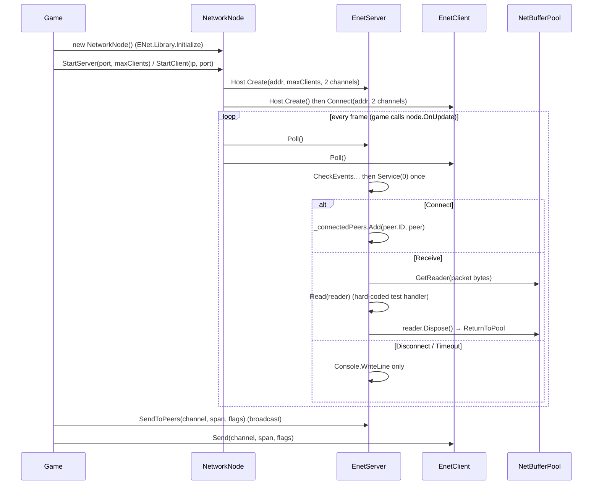
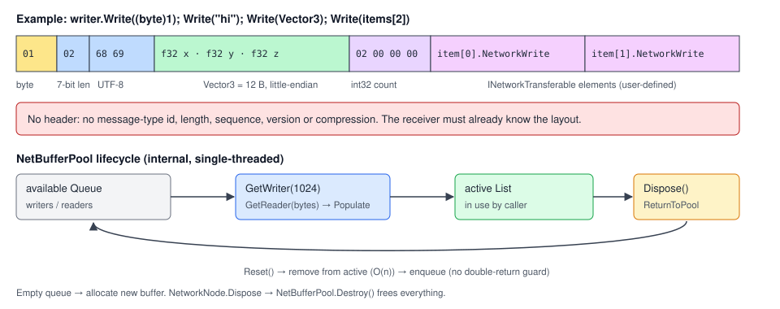

# Networking

## Purpose

A thin ENet (UDP) client/server layer with pooled binary buffers. **Status: scaffold.** Connections
and raw packets work, but there is no message protocol, no dispatch and no state replication. Nothing
in the Sandbox uses it.

## Key types

| Type | File | Visibility |
|---|---|---|
| `NetworkNode : Node` | [Nodes/NetworkNode.cs](../../MainframeEngine/Src/Nodes/NetworkNode.cs) | public: the entry point |
| `EnetServer` | [Networking/ENetServer.cs](../../MainframeEngine/Src/Networking/ENetServer.cs) | public class, **internal ctor** |
| `EnetClient` | [Networking/ENetClient.cs](../../MainframeEngine/Src/Networking/ENetClient.cs) | public class, **internal ctor** |
| `PeerId` | [Networking/PeerId.cs](../../MainframeEngine/Src/Networking/PeerId.cs) | `readonly struct` wrapping `ulong` (sized for Steam IDs) |
| `NodeId` | [Nodes/NodeId.cs](../../MainframeEngine/Src/Nodes/NodeId.cs) | `readonly struct` wrapping `uint`, on every `Node` |
| `NetBuffer`, `NetBufferWriter`, `NetBufferReader` | [Networking/Buffers/](../../MainframeEngine/Src/Networking/Buffers/) | public |
| `NetBufferPool` | [Networking/Buffers/NetBufferPool.cs](../../MainframeEngine/Src/Networking/Buffers/NetBufferPool.cs) | **internal static** |
| `INetworkTransferable` | [Networking/Transfer/INetworkTransferable.cs](../../MainframeEngine/Src/Networking/Transfer/INetworkTransferable.cs) | `NetworkWrite(writer)` / `NetworkRead(reader)`; no implementations |
| `NetworkMessage` | [Networking/Transfer/NetworkMessage.cs](../../MainframeEngine/Src/Networking/Transfer/NetworkMessage.cs) | empty placeholder |
| `NetworkUtils` | [Networking/Utils/NetworkUtils.cs](../../MainframeEngine/Src/Networking/Utils/NetworkUtils.cs) | local/public IP, region IDs, server IDs (unused) |

Package: `ENet-CSharp` 2.4.8 (nxrighthere fork).

## How it works

### Threading

Everything runs single-threaded on the game loop. `Poll()` uses non-blocking `Service(0)`. There are
no background threads or locks. `NetBufferPool` and the `NodeId` counter are static and not
thread-safe.

### Channels & reliability

Both hosts are created with 2 channels, but neither channel has an assigned meaning. Reliability is
chosen per send through `PacketFlags`; the default `None` means unreliable sequenced.

### Buffers & wire format

`NetBufferWriter` and `NetBufferReader` wrap `MemoryStream` with `BinaryWriter`/`BinaryReader` (UTF-8).

| Type | Encoding |
|---|---|
| primitives | little-endian, natural size (bool 1 B, decimal 16 B) |
| `string` | 7-bit-encoded length prefix + UTF-8 bytes |
| `Vector3` | 3 × float32 (12 B) |
| `T[] where T : INetworkTransferable` | int32 count + each element's `NetworkWrite` |

There is **no header, message-type id, versioning, compression or bit-packing**.

`NetBufferPool` keeps available queues and active lists for readers and writers. `GetWriter(cap = 1024)`
and `GetReader(bytes)` reuse a pooled buffer or allocate a new one. Calling `Dispose()` on a buffer
**returns it to the pool**; `NetworkNode.Dispose` calls `NetBufferPool.Destroy()`.

### Identity

- `PeerId` (ulong) is the server's peer-dictionary key. It is ulong so that Steam IDs can share the type later.
- `NodeId` (uint) is assigned to every node from a static counter, but it is never sent over the wire,
  and there is no `NodeId → Node` registry.
- `PeerType { ENet, Steam }` is declared but unused.

## Platform

The ENet macOS native is **x86_64 only**, so it does not load on Apple Silicon. Windows and Linux
natives are x64.

## Known issues

- **Peers are never removed** on Disconnect/Timeout ([ENetServer.cs:57-67](../../MainframeEngine/Src/Networking/ENetServer.cs)).
  The next `SendToPeers` throws ([:98](../../MainframeEngine/Src/Networking/ENetServer.cs)), and when ENet
  reuses a peer slot, `Add` throws on the duplicate key ([:54](../../MainframeEngine/Src/Networking/ENetServer.cs)).
- **Inconsistent error handling:** a failed server send throws; a failed client send only logs.
- **Asymmetric test protocol:** the client's `Read` expects `byte + string`, the server's expects `string`.
- `StartServer`/`StartClient` overwrite an existing instance without disposing it. `Library.Initialize`
  and `Deinitialize` are called per `NetworkNode`.
- `NetworkNode.LocalIp` runs a socket lookup in a static initializer. With no IPv4 route this can throw
  `TypeInitializationException` *(inferred)*.
- `NetBuffer` allocates two `MemoryStream`s per construction. `GetDataSpan` uses `Position`, which is
  correct for writers but wrong for readers. The pool has no double-return guard.
- `EnetServer._stopwatch` is dead code.
- Networking logs with `Console.WriteLine`, not `Log`.
- **README drift:** the README calls internal constructors and `NetBufferPool` from user code, names
  `NetworkPeerId`, and mentions "named channels".

## Related docs

[Scene graph & nodes](scene-graph-and-nodes.md) · [Steamworks](steamworks.md) ·
[Future: networking & replication](future/networking-replication.md)
