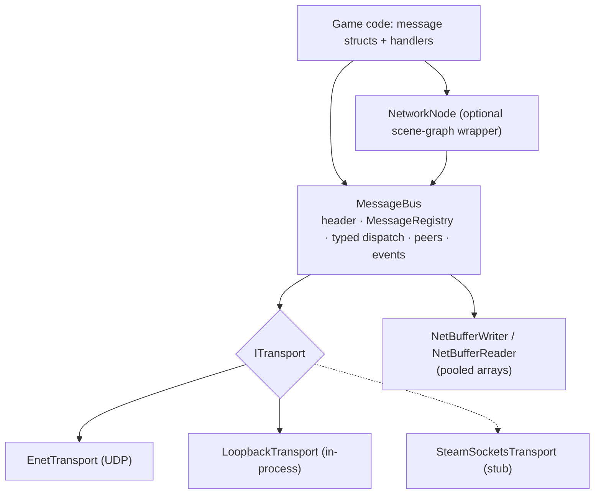
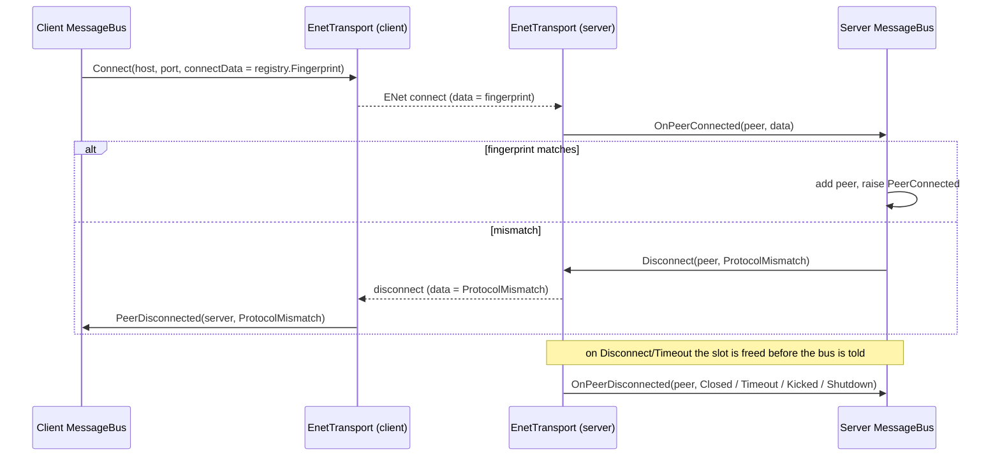

# Networking

## Purpose

Typed messages between a server and its clients over UDP (ENet) or in-process loopback. **Status:** the message
layer and transports from M5 have shipped. Node replication (spawn/despawn, snapshots, RPCs) waits for the M2 node
system; see [Networking & replication](future/networking-replication.md). Nothing in the Sandbox uses networking yet.

## Layers



## Key types

All types live in `MainframeEngine.Networking`, except `NetworkNode`, which is in `MainframeEngine`.

| Type | File | Role |
|---|---|---|
| `MessageBus` | [Messages/MessageBus.cs](../../MainframeEngine/Src/Networking/Messages/MessageBus.cs) | Send, broadcast, poll, dispatch; peer list; events; `NetStats` |
| `MessageRegistry` | [Messages/MessageRegistry.cs](../../MainframeEngine/Src/Networking/Messages/MessageRegistry.cs) | Type ↔ id (`ushort`), protocol version, `Fingerprint` |
| `MessageHeader`, `MessageContext`, `MessageHandler<T>` | [Messages/MessageHeader.cs](../../MainframeEngine/Src/Networking/Messages/MessageHeader.cs) | 7-byte header; what a handler receives |
| `ITransport`, `ITransportListener`, `NetChannel`, `DisconnectReason` | [Transport/ITransport.cs](../../MainframeEngine/Src/Networking/Transport/ITransport.cs) | Transport abstraction |
| `EnetTransport` | [Transport/EnetTransport.cs](../../MainframeEngine/Src/Networking/Transport/EnetTransport.cs) | ENet server (`Listen`) or client (`Connect`) |
| `LoopbackTransport` | [Transport/LoopbackTransport.cs](../../MainframeEngine/Src/Networking/Transport/LoopbackTransport.cs) | Linked in-process pair (`CreatePair`): single-player listen server, tests, benchmarks |
| `SteamSocketsTransport` | [Transport/SteamSocketsTransport.cs](../../MainframeEngine/Src/Networking/Transport/SteamSocketsTransport.cs) | **Stub**: documents the design, `TryListen`/`TryConnect` return false |
| `NetBufferWriter`, `NetBufferReader` | [Buffers/](../../MainframeEngine/Src/Networking/Buffers/) | Span-based serialization over `ArrayPool<byte>` arrays |
| `NetBufferPool` | [Buffers/NetBufferPool.cs](../../MainframeEngine/Src/Networking/Buffers/NetBufferPool.cs) | Internal, thread-safe pool of writers and readers |
| `INetworkTransferable` | [Transfer/INetworkTransferable.cs](../../MainframeEngine/Src/Networking/Transfer/INetworkTransferable.cs) | `NetworkWrite(writer)` / `NetworkRead(reader)`: the message payload contract |
| `PeerId` | [PeerId.cs](../../MainframeEngine/Src/Networking/PeerId.cs) | `ulong`; never reused within a transport |
| `NetworkNode` | [Nodes/NetworkNode.cs](../../MainframeEngine/Src/Nodes/NetworkNode.cs) | Owns a server and/or client bus, pumps them every frame in `OnProcess` (or `Poll()`) |
| `NetworkUtils` | [Utils/NetworkUtils.cs](../../MainframeEngine/Src/Networking/Utils/NetworkUtils.cs) | Local/public IP, regions, server ids |

## Usage

```csharp
// Shared by server and client: same types, same order (or explicit ids).
public struct Chat : INetworkTransferable
{
    public string Text;
    public readonly void NetworkWrite(NetBufferWriter w) => w.Write(Text);
    public void NetworkRead(NetBufferReader r) => Text = r.ReadString();
}

var node = new NetworkNode();
node.Messages.Register<Chat>();

var server = node.StartServer(NetworkUtils.DefaultPort, maxClients: 8);
server.PeerConnected += peer => server.Send(peer, new Chat { Text = "welcome" });
server.Subscribe((in MessageContext ctx, in Chat chat) => server.Broadcast(chat, NetChannel.Reliable, except: ctx.Sender));

var client = node.StartClient("127.0.0.1", NetworkUtils.DefaultPort);
client.Subscribe((in MessageContext ctx, in Chat chat) => Log.Info(chat.Text));
// every frame (OnProcess, or node.Poll() without a tree): Poll (dispatch) then Flush, for both buses
```

Without a node, build the bus yourself: `new MessageBus(EnetTransport.Listen(port, max), registry)`, or
`EnetTransport.Connect(host, port, registry.Fingerprint)`, then call `Poll()` and `Flush()` every frame.

## Wire format

Every packet is one message: a header followed by the payload.

| Field | Type | Notes |
|---|---|---|
| `protocolVersion` | byte | `MessageRegistry.ProtocolVersion`; a mismatch is dropped (`MessageDropReason.ProtocolMismatch`) |
| `messageId` | ushort | from `MessageRegistry`; at most `MaxMessages` (4096), because dispatch indexes an array by id |
| `tick` | uint | `MessageBus.Tick` of the sender (e.g. the server tick of a snapshot) |
| payload | bytes | the message's `NetworkWrite` |

All values are little-endian.

| Type | Encoding |
|---|---|
| bool, byte, sbyte | 1 B |
| short/ushort, char | 2 B (`char` is one UTF-16 code unit) |
| int/uint, float | 4 B |
| long/ulong, double | 8 B |
| decimal | 16 B (lo, mid, hi, flags) |
| `string`, `ReadOnlySpan<char>` | 7-bit varint UTF-8 byte count + UTF-8 bytes |
| `WriteVarUInt32` | 1 to 5 B |
| `Vector2` / `Vector3` / `Quaternion` | 2 / 3 / 4 × float32 |
| `T[] where T : INetworkTransferable` | int32 count + each element |

The reader checks every read. Running past the end throws `EndOfStreamException`. A bad length or varint throws
`InvalidDataException`; this includes an array count larger than the bytes left. The bus turns both exceptions into
`MessageDropReason.Malformed`, so a malformed packet cannot crash the receive loop.

## Connection lifecycle



- **Peer ids.** `EnetTransport` packs the ENet slot (low 32 bits) with a per-slot generation (high 32 bits). ENet
  reuses slots, but a `PeerId` is never reused, so sending to a stale id fails instead of reaching a new client.
- **Failed connects.** A client whose connection never completes gets `PeerDisconnected(…, ConnectFailed)`. ENet's
  adaptive timeout is 5 to 30 s; `Connect(…, timeoutMs)` overrides it.
- **Disconnects.** `DisconnectReason` values other than `Timeout` and `ConnectFailed` travel as the ENet disconnect
  data, so the remote side sees the reason. Disposing a transport tells every peer `Shutdown`.
- **Send failures** (unknown or gone peer, ENet refusing the packet) never throw. `Send` returns false, the bus logs
  a warning, raises `SendFailed` and counts it in `Stats.SendFailures`. `Broadcast` returns how many peers accepted.
- **Native library.** `ENet.Library` initialization is reference-counted (`EnetLibrary`). It happens when the first
  transport is created, not when a `NetworkNode` is constructed.

### Channels

| `NetChannel` | ENet channel | Flags | Use |
|---|---|---|---|
| `Reliable` | 0 | `PacketFlags.Reliable` | spawn/despawn, RPCs, control, chat |
| `Unreliable` | 1 | `PacketFlags.None` (unreliable sequenced) | state snapshots |

## Performance

- **Zero managed allocations in steady state.** This covers send, broadcast, poll, dispatch and the ENet event loop,
  for messages whose `NetworkRead` doesn't allocate (strings and arrays do).
  - The bus reuses one encode writer and one decode reader.
  - `LoopbackTransport` rents its packet copies from `ArrayPool`.
  - `EnetTransport` hands the listener a span over the native packet.
  - Handlers are multicast delegates stored per message id, and message structs are decoded on the stack with no
    boxing.
  - Unit tests assert 0 bytes with `GC.GetAllocatedBytesForCurrentThread`: 1000 loopback rounds and 500 real ENet
    reliable round trips.
- **Buffers.**
  - `NetBufferWriter` implements `IBufferWriter<byte>` and grows by renting a bigger array.
  - `NetBufferReader.SetData` copies the input, so a reader outlives the native packet.
  - Readers and writers keep their arrays across `Reset` and across pool reuse. The pool keeps up to 64 of each and
    ignores a double `Dispose`.
- **Logging.** Connections, disconnects, drops and send failures are logged through `Log`. Per-packet logging is
  off; set `MessageBus.LogPackets` to log every message at debug level (this allocates).
- **Benchmarks.** `MessageBenchmarks` (encode a snapshot; decode and dispatch one) and `NetBufferBenchmarks` live in
  [`Tests/MainframeEngine.Benchmarks`](../../Tests/MainframeEngine.Benchmarks/). Baselines are in `baseline.json`.

### Threading

`MessageBus` and the transports are single-threaded: drive them from the game loop. Events and handlers run inside
`Poll`. `NetBufferPool`, `EnetLibrary` and `NodeId.GetNext` (`Interlocked`) are thread-safe.

## Platform

ENet natives are our own builds, not the package's. See [Native libraries](natives.md).

- **Package assets excluded.** `ENet-CSharp` is referenced with `ExcludeAssets="native;build;buildTransitive"`.
  Its x86_64-only natives and its targets file no longer reach any output, including in referencing projects.
- **RID-agnostic builds.** `MainframeEngine.csproj` copies `runtimes/<rid>/native/*` flat into the output:
  `dotnet build`, `run`, `test`, and every app that references the engine (the SDK builds the engine without a RID,
  even under `dotnet publish -r`). One RID per OS is copied: `win-x64` `enet.dll`, `linux-x64` `libenet.so`,
  `osx-arm64` `libenet.dylib` (universal). The runtime's default probing finds them next to the app.
- **RID-specific engine builds** copy only that RID's files.
- **Packing.** `runtimes/**` is packed at `runtimes/<rid>/native/`, so a future engine NuGet package carries the
  natives as standard RID-specific assets.

| RID | ENet |
|---|---|
| osx-arm64 / osx-x64 | ✅ universal dylib; loopback round trip tested on Apple Silicon |
| win-x64, linux-x64 | ⏳ the natives arrive from `natives.yml`; until then the ENet tests skip ("native not shipped") and `EnetTransport` throws `DllNotFoundException` naming the missing file |

## Known issues / limits

- **No replication yet.** There is no `NodeId → Node` registry, spawn/despawn, snapshots, interpolation or RPCs
  (M5, after M2). `NodeId` is still never sent.
- **Stale natives.** A publish for one RID still contains the other OSes' natives, because the referenced engine is
  built RID-agnostic. They are harmless but add size (ENet ~150 KB per OS, `mfrmlui` ~5 MB). Fixing this needs consumer-side targets, as in the
  NuGet distribution plan.
- **`LoopbackTransport`** links exactly one client to one server.
- **`SteamSocketsTransport`** is a stub (see [Steamworks](steamworks.md)).
- **Fingerprint scope.** The fingerprint hashes type *names*, so both ends must use the same message types. Shipping
  them in a shared assembly is the expected setup.
- **README.** The README's networking section still describes the old `EnetServer`/`EnetClient` API.

## Related docs

[Native libraries](natives.md) · [Steamworks](steamworks.md) · [Scene graph & nodes](scene-graph-and-nodes.md) ·
[Future: networking & replication](future/networking-replication.md)
