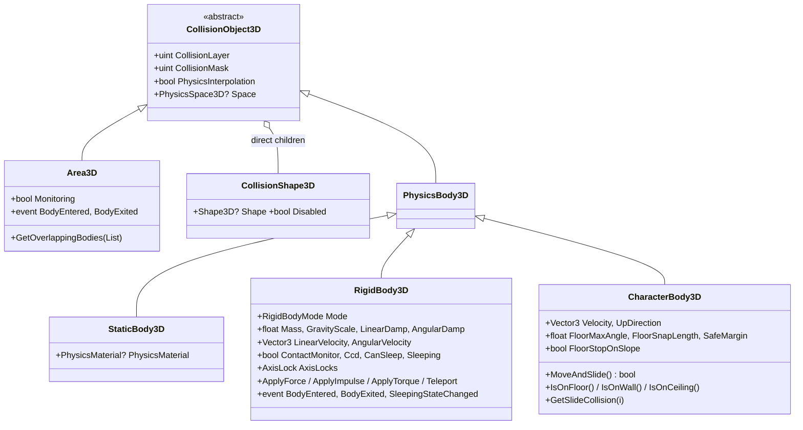
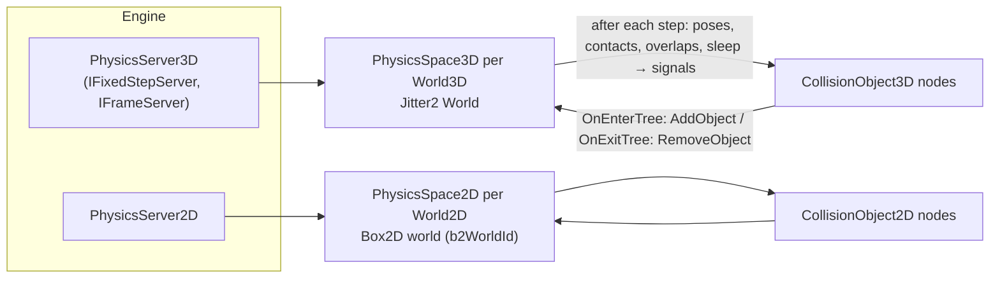

# Physics

## Purpose

Godot-style physics nodes on two pure-C# engines: **Jitter2** for 3D and **Box2D.NET** (a C# port of Box2D v3)
for 2D, because Jitter2 is 3D-only. Both run on the scene tree's fixed timestep with interpolated rendering,
collision layers and masks, contact/area signals, raycast and shape-cast queries, a character controller
(`MoveAndSlide`) and collision-shape debug drawing. Nodes and queries look the same in 2D and 3D; everything
library-specific stays inside the physics servers.

## Libraries

| | 3D | 2D |
|---|---|---|
| Package | [`Jitter2`](https://www.nuget.org/packages/Jitter2) **2.9.0** (pinned exactly; the API changes between minors) | [`Box2D.NET`](https://www.nuget.org/packages/Box2D.NET) **3.1.654** (ikpil's port of Box2D v3.1) |
| Repo / licence | [notgiven688/jitterphysics2](https://github.com/notgiven688/jitterphysics2), MIT | [ikpil/Box2D.NET](https://github.com/ikpil/Box2D.NET), MIT |
| Native code | none (pure C#) | none (pure C#) |
| Precision | `float` | `float` |
| Threading | process-wide worker pool (`PhysicsSettings3D.MultiThreaded`) | single-threaded |
| Determinism | non-deterministic by default; `Deterministic` = island solver, reproducible on one machine/build | deterministic on one machine/build |

Both are pinned in `Directory.Packages.props`; read the pinned version's API (the NuGet packages lag their repos).
Physics is single precision and offers no cross-platform lockstep mode
([ADR 0020](../../memory/decisions/0020-physics-precision-and-determinism.md)).

## Key types

| Type | File | Notes |
|---|---|---|
| `PhysicsServer3D`, `PhysicsSpace3D`, `PhysicsDirectSpaceState3D` | [Physics/3D/](../../MainframeEngine/Src/Physics/3D/) | one Jitter2 `World` per `World3D` |
| `PhysicsServer2D`, `PhysicsSpace2D`, `PhysicsDirectSpaceState2D` | [Physics/2D/](../../MainframeEngine/Src/Physics/2D/) | one Box2D world per `World2D` |
| `CollisionObject3D` → `StaticBody3D`, `RigidBody3D`, `CharacterBody3D`, `Area3D`; `CollisionShape3D` | [Physics/3D/](../../MainframeEngine/Src/Physics/3D/) | `PhysicsBody3D` is the base of the colliding ones |
| `CollisionObject2D` → `StaticBody2D`, `RigidBody2D`, `CharacterBody2D`, `Area2D`; `CollisionShape2D` | [Physics/2D/](../../MainframeEngine/Src/Physics/2D/) | pixels |
| `Shape3D`: `BoxShape3D`, `SphereShape3D`, `CapsuleShape3D`, `CylinderShape3D`, `ConvexPolygonShape3D`, `ConcavePolygonShape3D`, `HeightMapShape3D` | [Physics/3D/Shapes3D.cs](../../MainframeEngine/Src/Physics/3D/Shapes3D.cs) | `Resource`s |
| `Shape2D`: `RectangleShape2D`, `CircleShape2D`, `CapsuleShape2D`, `ConvexPolygonShape2D`, `SegmentShape2D`, `ConcavePolygonShape2D` | [Physics/2D/Shapes2D.cs](../../MainframeEngine/Src/Physics/2D/Shapes2D.cs) | `Resource`s |
| `PhysicsMaterial`, `PhysicsSettings3D`/`2D`, `CollisionLayers`, `AxisLock`, `RigidBodyMode` | [Physics/](../../MainframeEngine/Src/Physics/) | |
| `DebugLines`, `DebugLinesRenderer` | [Rendering/Debug/](../../MainframeEngine/Src/Rendering/Debug/) | per-viewport line batch + line-list pipeline |

## Node model



The 2D side mirrors this in pixels (`Vector2`, rotation in radians, angular velocity a `float`). All bodies derive
from `Node3D`/`Node2D`; every property above is `[Export]`ed (scene files) and the signals are `[Signal]`s.

- **Shapes** are `Resource`s: shareable between bodies and saved inline or as `.mres`. Changing a shape property,
  a `CollisionShape*` child's transform, `Disabled`, or the body's global scale rebuilds that body's shapes at the
  next step. Scale is baked into the library shapes.
- **Concave shapes** (`ConcavePolygonShape3D`, `HeightMapShape3D`, `SegmentShape2D`, `ConcavePolygonShape2D`) have
  no volume: static and kinematic bodies only (a dynamic body logs an error once and ignores them). Jitter2 has no
  height field, so `HeightMapShape3D` is a triangle mesh (`MapWidth × MapDepth` samples on a 1-unit grid centred on
  the origin; scale the shape node for other cell sizes).
- **Mass**: `RigidBody*.Mass` (kg) with inertia from the shapes (Jitter2 `SetMassInertia(mass)`; Box2D mass data
  scaled to the mass).
- **Damping** is per second (Godot): Jitter2 gets `1 − e^(−d·dt)` per step; Box2D takes it directly.
- **Gravity scale**: native in Box2D; in Jitter2 bodies with a scale other than 0/1 opt out of world gravity and get
  `mass · g · scale` as a force each step.

### Shape resources → library shapes

| Resource (3D) | Jitter2 | Resource (2D, px) | Box2D.NET |
|---|---|---|---|
| `BoxShape3D(Size)` | `BoxShape(size)` (full extents) | `RectangleShape2D(Size)` | polygon from the 4 transformed corners |
| `SphereShape3D(Radius)` | `SphereShape(r)` | `CircleShape2D(Radius)` | `b2CreateCircleShape` |
| `CapsuleShape3D(Radius, Height)` | `CapsuleShape(r, height − 2r)` (Y axis) | `CapsuleShape2D(Radius, Height)` | `b2CreateCapsuleShape` (Y axis) |
| `CylinderShape3D(Radius, Height)` | `CylinderShape(height, radius)` (note the order) | — | — |
| `ConvexPolygonShape3D(Points)` | `PointCloudShape(points)` | `ConvexPolygonShape2D(Points)` | `b2ComputeHull` + `b2MakePolygon` (≤ 8 points) |
| `ConcavePolygonShape3D(Faces)` | `TriangleMesh` + one `TriangleShape` per triangle | `ConcavePolygonShape2D(Segments)` / `SegmentShape2D` | one `b2CreateSegmentShape` per segment |
| `HeightMapShape3D` | triangle mesh (as above) | — | — |

A `CollisionShape3D` that is not at the body's origin (or scaled) becomes a `TransformedShape(shape, translation,
rotation·scale)`; several shape children add several shapes to one Jitter2 body (Jitter2 has no compound type).
In 2D the transform is applied to the geometry before it is handed to Box2D.

## Servers and spaces



- `Engine.OnLoad` registers `PhysicsServer3D(EngineOptions.Physics3D)` and `PhysicsServer2D(EngineOptions.Physics2D)`
  after the render server. Trees without them (tools, tests) get a default server from `PhysicsServer3D.For(tree)`
  when the first body enters.
- A space is created for a viewport's `World3D`/`World2D` when the first collision object enters it and lives until the
  server is disposed. `World3D.PhysicsSpace`/`World2D.PhysicsSpace` point at it.
- **Body type mapping**: `StaticBody` → static; `RigidBody` → dynamic or kinematic (`Mode`); `CharacterBody` →
  kinematic (moved by the engine); `Area3D` → no Jitter2 body (overlaps are queried, see below); `Area2D` → a
  kinematic body with sensor shapes that never sleeps.
- **Settings** (`PhysicsSettings3D`): `Gravity` (−9.81 Y), `SubstepCount` (1), `SolverIterations` (6) and
  `RelaxationIterations` (4), `AllowDeactivation`, `MultiThreaded`, `Deterministic`. (`PhysicsSettings2D`):
  `Gravity` (−980 px/s² Y), **`PixelsPerMeter` (100)**, `SubstepCount` (4), `AllowSleep`, `EnableContinuous`.
- **Units**: 3D is metres. Box2D is tuned for 0.1–10 m objects, so 2D nodes work in pixels and the space converts
  with `PixelsPerMeter` (fixed per space) at its boundary — positions, velocities, forces (kg·px/s²), torques and
  query results.
- All Jitter2 / Box2D calls live in `PhysicsSpace*` (plus the shape resources' `Create*` methods).

## Fixed timestep and interpolation


The scene tree owns the clock ([Scene graph & nodes](scene-graph-and-nodes.md#the-frame-scenetreetick)): up to 5
steps of 1/60 s per frame, frame deltas clamped to 0.25 s. Physics servers are `IFixedStepServer`s:

```
frame (not paused):
  if a step will run:  BeforeFixedSteps()      restore moving bodies from the render pose to the physics pose
  per step:            node.OnPhysicsProcess(dt)   (tree order; bodies show their physics pose)
                       FixedStep(dt):  push node changes → step → pull poses → contacts/areas/sleep → signals
  always:              AfterFixedSteps(alpha)  write lerp(prev, curr, alpha) / slerp into moving bodies
  then OnProcess, deferred calls, transform sync, frame servers (debug draw)
```

- Interpolation is done **on the node transform** (Unity-style): outside the fixed steps a dynamic, kinematic or
  character body's transform is its interpolated render pose (so visual children just follow); inside
  `OnPhysicsProcess` it is the physics pose. `PhysicsInterpolation = false` keeps the physics pose
  ([ADR 0024](../../memory/decisions/0024-physics-interpolation-on-node-transforms.md)). At a whole-step frame
  (`alpha = 0`) the render pose is the previous step's pose.
- Pose writes from the server do not count as user moves. User moves are detected with a Node3D/Node2D hook
  (`OnGlobalTransformInvalidated`, also fired when an ancestor moves) and pushed before the next step (or before a
  query): static bodies and areas move, dynamic bodies are teleported (velocity kept, interpolation restarted), and
  kinematic/character bodies get the velocity that reaches the new pose in one step (Jitter2 velocity, Box2D
  `b2Body_SetTargetTransform`), so they push what they touch instead of tunnelling into it.
- `RigidBody*.Teleport(transform)` moves the body now and restarts interpolation from there.
- While the tree is paused nothing steps or interpolates.

## Collision layers and masks

32-bit `CollisionLayer`/`CollisionMask`, Godot semantics: two bodies collide if
`(A.layer & B.mask) != 0 || (B.layer & A.mask) != 0` (either one scanning the other's layer is enough); an area
detects a body when `(area.mask & body.layer) != 0`; areas never detect areas
([ADR 0021](../../memory/decisions/0021-collision-layer-semantics.md)).

- **Jitter2**: an `IBroadPhaseFilter` reads layer/mask from the shapes' `RigidBody.Tag` record. It runs on worker
  threads, so it only reads record fields (changed on the main thread between steps). Changing a layer or mask drops
  the body's cached contacts (`ClearContactCache`) and wakes what it touched, because Jitter2 keeps resting contacts
  until they break.
- **Box2D**: its built-in test is an AND (`(A.category & B.mask) && (B.category & A.mask)`), so every shape passes it
  (`maskBits = ~0`) and carries `layer | mask << 32` in `categoryBits`; a custom filter callback
  (`enableCustomFiltering` on every shape) applies the OR rule, the one-way area rule and "no area-area". Queries use
  `maskBits = collisionMask`, which matches the layer in the low 32 bits. `b2Shape_SetFilter` re-runs pairing when a
  layer changes.

## Contacts, areas and signals

Signals are computed after each step and **dispatched on the main thread after it**, so user code never runs inside
a solver ([ADR 0022](../../memory/decisions/0022-physics-signal-dispatch.md)):

| Signal | 3D | 2D |
|---|---|---|
| `RigidBody.BodyEntered/BodyExited` (`ContactMonitor = true`) | scan the body's arbiters (`RigidBody.Contacts`) with intact contact points | `b2Body_GetContactData` (touching contacts with manifold points) |
| `Area.BodyEntered/BodyExited` | per area: tree query of its AABB, then `NarrowPhase.Overlap` against each candidate (sees static, rigid and character bodies) | `b2Shape_GetSensorData` of the area's sensor shapes |
| `RigidBody.SleepingStateChanged` | `RigidBody.IsActive` changes | `b2Body_IsAwake` changes |

- Current overlaps are diffed against the previous step's (per-receiver dictionaries stamped with the step), so
  events never depend on library begin/end callbacks (Jitter2's `EndCollide` does not fire when a body is removed or
  its contact cache cleared). Contacts that begin and end within one step are not reported.
- **Order**: all exits (contact exits, then area exits) before all enters (contact, then area), then sleep changes;
  within each group by the receiver's creation order, then the other body's. A body leaving one area for another in
  one step gets `exit` before `enter`.
- **Removal**: when a body leaves the tree (freed or removed), every area containing it and every monitoring body
  touching it gets `BodyExited` immediately — unless that pair's `BodyEntered` was still queued in the same dispatch,
  in which case neither is reported. Queued events of removed bodies are skipped, so `Free()`/`QueueFree()` inside a
  signal handler or `OnPhysicsProcess` is safe.

## Queries

`World3D.DirectSpaceState` / `World2D.DirectSpaceState` (also `PhysicsSpace*.DirectSpaceState`):

```csharp
var space = GetWorld3D()!.DirectSpaceState;
if (space.RayCast(from, to, out RayHit3D hit, collisionMask: CollisionLayers.Layer(1), exclude: this))
    Log.Info($"hit {hit.Collider.Name} at {hit.Position}, n={hit.Normal}, shape {hit.Shape?.Name}");
space.ShapeCast(new SphereShape3D { Radius = 0.5f }, from, motion, out ShapeCastHit3D cast);
space.IntersectShape(shape, transform, results);   // List<CollisionObject3D>, each body once
space.IntersectPoint(point, results);
```

- Results report the body, the `CollisionShape*` hit, the position, the surface normal (zero when the query starts
  inside a shape) and the fraction along the motion.
- Queries see the bodies as of the last step plus node moves made since (pending static/dynamic moves are pushed
  first; kinematic and character moves apply at the next step). Areas are never reported. Shape queries use the shape
  at scale 1; concave shapes cannot be query shapes. Queries are main-thread only and allocation-free.
- Jitter2 queries go through `DynamicTree.RayCast/SweepCast/Query` with cached filter delegates; Box2D queries through
  `b2World_CastRay/CastShape/OverlapShape/OverlapAABB` with static callbacks (the space is the context object).
  Box2D.NET 3.1 ray casts do hit sensors, so the callbacks skip area shapes.

## `CharacterBody` (`MoveAndSlide`)

Neither library ships a character controller, so it is the engine's. Call `MoveAndSlide()` from
`OnPhysicsProcess` after updating `Velocity`; it uses the tree's physics step as `dt`:

1. **Recover**: find everything within two `SafeMargin`s (Jitter2 `NarrowPhase.Distance`, else `MprEpa` for
   penetrations; Box2D manifold functions, which report penetration and nearby contacts) and push the body back out
   to one margin. Those contacts count (a body resting on the floor is a contact within the margin), so floor
   detection doesn't flicker. Up to 4 passes while anything was pushed.
2. **Slide** (up to `MaxSlides`): sweep every shape of the body along the remaining motion extended by the margin
   (Jitter2 `SweepCast`, Box2D `b2World_CastShape`), move to the contact minus the margin, classify the normal, remove
   the velocity going into the surface and project the remaining motion onto it. When the sweep reports "already
   touching" (no normal), the normal comes from a distance/penetration query.
3. **Classify** each contact against `UpDirection` and `FloorMaxAngle` (45°): floor, ceiling (within the same angle of
   down) or wall. `IsOnFloor/Wall/Ceiling`, `GetFloorNormal`, `GetWallNormal`, `GetSlideCollision(i)` (up to 16),
   `GetPositionDelta`, `GetRealVelocity`.
4. **Stop on slope**: standing on a floor with no sideways intent (only gravity) doesn't slide down it
   (`FloorStopOnSlope`).
5. **Snap**: if the body was on the floor, is no longer, and isn't moving up, it is pulled down up to
   `FloorSnapLength` (0.1 m / 1 px) onto floor geometry — sticks to slopes and small steps down.
6. On the floor, vertical velocity gained by sliding along it is dropped (walking up a slope and stopping doesn't
   launch the body); a jump (upward `Velocity`) is kept.

The final position is written to the node, which turns into a kinematic move of the body for this step, so dynamic
bodies in its way are pushed (the body collides with what its layer meets, even outside its own mask).

**Margins** ([ADR 0025](../../memory/decisions/0025-character-controller-margins.md)): Jitter2's sweeps resolve contacts
to a few millimetres (closer reports "overlapping"), so `CharacterBody3D.SafeMargin` defaults to **1 cm**;
`CharacterBody2D.SafeMargin` is 1 px (Box2D casts are exact; 1 px = 1 cm at 100 px/m).

## Debug drawing

- `PhysicsServer3D/2D.DebugDrawEnabled` (or `EngineOptions.DebugCollisionShapes`) draws every enabled collision shape
  each frame (after interpolation, so lines match what is rendered) into the viewport's
  `SceneViewport.DebugLines`. Colours: static green, dynamic orange, sleeping grey, kinematic/character blue,
  areas cyan. 2D shapes are drawn in the z = 0 plane in pixels (where `Camera2D` looks). The Sandbox has a toggle.
- `DebugLines` is an immediate-mode batch of coloured segments (boxes, circles, spheres, capsules, cylinders,
  triangle lists, 2D polygons); the render server draws a viewport's batch after its visuals and clears it every
  frame (also when nothing could be drawn). At most 2¹⁸ lines per frame; more are dropped (`DroppedLines`).
- `DebugLinesRenderer` draws the batch in the HDR scene pass with its own line-list pipeline
  (`Shaders/Debug/DebugLines`, built through `PipelineBuilder`/the pipeline cache): camera from the shared set 0
  (`FrameContext`), depth-tested but not depth-writing, alpha-blended. Line colours are sRGB-authored and converted to
  linear in the fragment shader (no distance fade, unlike the scene grid), then tonemapped with the scene. Vertex
  buffers are dynamic `GpuBuffer`s from `IVulkanContext.Allocator`, keyed by frame slot; a slot's buffer doubles when a
  frame has more lines (the old one goes to the deletion queue). The pipeline and buffers are released through the
  deletion queue when the render server is disposed.

## Performance

- **3D: zero managed allocations** in steady-state physics frames (≈ 500 bodies, contact monitors, areas,
  characters, debug draw and every query kind, single- and multi-threaded) — unit-tested, and the render-test
  allocation gate's Sandbox scene steps a crate stack (single-threaded: Jitter2's worker pool itself allocates 56 B
  about once per 5 000 multi-threaded steps, so the multi-threaded unit test excludes the library's share). Per-step work is O(moving bodies + monitors + areas); sleeping
  bodies cost no pose writes.
- **2D**: the engine's code allocates nothing, but Box2D.NET 3.1.654 allocates inside `b2World_Step` (a
  `B2StepContext` and solver arrays per step, ~350 B + per-island; [ADR 0023](../../memory/decisions/0023-box2d-step-allocations.md)).
  The 2D allocation test subtracts what the library allocated inside its steps and requires the rest to be zero.
- Benchmarks ([baseline.json](../../Tests/MainframeEngine.Benchmarks/baseline.json), Apple M5): one step of 1 000 awake
  boxes resting on a floor — 3D ≈ 0.50 ms (0 B), 2D ≈ 0.92 ms (352 B, Box2D's own) — and 10 000 raycasts ≈ 0.96 ms
  (0 B).

## Threading

- Steps run on the main thread inside the scene tree's fixed-step loop. Jitter2 uses its process-wide worker pool when
  `MultiThreaded` (steps of several worlds are serialized inside Jitter2); Box2D runs single-threaded (no task
  callbacks).
- Bodies, queries and nodes are main-thread only. Box2D keeps its worlds in a process-wide table, so 2D worlds must not
  be created or destroyed concurrently (the unit tests that use them share a non-parallel collection).

## Testing

Unit tests in [`Tests/MainframeEngine.Tests/Physics/`](../../Tests/MainframeEngine.Tests/Physics/): gravity, rest and
sleep; layer/mask semantics (incl. runtime changes on resting bodies); gravity scale and axis locks; contact, area and
sleep signals (ordering, main thread, removal and `QueueFree` mid-dispatch); queries (rays, shape casts, overlaps,
concave/height-map shapes, every shape type with scale); `MoveAndSlide` (floor, walls, 30° slopes, steep slopes,
ceilings, snap down a 5 cm step, recovery, pushing crates); interpolation (exact lerp, physics pose in
`OnPhysicsProcess`, teleport, pause); serialization round-trips of every body and shape; server lifecycle; debug
draw; the fixed-step hooks; allocation gates (3D and 2D). Render tests: `physics` (frames 30 and 150),
`physics-debug` (collision shapes) goldens and a determinism check (deterministic solver, one thread). See
[Testing](testing.md).

## Known issues

- Areas don't detect other areas (Box2D 3.1 sensors don't see sensors; 3D matches); no `AreaEntered` signal yet.
- No joints, soft bodies, vehicles or ragdoll tooling; no per-shape signals (`body_shape_entered`).
- Contacts that begin and end within one step aren't reported; `ContactMonitor` reports touching bodies, not impulses.
- Queries ignore a query shape's scale and never report areas; 2D has no height field, and chain shapes aren't used.
- Kinematic/character moves made outside `OnPhysicsProcess` reach queries only after the next step.
- `MoveAndSlide` doesn't climb steps (only snaps down) and has no constant-speed-on-slopes option.
- `HeightMapShape3D` is a triangle mesh (memory grows with the map). Jitter2's sweeps have a few-millimetre tolerance.
- `DebugLinesRenderer` draws one batch per frame (one viewport); editor views will need per-call buffer offsets.
- Spaces of sub-viewports are released once the viewport left the tree and has no bodies.
- No physics-aware replication yet (M5): bodies simulate wherever they run, so a networked game simulates on the
  server and replicates poses through its own `[Replicated]` members; clients should freeze or not simulate their
  copies. Client-side prediction for `CharacterBody` is a later concern ([Networking](networking.md)).
- The editor's shape gizmos, edit-mode worlds and "create collision from mesh" arrive with the [Editor](future/editor.md) (M10).

## Related docs

[Milestones](../milestones.md) · [Scene graph & nodes](scene-graph-and-nodes.md) ·
[Scene serialization](scene-serialization.md) · [Testing](testing.md) · [Future: editor](future/editor.md) ·
[Networking](networking.md)
