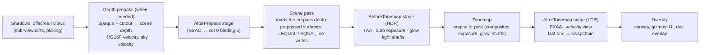

# Post-processing

## Purpose

How the main view's screen-space effects are organised ([ADR 0163](../../memory/decisions/0163-post-processing-stages-prepass-motion-vectors.md)):
three **stages** in the frame, **effects** registered on a per-view stack, the images they share (**scene textures**:
HDR colour, depth, velocity), a **target pool** with ping-pong histories, the **depth prepass** that writes depth and
**motion vectors** before lighting, and the **projection jitter** TAA needs. Auto exposure, glow, light shafts and
FXAA are effects in this system; SSAO and TAA plug into it. Code: [`Src/Rendering/Post/`](../../MainframeEngine/Src/Rendering/Post/).

## Frame



| Step | Who | When |
|---|---|---|
| `RenderServer.PrepareFrame` | Engine, before `BeginFrame` | decides the frame's post state: copies the root world's `PostProcessSettings` to `IVulkanContext.PostProcess`, asks the stack what the enabled effects need (`PostEffectNeeds`), marks the main view's draws prepassed, sets the projection jitter |
| `RenderServer.RenderPrepass` | Engine, after `RenderOffscreen`, before `BeginRenderPass` | starts the frame's effects (`OnBeginFrame`); with a prepass: writes set 0 for view 0, draws the prepass, the sky velocity, then the `AfterPrepass` stage |
| `BeginRenderPass` | Engine | the scene pass; after a prepass it begins with a load-depth render pass compatible with the scene pass |
| `BeginOverlayPass` | `EndFrame` (or the engine) | ends the scene pass, records `BeforeTonemap`, the tonemap (into the swapchain, or into the LDR image when an `AfterTonemap` effect is on), then `AfterTonemap`; the last `AfterTonemap` effect begins the swapchain pass and the overlay renderers draw after it |

Only the tree's root world is post-processed (glow, auto exposure, light shafts, FXAA, the prepass); sub-viewports
(the editor viewport) use the engine tonemap alone (forest-showcase decision 12).

## Key types

| Type | Role |
|---|---|
| `PostStage` | `AfterPrepass`, `BeforeTonemap`, `AfterTonemap` |
| `PostEffect` | an effect: `Name`, `Stage`, `Order`, `Needs`, `IsEnabled(settings)`, and `OnCreate`, `OnBeginFrame`, `OnResize`, `OnRecord`, `OnDispose` |
| `PostEffectOrder` | the built-in orders: `Ssao` 100, `ContactShadows` 200; `Taa` 100, `DepthOfField` 150, `AutoExposure` 200, `Glow` 300, `LightShafts` 400; `Sharpen` 50, `Fxaa` 100, `DebugView` 1000 |
| `PostEffectNeeds` | `DepthPrepass`, `Velocity` (implies the prepass), `Jitter` |
| `PostEffectSettings` | what effects decide on: the root world's `PostProcessSettings` (`World`), `AntiAliasing`, `RenderDebugView`; `PostTonemap` = the world asks for more than the engine tonemap |
| `PostProcessStack` | the view's effects, sorted by stage, order, registration; `GetNeeds`, `CountEnabled`, `BeginFrame`, `Record(stage)`, `Resize` |
| `PostEffectContext` | per stage: `CommandBuffer`, `Stage`, `Settings`, `Scene` (`SceneTextures`), `Targets` (pool), `Camera` (`PostCamera`), `FrameNumber`, `DeltaTime`, `Time`, `Exposure`, `IsLastInStage`, `BeginOutput`/`EndOutput`, `CopyToSceneColor` |
| `SceneTextures` | `Color` (HDR), `Depth`, `Velocity`, `Ldr`, `Extent`, `Generation`, `HasPrepass`, point and linear samplers |
| `PostCamera` | `View`, unjittered `Projection` and `ViewProjection`, `JitteredProjection`, `PreviousViewProjection`, `Jitter`, `PreviousJitter`, `HistoryValid`, `Position`, `Near`, `Far` |
| `PostTargetPool<RenderTarget>` | named scene-relative targets (`Get`) and ping-pong pairs (`GetHistory` → `PostHistory`) |
| `ScenePrepass` | the prepass render pass, the velocity image, the load-depth scene pass, the sky velocity draw |
| `SceneColorCopy` | `CopyToSceneColor`'s fullscreen copy into the HDR scene colour |
| `TemporalJitter` | Halton (2, 3): `Halton`, `SampleIndex`, `PixelOffset`, `NdcOffset`, `Apply(projection, jitter)` |
| `IPostProcessHost` | the renderer's side the render server drives (`PostEffects`, `BeginPostFrame`, `BeginPrepass`/`EndPrepass`, `RecordAfterPrepass`) |

All of these are internal for now; `RenderDebugView`, `TemporalJitter`, `FrameTemporal` and the `FrameData` fields are
public.

## Stages

**AfterPrepass.** After the depth prepass, before the lit scene pass. `SceneTextures.Depth` holds the opaque and
cutout depth, `Velocity` the motion vectors; nothing is lit (`Color` is not rendered yet). SSAO runs here and binds its
output for the lit shaders (below). The stage only runs on frames with a prepass, and any effect in it should declare
`PostEffectNeeds.DepthPrepass`.

**BeforeTonemap.** After the scene pass, on linear HDR colour. Built in: auto exposure, glow and light shafts, which
the post tonemap pass composites (their outputs are bound in its set); they run whenever the world's settings are not
the default (`PostEffectSettings.PostTonemap`), exactly as before ADR 0163. An effect that produces a new HDR image
(TAA, depth of field) writes it back with `PostEffectContext.CopyToSceneColor(view)`: one fullscreen pass over the scene
colour, after which every later effect and the tonemap read the new image (their sets bind the scene colour).

**AfterTonemap.** After the tonemap, on the display-encoded LDR image (`R8G8B8A8_UNORM`, `SceneTextures.Ldr`), before
the canvas, gizmos, UI and dev overlay. When any effect of the stage is on, the tonemap writes the stage's first LDR
image; each effect draws one fullscreen pass from `Scene.Ldr` into `context.BeginOutput()`, which is the next LDR
image of a ping-pong pair, or, for the last effect (`IsLastInStage`), the swapchain pass, which stays open for the
overlay renderers. An effect builds a pipeline per `OutputRenderPass` it is handed (`PassPipelines`), and decodes sRGB
when `OutputEncodesSrgb` (a swapchain view that encodes). Built in: FXAA, and the velocity debug view (last).

## Writing an effect

```csharp
internal sealed class MyEffect() : PostEffect("my effect", PostStage.BeforeTonemap, PostEffectOrder.Glow + 50)
{
    public override PostEffectNeeds Needs => PostEffectNeeds.DepthPrepass;
    public override bool IsEnabled(in PostEffectSettings settings) => settings.World.MyEffectEnabled;

    protected override void OnCreate(PostEffectContext context) { /* pipelines, sets, pooled targets */ }
    protected override void OnResize(PostEffectContext context) { /* rewrite sets: Scene views and pool targets are new */ }
    protected override void OnRecord(PostEffectContext context) { /* passes with context.CommandBuffer */ }
    protected override void OnDispose() { /* destroy (device idle) */ }
}
```

- Register it on the view's stack: built-ins in `VulkanRenderer.RegisterPostEffects`; tests through
  `RenderServer.PostEffects.Add`. One instance per view, so its fields are that view's state (TAA's history,
  auto exposure's adapted luminance).
- `IsEnabled` is read several times a frame: no side effects. `OnCreate` runs the first frame it is enabled
  (`Scene` is filled in); `OnBeginFrame` every enabled frame before any pass of the view.
- Record with no render pass active (an `AfterTonemap` effect opens its output with `BeginOutput`). Use
  `RenderTarget.Begin`/`End` for every pass: `End` records the barrier MoltenVK needs between encoders.
- Never rewrite a descriptor set a frame in flight may bind: keep one set per source image (the `LdrInputSets` and
  `SceneColorCopy` pattern), and rewrite only in `OnResize` (device idle).
- Per-frame code allocates nothing (no lambdas capturing state, no LINQ).

## Scene textures

| Image | Format, layout | Valid in |
|---|---|---|
| `Color` | `R16G16B16A16_SFLOAT`, `SHADER_READ_ONLY_OPTIMAL` | `BeforeTonemap` |
| `Depth` | the scene depth format (D32), depth aspect, `DEPTH_STENCIL_READ_ONLY_OPTIMAL`; 1 = far | `AfterPrepass` (the prepass's) and `BeforeTonemap` (the scene pass's, which adds what the prepass does not draw: the grid, Spine) |
| `Velocity` | `R16G16_SFLOAT`, `SHADER_READ_ONLY_OPTIMAL` | frames with a prepass (`HasPrepass`) |
| `Ldr` | `R8G8B8A8_UNORM`, display-encoded, `SHADER_READ_ONLY_OPTIMAL` | `AfterTonemap` |

There is no normal buffer: GTAO rebuilds normals from depth. A normals attachment would be a second prepass output
(every prepass pipeline would change). Views change on resize (`Generation` moves).

## Target pool and histories

`context.Targets.Get(new PostTargetDesc(name, format, PostTargetScale.Half))` returns a `RenderTarget` (one sampled
colour attachment) created on first request at the scene's size (`Full`, `Half`, `Quarter`, at least 1 pixel) and
resized with the scene; `Generation` moves on every resize. `GetHistory(desc)` returns a `PostHistory` of two targets:
call `Advance(frameNumber)` once per frame (it swaps), write `Current`, call `MarkWritten()`; next frame `Previous` holds
it and `IsValid` is true. `IsValid` is false on the first frame, after a frame that wrote nothing, after a resize and
after `Reset()` (camera cuts).

## Depth prepass

**When.** The prepass runs when an enabled effect needs it (`PostEffectNeeds.DepthPrepass` or `Velocity`: SSAO, TAA,
the velocity view; water's `SceneTextures` later), or when `RenderServer.ForceDepthPrepass` is set (start-up:
`MAINFRAME_DEPTH_PREPASS=1`). Off by default, so existing frames do not change.

**What.** One render pass (`ScenePrepass.PrepassRenderPass`): colour 0 is the velocity image, the depth attachment is
the **scene target's own depth**. `MeshRenderer.DrawPrepass` draws the main view's sorted opaque list: every surface of
a `MaterialGpu.Prepassable` material (lit, unshaded and PBR `StandardMaterial3D`, `FoliageMaterial3D` with its wind,
`TerrainSplatMaterial3D`, multimeshes) in instanced runs, depth LESS with writes, cutouts alpha-tested exactly as their
colour shaders do (`Mesh/MeshDepth.vk.frag`; albedo × vertex-colour alpha against the cutoff). Next passes, overlays,
outlines, water and blended surfaces are not prepassed. Vertex shaders: `Mesh/MeshDepth.vk.vert`,
`MeshDepthExt.vk.vert` (vertex streams), `Foliage/FoliageDepth.vk.vert`; the position expressions are copied from the
colour shaders. Then a fullscreen triangle at the far plane, depth-tested EQUAL, writes the sky's velocity
(`Mesh/PrepassSky`).

**The scene pass after it** begins with `ScenePrepass.SceneLoadPass` (depth `LOAD`, colour cleared), compatible with
the scene pass (same attachments and dependencies), so every scene pipeline and the scene framebuffer are used
unchanged. Prepassed surfaces draw with their material's pipeline variant `PipelineKey.Prepassed`: no depth writes,
LESS_OR_EQUAL, and cutouts EQUAL **without `discard`** (specialization constant 0 = opaque): the prepass already kept
only the pixels that pass the alpha test, so leaves cost one alpha test (in the prepass) and keep early depth testing
in the expensive lit shader. Everything else (sky, grid, Spine, outlines, transparent surfaces, next passes) keeps its
own pipelines and tests the prepass depth as it would its own.

**Precision.** Prepass on and off match within the render tests' usual tolerance, not bit for bit
(`ThePrepassLeavesTheImageAsItWas`, ten scenes): where two surfaces meet at exactly equal depth the later one wins
(LESS_OR_EQUAL; without the prepass the earlier one did), a cutout's edge pixels follow the prepass's alpha test, and
the prepassed pipelines' shading differs by a code value here and there (a different specialization). Measured on
MoltenVK: at most 0.12 % of pixels beyond ±4 (`tree-forest`), no holes. EQUAL depends on the prepass and colour
vertex shaders computing bit-identical positions: Slang 2026.1 cannot mark `SV_Position` invariant (`precise` emits no
`NoContraction`, `[vk::invariant]` is unknown), so the expressions are kept identical and the parity test guards it.

**Cost (the Forest).** `just forest-bench` at 1920 × 1080 on an Apple M-series GPU (MoltenVK), 1800 frames, two runs
each: without the prepass p50 13.09 / 13.20 ms, mean 12.84 / 12.81 ms; with it (`MAINFRAME_DEPTH_PREPASS=1`) p50
11.71 / 11.76 ms, mean 11.72 / 11.71 ms. GPU timestamps around the passes: the scene pass 9.69 ms alone; prepass
3.23 ms + scene pass 4.95 ms with it. The prepass pays for itself: leaves no longer shade hidden fragments or run
`discard` in the lit shader. It stays opt-in until an effect needs it (`ForceDepthPrepass` turns it on for scenes
like the Forest).

## Motion vectors

`SceneTextures.Velocity` (`R16G16_SFLOAT`) holds, per pixel, its **screen UV this frame minus last frame**, both
unjittered (UV 0,0 top-left, +y down): `previousUv = uv − velocity`. Written by the prepass; 0 where nothing moved.

- **Camera motion** for everything: the prepass vertex shaders output this frame's unjittered clip position
  (`unjitterClip`) and last frame's through `FrameData.PreviousViewProjection`; the fragment shader divides
  (`velocityFromClip`, `include/frame.slang`).
- **Moving nodes**: last frame's model matrix at vertex binding 3 (`VertexLayouts.PreviousInstanceBinding`, locations
  10–13). `MeshInstanceData` is 80 bytes with 12 spare, too small for a matrix (G6.3 claims the padding), so a
  prepassed view's instance allocation is followed by a block of previous `MeshInstanceData` for its opaque instances,
  bound at binding 3 with an offset that lines up the instance indices. Each node keeps `GeometryInstance3D.Motion`
  (`MotionHistory`): the model matrix of the frame before, when the prepass drew it then (a node not drawn last frame
  moves with the camera only for one frame). Physics bodies need nothing extra: their model matrix is the interpolated
  render pose.
- **Multimeshes** are static: binding 3 is their own instance buffer, so instances move with the camera only.
- **Foliage wind**: `FoliageDepth.vk.vert` evaluates `windOffset` twice, with `frame.wind`/`windParams`/`clip.z` and
  with `frame.prevWind`/`prevWindParams`/`temporal.x`, so swaying leaves and grass have real motion vectors.
- **The sky**: camera rotation only (`PrepassSky.vk.frag`: the pixel's ray projected by last frame's view-projection as
  a direction).
- Not covered: what the prepass does not draw (Spine, the grid, transparent surfaces, water, particles) shows the
  velocity of what is behind it; sub-viewports have no velocity.

`FrameData` (set 0, binding 0) is 560 bytes: after `fogParams` come `prevViewProjection` (last frame's unjittered),
`jitter` (xy this frame, zw last frame, NDC), `temporal` (x last frame's time, y 1 when the previous fields are last
frame's, z the jitter sample index) and `prevWind`, `prevWindParams`. `FrameContext` keeps each view's `ViewHistory`:
the first camera write of a frame moves "current" to "previous" when it came from the frame before; a view written twice
in a frame (the picking pass, then the main pass) keeps last frame's values; a view not written last frame has no
history (previous = current). `FrameContext.ResetHistory()` runs on resize.

## Projection jitter

When an enabled effect declares `PostEffectNeeds.Jitter` (TAA), the render server sets
`FrameContext.ProjectionJitter` every frame to Halton (2, 3) sample `frameNumber mod 8` (`TemporalJitter.NdcOffset`,
from index 1, in [−0.5, 0.5) pixel) and `JitterIndex`. Only the main view's (view 0) set-0 matrices are jittered
(`projection`, `viewProjection`, `invProjection`): culling, shadows, light shafts and the UI use the camera's own
matrices (the root object-ID pass shares view 0's set, so picks are jittered by under a pixel). `TemporalJitter.Apply` adds `jitter · clip.w` to clip x and y, for perspective and
orthographic projections. Motion vectors are unjittered, so a still scene with jitter has zero velocity
(`TheProjectionJitterLeavesStillPixelsStill`). Under `--fixed-fps` the sequence is deterministic.

## Ambient occlusion binding

Set 0 binding 5 (`FrameContext.AmbientOcclusionBinding`) is `ssaoTexture` (`include/ambient_occlusion.slang`), a
combined image sampler with the frame set's linear clamp sampler; `ambientOcclusion(screenUv)` returns its red channel
(1 = unoccluded). Without SSAO it is a white 1×1 `R8G8B8A8_UNORM` image, in every view. The renderer clears the binding
at the start of each frame (`BeginPostFrame`); an SSAO effect calls `FrameContext.SetAmbientOcclusion(image, id)` in its
`OnBeginFrame`, before the frame's first bind of view 0's set. The binding is latched per frame: a change after the set
was bound applies next frame (a bound set is never rewritten). Offscreen views always bind white. The fragment stage
uses 14 images and 11 samplers (terrain splat: 15 and 12) of MoltenVK's 16.

## Debug view

`RenderServer.DebugView = RenderDebugView.Velocity` replaces the final image with the motion vectors (it turns the
prepass on): red = 128/255 + velocity.x × 16, green the same for y, blue 128/255, written as display values so a capture
decodes exactly (`VelocityDebugView.Decode`); still is 128 grey.

## Settings

Effects read their switches from `PostEffectSettings`: the world's `PostProcessSettings` (set on `WorldEnvironment`, Godot
style: glow, auto exposure, light shafts; SSAO's will go there too), the project's `AntiAliasing`
(`rendering.antiAliasing`; TAA will be `AntiAliasing.Taa`) and the renderer's debug view. `RenderServer.ForceDepthPrepass`
and `MAINFRAME_DEPTH_PREPASS` force the prepass.

## Game-defined effects (later)

The shape is ready for a Godot `CompositorEffect`-like hook: a public `PostEffect` base (stage, order, enable rule,
create/resize/record), a `Compositor` resource on `WorldEnvironment` (or `Camera3D`) listing effect instances, and the
render server adding them to the view's stack when the world changes. What stays internal until then: the Vulkan
handles in `PostEffectContext` (M11's encoder API would replace them with backend-neutral targets and passes), and the
pipeline helpers. Game effects would get the same `SceneTextures`, pool and camera.

## Adding SSAO and TAA

- **SSAO (GTAO):** an `AfterPrepass` effect at `PostEffectOrder.Ssao` with `Needs = DepthPrepass`, enabled by the
  world's SSAO settings. Read `Scene.Depth` (`DEPTH_STENCIL_READ_ONLY_OPTIMAL`, point sampler) and the camera's
  `Projection`/`Near`/`Far` (unjittered) or `FrameData` in a frame-set layout; half-resolution targets from
  `Targets.Get(..., PostTargetScale.Half)`; the full-resolution result's view goes to
  `context.Vulkan.Frame.SetAmbientOcclusion(...)` in `OnBeginFrame` (id: a counter bumped on create/resize). In the lit
  shaders, include `ambient_occlusion.slang` and multiply the ambient/indirect term by
  `ambientOcclusion(SV_Position.xy * frame.viewport.zw)` (`shadeLightsPbr`'s IBL terms, the Blinn-Phong ambient).
- **TAA:** a `BeforeTonemap` effect at `PostEffectOrder.Taa` with `Needs = Velocity | Jitter`, enabled by
  `settings.AntiAliasing == AntiAliasing.Taa` (add the value). History: `Targets.GetHistory(new("taa", R16G16B16A16_SFLOAT))`,
  `Advance` in `OnBeginFrame` (or `OnRecord`), reset on cuts. Resolve `Scene.Color` with `Previous` and `Scene.Velocity`
  (closest-depth from `Scene.Depth`) into `Current`, `MarkWritten()`, then `CopyToSceneColor(Current's view)`. The
  camera's `Jitter`/`PreviousJitter` give the sample offsets in NDC (pixels: `jitter.x · width / 2`,
  `−jitter.y · height / 2`).

## Testing

- **Render tests** (`PostProcessingTests`): prepass parity on ten scenes against their goldens; the self-checked
  `velocity` scene (rotating camera, a gravity-less `RigidBody3D` crossing: every static pixel against the camera's own
  matrices, the body's centre pixel against its own motion); the jitter leaving still pixels still; foliage moving in the
  wind and not without it; `post-copy` (a `BeforeTonemap` test effect writes the scene colour through a pooled history);
  0 B per frame with the prepass, velocity view and jitter (allocation gate). Host flags `--prepass`, `--jitter`,
  `--velocity-view`.
- **Unit tests** (`PostProcessingTests`): stage and order sorting, enable rules and needs, lazy creation and disposal,
  the built-ins' stages, the target pool and history validity, Halton and the jittered projection, the 560-byte frame
  block and its offsets, view and node motion histories.

## Known issues

- Sub-viewports have no post effects, prepass or velocity.
- What the prepass does not draw has no velocity of its own (see above); a reactive mask for TAA is not built.
- SSAO and TAA themselves are not built yet (lanes S and T).

## Related docs

[Color pipeline](color-pipeline.md) · [Vulkan renderer](vulkan-renderer.md) · [Materials & meshes](materials-and-meshes.md) ·
[Lighting](lighting.md) · [Rendering features (G6.6)](future/rendering-features.md#ssao) ·
[Forest showcase (G8d.8)](future/forest-showcase.md#g8d8-taa)
