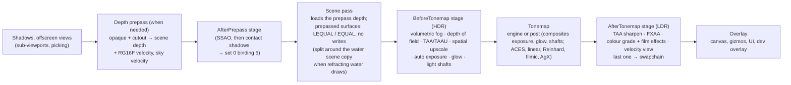

# Post-processing

## Purpose

How the main view's screen-space effects are organised ([ADR 0163](../../memory/decisions/0163-post-processing-stages-prepass-motion-vectors.md)):
three **stages** in the frame, **effects** registered on a per-view stack, the images they share (**scene textures**:
HDR colour, depth, velocity), a **target pool** with ping-pong histories, the **depth prepass** that writes depth and
**motion vectors** before lighting, the **projection jitter** TAA needs, and the **render and output resolutions** of an
upscaled main view ([ADR 0174](../../memory/decisions/0174-taa-upscaling.md), [Render and output resolution](#render-and-output-resolution)).
Auto exposure, glow, light shafts, FXAA, TAA (ADR 0166) and its upscaling TAAU, FSR 1, SSAO ([ADR 0165](../../memory/decisions/0165-ssao-gtao.md)) and ADR 0168's depth of field and colour grade
are effects in this system. The world's settings are a `PostProcessProfile` resource ([ADR 0169](../../memory/decisions/0169-post-processing-profile-and-editor-preview.md),
[The profile](#the-profile)), and a `SubViewport` can run the same stack for its own world
([Sub-viewports](#sub-viewports)): the editor previews post-processing that way. Code: [`Src/Rendering/Post/`](../../MainframeEngine/Src/Rendering/Post/).

## Frame



| Step | Who | When |
|---|---|---|
| `RenderServer.PrepareFrame` | Engine, before `BeginFrame` | decides the frame's post state: copies the root world's `PostProcessSettings` to `IVulkanContext.PostProcess`, asks the stack what the enabled effects need (`PostEffectNeeds`), marks the main view's draws prepassed, sets the projection jitter |
| `RenderServer.RenderPrepass` | Engine, after `RenderOffscreen`, before `BeginRenderPass` | starts the frame's effects (`OnBeginFrame`); with a prepass: writes set 0 for view 0, draws the prepass, the sky velocity, then the `AfterPrepass` stage |
| `BeginRenderPass` | Engine | the scene pass; after a prepass it begins with a load-depth render pass compatible with the scene pass |
| `BeginOverlayPass` | `EndFrame` (or the engine) | ends the scene pass, records `BeforeTonemap`, the tonemap (into the swapchain, or into the LDR image when an `AfterTonemap` effect is on), then `AfterTonemap`; the last `AfterTonemap` effect begins the swapchain pass and the overlay renderers draw after it |

The table is the main view's: the tree's root world. A `SubViewport` with `PostProcessing` runs the same stages inside
`RenderServer.RenderOffscreen` for its world ([Sub-viewports](#sub-viewports)); other sub-viewports use the engine
tonemap alone.

## Key types

| Type | Role |
|---|---|
| `PostStage` | `AfterPrepass`, `BeforeTonemap`, `AfterTonemap` |
| `PostEffect` | an effect: `Name`, `Stage`, `Order`, `Needs`, `IsEnabled(settings)`, and `OnCreate`, `OnBeginFrame`, `OnResize`, `OnRecord`, `OnDispose` |
| `PostEffectOrder` | the built-in orders: `Ssao` 100, `ContactShadows` 200; `VolumetricFog` 50, `DepthOfField` 75, `Taa` 100, `Upscale` 110, `AutoExposure` 200, `Glow` 300, `LightShafts` 400; `Sharpen` 50, `Fxaa` 100, `ColorGrade` 150, `DebugView` 1000. `BeforeTonemap` effects after `Taa` and every `AfterTonemap` one run at the output resolution (ADR 0174) |
| `PostEffectNeeds` | `DepthPrepass`, `Velocity` (implies the prepass), `Jitter` |
| `PostEffectSettings` | what effects decide on: the root world's `PostProcessSettings` (`World`), `AntiAliasing`, `RenderDebugView`, `TaaSharpness`, the primary sun's `ContactShadows` (ADR 0167), the world's `VolumetricFog` (ADR 0171), `Upscaling`, `Scaling3DMode` and `FsrSharpness` (ADR 0174); `PostTonemap` = the world asks for more than the engine tonemap |
| `PostProcessStack` | the view's effects, sorted by stage, order, registration; `GetNeeds`, `CountEnabled`, `BeginFrame`, `Record(stage)`, `Resize` |
| `PostEffectContext` | per stage: `CommandBuffer`, `Stage`, `Settings`, `Scene` (`SceneTextures`), `Targets` (the pool of the effect's resolution; `RenderTargets`, `OutputTargets`), `IsOutputResolution`, `Camera` (`PostCamera`), `FrameNumber`, `DeltaTime`, `Time`, `Exposure`, `View` (the frame-set slot: `FrameContext.SetFor`), `Shadows` (the view's shadow set), `IsLastInStage`, `BeginOutput`/`EndOutput`, `CopyToSceneColor`, `CopyToOutputColor`, `OutputColorWritten` |
| `SceneTextures` | `Color` (HDR) and `Extent` of the effect's resolution, `RenderColor`/`RenderExtent`, `OutputColor`/`OutputExtent`, `Upscaled`, `Depth`, `Velocity`, `Ldr`, `Generation`, `HasPrepass`, point and linear samplers |
| `PostCamera` | `View`, unjittered `Projection` and `ViewProjection`, `JitteredProjection`, `PreviousViewProjection`, `Jitter`, `PreviousJitter`, `HistoryValid`, `Position`, `Near`, `Far` |
| `PostTargetPool<RenderTarget>` | named scene-relative targets (`Get`) and ping-pong pairs (`GetHistory` → `PostHistory`) |
| `ScenePrepass` | the prepass render pass, the velocity image, the load-depth scene pass, the sky velocity draw |
| `SceneColorCopy` | `CopyToSceneColor`'s fullscreen copy into the HDR scene colour |
| `TemporalJitter` | Halton (2, 3): `Halton`, `SampleIndex`, `PixelOffset`, `NdcOffset`, `Apply(projection, jitter)` |
| `IPostProcessHost` | the renderer's side the render server drives (`PostEffects`, `BeginPostFrame`, `BeginPrepass`/`EndPrepass`, `RecordAfterPrepass`) |
| `VolumetricFogEffect` | volumetric fog (ADR 0171): half-resolution march through the sun's cascades, temporal reprojection, depth-aware composite ([Volumetric fog](#volumetric-fog)); `VolumetricFogSettings` is its packed `WorldEnvironment` settings |
| `TaaEffect`, `TaaSharpenEffect` | TAA's resolve (TAAU while upscaling) and RCAS sharpen (also FSR 1's second half) ([TAA](#taa), ADR 0166, ADR 0174); `TaaParams` is the resolve's push block |
| `SpatialUpscaleEffect` | ADR 0174: the bilinear or FSR 1 (EASU) upscale to the output resolution while upscaling without TAA, and the fallback on a frame TAAU skipped |
| `RenderScaling`, `Scaling3DMode` | public (ADR 0174): the render size for a scale, the Halton cycle length, the mip bias; `Bilinear`, `Fsr`, `Taau` |
| `PostProcessProfile` | public resource (ADR 0169): the world's tonemap, auto exposure, glow, light shafts, SSAO and adjustments; `Settings` is the packed struct |
| `SubViewportPost` | a post-processed `SubViewport`'s stack, pool, prepass, LDR ping-pong and overlay pass (`IPostOutput` onto the view's image) |
| `PostTonemapPass` | the post tonemap (`TonemapPost`) into an LDR target, for `SubViewportPost` (the main view's is in `VulkanRenderer.Presentation`) |

All of these are internal for now; `RenderDebugView`, `TemporalJitter`, `FrameTemporal` and the `FrameData` fields are
public.

## Stages

**AfterPrepass.** After the depth prepass, before the lit scene pass. `SceneTextures.Depth` holds the opaque and
cutout depth, `Velocity` the motion vectors; nothing is lit (`Color` is not rendered yet). SSAO runs here and binds its
output for the lit shaders (below); so do the sun's contact shadows (`ContactShadows`, ADR 0167, which since ADR 0170
write the same image with the shadow in its green channel; [shadow-system.md → Contact shadows](shadow-system.md#contact-shadows)). The stage only runs on frames with a prepass, and any effect in it should declare
`PostEffectNeeds.DepthPrepass`.

**BeforeTonemap.** After the scene pass, on linear HDR colour. Built in: the volumetric fog (first, ADR 0171: it fogs
the scene colour from the scene depth, so TAA then smooths it with the rest of the image), TAA (everything after it reads
the resolved image), then auto exposure, glow and light shafts, which
the post tonemap pass composites (their outputs are bound in its set); they run whenever the world's settings are not
the default (`PostEffectSettings.PostTonemap`), exactly as before ADR 0163. Depth of field (`DepthOfFieldEffect`,
ADR 0168) runs after the fog and before TAA (ADR 0174: at render resolution) when the lens asks for it, from the scene
pass's own colour and depth (no prepass), and writes the scene colour back. While the view upscales, the upscale (TAAU,
or `SpatialUpscaleEffect`) comes right after TAA's slot and everything after it runs at the output resolution
([Render and output resolution](#render-and-output-resolution)). An effect that produces a new HDR image
(TAA, depth of field) writes it back with `PostEffectContext.CopyToSceneColor(view)`: one fullscreen pass over the scene
colour, after which every later effect and the tonemap read the new image (their sets bind the scene colour).

**AfterTonemap.** After the tonemap, on the display-encoded LDR image (`R8G8B8A8_UNORM`, `SceneTextures.Ldr`), before
the canvas, gizmos, UI and dev overlay. When any effect of the stage is on, the tonemap writes the stage's first LDR
image; each effect draws one fullscreen pass from `Scene.Ldr` into `context.BeginOutput()`, which is the next LDR
image of a ping-pong pair, or, for the last effect (`IsLastInStage`), the swapchain pass, which stays open for the
overlay renderers. An effect builds a pipeline per `OutputRenderPass` it is handed (`PassPipelines`), and decodes sRGB
when `OutputEncodesSrgb` (a swapchain view that encodes). Built in: TAA's sharpen, FXAA, the colour grade and film
effects (`ColorGradeEffect`, ADR 0168: after FXAA, so grain is not smoothed), and the velocity debug view (last).

## Writing an effect

```csharp
internal sealed class MyEffect() : PostEffect("my effect", PostStage.BeforeTonemap, PostEffectOrder.Glow + 50)
{
    public override PostEffectNeeds Needs => PostEffectNeeds.DepthPrepass;
    public override bool IsEnabled(in PostEffectSettings settings) => settings.World.MyEffectEnabled;

    protected override void OnCreate(PostEffectContext context) { /* pipelines, sets, pooled targets */ }
    protected override void OnResize(PostEffectContext context) { /* rewrite sets: Scene views and pool targets are new */ }
    protected override void OnRecord(PostEffectContext context) { /* passes with context.CommandBuffer */ }
    protected override void OnDispose() { /* destroy (device idle) */ }
}
```

- Register it on the view's stack: built-ins in `VulkanRenderer.RegisterPostEffects`; tests through
  `RenderServer.PostEffects.Add`. One instance per view, so its fields are that view's state (TAA's history,
  auto exposure's adapted luminance).
- `IsEnabled` is read several times a frame: no side effects. `OnCreate` runs the first frame it is enabled
  (`Scene` is filled in); `OnBeginFrame` every enabled frame before any pass of the view.
- Record with no render pass active (an `AfterTonemap` effect opens its output with `BeginOutput`). Use
  `RenderTarget.Begin`/`End` for every pass: `End` records the barrier MoltenVK needs between encoders.
- Never rewrite a descriptor set a frame in flight may bind: keep one set per source image (the `LdrInputSets` and
  `SceneColorCopy` pattern), and rewrite only in `OnResize` (device idle).
- Per-frame code allocates nothing (no lambdas capturing state, no LINQ).

## Scene textures

| Image | Format, layout | Valid in |
|---|---|---|
| `Color` | `R16G16B16A16_SFLOAT`, `SHADER_READ_ONLY_OPTIMAL` | `BeforeTonemap` |
| `Depth` | the scene depth format (D32), depth aspect, `DEPTH_STENCIL_READ_ONLY_OPTIMAL`; 1 = far | `AfterPrepass` (the prepass's) and `BeforeTonemap` (the scene pass's, which adds what the prepass does not draw: the grid, Spine) |
| `Velocity` | `R16G16_SFLOAT`, `SHADER_READ_ONLY_OPTIMAL` | frames with a prepass (`HasPrepass`) |
| `Ldr` | `R8G8B8A8_UNORM`, display-encoded, `SHADER_READ_ONLY_OPTIMAL` | `AfterTonemap` |

There is no normal buffer: GTAO rebuilds normals from depth. A normals attachment would be a second prepass output
(every prepass pipeline would change). Views change on resize (`Generation` moves).

### Water scene copy

Inside the scene pass, not a post stage ([ADR 0173](../../memory/decisions/0173-water-scene-copy-refraction-ssr-falls.md),
[Water → Scene textures](water.md#scene-textures)): a view that draws refracting water (`WaterMaterial3D.RefractionEnabled`)
ends its scene pass after the opaque half, copies the colour and the **linear view depth of the scene pass's own depth**
(prepass or not) into a `R16G16B16A16_SFLOAT` chain of up to 6 levels (`WaterSceneTextures`: level 0 exact, then colour
box-filtered and depth minimum), and resumes the pass (`ResumePass`: colour and depth `LOAD`, compatible with the scene
pass) for the blended draws. Water reads the chain through set 3 of its own pipeline layout: refraction from level 0 and
blurrier levels, screen-space reflections against level 1. The main view and post-processed sub-viewports each have one;
it does not touch `SceneTextures` (the post effects' images) and needs no prepass. Cost and memory: one full-screen copy
and five downsamples (≈ 22 MB at 1920 × 1080), the pass split (≈ 0 on desktop GPUs; a store and reload of colour and
depth on tile-based ones), and the water shader's taps (up to ≈ 35 per water pixel with High SSR).

## Target pool and histories

`context.Targets.Get(new PostTargetDesc(name, format, PostTargetScale.Half))` returns a `RenderTarget` (one sampled
colour attachment) created on first request at the scene's size (`Full`, `Half`, `Quarter`, at least 1 pixel) and
resized with the scene; `Generation` moves on every resize. `GetHistory(desc)` returns a `PostHistory` of two targets:
call `Advance(frameNumber)` once per frame (it swaps), write `Current`, call `MarkWritten()`; next frame `Previous` holds
it and `IsValid` is true. `IsValid` is false on the first frame, after a frame that wrote nothing, after a resize and
after `Reset()` (camera cuts).

## Depth prepass

**When.** The prepass runs when an enabled effect needs it (`PostEffectNeeds.DepthPrepass` or `Velocity`: SSAO, TAA,
the velocity view; refracting water does not: its copy reads the scene pass's depth), or when `RenderServer.ForceDepthPrepass` is set (start-up:
`MAINFRAME_DEPTH_PREPASS=1`). Off by default, so existing frames do not change.

**What.** One render pass (`ScenePrepass.PrepassRenderPass`): colour 0 is the velocity image, the depth attachment is
the **scene target's own depth**. `MeshRenderer.DrawPrepass` draws the main view's sorted opaque list: every surface of
a `MaterialGpu.Prepassable` material (lit, unshaded and PBR `StandardMaterial3D`, `FoliageMaterial3D` with its wind,
`TerrainSplatMaterial3D`, multimeshes) in instanced runs, depth LESS with writes, cutouts alpha-tested exactly as their
colour shaders do (`Mesh/MeshDepth.vk.frag`; albedo × vertex-colour alpha against the cutoff). Next passes, overlays,
outlines, water and blended surfaces are not prepassed. Vertex shaders: `Mesh/MeshDepth.vk.vert`,
`MeshDepthExt.vk.vert` (vertex streams), `Foliage/FoliageDepth.vk.vert`; the position expressions are copied from the
colour shaders. Then a fullscreen triangle at the far plane, depth-tested EQUAL, writes the sky's velocity
(`Mesh/PrepassSky`).

**The scene pass after it** begins with `ScenePrepass.SceneLoadPass` (depth `LOAD`, colour cleared), compatible with
the scene pass (same attachments and dependencies), so every scene pipeline and the scene framebuffer are used
unchanged. Prepassed surfaces draw with their material's pipeline variant `PipelineKey.Prepassed`: no depth writes,
LESS_OR_EQUAL, and cutouts EQUAL **without `discard`** (specialization constant 0 = opaque): the prepass already kept
only the pixels that pass the alpha test, so leaves cost one alpha test (in the prepass) and keep early depth testing
in the expensive lit shader. Everything else (sky, grid, Spine, outlines, transparent surfaces, next passes) keeps its
own pipelines and tests the prepass depth as it would its own.

**Precision.** Prepass on and off match within the render tests' usual tolerance, not bit for bit
(`ThePrepassLeavesTheImageAsItWas`, ten scenes): where two surfaces meet at exactly equal depth the later one wins
(LESS_OR_EQUAL; without the prepass the earlier one did), a cutout's edge pixels follow the prepass's alpha test, and
the prepassed pipelines' shading differs by a code value here and there (a different specialization). Measured on
MoltenVK: at most 0.12 % of pixels beyond ±4 (`tree-forest`), no holes. EQUAL depends on the prepass and colour
vertex shaders computing bit-identical positions: Slang 2026.1 cannot mark `SV_Position` invariant (`precise` emits no
`NoContraction`, `[vk::invariant]` is unknown), so the expressions are kept identical and the parity test guards it.

**Cost (the Forest).** `just forest-bench` at 1920 × 1080 on an Apple M-series GPU (MoltenVK), 1800 frames, two runs
each: without the prepass p50 13.09 / 13.20 ms, mean 12.84 / 12.81 ms; with it (`MAINFRAME_DEPTH_PREPASS=1`) p50
11.71 / 11.76 ms, mean 11.72 / 11.71 ms. GPU timestamps around the passes: the scene pass 9.69 ms alone; prepass
3.23 ms + scene pass 4.95 ms with it. The prepass pays for itself: leaves no longer shade hidden fragments or run
`discard` in the lit shader. It stays opt-in until an effect needs it (`ForceDepthPrepass` turns it on for scenes
like the Forest).

## Motion vectors

`SceneTextures.Velocity` (`R16G16_SFLOAT`) holds, per pixel, its **screen UV this frame minus last frame**, both
unjittered (UV 0,0 top-left, +y down): `previousUv = uv − velocity`. Written by the prepass; 0 where nothing moved.

- **Camera motion** for everything: the prepass vertex shaders output this frame's unjittered clip position
  (`unjitterClip`) and last frame's through `FrameData.PreviousViewProjection`; the fragment shader divides
  (`velocityFromClip`, `include/frame.slang`).
- **Moving nodes**: last frame's model matrix at vertex binding 3 (`VertexLayouts.PreviousInstanceBinding`, locations
  10–13). `MeshInstanceData` is 80 bytes with 12 spare, too small for a matrix (G6.3 claims the padding), so a
  prepassed view's instance allocation is followed by a block of previous `MeshInstanceData` for its opaque instances,
  bound at binding 3 with an offset that lines up the instance indices. Each node keeps `GeometryInstance3D.Motion`
  (`MotionHistory`): the model matrix of the frame before, when the prepass drew it then (a node not drawn last frame
  moves with the camera only for one frame). Physics bodies need nothing extra: their model matrix is the interpolated
  render pose.
- **Multimeshes** are static: binding 3 is their own instance buffer, so instances move with the camera only.
- **Foliage wind**: `FoliageDepth.vk.vert` evaluates `windOffset` twice, with `frame.wind`/`windParams`/`clip.z` and
  with `frame.prevWind`/`prevWindParams`/`temporal.x`, so swaying leaves and grass have real motion vectors.
- **The sky**: camera rotation only (`PrepassSky.vk.frag`: the pixel's ray projected by last frame's view-projection as
  a direction).
- Not covered: what the prepass does not draw (Spine, the grid, transparent surfaces, water, particles) shows the
  velocity of what is behind it; sub-viewports have no velocity.

`FrameData` (set 0, binding 0) is 688 bytes (with ADR 0165's AO parameters, ADR 0170's probe volume and ADR 0174's
`mipBias`/`mipScale` at the end): after `fogParams` come `prevViewProjection` (last frame's unjittered),
`jitter` (xy this frame, zw last frame, NDC), `temporal` (x last frame's time, y 1 when the previous fields are last
frame's, z the jitter sample index) and `prevWind`, `prevWindParams`. `FrameContext` keeps each view's `ViewHistory`:
the first camera write of a frame moves "current" to "previous" when it came from the frame before; a view written twice
in a frame (the picking pass, then the main pass) keeps last frame's values; a view not written last frame has no
history (previous = current). `FrameContext.ResetHistory()` runs on resize.

## Projection jitter

When an enabled effect declares `PostEffectNeeds.Jitter` (TAA), the render server sets
`FrameContext.ProjectionJitter` every frame to Halton (2, 3) sample `frameNumber mod n` (`TemporalJitter.NdcOffset`,
from index 1, in [−0.5, 0.5) of a render pixel) and `JitterIndex`; n is 8 at native resolution and 8 / scale² rounded up
to a power of two while upscaling (`RenderScaling.JitterSampleCount`: 16 at 0.75, 32 at 0.5; ADR 0174). Only the main view's (view 0) set-0 matrices are jittered
(`projection`, `viewProjection`, `invProjection`): culling, shadows, light shafts and the UI use the camera's own
matrices (the root object-ID pass shares view 0's set, so picks are jittered by under a pixel). `TemporalJitter.Apply` adds `jitter · clip.w` to clip x and y, for perspective and
orthographic projections. Motion vectors are unjittered, so a still scene with jitter has zero velocity
(`TheProjectionJitterLeavesStillPixelsStill`). Under `--fixed-fps` the sequence is deterministic.

## TAA

`AntiAliasing.Taa` ([ADR 0166](../../memory/decisions/0166-taa.md)): [`TaaEffect`](../../MainframeEngine/Src/Rendering/Post/TaaEffect.cs)
(`BeforeTonemap`, `PostEffectOrder.Taa`, first in the stage; `Needs = Velocity | Jitter`) and
[`TaaSharpenEffect`](../../MainframeEngine/Src/Rendering/Post/TaaSharpenEffect.cs) (`AfterTonemap`,
`PostEffectOrder.Sharpen`). TAA replaces FXAA (one enum); like every post effect it runs for the root world only.

**The resolve** (`Post/Taa.vk.frag`, one fullscreen pass into the history's `Current`, then `CopyToSceneColor`):

| Step | What |
|---|---|
| Reconstruct | the current colour at the output pixel's centre from the 3 × 3 jittered samples around it (sample `t` was taken at `t + 0.5 − jitterPixels`), weights `exp(−2.29 d² / 0.75²)` (`FilterFalloff`); written in input pixels with an output/input ratio, so TAAU (G8e.8) can render below the output size |
| Reproject | the velocity of the **closest depth** in the 3 × 3 (silhouettes carry their motion a pixel out); `previousUv = uv − velocity`; off-screen → no history |
| Disocclusion | the history's alpha is the view depth of its closest sample; the history is dropped when **no** texel of the 3 × 3 around `previousUv` stored the depth this pixel's closest sample had last frame (`DepthPrevious` row of inverse VP × last VP), within 15 % (`DepthTolerance`). The 3 × 3 keeps thin needles (in some texels one frame, not the next) from counting as disocclusions; without the test a swaying branch leaves a translucent copy of itself |
| History | a 5-tap Catmull–Rom (bilinear sampler) |
| Clip | towards the 3 × 3's variance box in YCoCg (Salvi: mean ± 1.25 σ, inside min/max), Playdead's clip towards the centre |
| Blend | Karis: everything above runs on `c / (1 + exposure · luma)`, unweighted at the end; feedback `FeedbackStill` 0.94 (≈ 17 frames), down to `FeedbackMoving` 0.88 at 8 px/frame, and to `FeedbackReactive` 0.2 where the scene alpha marks water |
| No history | first frame, resize, cut, disocclusion: a softer 3 × 3 reconstruction (`exp(−2.29 d²)`), which hides the single sample's aliasing and the dithered alpha's noise until the history builds up |

**TAAU** (ADR 0174, `TaaParams` flag 4, while upscaling): the inputs (colour, depth, velocity) are at render resolution,
the history and the result at output resolution. Each output pixel's 3 × 3 is the render texels around its position, the
jitter is in render pixels and the Halton cycle 8 / scale² long, and two things change: the reconstruction is narrower
(`TaaEffect.UpscaleFilterFalloff`: 0.75 / ratio² output pixels, at least 0.4; its weights relative to the nearest
sample's, so they never underflow), and the clip box is the 3 × 3's min/max instead of the variance box (a sparser frame
misses a thin line more often, and the variance box clipped it out of the history). The reactive water mask works as
before (the scene alpha at the pixel's render texel). Measured against a 4× supersampled frame at 0.75: thin bars and
sub-pixel spokes 29.9 dB (native TAA 33.1, no AA 22.6), swaying leaves 27.1 dB (native TAA 28.8); tried and dropped: a
confidence weight on the current frame (−1 to −3 dB), a wider filter (−1 dB), trusting still pixels' history (+0.15 dB,
not worth the ghosting risk).

The filter width, feedback and depth test were measured against a 4× supersampled frame (linear light) on the
`taa-edges` and `taa-foliage` scenes and on autowalk frame grabs: the wide Blackman–Harris fit Unreal uses
(`exp(−2.29 d²)`) blurred the converged image (mean error 1.51 against the supersampled frame, 1.18 at width 0.75, 3.44
without AA); a lower feedback (0.9) tracked swaying leaves slightly better but flickered more on still thin lines (0.3 vs
0.17 mean frame-to-frame change); turning the depth test off left ghosts of near branches.

**History and cuts.** `OutputTargets.GetHistory(new("taa", R16G16B16A16_SFLOAT))` (two output-size RGBA16F targets:
33 MB at 1920 × 1080, 59 MB at 2560 × 1440), `Advance` in `OnBeginFrame`. It starts again (`TaaEffect.ResetFrames`) on the first frame, after a resize
(the pool resets it), after a frame without a resolve (no prepass or no camera), when the view has no motion history
(`PostCamera.HistoryValid`), and on camera cuts: `RenderServer.ResetTemporalHistory()` (call it after teleporting the
camera; it forgets every view's motion history, `FrameContext.ResetHistory`) and a switch of the root world's camera
(the render server compares the camera each frame). Sets are written on creation and after a resize only (one per
history target), never while a frame in flight binds them.

**Water (the reactive mask).** Water has no motion vectors of its own (it is blended, not prepassed) and its flow
animates under the bed's static ones, so a full history smeared its ripples along the flow. Water in the main scene
pass blends with `BlendMode.AlphaReactive` (`a = dst · (1 − src.a)`): opaque surfaces and the sky write alpha 1, so the
resolve reads `1 − scene alpha` as reactivity and lowers the feedback towards 0.2 there; ripples stay as crisp as with
FXAA (and alias a little more than the rest of the image). Drawing water after TAA was the alternative: water lives in
the scene pass (fog, refraction of what is behind it), so moving it would have needed its own pass over the resolved
image and depth. Sub-viewports keep the plain alpha blend. Refracting water (ADR 0173) composes the bed itself and
replaces the pixel (`BlendMode.ColorOnlyReactive`: `rgb = src`, `a = dst · (1 − src.a)`) with `src.a` = 0.85 × its soft
edge, so the resolve keeps ≈ 0.31 of the history there: the ripples and the refracted bed do not smear, and the
screen-space reflection's jittered march (interleaved gradient noise shifted per jitter sample) still averages over a few
frames (`water-ssr --count 1` checks the reflection survives). Waterfalls and spray cards blend with `AlphaReactive`.

**Dithered cutouts.** `FoliageMaterial3D.AlphaDither` (tree leaves from `TreeMaterials`, the Forest's ferns): with
TAA on (the frame is jittered), the cutout keeps a fragment when its coverage, `(alpha − cutoff) / fwidth(alpha) + 0.5`,
beats a per-frame interleaved-gradient-noise threshold (`include/alpha_dither.slang`, `cutoutKeeps`; `material.pbr.w`
= 1). The history averages it into fractional coverage, so leaf edges resolve smoothly instead of crawling. The prepass
(`MeshDepth.vk.frag`) and `Foliage.vk.frag` share the function, so the scene pass's EQUAL test keeps exactly the
prepass's fragments. Without TAA, or without the flag, the test is `alpha ≥ cutoff` as before; shadow casters never
dither. G8e.5's `AlphaAntialiasingMode.AlphaToCoverage` can map onto it.

**The sharpen.** `rendering.taaSharpness` (0–1, default 0.25, `IVulkanContext.TaaSharpness`): RCAS (FSR 1's robust
contrast-adaptive sharpening, ported) on the tonemapped LDR image: a 5-tap cross, the largest negative lobe that keeps
each channel inside the cross's min/max, capped at RCAS's 0.1875 and scaled by the sharpness. After the history
(sharpening inside it would compound frame over frame), before the canvas, gizmos and UI. 0 disables the effect, and
the tonemap draws straight into the swapchain again.

**Cost** (the Forest, `just forest-bench`, 1920 × 1080, Apple M5, MoltenVK, measured while other lanes' GPU jobs ran,
so only the quietest runs mean much): FXAA p50 14.03 ms / p99 23.29 ms (no other GPU process), TAA p50 13.12 ms /
p99 21.64 ms; eight interleaved runs spread from 13 to 28 ms either way, with no consistent difference. TAA turns the
depth prepass on, which alone saved ≈ 1.4 ms in the Forest (above), and adds the resolve (one fullscreen pass, 9 colour
+ 9 depth + 5 history + 9 history-depth taps), the scene-colour copy and the LDR sharpen: in total about what the prepass
saves. Memory: two full-size `RGBA16F` history targets (33 MB at 1920 × 1080) and one LDR image for the sharpen.
0 B per frame (the Forest's benchmark and `TaaAllocatesNothingPerFrame`).

## Render and output resolution

[ADR 0174](../../memory/decisions/0174-taa-upscaling.md) (G8e.8): with `rendering.scaling3DScale` below 1
(`IVulkanContext.Scaling3DScale`, 0.25–1, default 1) the main view renders its 3D scene below the window's size and an
upscale brings it to the output resolution before glow and the tonemap. At 1 nothing changes: every image and pass is as
before.

| Resolution | What runs there |
|---|---|
| **Render** (`IVulkanContext.RenderExtent` = swapchain × scale, each side rounded; `SceneTextures.RenderExtent`) | the scene target and pass, the depth prepass and velocity, SSAO/GTAO and contact shadows (`AfterPrepass`), the water scene copy and SSR, volumetric fog and depth of field (`BeforeTonemap` before `Taa`); `FrameContext.Extent` and `frame.viewport` of view 0 |
| **Output** (the swapchain's; `SceneTextures.OutputExtent`) | TAA's history (TAAU), the upscale's result (`SceneTextures.OutputColor`), auto exposure, glow, light shafts, the tonemap and LUT, every `AfterTonemap` effect (RCAS, FXAA, the grade and film effects); the canvas, gizmos, UI and dev overlay are never scaled |

- **Two pools.** `PostEffectContext.RenderTargets` follows the render size, `OutputTargets` the output size; the stack
  points `Targets`, `Scene.Color` and `Scene.Extent` at the effect's resolution before each call
  (`PostEffectContext.RunsAtOutputResolution`: `BeforeTonemap` after `PostEffectOrder.Taa`, all of `AfterTonemap`). Depth
  and velocity stay at render resolution; an output effect that reads them maps its texel (light shafts' mask, the
  velocity view do).
- **The upscale.** TAA (`AntiAliasing.Taa`, or `Scaling3DMode.Taau`, which turns TAA on while upscaling) resolves into its
  output-resolution history and writes the output colour (`CopyToOutputColor`): **TAAU** ([TAA](#taa)). Without TAA,
  `SpatialUpscaleEffect` at `PostEffectOrder.Upscale` draws `Post/Upscale` into a pooled output target and copies it:
  `Fsr` runs FSR 1's EASU (12 taps, edge direction from the luma of the four nearest quads, a stretched Lanczos 2,
  deringed to the nearest 2 × 2's min/max; on the reversible tonemap `c / (1 + max c)` and back), then `TaaSharpenEffect`
  runs RCAS with `rendering.fsrSharpness`'s stops (`exp2(−s)`; Godot's 0.2 is 0.87); `Bilinear` is one bilinear tap. It is
  also the fallback on a TAAU frame the resolve skipped (no prepass or camera: `OutputColorWritten` is false).
- **The output colour** (`VulkanRenderer`'s `scene output`, `R16G16B16A16_SFLOAT`) exists only while upscaling; the
  tonemap and post tonemap sets bind it instead of the scene colour. A scale change is applied at the start of the next
  frame (`ApplyRenderScale`: device idle, the scene target, prepass, pools, output colour and LDR images resized, old
  images through the deletion queue, every effect's `OnResize`, motion histories reset), exactly like a window resize.
- **Mip bias.** View 0's `FrameData.MipBias` is log2 of the scale (−0.42 at 0.75) and `MipScale` its exp2; the material
  shaders multiply their UV gradients by it (`materialGrad` in `frame.slang`, a select that passes the gradient through
  untouched at native resolution: `Mesh`, `Foliage`, `TerrainSplat`'s position gradients, `Water`, `WaterScene`;
  `Waterfall` and `Spray` use `SampleBias`), so textures keep the output resolution's sharpness. 0 and 1 in every other
  view and at native resolution. The prepass's alpha test (`MeshDepth`) stays unbiased: reading the frame block there
  moved 0.6 % of `tree-forest`'s leaf-edge pixels at native resolution on MoltenVK (the prepass parity test), so under
  upscaling cutout coverage comes from the render resolution's mip.
- **Not scaled:** sub-viewports (the editor's views, `SubViewport` with post-processing) and the object-ID picking pass.
- **Cost** (the Forest, `just forest-bench`, Apple M5, MoltenVK): 0.75 renders a 2560-wide window about 26 % faster
  than native (p50 19.3–19.9 vs 26.3–26.5 ms) and a 1920 × 1080 one 16 % faster (15.3 vs 18.2 ms);
  [Forest → Performance](forest.md#performance).

## Ambient occlusion binding

Set 0 binding 5 (`FrameContext.AmbientOcclusionBinding`) is `ssaoTexture` (`include/ambient_occlusion.slang`), a
combined image sampler with the frame set's linear clamp sampler: the **screen-space occlusion** image, one
`R16G16B16A16_SFLOAT` target for everything screen-space the lit shaders read ([ADR 0170](../../memory/decisions/0170-light-probe-volume.md)):

| Channel | What | Without it |
|---|---|---|
| r | SSAO's ambient occlusion (`ambientOcclusion(screenUv)`, 1 = unoccluded) | 1 |
| g | the primary sun's contact shadow (`contactShadow(worldPos)`, ADR 0167) | 1 |
| b | the view depth of the prepass surface at the pixel (contact shadows and the bent normal apply only where it matches the shaded point's) | — |
| a | GTAO's view-space bent normal, its x and y quantised to 32 steps and packed as one exactly representable half float, 2 + 32 i + j (`gtaoPackBentNormal`; `screenBentNormal(worldPos)` unpacks it, read unfiltered) | < 2: none |

Without SSAO or contact shadows it is a white 1×1 `R8G8B8A8_UNORM` image, in every view (a = 1: no bent normal). SSAO's
upsample writes r, b and a with g = 1; the contact-shadow effect, when it runs, writes the whole image: SSAO's r and a
copied from SSAO's output (or 1 and none), its shadow in g and the depth in b, and binds it in SSAO's place keeping
SSAO's light-affect settings. The renderer clears the binding
at the start of each frame (`BeginPostFrame`); an SSAO effect calls `FrameContext.SetAmbientOcclusion(image, id)` in its
`OnBeginFrame`, before the frame's first bind of view 0's set. The binding is latched per frame: a change after the set
was bound applies next frame (a bound set is never rewritten). Offscreen views always bind white. The fragment stage
declares 15 images and 13 samplers (terrain splat: 16 and 14) of MoltenVK's 16, counting binding 6 below and the
separate cascade image of ADR 0167 (set 0 holds five images: the radiance, irradiance and BRDF maps, this image and the
light probe volume at binding 6; water's set 3 then reaches 16 and 14). SSAO also sets
`FrameData.AmbientOcclusion` (the last 16 bytes: light affect, AO channel affect, 1 while bound) through
`SetAmbientOcclusion(image, id, lightAffect, aoChannelAffect)`; it is 0 without SSAO and in offscreen views.


Set 0 binding 6 was the contact shadows' own image (ADR 0167) until ADR 0170 folded them into binding 5's green channel;
it is now the light probe volume (`FrameContext.ProbeVolumeBinding`, a 3D texture bound per world, not per post frame:
[Lighting → Light probes](lighting.md#light-probes)).

## SSAO

`SsaoEffect` ([ADR 0165](../../memory/decisions/0165-ssao-gtao.md)): ground-truth ambient occlusion (GTAO, Jimenez et
al. 2016, structured like Intel's XeGTAO) at `PostEffectOrder.Ssao` in `AfterPrepass`, `Needs = DepthPrepass`, enabled by
`PostProcessProfile.SsaoEnabled`. Four fullscreen fragment passes, recorded between the prepass and the scene pass:

| Pass | Shader | Target (pool) | What |
|---|---|---|---|
| GTAO | `Post/Gtao` | `ssao gtao`, ½, `R16G16B16A16_SFLOAT` | per texel (standing for full texel 2h): view position from the prepass depth, a normal from the neighbour depths (the side that continues the surface), 2 slice directions × 4 steps each way out to `SsaoRadius` (quadratic spacing, falloff from 38 % to 100 % of the radius, `SsaoHorizon` lowers the horizons), the cosine-weighted visible arc × the projected normal's length divided by the same without occluders (open surfaces are exactly 1); a near-field term from the first two steps × `SsaoDetail`; the bent normal (XeGTAO's: each slice's cosine-weighted mean direction of its visible arc, summed and normalised). r = visibility, g = linear depth, b/a = the bent normal's view x and y |
| Denoise ×2 | `Post/GtaoDenoise` | `ssao denoise`, then back into `ssao gtao` | 4 × 4 bilateral (windows −1..2, then −2..1: centred 7 × 7): weights from the distance to the centre's depth plane (gradient on the side that continues the surface), relative tolerance from `SsaoSharpness` |
| Upsample | `Post/GtaoUpsample` | `ssao`, full, `R16G16B16A16_SFLOAT` | joint bilateral against the full depth (closest-depth fallback), then `(1 − SsaoIntensity · (1 − v))^SsaoPower`; r = AO, g = 1 (the contact shadow's), b = view depth, a = the packed bent normal (upsampled with the same weights) |

- **Noise.** Slice rotation and step offset come from a 4 × 4 Bayer pattern (the denoise window holds each once); they
  change per frame only while the projection jitters (TAA: `FrameContext.JitterIndex`), so without TAA the image is stable.
- **Projection.** The push block (`include/gtao.slang`, 96 bytes) carries the coefficients of the projection the prepass
  rasterised with (`PostCamera.JitteredProjection`), so perspective, orthographic and jittered cameras unproject exactly.
- **Output layout** ([ADR 0170](../../memory/decisions/0170-light-probe-volume.md)): see
  [Ambient occlusion binding](#ambient-occlusion-binding). The bent normal is used only with light probes (it leans the
  probes' shading normal); the denoise passes blur it with the AO.
- **Debug view.** `RenderDebugView.AmbientOcclusion` (or `MAINFRAME_DEBUG_VIEW=ao`) shows the AO image as grey.
- **Cost (the Forest, 1920 × 1080, Apple M-series, MoltenVK).** About 1 ms of GPU time for the four passes measured
  under contention from other GPU work (≈ 0.8 ms quiet), timed by `SsaoEffect.LastGpuMilliseconds`
  (`RenderServer.SsaoGpuMilliseconds`, reported by the Forest benchmark); the prepass it turns on saves about as much in
  the Forest. Details in [ADR 0165](../../memory/decisions/0165-ssao-gtao.md#cost).
- **Shading.** How the lit shaders apply it (`ssaoCombine`, the specular-occlusion ratio, `ssaoDirect`):
  [Lighting → Screen-space ambient occlusion](lighting.md#screen-space-ambient-occlusion).

## Volumetric fog

`VolumetricFogEffect` ([ADR 0171](../../memory/decisions/0171-volumetric-fog.md), G8e.3): fog lit by the sun through its
shadow maps, so shafts fall through gaps in the canopy whether or not the sun is on screen. Its settings are the world's
(`WorldEnvironment.VolumetricFog*`, Godot's names, with the fog; [Color pipeline → Volumetric fog](color-pipeline.md#volumetric-fog-adr-0171)),
packed into `PostEffectSettings.VolumetricFog` by the render server. A `BeforeTonemap` effect at
`PostEffectOrder.VolumetricFog` (50, before TAA), `Needs = None`: it reads the scene pass's depth, so no prepass.

| Pass | Shader | Target (pool) | What |
|---|---|---|---|
| March | `Post/VolumetricFogMarch` | `volumetric fog march`, ½, `RGBA16F` | per texel (standing for the full pixel at twice its coordinates): 24 steps (`VolumetricFogEffect.Steps`) from the camera to the surface or the length, ends at `(i/n)^spread`, offset by interleaved gradient noise; extinction = density × the height fog's profile × the 32³ wind-drifted noise; in-scatter = albedo × extinction × (sun × one cascade comparison tap × Henyey–Greenstein + sky ambient × ambient inject × the light probes' open sky, ADR 0170) + emission × extinction, Hillaire's per-step integral. rgb = in-scatter, a = transmittance |
| Temporal | `Post/VolumetricFogTemporal` | `volumetric fog` history pair, ½, `RGBA16F` | the texel's surface point through last frame's view-projection; the history clipped to the 3 × 3 variance box (γ 1.5) and blended by `VolumetricFogTemporalReprojectionAmount`. Only with temporal reprojection |
| Composite | `Post/VolumetricFogComposite` | `volumetric fog composite`, full, `RGBA16F` | 4-tap depth-aware upsample, `colour · T + in-scatter` (sky pixels × `SkyAffect`), the scene alpha kept; then `CopyToSceneColor` |

- **Sets.** The march's pipeline layout is the lit shaders' (`FrameContext.CreatePipelineLayout`): set 0 is the view's
  frame set (`FrameContext.SetFor(context.View)`: camera, lights, sky irradiance), set 1 the view's shadow set
  (`PostEffectContext.Shadows`: the render server's `ShadowSystem`, else the renderer's fallback; the layout is rebuilt
  if it changes, the old one through the deletion queue), set 2 the scene depth and the noise volume. The temporal pass
  binds set 0 too (`prevViewProjection`). Sets are written on creation and resize only.
- **The sun** is the directional light with the cascades (`dirCodes` = 1), else the first, unshadowed; a view without
  shadow maps (`lights.counts.w`) is lit everywhere. Beyond the last cascade the far shadow (ADR 0167) shadows it.
- **The analytic fog** starts at the length in a view that runs the march (`fogColor.a` = 1 + start;
  `WorldEnvironment.GetFrameEnvironment`), so the air is counted once.
- **Noise.** With temporal reprojection the step offset rotates every frame and the history averages it; without, it is
  fixed per pixel (a still image shows a fine dither instead of banding).
- **Cost** and the Forest's values: [ADR 0171](../../memory/decisions/0171-volumetric-fog.md#consequences),
  [Forest](forest.md). `RenderServer.VolumetricFogGpuMilliseconds` times the three passes (the Forest benchmark reports it).

## Debug view

`RenderServer.DebugView = RenderDebugView.Velocity` replaces the final image with the motion vectors (it turns the
prepass on): red = 128/255 + velocity.x × 16, green the same for y, blue 128/255, written as display values so a capture
decodes exactly (`VelocityDebugView.Decode`); still is 128 grey. `RenderDebugView.AmbientOcclusion` shows the SSAO image
(red as grey) on frames SSAO drew. `MAINFRAME_DEBUG_VIEW=velocity|ao` sets the view at start-up.

## Settings

Effects read their switches from `PostEffectSettings`: the world's `PostProcessSettings` (`WorldEnvironment.PostProcessSettings`:
its `PostProcessProfile` with the lens, [The profile](#the-profile)), the project's `AntiAliasing`
(`rendering.antiAliasing`: `None`, `Fxaa`, `Taa`) and `TaaSharpness` (`rendering.taaSharpness`), and the renderer's debug
view. `RenderServer.ForceDepthPrepass` and `MAINFRAME_DEPTH_PREPASS` force the prepass. `PostEffectSettings.PostTonemap`
ignores the SSAO settings (`PostProcessSettings.WithoutSsao`): SSAO alone does not switch to the post tonemap pass.

## The profile

`PostProcessProfile` ([ADR 0169](../../memory/decisions/0169-post-processing-profile-and-editor-preview.md)) is a
`Resource` with Godot's property names in export groups: **Tonemap** (`Tonemapper`, `TonemapExposure`, `TonemapWhite`),
**Auto Exposure**, **Glow** (with `GlowQuality`), **Light Shafts**, **SSAO**, **Adjustments** (brightness, contrast,
saturation, `AdjustmentColorCorrection` LUT and its strength). `WorldEnvironment.PostProcess` references it, from a
`.mres` shared by scenes or inline; null is the engine default (its own tonemap, no effects).

```csharp
var look = new PostProcessProfile { SsaoEnabled = true, GlowEnabled = true, Tonemapper = Tonemapper.Agx };
ResourceSaver.Save(look, "Content/PostProcess/look.mres"); // optional: share it
root.AddChild(new WorldEnvironment { PostProcess = look, CameraAttributes = new CameraAttributesPractical { VignetteIntensity = 0.2f } });
```

- **The split (Godot's).** Sky, ambient and reflected light, fog and wind stay on `WorldEnvironment`; the lens (depth of
  field, vignette, grain, aberration) is `CameraAttributesPractical` on `WorldEnvironment.CameraAttributes`, replaced by
  the current camera's `Camera3D.Attributes`. `WorldEnvironment.PostProcessSettings` is profile + environment lens; the
  render server applies the camera's lens on top. Contact shadows are the sun's (`DirectionalLight3D.ContactShadows`),
  anti-aliasing the project's (`rendering.antiAliasing`) or the sub-viewport's.
- **Packed and live.** Every setter updates the profile's `Settings` (`PostProcessSettings`, the internal struct the
  effects read) and raises `Resource.Changed` when the value changed; each frame copies the struct (0 B). An edit applies
  on the next frame. `PostProcessProfile.FromSettings(settings)` builds a profile from a struct.
- **Old scenes.** `WorldEnvironment` is version 2: version-1 entries with post keys load them into an inline profile
  ([Scene serialization → Versioning](scene-serialization.md#versioning)).

## Sub-viewports

`SubViewport.PostProcessing` (default off; ADR 0169) runs the post stack for the view's world: its environment's
`PostProcessSettings`, the view camera's lens when the view has no `CameraOverride`, `SubViewport.AntiAliasing` (Godot's
per-viewport `screen_space_aa` / `use_taa`) and `SubViewport.TaaSharpness`. Ignored with `TransparentBg` (the chain
writes opaque images). The editor's scene view is the user ([Editor → Viewport](editor.md#viewport)).

- **One stack per view.** `SubViewportTargets.Post` is a `SubViewportPost`: a `PostProcessStack` with its own instance of
  every built-in effect (the list is `VulkanRenderer.RegisterPostEffects`'; the `subviewport-post` render test checks they
  match), a `PostTargetPool`, a `ScenePrepass` on the view's HDR target, a `SceneColorCopy`, the post tonemap
  (`PostTonemapPass`) and the `AfterTonemap` ping-pong. It is the effects' `IPostOutput`: the "present" pass is the view's
  LDR image (`SubViewport.ColorTarget`, display values in UNORM: `OutputEncodesSrgb` is false). With nothing beyond the
  engine tonemap enabled it records exactly the plain view's tonemap.
- **Frame.** `RenderServer.PrepareFrame` decides the view's settings and needs (`UpdateSubPostState`) and marks its draws
  prepassed before they are prepared. In `RenderOffscreen`, per post-processed view: `FrameContext.ResetView`, the view's
  jitter (`SetViewJitter`, Halton like the main view's, when TAA asks), `BeginFrame` (effects' `OnBeginFrame` with
  `FrameContext.PostView` = the view, so SSAO and contact shadows bind for it), the view's camera and lights, the prepass
  and `AfterPrepass`, the scene pass (loading the prepass depth), the object-ID pass, then `BeforeTonemap`, the tonemap
  and `AfterTonemap`. `PostEffectContext.JitterIndex` and `LightShaftsSun` are the view's.
- **Debug visuals after post.** In a post-processed view `Grid3D` (`VisualInstance3D.DrawsAfterPost`), `DebugLines` and
  `OverlayLines` are not drawn in the scene pass: an overlay pass (`SubViewportPost.OverlayRenderPass`: the LDR image
  loaded, the scene depth read-only) draws them after the effects with pipeline variants whose fragment shaders write
  display values (specialization constant 0 of `SceneGrid` and `DebugLines`; the alpha is raised towards its sRGB
  encoding, which approximates the HDR pass's linear blend). Neither graded, blurred nor smeared. They use the camera
  unjittered, written into the next view slot, so TAA does not shimmer them (the scene depth they test is jittered by
  under a pixel). Picking uses the view's jittered set, like the main view's.
- **Resize and lifetime.** A view's post state has a fixed size: a resized view gets a new `SubViewportPost` and the old
  one goes to `DeletionQueue.EnqueueDispose` (disposed once the frames that used it finished; its effects destroy objects
  directly). Turning `PostProcessing` off retires it; a view that stops rendering keeps it.
- **Cost.** What the main view's post costs, at the view's size. Views use one extra frame-set view slot when they have
  debug visuals.

## Game-defined effects (later)

The shape is ready for a Godot `CompositorEffect`-like hook: a public `PostEffect` base (stage, order, enable rule,
create/resize/record), a `Compositor` resource on `WorldEnvironment` (or `Camera3D`) listing effect instances, and the
render server adding them to the view's stack when the world changes. What stays internal until then: the Vulkan
handles in `PostEffectContext` (M11's encoder API would replace them with backend-neutral targets and passes), and the
pipeline helpers. Game effects would get the same `SceneTextures`, pool and camera.

## Adding SSAO and TAA

- **SSAO (GTAO):** built; see [SSAO](#ssao).
- **TAA:** built ([TAA](#taa), ADR 0166).

## Testing

- **Render tests** (`PostProcessingTests`): prepass parity on ten scenes against their goldens; the self-checked
  `velocity` scene (rotating camera, a gravity-less `RigidBody3D` crossing: every static pixel against the camera's own
  matrices, the body's centre pixel against its own motion); the jitter leaving still pixels still; foliage moving in the
  wind and not without it; `post-copy` (a `BeforeTonemap` test effect writes the scene colour through a pooled history);
  0 B per frame with the prepass, velocity view and jitter (allocation gate). Host flags `--prepass`, `--jitter`,
  `--velocity-view`, `--aa none|fxaa|taa`, `--taa-sharpness`. `SsaoTests`: the self-checked `ssao` scene (a box and a PBR
  sphere on a floor in a wall corner: creases darker than open floor and wall with SSAO, alike without it, no halo beyond
  the radius; golden), and 0 B per frame with an orbiting camera and jitter.
- **TAA render tests** (`TaaTests`, ADR 0166; goldens `taa-edges`, `taa-ghost`, `taa-foliage` on both drivers):
  - `taa-edges` (thin bars at shallow angles, sub-pixel spokes): TAA's frame 40 is at most 0.6 × as far from a 4×
    supersampled frame (box-filtered in linear light) as the aliased frame is (measured 0.35 on MoltenVK);
  - `taa-ghost`: a red box crossing a flat wall; its trail must be the wall (self-checked at frames 30 and 60);
    `--count 1` adds `ResetTemporalHistory`, a camera switch and a resize: exactly four new histories;
  - `taa-foliage` (`foliage-wind` with TAA and dithered leaves): closer to the supersampled frame than without AA
    (at most 0.9 ×; measured 0.78), so the swaying leaves are not dragged;
  - the `fxaa` scene with `--aa taa`: edges blended, the overlay gizmo exact;
  - 0 B per frame with TAA (allocation gate).
- **TAA unit tests** (`Rendering/TaaTests`): the settings and their round trip, TAA's stage order, needs and enable rules
  (it replaces FXAA; the sharpen only with a sharpness), the Halton sequence seen in pixels at any size, the depth rows
  against a moving camera, the push block's size, the material's dither flag.
- **ADR 0174** (`TaauTests`, render; goldens `taau_frame0040` and `fsr1_frame0005` on both drivers): `taau` (the
  `taa-edges` scene at 0.75 with TAAU) recovers over 35 % of native TAA's gain over no AA (MoltenVK 70 %, lavapipe
  44 %) and stays within 4 dB of native TAA against the 4× supersampled frame, `taau-foliage` within 2 dB of native TAA, `fsr1` (EASU + RCAS, TAA off) closer than bilinear; the
  scenes check their render size and which upscale ran. Scale changes (0.75 → 0.5, 0.75 → 1, 1 → 0.75 with TAAU) and
  resizes validation-clean with the ghost's trail still the wall; 0 B per frame with TAAU and with FSR. Unit
  (`Rendering/TaauTests`): the render size, the Halton length and its coverage, the mip bias and the frame block, the
  settings and their round trip (no migration: the keys are optional), which effects run at which resolution and the
  new order, the spatial upscale's and RCAS's enable rules and strengths, TAAU's push block.
- **ADR 0168** (`CinematicPostTests`, render and unit): the colour grade, LUTs, tonemappers, glow High, depth of field and
  film effects, the whole chain at 0 B per frame and across a resize; see [Color pipeline → Testing](color-pipeline.md#testing).
- **ADR 0169** (`SubViewportPostTests`; goldens `subviewport-post_frame0008` (post on) and `_frame0009` (off) on both
  drivers): the `subviewport-post` scene shows a view full-window and checks its own image: with post-processing the
  profile's grade makes the scene grey and the vignette darkens the corners while the red debug and green overlay line
  patches keep their exact colours; without it the colours stay; with TAA the view's history accumulates and the line
  patches are identical in consecutive frames; the view's effects are the main view's list; 0 B per frame with TAA, SSAO,
  glow and the grade under an orbiting camera. Unit tests (`PostProcessProfileTests`): defaults, the struct from the
  profile and the lens, change notification, the inline and `.mres` round trips, the version-1 migration (the Forest's
  pre-ADR-0169 environment) and its inline-resource value.
- **ADR 0171** (`VolumetricFogTests`; golden `volumetric-fog_frame0030` on both drivers): a beam of sunlight through a hole
  in a roof stands > 3× above the shadowed fog beside it (which the sky ambient still lights; flat without volumetric
  fog), still frames are stable once converged (< 0.25 mean code change frame to frame), 0 B per frame with a swinging
  camera. Unit tests: Godot's defaults, the packing and clamps, the analytic fog's start distance, the stage and enable
  rule, Henyey–Greenstein's normalisation, the step spacing, the noise volume (full range, tiling), the push blocks, the
  scene round trip.
- **Unit tests** (`PostProcessingTests`): stage and order sorting, enable rules and needs, lazy creation and disposal,
  the built-ins' stages, the target pool and history validity, Halton and the jittered projection, the 576-byte frame
  block and its offsets, view and node motion histories. `SsaoTests`: defaults, the tonemap rule, stage and needs, the
  push block and the shader's unprojection, scene round trip.

## Known issues

- Volumetric fog: see [Color pipeline → Known issues](color-pipeline.md#known-issues) (sun only, one shadow tap per
  step, transparent surfaces fogged as the air behind them, unoccluded sky ambient, no quality setting).

- Sub-viewports without `PostProcessing` have no post effects, prepass or velocity. Hidden editor tabs keep their post state (TAA history, pool).
- What the prepass does not draw has no velocity of its own (see above). Water, falls and spray mark themselves reactive
  for TAA; particles (G6.3), Spine and transparent `StandardMaterial3D`s do not yet, so they may smear under TAA when
  they animate.
- TAA softens the image a little in motion (the sharpen restores some of it); the dithered alpha's noise shows for a
  frame or two where a branch uncovers leaves (the softer no-history reconstruction hides most of it); the Karis
  weighting uses the project exposure, not auto exposure's.
- SSAO: thin geometry (grass blades, leaf cards) counts as infinitely thick, so a fern darkens the ground behind it within
  the radius; what the prepass does not draw (water, blended surfaces, Spine, the grid) neither occludes nor receives it
  (water and blended meshes skip it, but next passes and no-depth-test overlays drawn with the mesh shader read the AO
  of what is behind them); the bent normal is quantised to 32 × 32 directions (it only leans a low-frequency lookup);
  quality is fixed (2 slices × 4 steps, no `rendering.ssaoQuality` yet).

## Related docs

[Color pipeline](color-pipeline.md) · [Vulkan renderer](vulkan-renderer.md) · [Materials & meshes](materials-and-meshes.md) ·
[Lighting](lighting.md) · [Rendering features (G6.6)](future/rendering-features.md#ssao) ·
[Forest showcase (G8d.8)](future/forest-showcase.md#g8d8-taa)
