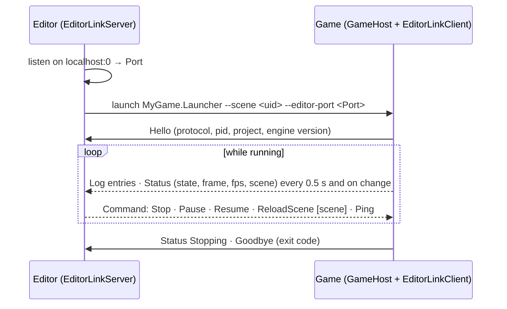

# Projects, GameHost and the editor link

## Purpose

How a game is laid out and run without an `Engine` subclass, and the engine-side pieces the editor builds its
project workflow on (M10 E4): the project file, `GameHost`, input actions, log routing, the editor link used by
out-of-process play, collectible loading of game assemblies for code reload, and the `mfgame` template. The editor UI
that drives them lives in `MainframeEngine.Editor` ([Editor](editor.md#projects)).

Decisions: [project file + GameHost](../../memory/decisions/0090-project-file-and-gamehost.md),
[log sinks](../../memory/decisions/0091-structured-log-sinks.md),
[editor link](../../memory/decisions/0092-editor-link-protocol.md),
[collectible game assemblies](../../memory/decisions/0093-collectible-game-assemblies.md),
[template engine reference](../../memory/decisions/0094-game-template-engine-reference.md).

## Key types

| Type | File | Notes |
|---|---|---|
| `ProjectSettings` (+ `WindowSettings`, `PhysicsProjectSettings`, `AudioProjectSettings`, `LocalizationProjectSettings`, `RenderingProjectSettings`, `AutoloadSettings`) | [Project/ProjectSettings.cs](../../MainframeEngine/Src/Project/ProjectSettings.cs) | the contents of `project.mfproj`; `Load`, `Parse`, `Save`, `ToJson`, `ToEngineOptions` |
| `ProjectSettingsFormat`, `ProjectMigration` | [Project/ProjectSettingsFormat.cs](../../MainframeEngine/Src/Project/ProjectSettingsFormat.cs) | reader/writer, `format` migrations |
| `GameHost : Engine`, `GameHostOptions`, `GameSession` | [Project/](../../MainframeEngine/Src/Project/) | runs a project; command line; the testable session logic |
| `InputMap`, `InputAction`, `InputBinding`, `InputState`, `Input` | [Scene/Input/](../../MainframeEngine/Src/Scene/Input/) | actions; per-tree polled state (`SceneTree.Input`); static facade |
| `Log`, `LogEntry`, `ILogSink`, `ConsoleLogSink`, `FileLogSink`, `MemoryLogSink` | [Debugging/](../../MainframeEngine/Src/Debugging/) | structured log routing |
| `UserDataPaths`, `EngineInfo` | [Core/](../../MainframeEngine/Src/Core/) | per-user folders; engine version |
| `EditorLinkProtocol`, `EditorLinkClient`, `EditorLinkServer`, `EditorLinkLogSink` | [EditorLink/](../../MainframeEngine/Src/EditorLink/) | game ↔ editor channel |
| `GameAssemblyLoader`, `Debouncer`, `DebouncedFileWatcher` | [Project/](../../MainframeEngine/Src/Project/) | code reload support |
| `mfgame` template | [Templates/MainframeEngine.Templates](../../Templates/MainframeEngine.Templates/) | `dotnet new` project template |

## A game project

```text
MyGame/                      ← dotnet new mfgame -n MyGame --engine-path <engine checkout>
├─ project.mfproj            ← ProjectSettings (copied next to the app)
├─ Content/Scenes/Main.mscene
├─ MyGame/MyGame.csproj      ← class library: node/resource types (generator as analyzer)
├─ MyGame.Launcher/          ← exe: return GameHost.Run(args, typeof(MyGame.Spinner).Assembly);
├─ Directory.Build.props     ← TargetFramework, warnings as errors, MainframeEnginePath
├─ MyGame.slnx · global.json · .gitignore · .gitattributes (LFS rules)
```

The launcher copies `project.mfproj` and `Content/**` to its output; engine content and natives come through the
engine project reference, as for the Demo. The editor loads `MyGame.dll` (the library), never the launcher.

## `project.mfproj`

JSON in the [scene-format](scene-serialization.md#file-format) conventions (UTF-8, LF, indented, comments and trailing
commas tolerated). Only values that differ from the defaults are written, except `format`, `name` and
`engineVersion`; whole sections are omitted when default.

```jsonc
{
  "format": 1,
  "name": "Space Game",
  "engineVersion": "0.4.2",                    // the engine the project was created with / upgraded to
  "mainScene": "scn_0123456789ab",             // UID or Content/ path
  "assemblies": ["SpaceGame"],                 // game assemblies (types registered before scenes load)
  "steamAppId": 480,
  "window": { "title": "Space!", "width": 1920, "height": 1080, "vsync": false, "maxFps": 144, "icon": "Content/icon.png" },
  "physics": {
    "ticksPerSecond": 120, "maxStepsPerFrame": 8,
    "3d": { "gravity": [0, -20, 0], "substeps": 2, "solverIterations": 8, "relaxationIterations": 3,
            "allowDeactivation": false, "multiThreaded": false, "deterministic": true },
    "2d": { "gravity": [0, -500], "pixelsPerMeter": 64, "substeps": 8, "allowSleep": false, "continuous": false }
  },
  "input": {
    "jump": { "bindings": ["key:Space", "pad:A"] },
    "move_left": { "deadzone": 0.25, "bindings": ["key:A", "axis:LeftX-"] }
  },
  "audio": { "enabled": true, "busLayout": "Content/Settings/AudioBusLayout.mres", "sampleRate": 44100, "bufferMs": 20 },
  "localization": { "defaultLocale": "es", "sourceLocale": "en", "fallbacks": ["es"], "directory": "Content/locale", "domain": "messages" },
  "rendering": { "exposure": 1.1, "shadows": "Low" },
  "autoloads": [
    { "name": "Music", "scene": "Content/Autoload/Music.mscene" },
    { "name": "Stats", "type": "GameStats", "enabled": false }
  ]
}
```

- **Versioning.** `format` is `ProjectSettingsFormat.Current` (1). Older files run through `ProjectMigration` steps
  (`From` → `From + 1`, each editing the `JsonObject`) before they are read; newer files are rejected ("update the
  engine"). `engineVersion` is advisory: `GameHost` warns when its major/minor differs from `EngineInfo.Version`
  (development builds `0.0.0-*` never warn).
- **Errors** are `InvalidDataException`s naming the file and the setting (`'project.mfproj': window.width must be an
  integer.`); unknown keys log a warning and are ignored.
- **Physics**: `ticksPerSecond` → `EngineOptions.PhysicsTicksPerSecond` (the tree's fixed tick), `3d`/`2d` → the
  `PhysicsSettings3D`/`2D` the engine builds `PhysicsServer3D`/`2D` with (gravity, substeps, solver, sleeping,
  determinism), `maxStepsPerFrame` → `SceneTree.MaxPhysicsStepsPerFrame` at `GameSession.Start`.
- **Audio bus layout**: a reference to the `.mres` resource ([Audio](audio.md#buses)) the `AudioServer` loads; missing
  → the built-in default layout, invalid → the default with an `[ERROR]`.
- **Localization** (`LocalizationProjectSettings.ToOptions()` → `EngineOptions.Localization`, `defaultLocale` →
  `EngineOptions.Locale`): the engine constructor calls `Tr.Configure` with them before any game code runs, so the
  catalog folder, domain, source locale and fallback chain are the project's. `defaultLocale` is used when catalogs
  exist for its chain (itself, its parents or the fallbacks), else the OS language under the same rule, else the source
  locale; `--locale` (the player's choice) overrides it. Fallbacks never apply to the source language itself.
- **Shadows** (`RenderServer.ShadowQuality`, applied in `GameHost.OnLoad` before any visual exists): `Off` runs without
  shadow maps (`ShadowsEnabled = false`); `Low`/`Medium`/`High` apply `ShadowQualitySettings.For(level)` to the shadow
  system — atlas size, PCF filter, cascade limit and per-map resolution limit
  ([shadow quality levels](shadow-system.md#quality-levels)). `High` is the shadow system's defaults.

## GameHost

```csharp
// MyGame.Launcher/Program.cs
return GameHost.Run(args, typeof(MyGame.Spinner).Assembly);
```

`GameHost.Run` parses the command line, loads the project (`--project`, else `project.mfproj` next to the app),
adds a `FileLogSink` (`{user data}/{name}/logs/{name}.log`), loads the game assemblies (the ones passed plus
`ProjectSettings.Assemblies`, by name) and runs a `GameHost`. Exit code: 0, 1 (failed start, e.g. the main scene
does not load), 2 (bad command line).

| Flag | Effect |
|---|---|
| `--project <path>` | project file or folder |
| `--scene <uid\|path>` | start this scene instead of `mainScene` (editor "play current scene") |
| `--editor-port <n>` | connect the editor link to `localhost:n` |
| `--max-frames <n>` · `--fixed-fps <n>` · `--hidden` · `--no-vsync` · `--validation` | headless/CI runs |
| `--no-log-file` | no log file |
| `--locale <name>` | start in this locale (overrides `localization.defaultLocale`) |
| `--screenshot <file.png>` | save the frame `--max-frames` ends on (frame 60 without it) as a PNG |
| `--frame-capture` | allow `SceneTree.CaptureFrame` (a game's own screenshot harness; implied by `--screenshot`) |
| `++ …` | everything after `++` is the game's (`GameHost.UserArgs`, Godot's `OS.get_cmdline_user_args`), never parsed by the host |

Anything else before `++` is left in `GameHostOptions.Remaining` for the game. Nodes ask the host to quit with
`SceneTree.Quit(code)`; `GameHost.Project` is the running project's settings (its `version` for build stamps).

Startup: `ProjectSettings.ToEngineOptions()` (window, VSync, physics settings and tick, audio, localization, Steam) +
the flags → `Engine` constructor (`Tr.Configure`) → `GameSession` (connects the editor link first) → `OnLoad`:
`base.OnLoad()`, frame cap, exposure, shadow quality, then `GameSession.Start`: input map → `Tree.Input.Map`, `MaxStepsPerFrame`,
autoloads (each added as `/root/{Name}`, in order, before the scene; a failing one is logged and skipped), then
`Tree.ChangeSceneToFile(--scene ?? mainScene)`. Each frame `GameSession.Update` applies editor commands and reports
status. `GameHost` can be subclassed (call the bases); subclassing `Engine` directly still works (the editor and render-test host do).

### UI hot reload

Debug engine builds (`UiServerOptions.DefaultHotReload`) hot-reload the game's `.rml`/`.rcss` from the project sources:
`GameHost.Run` hands the launcher's game assemblies to the `GameHost` constructor, and `GameHost.CreateUiOptions` turns
their `[AssemblyMetadata("MainframeContentSource", …)]` folders (`UiServerOptions.SourceDirectoriesOf`) into the UI's
source directories, so saving a document in the project's `Content/` reloads it in the running game. The `mfgame`
template's `MyGame.csproj` records its sibling `Content/` folder under that key in Debug builds only; Release builds and
installed games load from the output folder. An explicit `EngineOptions.Ui` (tests, engine subclasses) is left alone.

## Input actions

`InputMap` holds named actions (`InputAction`: deadzone, bindings). `InputBinding` is a key, a mouse button, a
gamepad button or one direction of a gamepad axis, on any pad or one pad index; its text form is used in the project
file: `key:Space`, `mouse:Left`, `pad:A`, `pad1:Start`, `axis:LeftX-`, `axis:RightTrigger+` (stick Y is SDL's: positive
down).

Every `SceneTree` has an `InputState` (`tree.Input`), fed by `SceneTree.PushInput` **before** the UI and nodes (an
event the UI consumes still updates polled state, so keys never stick). The engine points the static `Input` at its
tree's state:

```csharp
if (Input.IsActionJustPressed("jump")) Jump();
var move = Input.GetVector("move_left", "move_right", "move_up", "move_down"); // length ≤ 1
protected override void OnUnhandledInput(InputEvent e) { if (e.IsActionPressed("pause")) ... }
```

- Strength: 1 for keys/buttons; axes past the deadzone rescale 0..1; an action takes the strongest of its inputs.
- "Just pressed/released" follow Godot: true in the process frame after the change, and in `OnPhysicsProcess` only
  for the first physics step after it.
- `ActionPress`/`ActionRelease` simulate input; `ReleaseAll` clears everything (focus loss). Editing or replacing the
  map rebuilds the action table (held inputs stay pressed, without an edge). Polling and event handling do not
  allocate.

## Log routing

`Log.Debug/Info/Warning/Error/Fatal/Write` build a `LogEntry` — level, UTC time, category (from the `"[Category] "`
prefix, or explicit with `Write`), message, caller member/file/line — and pass it to each `ILogSink` in `Log.Sinks`
(`AddSink`/`RemoveSink`; copy-on-write, no lock). `Log.LogLevel` filters first: a filtered `Log.Debug($"…{x}")`
formats and allocates nothing (per-level interpolated-string handlers, invariant culture). A throwing sink is reported
on stderr and skipped; a sink that logs does not recurse.

| Sink | |
|---|---|
| `ConsoleLogSink` (`Log.ConsoleSink`, default) | `[12:00:00.123] [INFO]	[Audio] message`, call site while `Level.Verbose` is set |
| `FileLogSink` | UTF-8, LF; `Write` only queues — a background thread writes, flushing within 1 s and at once after errors (`Flush()` on demand); a full queue drops entries and logs how many; previous runs kept as `.1.log`, `.2.log`… (`MaxFiles`), rotates at `MaxBytes` (a failed rotation is retried after 30 s); a second process logging to the same folder writes `{name}-{pid}.log` (the owner holds `{name}.log.lock`); I/O failures reported once on stderr; `ForUser(game)` writes to `UserDataPaths.LogDirectory(game)` |
| `MemoryLogSink` | ring of the last N entries; `Snapshot()`, `CopySince(sequence)` for incremental panels; no allocation once full |
| `EditorLinkLogSink` | queues entries on the editor link |

`UserDataPaths`: `%APPDATA%\{game}`, `~/Library/Application Support/{game}`, `$XDG_DATA_HOME/{game}`
(`~/.local/share`); `MAINFRAME_USER_DATA` overrides the base folder.

## Editor link



- **Wire format** (`EditorLinkProtocol`): `u32 length` (type byte + payload, ≤ 1 MiB) · `u8 type` · payload,
  little-endian; strings `u32` byte count + UTF-8 (strict). Oversized log text is truncated to fit. A malformed frame
  closes the connection. `EditorLinkProtocol.Version` is checked from the hello.
- **Game side** (`EditorLinkClient`): a background thread connects (and reconnects with back-off when the editor goes
  away), sends a hello per connection, then drains queued logs (batched up to 64 KB), the latest status and the
  goodbye; a reader thread queues commands, which `GameSession.Update` applies on the game loop. Nothing on the game
  loop blocks: when more than `QueueCapacity` (4096) entries wait, new ones are dropped, counted and reported as
  `LogDropped`.
- **Editor side** (`EditorLinkServer`): several games at once (each message carries a `GameId`; local `Connected`/
  `Disconnected` markers); `TryRead` from the editor's main thread; `SendCommand(command)` to all or
  `SendCommand(gameId, command)`; `Disconnect(gameId?)`. Each game has its own send lock and a 2 s send timeout, so a game that stops reading is dropped without stalling the others. Received logs beyond 100 000 unread messages are dropped and
  counted.
- **Commands in the game**: Stop → `Quit(Ok)`; Pause/Resume → `Tree.Paused`; ReloadScene → re-read cached scenes from
  disk (`ResourceLoader.RefreshCachedScenes`) and `ChangeSceneToFile` the given scene or the current one (autoloads
  stay); Ping → status now.

## Game assemblies and code reload

```csharp
var dll = GameAssemblyLoader.FindBuildOutput("MyGame/MyGame.csproj")!; // newest bin/Debug/<tfm>/MyGame.dll
using var loader = new GameAssemblyLoader(dll);
loader.Load();                    // collectible context; its [Export] types register
// … edit scenes using game types …
// serialize open scenes, free every node of game types, then:
if (!loader.Unload()) Log.Warning("game code still referenced");   // collected (GC-verified) or not
loader.Load();                    // the rebuilt dll; re-instantiate the scenes
```

- The engine and every assembly the host already has are shared with the default context; the game's private
  dependencies load into its context from the build folder (`.deps.json` when present). Files are read into memory,
  so the build can overwrite them.
- `Unload` releases what would pin the context: type and replication registrations (with M9's translatable-property
  metadata, which lives in `NodeTypeInfo`), cached resources of game types and cached scenes' inline tables holding
  them (`ResourceLoader.ReleaseTypesOf`), `Node`'s per-type caches (weak for collectible types), and — for game code
  that forgot to clean up — handlers of game code left on `Tr.LocaleChanged` and on any live `SceneTree`'s events
  (`Tr.ReleaseCodeOf`), and in the game UI (`UiServer.ReleaseCodeOf`): data models still bound to game delegates,
  owners or types are disposed, documents closed since the last UI frame are destroyed (their element listeners) and
  queued RmlUi handles are released. Each forced removal logs a warning naming the handler or model. `Tr`'s catalogs
  and format caches hold only strings. It then unloads and runs the GC until a weak reference to the context dies (default 5 s);
  `LastUnloadedContext` stays alive when something leaked.
- Keep game objects out of long-lived locals of the code that unloads (Debug builds extend temporaries to the end of
  the method): touch them in separate methods.
- While a type is missing, scenes load it as `MissingNode`/`MissingResource` with its data and save it back
  byte-identically; the reloaded assembly restores the real type.
- `DebouncedFileWatcher` (a `FileSystemWatcher` + `Debouncer`) raises one `Changed` batch per burst of file changes —
  for the editor's "rebuild needed" badge (sources) and reload trigger (build output).

## Template

`Templates/MainframeEngine.Templates` is a `dotnet new` template package (not published) with `mfgame`:

```bash
dotnet new install Templates/MainframeEngine.Templates/content/mfgame
dotnet new mfgame -n MyGame --engine-path /path/to/mainframe-engine
dotnet run --project MyGame/MyGame.Launcher
```

| Option | |
|---|---|
| `--engine-path` | engine checkout (absolute, or relative to the new project); project references to `MainframeEngine` + the generator |
| `--engine-source package` | *future*: a `PackageReference` to `MainframeEngine` instead ([distribution](future/distribution-nuget.md)) |
| `--engine-version` | recorded in `project.mfproj` (and the package version) |

A new game's `project.mfproj` spells out the defaults it starts from: a 1280×720 VSync window, 60 Hz physics with
5 steps per frame and Earth gravity, `Content/Settings/AudioBusLayout.mres` (shipped: Master → Music, SFX, UI, Voice),
`en` as the source locale with catalogs in `Content/locale` (the launcher imports `build/Localization.targets` with
`LocaleContentRoot=../Content`, so a `.po` added there is compiled and shipped) and `High` shadows.

`just template-smoke` (`build/template-smoke.sh`) installs the template into a private hive, creates `SmokeGame`
against the checkout, builds it warnings-as-errors and runs it for 30 hidden frames with `--screenshot`, failing on any
`[ERROR]` in its log or a missing screenshot; CI's `template` job does the same on lavapipe and packs the template (`just template-pack`).

## Testing

Unit suites in [Tests/MainframeEngine.Tests/Project](../../Tests/MainframeEngine.Tests/Project/),
[Debugging](../../Tests/MainframeEngine.Tests/Debugging/) and [Scene/InputMapTests.cs](../../Tests/MainframeEngine.Tests/Scene/InputMapTests.cs):

| Suite | Covers |
|---|---|
| `ProjectSettingsTests` | defaults write only the identity, every setting round-trips and re-writes identically, LF, hand edits, unknown keys, every error message, migration chains/gaps, save/load by file or folder, `ToEngineOptions`, version comparison |
| `InputMapTests` | binding text forms, map edits, edges in process and physics, multiple inputs, deadzones/rescale, `GetVector`, per-pad bindings, UI-consumed events, simulation, `ReleaseAll`, live map changes, event helpers, the static facade, 0 B |
| `LogRoutingTests`, `LogSinkTests`, `UserDataPathsTests` | entries, categories, explicit categories, filtering, **0 B when filtered** (and to a memory sink), invariant culture, failing/recursive sinks, console format; memory ring/`CopySince`, file format, run and size rotation; per-OS folders |
| `EditorLinkProtocolTests`, `EditorLinkConnectionTests` | every frame round-trips, back-to-back frames, bad lengths, malformed bodies, truncation; streaming in order, commands, goodbye, reconnect after the editor restarts (queued logs delivered) or drops the link, a stalled editor (never blocks, drops reported exactly), no editor at all, garbage peers, several games by id |
| `GameHostOptionsTests`, `GameSessionTests`, `GameSessionEditorLinkTests` | flags and overrides; autoloads (scene/type/disabled/broken), `--scene`, missing scene, reload from disk, commands; a session against a real `EditorLinkServer` |
| `ProjectServersTests`, `ProjectLocalizationTests` | a project file's gravity moves a body at its tick rate, `maxStepsPerFrame` reaches the tree, the referenced bus layout is the one the audio server mixes with; `defaultLocale` + fallbacks drive `Tr`, `--locale` overrides |
| `GameUnloadLeakTests` | a game type with `[Export(Translatable)]` re-translated on a locale switch, and a game HUD (`UiDocument` data model, data event, element listener, a raw model never disposed) — with forgotten `Tr`/`SceneTree.LocaleChanged` subscriptions — unload and are **collected** with no UI frame in between |
| `GameAssemblyLoaderTests`, `DebouncerTests` | Roslyn-compiled game assemblies: load → tick → save/load scenes with inline game resources → unload → **collected** → rebuild in place → reload with values kept; `MissingNode` round trip while unloaded; leak detection; private dependencies; build-output discovery; debounce and the real watcher |

## Known issues

- Shadow quality cannot switch between `Off` and the other levels after visuals exist (no shadow system to create
  or drop at run time); `Low`/`Medium`/`High` switch at any time.
- The template's sample scene has a fixed UID (unique within each game, the same across games).
- Game-registered `RemovedNodeTypes` upgrades and `Codecs.Register` codecs are not removed on unload.
- The editor link has no authentication (loopback only).

## Related docs

[Editor](editor.md) · [Engine lifecycle](engine-lifecycle.md) · [Cameras & input](cameras-and-input.md) ·
[Scene serialization](scene-serialization.md) · [Distribution via NuGet](future/distribution-nuget.md) ·
[Release](release.md) · [Testing](testing.md)
