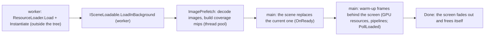
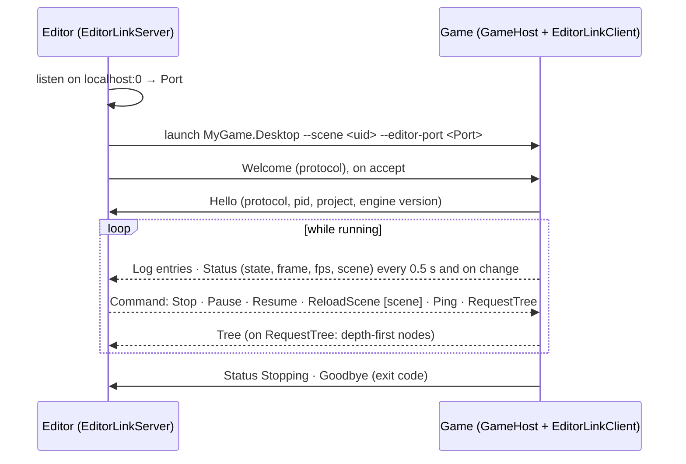

# Projects, GameHost and the editor link

## Purpose

How a game is laid out and run without an `Engine` subclass, and the engine-side pieces the editor builds its
project workflow on (M10 E4): the project file, `GameHost`, input actions, log routing, the editor link used by
out-of-process play, collectible loading of game assemblies for code reload, and the `mfgame` template. The editor UI
that drives them lives in `MainframeEngine.Editor` ([Editor](editor.md#projects)).

Decisions: [project file + GameHost](../../memory/decisions/0090-project-file-and-gamehost.md),
[log sinks](../../memory/decisions/0091-structured-log-sinks.md),
[editor link](../../memory/decisions/0092-editor-link-protocol.md),
[collectible game assemblies](../../memory/decisions/0093-collectible-game-assemblies.md),
[template engine reference](../../memory/decisions/0094-game-template-engine-reference.md).

## Key types

| Type | File | Notes |
|---|---|---|
| `ProjectSettings` (+ `WindowSettings`, `PhysicsProjectSettings`, `AudioProjectSettings`, `LocalizationProjectSettings`, `RenderingProjectSettings`, `AutoloadSettings`) | [Project/ProjectSettings.cs](../../MainframeEngine/Src/Project/ProjectSettings.cs) | the contents of `project.mfproj`; `Load`, `Parse`, `Save`, `ToJson`, `ToEngineOptions` |
| `ProjectSettingsFormat`, `ProjectMigration` | [Project/ProjectSettingsFormat.cs](../../MainframeEngine/Src/Project/ProjectSettingsFormat.cs) | reader/writer, `format` migrations |
| `GameHost : Engine`, `GameHostOptions`, `GameSession` | [Project/](../../MainframeEngine/Src/Project/) | runs a project; command line; the testable session logic |
| `InputMap`, `InputAction`, `InputBinding`, `InputState`, `Input` | [Scene/Input/](../../MainframeEngine/Src/Scene/Input/) | actions; per-tree polled state (`SceneTree.Input`); static facade |
| `Log`, `LogEntry`, `ILogSink`, `ConsoleLogSink`, `FileLogSink`, `MemoryLogSink` | [Debugging/](../../MainframeEngine/Src/Debugging/) | structured log routing |
| `UserDataPaths`, `EngineInfo` | [Core/](../../MainframeEngine/Src/Core/) | per-user folders; engine version |
| `EditorLinkProtocol`, `EditorLinkClient`, `EditorLinkServer`, `EditorLinkLogSink` | [EditorLink/](../../MainframeEngine/Src/EditorLink/) | game ↔ editor channel |
| `GameAssemblyLoader`, `Debouncer`, `DebouncedFileWatcher` | [Project/](../../MainframeEngine/Src/Project/) | code reload support |
| `mfgame` template | [Templates/MainframeEngine.Templates](../../Templates/MainframeEngine.Templates/) | `dotnet new` project template |

## A game project

```text
MyGame/                      ← dotnet new mfgame -n MyGame --engine-path <engine checkout>
├─ project.mfproj            ← ProjectSettings (copied next to the app)
├─ Content/Scenes/Main.mscene
├─ MyGame/MyGame.csproj      ← class library: node/resource types (generator as analyzer)
├─ MyGame.Desktop/           ← exe: return GameHost.Run(args, typeof(MyGame.Spinner).Assembly);
├─ Directory.Build.props     ← TargetFramework, warnings as errors, MainframeEnginePath
├─ MyGame.slnx · global.json · .gitignore · .gitattributes (LFS rules)
```

`MyGame.Desktop` is the game's desktop *head*: the executable for Windows, macOS and Linux. The planned mobile heads
(`MyGame.Android`, `MyGame.iOS` — [mobile](future/mobile.md)) sit next to it over the same library. The desktop project
copies `project.mfproj` and `Content/**` to its output; engine content and natives come through the engine project
reference, as for the Demo. The editor loads `MyGame.dll` (the library), never a head; Play builds and runs the desktop
project (`GameProjectLayout.DesktopProjectOf`). Projects made before the rename have `MyGame.Launcher`, which the editor
still finds when there is no `*.Desktop` project.

## `project.mfproj`

JSON in the [scene-format](scene-serialization.md#file-format) conventions (UTF-8, LF, indented, comments and trailing
commas tolerated). Only values that differ from the defaults are written, except `format`, `name` and
`engineVersion`; whole sections are omitted when default.

```jsonc
{
  "format": 3,
  "name": "Space Game",
  "engineVersion": "0.4.2",                    // the engine the project was created with / upgraded to
  "mainScene": "scn_0123456789ab",             // UID or Content/ path
  "assemblies": ["SpaceGame"],                 // game assemblies (types registered before scenes load)
  "isDemo": true,                              // this build is the game's Steam demo (see Demo builds)
  "steam": { "appId": 480, "demoAppId": 481, "devAppIdFile": true, "restartThroughSteam": true },
  "window": { "title": "Space!", "width": 1920, "height": 1080, "vsync": false, "maxFps": 144, "icon": "Content/icon.png" },
  "physics": {
    "ticksPerSecond": 120, "maxStepsPerFrame": 8,
    "3d": { "gravity": [0, -20, 0], "substeps": 2, "solverIterations": 8, "relaxationIterations": 3,
            "allowDeactivation": false, "multiThreaded": false, "deterministic": true },
    "2d": { "gravity": [0, -500], "pixelsPerMeter": 64, "substeps": 8, "allowSleep": false, "continuous": false }
  },
  "input": {
    "jump": { "bindings": ["key:Space", "pad:A"] },
    "move_left": { "deadzone": 0.25, "bindings": ["key:A", "axis:LeftX-"] }
  },
  "audio": { "enabled": true, "busLayout": "Content/Settings/AudioBusLayout.mres", "sampleRate": 44100, "bufferMs": 20 },
  "localization": { "defaultLocale": "es", "sourceLocale": "en", "fallbacks": ["es"], "directory": "Content/locale", "domain": "messages" },
  "rendering": { "exposure": 1.1, "shadows": "Low" },
  "ui": { "scaleMode": "ScaleWithScreenSize", "referenceResolution": [1920, 1080], "matchWidthOrHeight": 1, "minScale": 0.5 },
  "loading": { "async": true, "screen": "Content/UI/loading.rml" }, // ADR 0183: the start scene loads behind a loading screen
  "autoloads": [
    { "name": "Music", "scene": "Content/Autoload/Music.mscene" },
    { "name": "Stats", "type": "GameStats", "enabled": false }
  ]
}
```

- **Versioning.** `format` is `ProjectSettingsFormat.Current` (3; format 1 had a top-level `steamAppId`, which the
  1 → 2 migration moves to `steam.appId`; the 2 → 3 migration writes `ui.scaleMode: "ConstantPixelSize"` into projects
  that have none, so their UI keeps its size). Older files run through `ProjectMigration` steps
  (`From` → `From + 1`, each editing the `JsonObject`) before they are read; newer files are rejected ("update the
  engine"). `engineVersion` is advisory: `GameHost` warns when its major/minor differs from `EngineInfo.Version`
  (development builds `0.0.0-*` never warn).
- **Rendering**: `exposure` → `IVulkanContext.Exposure`, `shadows` → `RenderServer.ShadowQuality`, `antiAliasing`
  (`None` default, `Fxaa` or `Taa`; ADR 0154, ADR 0166) → `IVulkanContext.AntiAliasing`, `taaSharpness` (0–1, default
  0.25, written only when it differs; the sharpen after TAA) → `IVulkanContext.TaaSharpness`, `waterSsr` (`Off`,
  `Low` default, `High`: refracting water's screen-space reflections, ADR 0173) → `RenderServer.WaterSsr`, and ADR 0174's
  render scaling under Godot's names: `scaling3DMode` (`Bilinear` default, `Fsr`, `Taau`) → `IVulkanContext.Scaling3DMode`,
  `scaling3DScale` (0.25–1, default 1: native) → `IVulkanContext.Scaling3DScale`, `fsrSharpness` (0–2 stops, default 0.2)
  → `IVulkanContext.FsrSharpness` (optional keys: no migration; [Post-processing → Render and output resolution](post-processing.md#render-and-output-resolution)), all applied
  by `GameHost.OnLoad`. The editor's Project Settings show them under Rendering.
- **UI** (`UiProjectSettings`, ADR 0181; [Game UI → Scaling](game-ui.md#scaling)): how every game UI follows the window
  — each `UiLayer` in its default `UiScaleMode.Project`, the developer overlay (F12) and the RmlUi debugger. `scaleMode`
  is `ScaleWithScreenSize` (the default for new projects: the UI is authored for `referenceResolution`, default
  `[1920, 1080]` pixels, and 1 dp = framebuffer ÷ reference, so 2560×1440 draws it at 1.333 and 4K at 2) or
  `ConstantPixelSize` (1 dp = the content scale, the engine's behaviour before format 3). `matchWidthOrHeight` (0 =
  width, 1 = height, default 1; between: a log-space blend, Unity's formula), `minScale`/`maxScale` (0 = no limit) clamp
  the result. `ToScaling()` → `UiServerOptions.Scaling` (`GameHost.CreateUiOptions`); change it at run time with
  `UiServer.Scaling`. The editor's Project Settings show it under UI.
- **Loading** (`LoadingProjectSettings`, ADR 0183; [Async loading](#async-loading-and-the-loading-screen-adr-0183)): `async`
  (default true) makes `GameHost` load the start scene on a worker thread behind a loading screen; `screen` is the
  screen's document (`.rml` binding the `loading` data model), null (default) the engine's
  (`LoadingScreen.DefaultSource`), `""` none. Optional keys, no migration.
- **Errors** are `InvalidDataException`s naming the file and the setting (`'project.mfproj': window.width must be an
  integer.`); unknown keys log a warning and are ignored.
- **Physics**: `ticksPerSecond` → `EngineOptions.PhysicsTicksPerSecond` (the tree's fixed tick), `3d`/`2d` → the
  `PhysicsSettings3D`/`2D` the engine builds `PhysicsServer3D`/`2D` with (gravity, substeps, solver, sleeping,
  determinism), `maxStepsPerFrame` → `SceneTree.MaxPhysicsStepsPerFrame` at `GameSession.Start`.
- **Audio bus layout**: a reference to the `.mres` resource ([Audio](audio.md#buses)) the `AudioServer` loads; missing
  → the built-in default layout, invalid → the default with an `[ERROR]`.
- **Localization** (`LocalizationProjectSettings.ToOptions()` → `EngineOptions.Localization`, `defaultLocale` →
  `EngineOptions.Locale`): the engine constructor calls `Tr.Configure` with them before any game code runs, so the
  catalog folder, domain, source locale and fallback chain are the project's. `defaultLocale` is used when catalogs
  exist for its chain (itself, its parents or the fallbacks), else the OS language under the same rule, else the source
  locale; `--locale` (the player's choice) overrides it. Fallbacks never apply to the source language itself.
- **Shadows** (`RenderServer.ShadowQuality`, applied in `GameHost.OnLoad` before any visual exists): `Off` runs without
  shadow maps (`ShadowsEnabled = false`); `Low`/`Medium`/`High` apply `ShadowQualitySettings.For(level)` to the shadow
  system — atlas size, PCF filter, cascade limit and per-map resolution limit
  ([shadow quality levels](shadow-system.md#quality-levels)). `High` is the shadow system's defaults.
- **Steam** (`SteamProjectSettings`, the editor's Steamworks section; [Steamworks](steamworks.md#project-settings)):
  `appId` (full game) and `demoAppId` (the demo's own Steam app). `ProjectSettings.SteamAppId` is the one this build
  uses — `demoAppId` when `isDemo`, else `appId`; 0 leaves Steam off — and becomes `EngineOptions.SteamAppId`.
  `devAppIdFile` (default true) lets development runs start Steam without being launched by it; `restartThroughSteam`
  (default false) makes shipped builds started outside Steam relaunch through it.

### App name and icon (ADR 0182)

`name` is the game's player-facing name and `window.icon` (a PNG, `Content/…`) its icon, everywhere:

- **Run time.** The window title when `window.title` is unset, the user data folder (`GameHost.UserDataDirectory`), and
  `window.icon` → `EngineOptions.IconPath` (the SDL window/taskbar icon on Windows and Linux; on macOS the Dock icon of
  an unbundled run — a bundled one keeps its `.icns`, see [Release → Game executables](release.md#game-executables-adr-0182)).
- **Build time.** [`build/MainframeGame.props`](../../build/MainframeGame.props) reads `name`, `window.icon` and
  `version` (the first such strings in the file; JSON escapes are not decoded) into `MainframeAppName`,
  `MacAppDisplayName`, `MacAppIcon` and `MacAppVersion`: the macOS development bundle `bin/<cfg>/net10.0/<name>.app`,
  `Product` and the executable's `AssemblyTitle` (Windows file description). Desktop projects override them (an `.icns`
  on Apple's icon grid in `MacAppIcon`, an `.ico` in `ApplicationIcon`).
- **Packaging.** `build/package-game.sh` names the `.app` and the executable from `name` and takes the icon from
  `window.icon` ([Release → Games](release.md#games)).

Renaming a game moves its user data folder (settings, saves, logs) with it. No new keys: the editor's Project Settings
already edit `name` and `window.icon`.

### Demo builds

`isDemo` (Application › Demo Build) marks the game's **Steam demo** build, as opposed to the full game:

- **Compile time.** Every project of the game imports the engine's
  [`build/MainframeGame.props`](../../build/MainframeGame.props) (the template's `Directory.Build.props` does, as does
  `Examples/Demo`'s). It reads
  `isDemo` from the nearest `project.mfproj` and, when true, adds `DEMO` to `DefineConstants`, so game code separates
  the builds with `#if DEMO` / `#if !DEMO` (cut content, a "buy the full game" screen). A build overrides the file with
  `-p:MainframeDemo=true|false`: `dotnet publish MyGame.Desktop -c Release -p:MainframeDemo=true` makes the demo from
  the same checkout as the full game.
- **Run time.** The props also stamp every game assembly with `[AssemblyMetadata("MainframeDemo", "true|false")]`.
  `GameHost.Run` sets `ProjectSettings.IsDemo` from it (`GameHost.BuiltAsDemo`; the entry assembly first), so the
  running game agrees with how it was compiled even when `-p:MainframeDemo` differs from the copied project file.
  `GameHost.IsDemo` is the runtime check; Steam starts with the demo app id; the log says `Demo build (Steam app N)`.
- The editor builds and loads the game with the project's `isDemo`; save the setting and Play (or Build & Reload) to
  switch. Projects created before `MainframeGame.props` add the import to their `Directory.Build.props` by hand.

## GameHost

```csharp
// MyGame.Desktop/Program.cs
return GameHost.Run(args, typeof(MyGame.Spinner).Assembly);
```

`GameHost.Run` parses the command line, loads the project (`--project`, else `project.mfproj` next to the app),
adds a `FileLogSink` (`{user data}/{name}/logs/{name}.log`), loads the game assemblies (the ones passed plus
`ProjectSettings.Assemblies`, by name) and runs a `GameHost`. Exit code: 0, 1 (failed start, e.g. the main scene
does not load), 2 (bad command line).

| Flag | Effect |
|---|---|
| `--project <path>` | project file or folder |
| `--scene <uid\|path>` | start this scene instead of `mainScene` (editor "play current scene") |
| `--editor-port <n>` | connect the editor link to `localhost:n` |
| `--headless` | no window, renderer or audio device: a dedicated server (`HeadlessHost`, below) |
| `--max-frames <n>` · `--fixed-fps <n>` · `--hidden` · `--no-vsync` · `--validation` | headless/CI runs |
| `--no-log-file` | no log file |
| `--locale <name>` | start in this locale (overrides `localization.defaultLocale`) |
| `--screenshot <file.png>` | save the frame `--max-frames` ends on (frame 60 without it) as a PNG |
| `--frame-capture` | allow `SceneTree.CaptureFrame` (a game's own screenshot harness; implied by `--screenshot`) |
| `--dev-overlay` | start with the developer overlay (F12) shown (QA captures) |
| `--sync-load` | load the start scene synchronously, without the loading screen (as `loading.async: false`; before/after timings) |
| `--loading-hold <s>` | keep the loading screen up at least this long before the scene enters (QA of its look) |
| `--loading-screenshot <file.png>` | save the loading screen's first frame at or past half progress (QA) |
| `++ …` | everything after `++` is the game's (`GameHost.UserArgs`, Godot's `OS.get_cmdline_user_args`), never parsed by the host |

Anything else before `++` is left in `GameHostOptions.Remaining` for the game. `GameHost.IsDebugBuild` is true when the
game's first assembly was compiled in Debug (developer keys), `GameHost.IsHeadless` under `--headless`. Nodes ask the host to quit with
`SceneTree.Quit(code)`; `GameHost.Project` is the running project's settings (its `version` for build stamps).

Startup: `ProjectSettings.ToEngineOptions()` (window, VSync, physics settings and tick, audio, localization, Steam) +
the flags + `CreateUiOptions` (the UI scale, hot-reload folders) → `Engine` constructor (`Tr.Configure`) → `GameSession` (connects the editor link first) → `OnLoad`:
`base.OnLoad()`, frame cap, exposure, shadow quality; then, on the **first update** (the window is up: SDL shows it
after `OnLoad`, ~0.3 s on macOS, and Godot readies its scene with the window already there) and with that update's
delta discarded (`Engine.DiscardFrameDelta`, so start-up time never reaches the game; with `--fixed-fps` the frame keeps the fixed delta like every other, as Godot's first frame does: ADR 0135), `GameSession.Start`: input map → `Tree.Input.Map`, `MaxStepsPerFrame`,
autoloads (each added as `/root/{Name}`, in order, before the scene; a failing one is logged and skipped), then
`Tree.ChangeSceneToFile(--scene ?? mainScene)` — or, by default, `GameSession.StartAsync` (below). Each frame
`GameSession.Update` applies editor commands and reports status. `GameHost` can be subclassed (call the bases); subclassing `Engine` directly still works (the editor and render-test host do).

### Async loading and the loading screen (ADR 0183)

The start scene loads asynchronously by default, so the window shows a loading screen from its first frame instead of
staying black and unresponsive (macOS's beachball) until the scene is ready. On the first update `GameHost` calls
`GameSession.StartAsync` (input map and autoloads at once, then `SceneTree.ChangeSceneToFileAsync`) and adds a
`LoadingScreen` (`loading.screen`, else the engine's branded one) over everything:



Meanwhile the main loop runs normally (window events, audio, the screen's RCSS animations); only the warm-up frames,
where the new scene creates its GPU resources behind the screen, are long. `SceneLoad` reports `Stage`, `Progress`
(weighted stages, monotonic) and `StageText`; see [Scene serialization → Asynchronous loading](scene-serialization.md#asynchronous-loading-adr-0183)
for the API and [Game UI → Loading screen](game-ui.md#loading-screen-adr-0183) for the document.

- **Frames count once the game is on screen.** `SceneTree.IsLoading` is true while a load runs or a loading screen is
  shown (fading out included); the engine decides per frame, when its update begins, and frames that were loading do
  not count for `--max-frames` (`Engine.LoadedFrameCount`), `--screenshot` or `--bake-lighting`'s update. So captures
  and timings start after the fade: with `--fixed-fps` a capture lands warm-up + fade frames (~30) later in scene time
  than with `--sync-load`.
- **A failed load** logs `[Project] Could not start scene …` and quits with exit code 1, like the synchronous start.
- **Start-up times** are logged: `[GameHost] First frame presented N ms after the process started` and `Start scene on
  screen N ms … (loaded asynchronously in S s)`. The Forest on an M5 (cached bakes, 1920×1080): the first frame at
  ~1.3 s (was ~10.3 s: the window stayed black through the valley build and the first frame's uploads) and the game
  playable at ~9.4 s (was ~12.8 s); the image prefetch removed ~4.5 s of main-thread decoding and mip building.
- `--headless` (no UI) and the editor's Reload Scene keep loading synchronously; `--sync-load` or `loading.async: false`
  restore the old start.

### Headless (`--headless`, ADR 0120)

`GameHost.Run` with `--headless` runs a `HeadlessHost` instead of a `GameHost` (no `Engine`: no SDL window, Vulkan,
canvas, UI or dev overlay): its own `SceneTree` with `MultiplayerApi`, both physics servers and, when the project has
audio, an `AudioServer` on the null device (buses and players work, nothing is heard). It runs the same
`GameSession` (input map, autoloads, `--scene`/`mainScene`) and loops at `window.maxFps`, else the physics rate:
`GameSession.Update`, `Tree.Tick`, then the queued canvas draws (Godot runs `_draw` headless too). `--fixed-fps`
and `--max-frames` apply. Ctrl+C / SIGTERM raise `SceneTree.CloseRequested` (the game's chance to save), then quit.
`GameHost.IsHeadless` tells game code (Godot's `DisplayServer.get_name() == "headless"`). `UiLayer`s warn and load
nothing; `UiDocument.CreateDataModel` throws, so UI nodes check `IsHeadless` first.

### UI hot reload

Debug engine builds (`UiServerOptions.DefaultHotReload`) hot-reload the game's `.rml`/`.rcss` from the project sources:
`GameHost.Run` hands the desktop project's game assemblies to the `GameHost` constructor, and `GameHost.CreateUiOptions` turns
their `[AssemblyMetadata("MainframeContentSource", …)]` folders (`UiServerOptions.SourceDirectoriesOf`) into the UI's
source directories, so saving a document in the project's `Content/` reloads it in the running game. The `mfgame`
template's `MyGame.csproj` records its sibling `Content/` folder under that key in Debug builds only; Release builds and
installed games load from the output folder. An explicit `EngineOptions.Ui` (tests, engine subclasses) is left alone.

## Input actions

`InputMap` holds named actions (`InputAction`: deadzone, bindings). `InputBinding` is a key, a mouse button, a
gamepad button or one direction of a gamepad axis, on any pad or one pad index; its text form is used in the project
file: `key:Space`, `mouse:Left`, `pad:A`, `pad1:Start`, `axis:LeftX-`, `axis:RightTrigger+` (stick Y is SDL's: positive
down).

Every `SceneTree` has an `InputState` (`tree.Input`), fed by `SceneTree.PushInput` **before** the UI and nodes (an
event the UI consumes still updates polled state, so keys never stick). The engine points the static `Input` at its
tree's state:

```csharp
if (Input.IsActionJustPressed("jump")) Jump();
var move = Input.GetVector("move_left", "move_right", "move_up", "move_down"); // length ≤ 1
protected override void OnUnhandledInput(InputEvent e) { if (e.IsActionPressed("pause")) ... }
```

- Strength: 1 for keys/buttons; axes past the deadzone rescale 0..1; an action takes the strongest of its inputs.
- "Just pressed/released" follow Godot 4: true in the process frame after the change, and in `OnPhysicsProcess` only
  for the first physics step after it; a change made during a physics step (`ActionPress` from `OnPhysicsProcess`)
  counts from the next step, and a tap released again before that step still reads as just pressed
  ([ADR 0129](../../memory/decisions/0129-godot-just-pressed-timing.md)).
- `ActionPress`/`ActionRelease` simulate input; `ReleaseAll` clears everything (focus loss). Editing or replacing the
  map rebuilds the action table (held inputs stay pressed, without an edge). Polling and event handling do not
  allocate.

## Log routing

`Log.Debug/Info/Warning/Error/Fatal/Write` build a `LogEntry` — level, UTC time, category (from the `"[Category] "`
prefix, or explicit with `Write`), message, caller member/file/line, and its **source** (`LogEntry.Source`: `engine` for
call sites in the engine checkout's `MainframeEngine*` projects, `game` for everything else, from the caller file;
[ADR 0141](../../memory/decisions/0141-log-source-tag.md)) — and pass it to each `ILogSink` in `Log.Sinks`
(`AddSink`/`RemoveSink`; copy-on-write, no lock). `Log.LogLevel` filters first: a filtered `Log.Debug($"…{x}")`
formats and allocates nothing (per-level interpolated-string handlers, invariant culture). A throwing sink is reported
on stderr and skipped; a sink that logs does not recurse.

| Sink | |
|---|---|
| `ConsoleLogSink` (`Log.ConsoleSink`, default) | `[12:00:00.123] [INFO] engine Audio: message` / `[12:00:00.130] [INFO] game Net: message` (`game message` without a category), call site while `Level.Verbose` is set |
| `FileLogSink` | UTF-8, LF; `Write` only queues — a background thread writes, flushing within 1 s and at once after errors (`Flush()` on demand); a full queue drops entries and logs how many; previous runs kept as `.1.log`, `.2.log`… (`MaxFiles`), rotates at `MaxBytes` (a failed rotation is retried after 30 s); a second process logging to the same folder writes `{name}-{pid}.log` (the owner holds `{name}.log.lock`); I/O failures reported once on stderr; `ForUser(game)` writes to `UserDataPaths.LogDirectory(game)` |
| `MemoryLogSink` | ring of the last N entries; `Snapshot()`, `CopySince(sequence)` for incremental panels; no allocation once full |
| `EditorLinkLogSink` | queues entries on the editor link |

`UserDataPaths`: `%APPDATA%\{game}`, `~/Library/Application Support/{game}`, `$XDG_DATA_HOME/{game}`
(`~/.local/share`); `MAINFRAME_USER_DATA` overrides the base folder. `GameHost.UserDataDirectory` is the running game's
folder (created on use; saves and settings go there, next to `logs/`), `GameHost.UserDataPath("saves/run-1.json")` a
path inside it. File log lines read like the console's (`2026-10-05T12:00:00.123Z [INFO] game Net: …`).

## Editor link



- **Wire format** (`EditorLinkProtocol`): `u32 length` (type byte + payload, ≤ 1 MiB) · `u8 type` · payload,
  little-endian; strings `u32` byte count + UTF-8 (strict). Oversized log text is truncated to fit. A malformed frame
  closes the connection. `EditorLinkProtocol.Version` is checked from the hello (version 3 added the welcome).
- **Game side** (`EditorLinkClient`): a background thread connects (and reconnects with back-off when the editor goes
  away), sends a hello per connection and waits for the editor's welcome; only then does the connection count
  (`IsConnected`, `ConnectionCount`) and drain queued logs (batched up to 64 KB), the latest status and the goodbye.
  A connection with no welcome within `WelcomeTimeoutMilliseconds` (2 s) is closed and retried with the back-off,
  with the logs still queued. A reader thread queues commands, which `GameSession.Update` applies on the game loop.
  Nothing on the game loop blocks: when more than `QueueCapacity` (4096) entries wait, new ones are dropped, counted and reported as
  `LogDropped`.
- **Editor side** (`EditorLinkServer`): an async accept loop (cancelled on `Dispose`) writes the welcome to each new
  connection before listing it; several games at once (each message carries a `GameId`; local `Connected`/
  `Disconnected` markers); `TryRead` from the editor's main thread; `SendCommand(command)` to all or
  `SendCommand(gameId, command)`; `Disconnect(gameId?)`. Each game has its own send lock and a 2 s send timeout, so a game that stops reading is dropped without stalling the others. Received logs beyond 100 000 unread messages are dropped and
  counted.
- **Commands in the game**: Stop → `Quit(Ok)`; Pause/Resume → `Tree.Paused`; ReloadScene → re-read cached scenes from
  disk (`ResourceLoader.RefreshCachedScenes`) and `ChangeSceneToFile` the given scene or the current one (autoloads
  stay); Ping → status now; RequestTree → `GameSession.SnapshotTree(Tree.Root)` sent as a `Tree` message (protocol
  version 2, [0133](../../memory/decisions/0133-remote-scene-tree.md)): `u8 truncated, i32 count`, then per node `i32 depth,
  str name, str type` depth-first from the root (depth 0); at most `MaxTreeNodes` (3000) nodes and names/types cut to 48
  characters, so the worst case fits a frame. The latest snapshot waits next to the status (a newer one replaces it).
- **Sockets inherited by child processes.** macOS has no `SOCK_CLOEXEC`/`accept4`: .NET calls `socket()`/`accept()`
  and then sets `FD_CLOEXEC` separately, and `Process.Start` forks, so a child started in between (the editor runs
  `dotnet build`, whose build servers outlive it, and games) holds the socket for its whole life. Two consequences
  are handled:
  - A listener the editor closed keeps completing handshakes into its backlog while such a child lives. Nobody reads
    them, so a game that counted the handshake as a connection would write its logs into the void. Hence the welcome.
  - .NET unblocks a blocking call before closing a socket only when the descriptor has `FD_CLOEXEC` (one without may
    be shared). A blocking accept on a descriptor without it makes `TcpListener.Stop()` spin forever. The async
    accept is cancelled instead. A fork-race leak sets the flag on the editor's copy, so this only guards
    descriptors that something made inheritable.

## Game assemblies and code reload

```csharp
var dll = GameAssemblyLoader.FindBuildOutput("MyGame/MyGame.csproj")!; // newest bin/Debug/<tfm>/MyGame.dll
using var loader = new GameAssemblyLoader(dll);
loader.Load();                    // collectible context; its [Export] types register
// … edit scenes using game types …
// serialize open scenes, free every node of game types, then:
if (!loader.Unload()) Log.Warning("game code still referenced");   // collected (GC-verified) or not
loader.Load();                    // the rebuilt dll; re-instantiate the scenes
```

- The engine and every assembly the host already has are shared with the default context; the game's private
  dependencies load into its context from the build folder (`.deps.json` when present). Files are read into memory,
  so the build can overwrite them.
- `Unload` releases what would pin the context: type and replication registrations (with M9's translatable-property
  metadata, which lives in `NodeTypeInfo`), cached resources of game types and cached scenes' inline tables holding
  them (`ResourceLoader.ReleaseTypesOf`), `Node`'s per-type caches (weak for collectible types), and — for game code
  that forgot to clean up — handlers of game code left on `Tr.LocaleChanged` and on any live `SceneTree`'s events
  (`Tr.ReleaseCodeOf`), and in the game UI (`UiServer.ReleaseCodeOf`): data models still bound to game delegates,
  owners or types are disposed, documents closed since the last UI frame are destroyed (their element listeners) and
  queued RmlUi handles are released. Each forced removal logs a warning naming the handler or model. `Tr`'s catalogs
  and format caches hold only strings. It then unloads and runs the GC until a weak reference to the context dies (default 5 s);
  `LastUnloadedContext` stays alive when something leaked.
- Keep game objects out of long-lived locals of the code that unloads (Debug builds extend temporaries to the end of
  the method): touch them in separate methods.
- While a type is missing, scenes load it as `MissingNode`/`MissingResource` with its data and save it back
  byte-identically; the reloaded assembly restores the real type.
- `DebouncedFileWatcher` (a `FileSystemWatcher` + `Debouncer`) raises one `Changed` batch per burst of file changes —
  for the editor's "rebuild needed" badge (sources) and reload trigger (build output).

## Template

`Templates/MainframeEngine.Templates` is a `dotnet new` template package (not published) with `mfgame`:

```bash
dotnet new install Templates/MainframeEngine.Templates/content/mfgame
dotnet new mfgame -n MyGame --engine-path /path/to/mainframe-engine
dotnet run --project MyGame/MyGame.Desktop
```

| Option | |
|---|---|
| `--engine-path` | engine checkout (absolute, or relative to the new project); project references to `MainframeEngine` + the generator |
| `--engine-source package` | *future*: a `PackageReference` to `MainframeEngine` instead ([distribution](future/distribution-nuget.md)) |
| `--engine-version` | recorded in `project.mfproj` (and the package version) |

A new game's `project.mfproj` spells out the defaults it starts from: a 1280×720 VSync window, 60 Hz physics with
5 steps per frame and Earth gravity, `Content/Settings/AudioBusLayout.mres` (shipped: Master → Music, SFX, UI, Voice),
`en` as the source locale with catalogs in `Content/locale` (the desktop project imports `build/Localization.targets` with
`LocaleContentRoot=../Content`, so a `.po` added there is compiled and shipped) and `High` shadows.

`just template-smoke` (`build/template-smoke.sh`) installs the template into a private hive, creates `SmokeGame`
against the checkout, builds it warnings-as-errors and runs it for 30 hidden frames with `--screenshot`, failing on any
`[ERROR]` in its log or a missing screenshot; CI's `template` job does the same on lavapipe and packs the template (`just template-pack`).

## Testing

Unit suites in [Tests/MainframeEngine.Tests/Project](../../Tests/MainframeEngine.Tests/Project/),
[Debugging](../../Tests/MainframeEngine.Tests/Debugging/) and [Scene/InputMapTests.cs](../../Tests/MainframeEngine.Tests/Scene/InputMapTests.cs):

| Suite | Covers |
|---|---|
| `ProjectSettingsTests` | defaults write only the identity, every setting round-trips and re-writes identically, LF, hand edits, unknown keys, every error message, migration chains/gaps, save/load by file or folder, `ToEngineOptions`, version comparison |
| `InputMapTests` | binding text forms, map edits, edges in process and physics, multiple inputs, deadzones/rescale, `GetVector`, per-pad bindings, UI-consumed events, simulation, `ReleaseAll`, live map changes, event helpers, the static facade, 0 B |
| `LogRoutingTests`, `LogSinkTests`, `UserDataPathsTests` | entries, categories, explicit categories, filtering, **0 B when filtered** (and to a memory sink), invariant culture, failing/recursive sinks, console format; memory ring/`CopySince`, file format, run and size rotation; per-OS folders |
| `EditorLinkProtocolTests`, `EditorLinkConnectionTests` | every frame round-trips, back-to-back frames, bad lengths, malformed bodies, truncation; streaming in order, commands, goodbye, reconnect after the editor restarts (queued logs delivered) or drops the link, logs held until the welcome (an unanswered connection is retried), a stalled editor (never blocks, drops reported exactly), no editor at all, garbage peers, several games by id |
| `EditorLinkInheritedSocketTests` (macOS/Linux) | a child process holding the listener: `Dispose` returns when the editor's descriptor is inheritable; a closed listener only a child holds gets no logs and no connection count, and the logs reach the next editor once |
| `GameHostOptionsTests`, `GameSessionTests`, `GameSessionEditorLinkTests` | flags and overrides (the loading flags); autoloads (scene/type/disabled/broken), `--scene`, missing scene, `StartAsync` (autoloads at once, the scene once loaded, a missing scene fails the load), reload from disk, commands; a session against a real `EditorLinkServer` |
| `SceneLoadTests`, `LoadingScreenTests`, `ImagePrefetchTests` (ADR 0183) | see [Scene serialization → Asynchronous loading](scene-serialization.md#asynchronous-loading-adr-0183); the `loading-screen` render golden (moltenvk, lavapipe) |
| `ProjectServersTests`, `ProjectLocalizationTests` | a project file's gravity moves a body at its tick rate, `maxStepsPerFrame` reaches the tree, the referenced bus layout is the one the audio server mixes with; `defaultLocale` + fallbacks drive `Tr`, `--locale` overrides |
| `GameUnloadLeakTests` | a game type with `[Export(Translatable)]` re-translated on a locale switch, and a game HUD (`UiDocument` data model, data event, element listener, a raw model never disposed) — with forgotten `Tr`/`SceneTree.LocaleChanged` subscriptions — unload and are **collected** with no UI frame in between |
| `GameAssemblyLoaderTests`, `DebouncerTests` | Roslyn-compiled game assemblies: load → tick → save/load scenes with inline game resources → unload → **collected** → rebuild in place → reload with values kept; `MissingNode` round trip while unloaded; leak detection; private dependencies; build-output discovery; debounce and the real watcher |

## Known issues

- Shadow quality cannot switch between `Off` and the other levels after visuals exist (no shadow system to create
  or drop at run time); `Low`/`Medium`/`High` switch at any time.
- The template's sample scene has a fixed UID (unique within each game, the same across games).
- Game-registered `RemovedNodeTypes` upgrades and `Codecs.Register` codecs are not removed on unload.
- The editor link has no authentication (loopback only).

## Related docs

[Editor](editor.md) · [Engine lifecycle](engine-lifecycle.md) · [Cameras & input](cameras-and-input.md) ·
[Scene serialization](scene-serialization.md) · [Distribution via NuGet](future/distribution-nuget.md) ·
[Release](release.md) · [Testing](testing.md)
