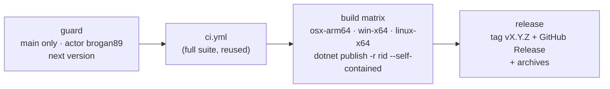

# Release & versioning

How the editor is versioned, built and released. Engine packages for games are a separate, planned
step: see [Future: distribution via NuGet](future/distribution-nuget.md).

## Branch rules

`main` is protected by the `main-protection` repository ruleset (no bypass actors, admins included):

- changes land only through pull requests; **squash** or **rebase** merges (merge commits are disabled);
- the `ci-success` check ([`ci.yml`](../../.github/workflows/ci.yml)) must pass, on a branch that is up
  to date with `main`;
- linear history; no force pushes; no deletion.

Release tags (`v*`) are immutable (`release-tags-immutable` ruleset: no update, no deletion).

## Versioning

[SemVer](https://semver.org). The version lives **only in git tags** `vX.Y.Z`; nothing in the repo is
bumped. Local builds are `0.0.0-dev` (`Directory.Build.props`); releases pass `-p:Version=X.Y.Z`.

Each publish bumps the **patch** of the latest `vX.Y.Z` tag ([`build/next-version.sh`](../../build/next-version.sh);
first release `v1.0.0`). A minor/major bump is done by pushing a tag by hand on the commit to release
from (e.g. `v1.1.0`); the next publish continues from it (`v1.1.1`). `just next-version` prints what the
next publish would create.

**Engine and editor are versioned in lock step.** There is one version for the whole product: the release tag.
`dotnet publish -p:Version=X.Y.Z` is a global MSBuild property, so it flows to every project in the build graph —
the editor, the engine core, the generator and every referenced project get the same `X.Y.Z`. At run time
`EngineInfo.Version` is the single source of truth: the editor shows it (`EditorBrand.Version`), checks at startup
that its own assembly version matches the engine core it loaded (`EditorBrand.VersionsMatch`, an error otherwise),
new projects record it in `project.mfproj` (`engineVersion`), the editor link handshake carries it, and the planned
NuGet packages ([distribution via NuGet](future/distribution-nuget.md)) use it as their package version.

## Publishing

[`publish.yml`](../../.github/workflows/publish.yml) — **Actions → publish → Run workflow** on `main`.

- **Who/where.** The `guard` job runs only when `github.ref == refs/heads/main` and
  `github.actor == brogan89`; every other job depends on it, so a dispatch from another branch or user
  skips the whole run. Jobs also run in the `release` environment, whose deployment branch policy
  allows `main` only. (Required reviewers on environments need GitHub Enterprise for private repos, so the
  actor check is the gate.)
- **Tests first.** The full CI suite runs again (`workflow_call`) before anything is built.
- **Artifacts.** Self-contained, ReadyToRun editor builds, packaged by
  [`build/package-editor.sh`](../../build/package-editor.sh):
  `MainframeEngine-X.Y.Z-osx-arm64.tar.gz` (`Mainframe Engine.app`, unsigned — first launch:
  right-click → Open), `MainframeEngine-X.Y.Z-win-x64.zip`, `MainframeEngine-X.Y.Z-linux-x64.tar.gz`; the
  GitHub Release is titled "Mainframe Engine vX.Y.Z". `just publish-local [rid]` produces the same archive
  locally. The executable inside stays `MainframeEngine.Editor` (the assembly name the workflow and tests use).
- **Demo assets.** The `demo` job (needs `guard` and `ci`; the release waits for it) pulls the Demo's LFS content and runs
  [`build/package-demo.sh`](../../build/package-demo.sh) `<version> <out-dir>`, which zips `Examples/Demo` (tracked and
  unignored files, no `bin/`/`obj/`, failing on LFS pointer files) under a top folder `MainframeEngine.Demo/` as
  `MainframeEngine.Demo-vX.Y.Z.zip` and a stable-name copy `MainframeEngine.Demo.zip`. Both are attached to the release;
  the editor's **Download Demo** button fetches the first (or the second from a development build), see
  [Editor: projects](editor.md#projects). CI zips the Demo the same way (version `0.0.0-ci`) and runs
  `MainframeEngine.Editor --validate-demo-zip` on it, so a broken Demo zip fails before a release.
- **Requirements on the user's machine.** Creating and playing game projects runs `dotnet build`, so the
  .NET 10 SDK must be installed even though the editor itself is self-contained.

## Updates

Released editors check GitHub Releases at start-up and update themselves in place — badge, release notes, **Update &
restart**: download, SHA-256 check, swap by the downloaded editor (`--apply-update`), relaunch. Nothing in the release
workflow is specific to it: the archives' names and layout are the contract. See [Editor updates](editor-updates.md).

**End-to-end check** (manual, on each OS, before a release that changes the updater):

1. `just publish-local <rid> 0.9.0` and unpack `artifacts/release/MainframeEngine-0.9.0-<rid>.*` somewhere writable
   (macOS: `~/Applications`, then right-click → Open once).
2. Start it, open a project, click the badge, **Update & restart**.
3. The editor relaunches as the latest release with the project open; `~/.mainframe/updates/update.log` shows the run.
   When the latest release itself contains the updater, `<root>.old` and the staging folder are gone after it starts and
   the Output panel says "Updated to vX.Y.Z".
4. Repeat from a read-only location (macOS: straight from Downloads, i.e. translocated) to see **Download** and the hint.

## macOS app name

The product name macOS shows — Dock tooltip, the bold app menu next to the Apple menu, Cmd+Tab, Finder — is
**Mainframe Engine**, never the executable name. macOS takes it from the `CFBundleName`/`CFBundleDisplayName` of the
bundle the executable runs from, once, when the process registers with LaunchServices
([ADR 0096](../../memory/decisions/0096-macos-app-name.md)). One template,
[`build/macos/Info.plist.in`](../../build/macos/Info.plist.in) (`@VERSION@`, `@BUNDLE_ID_SUFFIX@`), feeds both bundles:

| | Release | Development (`just editor`, `dotnet run`) |
|---|---|---|
| Built by | [`build/package-editor.sh`](../../build/package-editor.sh) | [`build/macos/DevAppBundle.targets`](../../build/macos/DevAppBundle.targets) (after every macOS build of the editor) |
| Bundle | `Mainframe Engine.app` in the archive | `MainframeEngine.Editor/bin/<cfg>/net10.0/Mainframe Engine.app` |
| `Contents/MacOS/MainframeEngine.Editor` | the published files | a symlink to `../../../MainframeEngine.Editor` (the apphost) |
| Identifier / version | `com.mainframegames.editor`, `X.Y.Z` | `com.mainframegames.editor.dev`, `$(Version)` (`0.0.0-dev`) |

In development the build output stays where it is: the .NET apphost resolves its own path with `realpath`, so the app
base directory (assemblies, `Content/`) is still `bin/<cfg>/net10.0/`, while CoreFoundation picks the main bundle from
the unresolved exec path. The `.dev` identifier keeps development builds apart from an installed release (LaunchServices,
preferences, permissions). `dotnet run` starts the bundle path directly (not via `open`), so console output, exit codes
and Ctrl+C are unchanged. RID-specific builds/publishes skip the dev bundle; `-p:MacDevAppBundle=false` turns it off.
Starting `bin/…/MainframeEngine.Editor` itself still works and shows the executable name. Changing the name in-process
does not work: `NSProcessInfo.processName` (even set before `NSApplication` exists) and SDL hints leave the
LaunchServices name alone; only private LaunchServices calls could change it.

## Related docs
[Editor updates](editor-updates.md) ·
[Build & platforms](build-and-platforms.md) · [Testing](testing.md) ·
[Future: distribution via NuGet](future/distribution-nuget.md)
