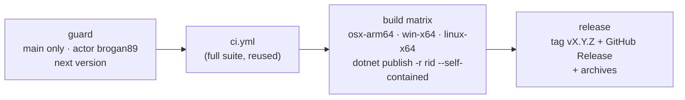

# Release & versioning

How the editor is versioned, built and released. Engine packages for games are a separate, planned
step: see [Future: distribution via NuGet](future/distribution-nuget.md).

## Branch rules

`main` is protected by the `main-protection` repository ruleset (no bypass actors, admins included):

- changes land only through pull requests; **squash** or **rebase** merges (merge commits are disabled);
- the `ci-success` check ([`ci.yml`](../../.github/workflows/ci.yml)) must pass, on a branch that is up
  to date with `main`;
- linear history; no force pushes; no deletion.

Release tags (`v*`) are immutable (`release-tags-immutable` ruleset: no update, no deletion).

## Versioning

[SemVer](https://semver.org). The version lives **only in git tags** `vX.Y.Z`; nothing in the repo is
bumped. Local builds are `0.0.0-dev` (`Directory.Build.props`); releases pass `-p:Version=X.Y.Z`.

Each publish bumps the **patch** of the latest `vX.Y.Z` tag ([`build/next-version.sh`](../../build/next-version.sh);
first release `v1.0.0`). A minor/major bump is done by pushing a tag by hand on the commit to release
from (e.g. `v1.1.0`); the next publish continues from it (`v1.1.1`). `just next-version` prints what the
next publish would create.

**Engine and editor are versioned in lock step.** There is one version for the whole product: the release tag.
`dotnet publish -p:Version=X.Y.Z` is a global MSBuild property, so it flows to every project in the build graph —
the editor, the engine core, the generator and every referenced project get the same `X.Y.Z`. At run time
`EngineInfo.Version` is the single source of truth: the editor shows it (`EditorBrand.Version`), checks at startup
that its own assembly version matches the engine core it loaded (`EditorBrand.VersionsMatch`, an error otherwise),
new projects record it in `project.mfproj` (`engineVersion`), the editor link handshake carries it, and the planned
NuGet packages ([distribution via NuGet](future/distribution-nuget.md)) use it as their package version.

## Publishing

[`publish.yml`](../../.github/workflows/publish.yml) — **Actions → publish → Run workflow** on `main`.

- **Who/where.** The `guard` job runs only when `github.ref == refs/heads/main` and
  `github.actor == brogan89`; every other job depends on it, so a dispatch from another branch or user
  skips the whole run. Jobs also run in the `release` environment, whose deployment branch policy
  allows `main` only. (Required reviewers on environments need GitHub Enterprise for private repos, so the
  actor check is the gate.)
- **Tests first.** The full CI suite runs again (`workflow_call`) before anything is built.
- **Artifacts.** Self-contained, ReadyToRun editor builds, packaged by
  [`build/package-editor.sh`](../../build/package-editor.sh):
  `MainframeEditor-X.Y.Z-osx-arm64.tar.gz` (`Mainframe Editor.app`, unsigned — first launch:
  right-click → Open), `…-win-x64.zip`, `…-linux-x64.tar.gz`. `just publish-local [rid]` produces the
  same archive locally.
- **Requirements on the user's machine.** Creating and playing game projects runs `dotnet build`, so the
  .NET 10 SDK must be installed even though the editor itself is self-contained.

## Related docs
[Build & platforms](build-and-platforms.md) · [Testing](testing.md) ·
[Future: distribution via NuGet](future/distribution-nuget.md)
