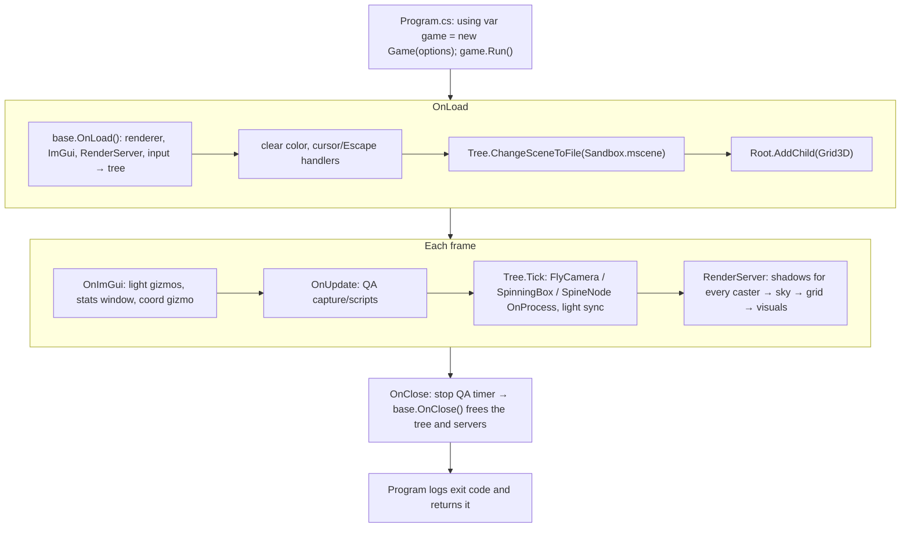

# Sandbox

## Purpose

[`MainframeEngine.Sandbox`](../../MainframeEngine.Sandbox/) is the test game. It exercises most engine
features in one 3D scene, and it is the reference for how a game is expected to use the engine: the scene
is a file ([Content/Scenes/Sandbox.mscene](../../MainframeEngine.Sandbox/Content/Scenes/Sandbox.mscene))
loaded into the engine's scene tree, behaviour lives in node types, and `Game` only adds window-level
input, the debug overlay and QA scripting.

Files: [Program.cs](../../MainframeEngine.Sandbox/Program.cs), [Src/Game.cs](../../MainframeEngine.Sandbox/Src/Game.cs),
[Src/SandboxSceneBuilder.cs](../../MainframeEngine.Sandbox/Src/SandboxSceneBuilder.cs),
[Src/Nodes/](../../MainframeEngine.Sandbox/Src/Nodes/) (`FlyCamera`, `SpinningBox`),
[Src/QaCapture.cs](../../MainframeEngine.Sandbox/Src/QaCapture.cs). The project references
`MainframeEngine.Generators` as an analyzer so its node types are registered for the scene file.

`Game` takes its `EngineOptions` (`Game.DefaultOptions` is the window below). `Program` sets the
working directory to the build output; engine content no longer needs it (`ContentPaths` resolves against
`AppContext.BaseDirectory`), but `SpineFolder` still enumerates its folder relative to the working directory.

`--write-scene <path>` builds the scene in code (`SandboxSceneBuilder.Build()`) and saves it with
`SceneSaver` without opening a window — that is how the committed scene file is produced (its UID is kept):

```bash
dotnet run --project MainframeEngine.Sandbox -- --write-scene MainframeEngine.Sandbox/Content/Scenes/Sandbox.mscene
```

## QA capture

`--qa-capture <dir> [--qa-frames 30,90,180]` (`just qa` → `artifacts/qa`) runs with a fixed 60 Hz
timestep and VSync off, saves `sandbox_frameNNNN.png` for each listed frame through
`Engine.CaptureFrame()`, and exits one frame after the last capture (or scripted step).

Scripted window/input steps (they log `[QA]` lines; combine freely):

| Flag | Effect |
|---|---|
| `--qa-resize WxH@frame` | sets `Window.Size` (points) → swapchain recreation; later captures have the new size |
| `--qa-minimize frame` | minimises, restores after 1.5 s (a timer pushes SDL events to wake the blocked loop; it is stopped, waiting for in-flight callbacks, before SDL shuts down) and logs the updates/frames that ran meanwhile. Captures listed during the minimised period are taken after restore, one at a time, and keep their listed frame number in the file name. |
| `--qa-input frame` | pushes a right-button drag into SDL's event queue for 22 frames and logs the camera forward before/after (SDL input → `IMouse` → `InputRouter` → `FlyCamera.OnInput`) |

Example: `dotnet run -c Release --project MainframeEngine.Sandbox -- --qa-capture artifacts/qa
--qa-frames 30,90,200 --qa-resize 1000x600@60 --qa-minimize 120 --qa-input 150`.

## Network demo (M5)

`--server [port]` hosts (ENet, default port 7777) and spawns four `NetBox`es (`Content/Scenes/NetBox.mscene`, a
`Box3d` with interpolated `[Replicated]` position and rotation and a replicated colour) that orbit the origin on the
server; `--client <host> [port]` joins and shows them replicated. Every 3 s the server calls the `Ping` RPC
(`RpcMode.Server`, `CallLocal`), which pulses the first box everywhere. Both ends log the replication state every
2 s (`[NetDemo] …`: tick, render tick, node count, the first box's position, bytes per second) and show it in the
ImGui window; the title says `[server :port]` or `[client -> host:port]`. `--quit-after <seconds>` exits on its own.
With `--qa-capture`, network runs keep wall-clock time and VSync (not the fixed QA step), so both clocks agree.

```sh
dotnet run -c Release --project MainframeEngine.Sandbox -- --server --quit-after 30 &
dotnet run -c Release --project MainframeEngine.Sandbox -- --client 127.0.0.1 --quit-after 15 --qa-capture artifacts/qa-net --qa-frames 600,1100
```

Regenerate the box scene with `--write-net-scene MainframeEngine.Sandbox/Content/Scenes/NetBox.mscene`.

## Scene

| Object | Setup |
|---|---|
| Window | "Mainframe Engine Sandbox", Vulkan, 1920×1080, icon `Content/Branding/mg_300_circle.png` |
| Clear color | (0.18, 0.31, 0.31), dark slate grey |
| Root | `Node3D` "Sandbox" (the scene file's root; nodes below are owned by it) |
| Camera | `FlyCamera : Camera3D` at (0, 5, 10) looking at the origin; hold RMB to look, WASD/QE to move, Shift ×2 (`Speed`, `LookSensitivity` exported) |
| Sky | `WorldEnvironment` with an inline `Sky` resource: `Panoramic`, `Content/Sky/sky_10_2k.png` |
| Grid | `Grid3D` added under `/root` at runtime (not saved; draws first, `RenderPriority` -100) |
| Shadows | the render server's `ShadowSystem` |
| Spine | `SpineNode` "SpineBoy": `Folder = Content/Models/Spine/SpineBoy`, default `SpineScale` (0.02), `Scale = 0.1`, `Animation = "walk"` |
| Floor | `Quad`, `RotationDegrees` (90, 0, 0), scale (10, 10, 1), white |
| Box | `SpinningBox : Box3d` at (3, 1, 0), white, `DegreesPerSecond` (20, 20, 0) |
| Lights | every shadow type at once: 2 `DirectionalLight3D` (warm key "Sun" 0.8, cool "Fill" 0.2), 1 `OmniLight3D` (blue, right of the box), 2 `SpotLight3D` (warm and green cones) — all shadow-casting; directions come from the nodes' rotations |

## Lifecycle



## ImGui window ("Game Window")

Shows frame count, delta time, FPS and ms, plus a VSync checkbox, a fullscreen checkbox, a Max FPS
combo (Unlimited/30/60/120/144/240), the active camera's position and forward vector, and the number of
nodes in the tree.

Controls are listed in [Cameras & input](cameras-and-input.md#sandbox-controls).

## Known issues

- Steady-state frames allocate nothing (enforced by the render-test allocation gate).
- The ImGui gizmos use the camera synced at the previous render (one frame behind a moving camera).
- `sky_16_2k.png` ships but is unused.

## Related docs

[Engine lifecycle](engine-lifecycle.md) · [Architecture overview](architecture-overview.md) ·
[Scene graph & nodes](scene-graph-and-nodes.md) · [Scene serialization](scene-serialization.md) · [Networking](networking.md)
