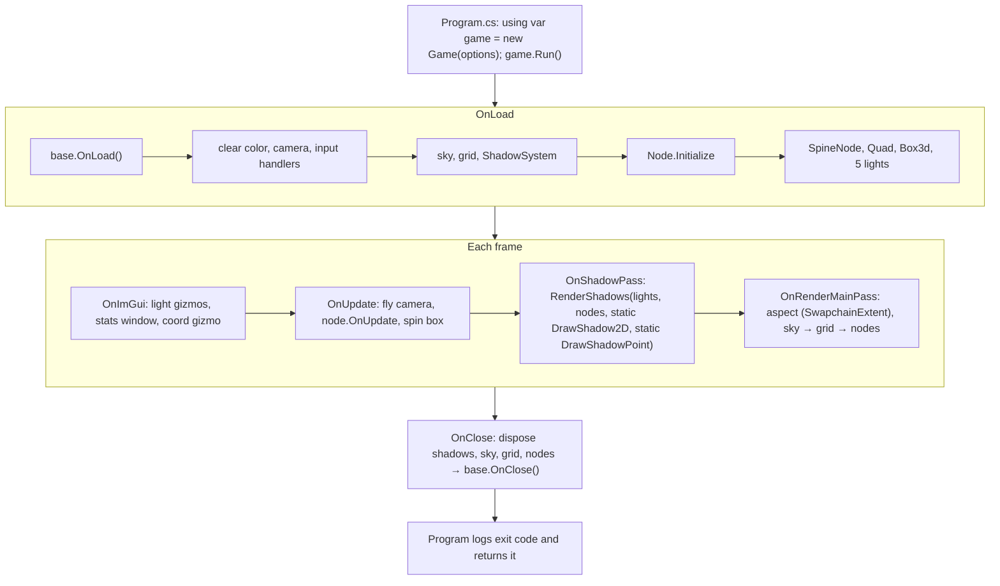

# Sandbox

## Purpose

[`MainframeEngine.Sandbox`](../../MainframeEngine.Sandbox/) is the test game. It exercises most engine
features in one 3D scene, and it is the reference for how a game is expected to use the engine.

Files: [Program.cs](../../MainframeEngine.Sandbox/Program.cs), [Src/Game.cs](../../MainframeEngine.Sandbox/Src/Game.cs),
[Src/QaCapture.cs](../../MainframeEngine.Sandbox/Src/QaCapture.cs).

`Game` takes its `EngineOptions` (`Game.DefaultOptions` is the window below). `Program` sets the
working directory to the build output so relative content paths resolve wherever it is launched from.

## QA capture

`--qa-capture <dir> [--qa-frames 30,90,180]` (`just qa` → `artifacts/qa`) runs with a fixed 60 Hz
timestep and VSync off, saves `sandbox_frameNNNN.png` for each listed frame through
`Engine.CaptureFrame()`, and exits one frame after the last capture (or scripted step).

Scripted window/input steps (they log `[QA]` lines; combine freely):

| Flag | Effect |
|---|---|
| `--qa-resize WxH@frame` | sets `Window.Size` (points) → swapchain recreation; later captures have the new size |
| `--qa-minimize frame` | minimises, restores after 1.5 s (a timer pushes SDL events to wake the blocked loop; it is stopped, waiting for in-flight callbacks, before SDL shuts down) and logs the updates/frames that ran meanwhile. Captures listed during the minimised period are taken after restore, one at a time, and keep their listed frame number in the file name. |
| `--qa-input frame` | pushes a right-button drag into SDL's event queue for 22 frames and logs the camera forward before/after (SDL input → `IMouse` → fly camera) |

Example: `dotnet run -c Release --project MainframeEngine.Sandbox -- --qa-capture artifacts/qa
--qa-frames 30,90,200 --qa-resize 1000x600@60 --qa-minimize 120 --qa-input 150`.

## Scene

| Object | Setup |
|---|---|
| Window | "Mainframe Engine Sandbox", Vulkan, 1920×1080, icon `Content/Branding/mg_300_circle.png` |
| Clear color | (0.18, 0.31, 0.31), dark slate grey |
| Camera | `Camera3D` at (0, 5, 10) looking at the origin |
| Sky | `SkyPanoramic("Content/Sky/sky_10_2k.png")` |
| Grid | `SceneGrid3d` (size 200) |
| Shadows | `ShadowSystem` + `Node.Initialize(Renderer, shadows)` |
| Spine | Spineboy from `Content/Models/Spine/SpineBoy`, default `SpineScale` (0.02), `Scale = 0.1`, animation `"walk"` |
| Floor | `Quad`, rotation (90, 0, 0), scale (10, 10, 1), white |
| Box | `Box3d` at (3, 1, 0), white, spinning 20°/s on X and Y |
| Lights | every shadow type at once: 2 `DirectionalLight` (warm key 0.8, cool fill 0.2), 1 `PointLight` (blue, right of the box), 2 `SpotLight` (warm and green cones) — all shadow-casting |

## Lifecycle

## ImGui window ("Game Window")

Shows frame count, delta time, FPS and ms, plus a VSync checkbox, a fullscreen checkbox, a Max FPS
combo (Unlimited/30/60/120/144/240), and the camera position and forward vector.

Controls are listed in [Cameras & input](cameras-and-input.md#input-sandbox).

## Known issues

- `(IVulkanContext)Renderer` is cast without a guard, against CLAUDE.md guidance.
- Calls to `Renderer.EnableDepthTest()` / `Clear()` are Vulkan no-ops.
- Steady-state frames allocate nothing (enforced by the render-test allocation gate).
- `Node.Initialize` should move into `Engine` (`TODO` at `Game.cs:59`).
- `sky_16_2k.png` ships but is unused.

## Related docs

[Engine lifecycle](engine-lifecycle.md) · [Architecture overview](architecture-overview.md)
