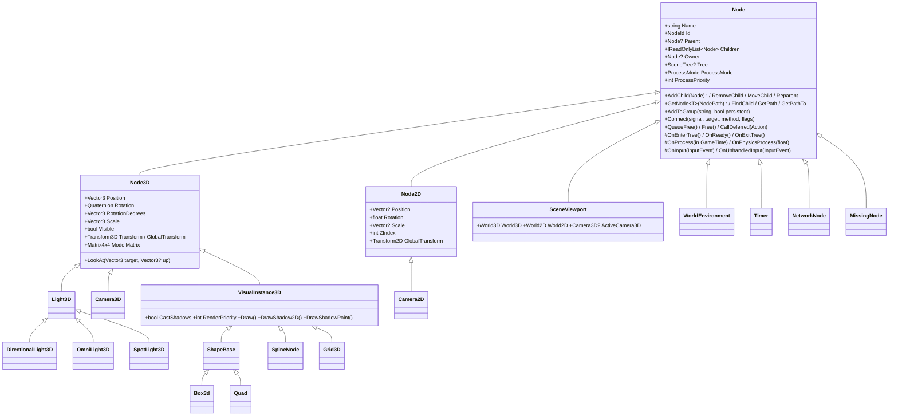

# Scene Graph & Nodes

## Purpose

Everything in a game is a **node in a tree**, as in Godot. Behaviour comes from node *types* (C#
subclasses); scenes are reusable subtrees saved as data ([Scene serialization](scene-serialization.md)).
The engine owns a `SceneTree` and runs the frame for every node inside it: lifecycle callbacks,
fixed-step physics process, process, deferred calls and frees, transform sync, input routing, groups and
signals. Nodes are thin front-ends to engine **servers** (rendering now; physics, audio and UI later):
the node holds editable state, the server holds GPU/physics/audio objects.

Names follow Godot (`Node3D`, `Camera3D`, `OmniLight3D`, `WorldEnvironment`, `QueueFree`, `NodePath`,
…) with two exceptions recorded in the [Godot-names ADR](../../memory/decisions/0010-godot-node-names.md):
the root is `SceneViewport` (not `Viewport`, which the renderer uses unqualified for
`Silk.NET.Vulkan.Viewport`) and lifecycle methods use the engine's `On*` prefix.

## Class hierarchy



## Key types

| Type | File | Notes |
|---|---|---|
| `Node` | [Scene/Node.cs](../../MainframeEngine/Src/Scene/Node.cs) (+ `.Processing`, `.Groups`, `.Signals`) | tree, names, paths, lifecycle, groups, signals, freeing |
| `SceneTree`, `SceneTreeTimer` | [Scene/SceneTree.cs](../../MainframeEngine/Src/Scene/SceneTree.cs) | frame loop, process lists, groups, deferred queue, `NodeId` registry |
| `SceneViewport`, `World3D`, `World2D` | [Scene/](../../MainframeEngine/Src/Scene/) | root viewport, render scenario |
| `Node3D`, `Node2D`, `Transform3D`, `Basis`, `Transform2D`, `EulerAngles` | [Scene/](../../MainframeEngine/Src/Scene/) | cached, dirty-flagged transforms |
| `NodePath`, `NodeId`, `ProcessMode`, `Timer`, `MissingNode` | [Scene/](../../MainframeEngine/Src/Scene/) | |
| `InputEvent*`, `InputRouter` | [Scene/Input/](../../MainframeEngine/Src/Scene/Input/) | SDL/Silk input → tree |
| `VisualInstance3D`, `Camera3D`, `Light3D` (+3), `WorldEnvironment`, `Sky`, `Grid3D` | [Scene/Nodes3D/](../../MainframeEngine/Src/Scene/Nodes3D/) | render front-ends |
| `Camera2D` | [Scene/Nodes2D/](../../MainframeEngine/Src/Scene/Nodes2D/) | |
| `IServer`, `ServerRegistry`, `RenderServer` | [Servers/](../../MainframeEngine/Src/Servers/) | |
| `ShapeBase`, `Box3d`, `Quad`, `SpineNode`, `NetworkNode` | [Nodes/](../../MainframeEngine/Src/Nodes/) | existing drawables, retargeted onto `VisualInstance3D` |

## The tree

- **Children** are ordered (`Children`, `GetChild`, `GetIndex`, `MoveChild`, `AddSibling`).
  `AddChild` rejects a node that already has a parent and cycles; `Reparent(newParent,
  keepGlobalTransform: true)` moves a subtree keeping its world transform.
- **Names** are unique among siblings. An empty name becomes the type name; a collision appends a number
  (`Box` → `Box2`, `Box2` → `Box3`). `/ : @ % "` are replaced with `_`. Up to 8 children are searched
  linearly; above that a name index is kept (span-keyed, so lookups do not allocate).
- **Owner** is the scene root a node was saved with; it must be an ancestor and is cleared when a removal
  breaks that. The scene saver writes only nodes owned by the root, so runtime-spawned nodes are never
  saved. `UniqueNameInOwner` makes a node reachable as `%Name` from nodes sharing its owner.
- **`NodePath`**: relative (`"Camera"`, `"../Player/Camera"`, `"."`) or absolute (`"/root/Main"`), with
  `%Name` segments. `GetNode<T>` throws on a missing node or wrong type, `GetNodeOrNull<T>` does not.
  Resolution walks spans and does not allocate. `FindChild(pattern)` / `FindChildren<T>` match `*`/`?`
  wildcards (owned nodes only by default, as in Godot). `GetPath()` / `GetPathTo(node)` build paths.
- **Freeing**: `Free()` removes the node (exiting the tree), frees its children, disconnects its named
  signal connections and calls `Dispose(bool)` for resource release; `Dispose()` is `Free()` so nodes work
  with `using`. `QueueFree()` defers the free to the end of the frame (immediate outside a tree).
  `Node.IsInstanceValid(node)` is Godot's `is_instance_valid`.
- **Identity**: every node gets a runtime-unique `NodeId` (never reused). `SceneTree.Find(NodeId)` looks
  it up through a dictionary maintained on enter/exit — what networking replication uses. Scene files
  reference nodes by path, never by id.

## Lifecycle

```mermaid
sequenceDiagram
    autonumber
    participant P as parent.AddChild(child)
    participant C as child subtree
    participant S as Servers
    P->>C: Parent, Tree, viewport, resolved ProcessMode set
    C->>C: OnEnterTree() — top-down; TreeEntered; parent's ChildEnteredTree
    C->>S: visuals/lights/cameras register with their World3D / RenderServer
    C->>C: OnReady() — bottom-up, once per node; Ready
    loop every frame while inside the tree
        C->>C: OnPhysicsProcess(fixedDt) × N fixed steps
        C->>C: OnProcess(gameTime)
    end
    P->>C: RemoveChild / QueueFree
    C->>C: OnExitTree() — bottom-up; TreeExiting; parent's ChildExitingTree
    C->>S: unregister
    C->>C: TreeExited (after removal)
```

- `OnReady` runs once per node (`RequestReady()` re-arms it) after all its children are ready — the
  place for `GetNode<T>()`. Children added inside `OnEnterTree`/`OnReady` enter immediately.
- Callbacks are `protected virtual`. Process callbacks are enabled exactly when a type overrides them
  (found once per type, cached); `SetProcess`, `SetPhysicsProcess`, `SetProcessInput` and
  `SetProcessUnhandledInput` toggle them.
- **`ProcessMode`**: `Inherit` (the root is `Pausable`), `Pausable`, `WhenPaused`, `Always`, `Disabled`.
  `SceneTree.Paused` stops pausable nodes (process, physics, input) and the fixed-step servers.
- **`ProcessPriority`**: lower runs first; equal priorities run in tree order. Physics process uses the
  same order.
- **Built-in signals** (`[Signal]` events): `TreeEntered`, `Ready`, `TreeExiting`, `TreeExited`,
  `Renamed`, `ChildEnteredTree`, `ChildExitingTree`; plus `Timer.Timeout`.

## The frame (`SceneTree.Tick`)

| Step | What runs |
|---|---|
| 1. Physics | `accumulator += min(dt, MaxFrameDelta = 0.25 s)`; up to `MaxPhysicsStepsPerFrame = 5` steps of `1 / PhysicsTicksPerSecond` (60 Hz): `PhysicsFrame` event, `OnPhysicsProcess`, physics-callback timers, `IFixedStepServer.FixedStep` (not while paused). A backlog beyond the cap is dropped. `PhysicsInterpolationFraction` (0..1) is left for interpolating physics-driven visuals (M6). |
| 2. Process | `ProcessFrame` event, `OnProcess(in GameTime)`, idle timers (`SceneTreeTimer`). |
| 3. Deferred | `CallDeferred` callbacks in order (including ones queued while flushing), then `QueueFree` frees; repeated until both queues are empty. |
| 4. Transform sync | `OnTransformChanged` for 2D/3D nodes that asked (`SetNotifyTransform`) and whose global transform changed — lights push their direction/position here. |
| 5. Frame servers | `IFrameServer.Process` (Steam callbacks now; audio/UI later). |

Iteration is over sorted, reused snapshots, so callbacks may add, remove, free or reorder nodes: removed
or queued nodes are skipped, added ones start next frame. The lists re-sort lazily (only after the tree,
membership or a priority changed). **A steady-state tick allocates nothing** (unit-tested over 10 000
nodes; see [Testing](testing.md)).

`Engine` owns one tree (`Engine.Tree`, `Engine.Root`) and ticks it after the legacy `OnUpdate` hook; see
[Engine lifecycle](engine-lifecycle.md). Tests and tools create their own `SceneTree`.

## Transforms

`Node3D` stores local position, rotation (a normalized quaternion) and scale. `RotationDegrees` is Euler
degrees applied about X, then Y, then Z (`EulerAngles`; the order the engine always used, so old scenes
keep their look); the value set is returned unchanged until `Rotation` is set directly, so incrementing it
is stable. Decomposed angles snap within 0.0005° of a whole degree so scene files stay readable.

- `Transform` (local) and `GlobalTransform` are `Transform3D` (a `Basis` of column vectors + origin).
  `ModelMatrix` is the cached row-vector world matrix (`Scale × Rotation × Translation`) the drawables use.
- Setting any transform property marks the node's local transform dirty and its `Node3D` subtree's global
  transforms dirty, stopping at subtrees that are already dirty (a node is only cleaned after its
  ancestors, so a dirty node's subtree is dirty). Globals are recomputed lazily on read.
- Transforms chain only through `Node3D` parents: a `Node3D` under a plain `Node` is a new transform root
  (Godot semantics). `Visible` / `IsVisibleInTree()` follow the same chain.
- `LookAt(target, up)` points `-Z` at a world position, keeping position and scale; `GlobalPosition`,
  `GlobalTransform` setters compute the local transform; `TranslateObjectLocal`, `RotateObjectLocal`.
- `SetNotifyTransform(true)` queues `OnTransformChanged()` for the end of the frame whenever the global
  transform changed (once per frame, also on entering the tree).

`Node2D` mirrors this in 2D (`Transform2D`, rotation in radians, `RotationDegrees` serialized, `ZIndex`).

## Groups, deferred calls, timers

- `AddToGroup(name, persistent)` / `RemoveFromGroup` / `IsInGroup`; persistent groups are saved with
  the scene. The tree tracks members while they are inside it: `GetNodesInGroup` (tree order, live list),
  `GetFirstNodeInGroup`, `CallGroup(name, action)` and the allocation-free
  `CallGroup<TState>(name, state, static action)`, which iterate a snapshot.
- `CallDeferred(Action)` and the allocation-free `CallDeferred(Action<object?>, state)` (on nodes inside a
  tree, or on `SceneTree`) run at step 3.
- `SceneTree.CreateTimer(seconds)` returns a one-shot `SceneTreeTimer` (`Timeout` event);
  the `Timer` node (`WaitTime`, `OneShot`, `Autostart`, `ProcessCallback`) is the saveable kind.
- `SceneTree.ChangeScene(Node | PackedScene)` / `ChangeSceneToFile(pathOrUid)` replace `CurrentScene`
  (deferred to the end of the frame during a tick). `Shutdown()` frees everything.

## Signals

Signals are plain C# events marked `[Signal]`, so code connects with `+=` as usual. The source generator
records each one (name, delegate type, parameter types, add/remove accessors) so the editor's Signals
panel and scene files can connect **by name**:

```csharp
area.Connect("BodyEntered", player, nameof(Player.OnHit), ConnectFlags.Persist);
```

- The target method must be public or marked `[SignalHandler]`, and its parameters must accept the
  signal's. Binding uses reflection once, at connect time; emitting is a normal delegate call.
- `ConnectFlags.Persist` connections are saved with the scene and re-bound on instantiation (their
  `OriginScene` is the scene root that created them, so a sub-scene's connections are not re-saved by the
  scenes that instance it). `Deferred` runs the handler at the end of the frame, `OneShot` disconnects
  after the first emission (both through a generated forwarder; void signals up to 8 parameters).
- Named connections are removed automatically when either node is freed. `Disconnect`, `IsConnected`,
  `GetSignalConnections`, `GetIncomingConnections`.

## Input

`InputRouter` (owned by `Engine`) turns Silk.NET/SDL keyboard, mouse and gamepad callbacks into
`InputEventKey`, `InputEventText`, `InputEventMouseButton`, `InputEventMouseMotion`,
`InputEventMouseWheel`, `InputEventGamepadButton` and `InputEventGamepadAxis` and calls
`SceneTree.PushInput`: `OnInput` in reverse tree order (children before parents), then `OnUnhandledInput`,
stopping once a node calls `GetViewport().SetInputAsHandled()`. Nodes that cannot process (pause) are
skipped. One event instance per type is reused (allocation-free): `Clone()` an event to keep it. The
UI server will get events first in M8; ImGui does not consume them.

## Servers and render nodes

Servers replace the old static `Node.Initialize`: `Engine` registers them in `OnLoad` (after the
renderer) into `SceneTree.Servers` (`ServerRegistry`), and nodes reach them in `OnEnterTree`:

| Server | Interface | Status |
|---|---|---|
| `RenderServer` | `IServer` | M2: facade over the renderer and one shared `ShadowSystem` |
| `SteamServer` | `IFrameServer` | M2: registered when `EngineOptions.SteamAppId` ≠ 0; pumps `Steam.RunCallbacks` |
| physics (M6) | `IFixedStepServer` | ticked after `OnPhysicsProcess`, frozen while paused |
| audio (M7), UI (M8) | `IFrameServer` | ticked after transform sync |

`ServerRegistry` holds one server per type (`Register`, `Get<T>`, `GetRequired<T>`, `Render`) and disposes
them in reverse order after the tree is freed.

**`RenderServer`** draws a viewport's `World3D` with its active camera
(`SceneViewport.ActiveCamera3D`, else `ActiveCamera2D`; aspect from the swapchain extent):

- `RenderShadows(viewport)` — every shadow-casting, visible `VisualInstance3D` into every light's map
  (`ShadowSystem.RenderShadows<TState>` with static lambdas).
- `RenderMain(viewport)` — writes the frame's shared set 0 (`IVulkanContext.Frame.Begin(camera, World3D.Lights)`:
  camera + lights, once per frame), then the `WorldEnvironment`'s sky, then visible visuals by `RenderPriority`
  then tree-entry order, all into the HDR scene target ([Color pipeline](color-pipeline.md)).
- `ShadowsEnabled = false` runs without a `ShadowSystem` (lit pipelines bind the fallback set).
- It tracks every GPU resource owner it created, so nodes removed but never freed are still released at
  shutdown.

**Render node front-ends**:

| Node | Wraps | Notes |
|---|---|---|
| `VisualInstance3D` | — | registers with `World3D` while in a tree; creates GPU objects through the server on first enter (or lazily at the first draw); releases them on `Free` or server shutdown; `CastShadows`, `RenderPriority` |
| `Box3d`, `Quad` (`ShapeBase`) | lit flat-colored meshes | pipeline per instance until M3's `MeshInstance3D` |
| `SpineNode` | `SpineRenderer` | `Folder`, `Animation` (played on load), `SpineScale`; skeleton data loads on the CPU on first use |
| `Grid3D` | `SceneGrid3d` | debug/editor grid: no shadows, `RenderPriority` -100 |
| `Camera3D` | `PerspectiveCamera` | `Current`, `Fov`, `Near`, `Far`; looks along `-Z`; `RenderCamera` is the synced math camera |
| `Camera2D` | `OrthographicCamera` | `Current`, `Zoom`, `Distance` |
| `DirectionalLight3D`, `OmniLight3D`, `SpotLight3D` | `DirectionalLight`, `PointLight`, `SpotLight` | `Color`, `Energy`, `Range`, cone angles; direction = global `-Z`; registered in `World3D.Lights` |
| `WorldEnvironment` | `SkyEnvironment` | `Sky` resource (procedural / panoramic / cubemap + colors), `AmbientColor` |

The pre-M2 math cameras are now `PerspectiveCamera` / `OrthographicCamera` (`ICamera`), still usable
without a tree (Examples/SpineExamples).

## Invariants

- Node constructors must be cheap and side-effect free (the type registry creates a pristine instance of
  every serialized type; scenes are instantiated outside the tree). Acquire GPU/native objects in
  `OnEnterTree` or through a server.
- Nodes are main-thread only while inside a tree.
- Draw methods run inside the server's passes (main render pass / shadow callbacks); tree-less code may
  call them by hand inside the matching pass.

## Known issues

- Each `ShapeBase` still builds its own pipeline and descriptor sets (fixed by M3 materials/meshes,
  which also replaces `Box3d`/`Quad` with `MeshInstance3D`).
- The tree root is the only viewport; sub-viewports (editor scene views) and 2D rendering come later
  (M8/M10). `Camera2D` renders 3D visuals orthographically.
- Euler angles use X→Y→Z order (engine legacy), not Godot's Y→X→Z.
- Re-sorting a process list after a structural change is O(n log n); spawning every frame in a very large
  tree pays it each frame.

## Related docs

[Scene serialization](scene-serialization.md) · [Engine lifecycle](engine-lifecycle.md) ·
[Spine](spine.md) · [Lighting](lighting.md) · [Cameras & input](cameras-and-input.md) ·
[Shadow system](shadow-system.md) · [Future: materials & meshes](future/materials-and-meshes.md) ·
[Future: editor](future/editor.md)
