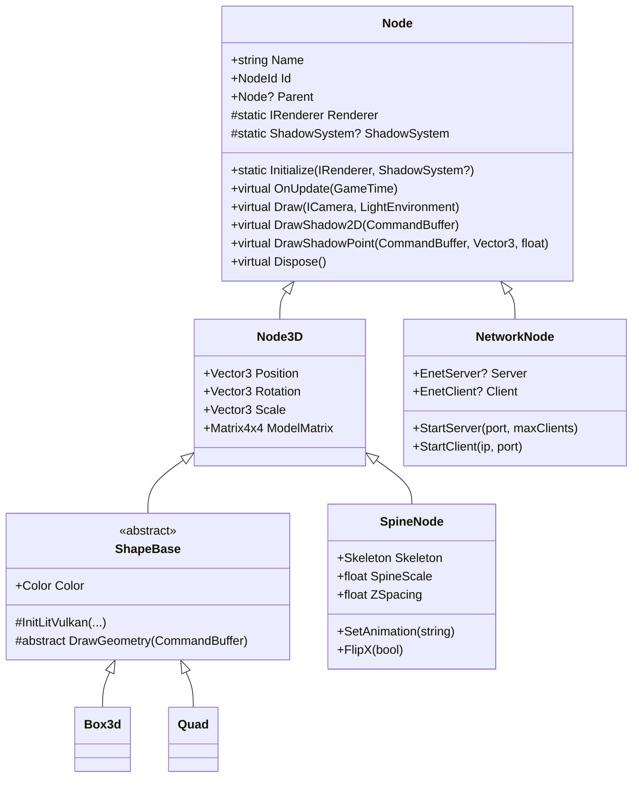
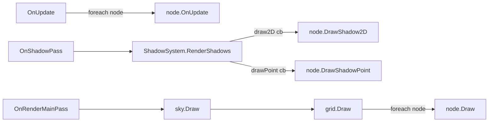

# Scene Graph & Nodes

## Purpose

Nodes are the game-facing objects: transforms, drawables, Spine skeletons and the network endpoint.
Today the "scene graph" is a **flat list owned by the game**. `Node.Parent` exists but is not used by
any transform or traversal.

## Class hierarchy



Not nodes: `SkyEnvironment`, `SceneGrid*`, `Light` and `LightEnvironment`, cameras.

## Key types

| Type | File |
|---|---|
| `Node` | [Nodes/Node.cs](../../MainframeEngine/Src/Nodes/Node.cs) |
| `Node3D` | [Nodes/Node3D.cs](../../MainframeEngine/Src/Nodes/Node3D.cs) |
| `NodeId` | [Nodes/NodeId.cs](../../MainframeEngine/Src/Nodes/NodeId.cs) (namespace `MainframeEngine.Networking`) |
| `ShapeBase`, `Box3d`, `Quad` | [Nodes/Shapes/](../../MainframeEngine/Src/Nodes/Shapes/) |
| `SpineNode`, `SpineFolder` | [Nodes/SpineNode.cs](../../MainframeEngine/Src/Nodes/SpineNode.cs) — see [Spine](spine.md) |
| `NetworkNode` | [Nodes/NetworkNode.cs](../../MainframeEngine/Src/Nodes/NetworkNode.cs) — see [Networking](networking.md) |

## How it works

### Static initialization

```csharp
Node.Initialize(Renderer, shadowSystem);   // in OnLoad, before any node is constructed
```

Shape constructors read the static `Renderer`; `ShapeBase` adds the shadow descriptor set layout to its
pipeline when `ShadowSystem` is non-null; `SpineNode` passes the static `ShadowSystem` to its renderer.

### Identity

Every `Node` gets `Id = NodeId.GetNext()`, which is a static `uint` counter starting at 1, where 0 means
"invalid". IDs are never recycled and the counter is not thread-safe.

### Transform

`Node3D.ModelMatrix` is computed on every access:

```
Scale × RotX × RotY × RotZ × Translation     (System.Numerics, row vectors)
```

so the effective order is scale → X → Y → Z rotation → translate. Rotation is Euler **degrees**. There is no
caching, no quaternion and no parent multiplication.

### Per-frame use (by the game)



### Shapes (`ShapeBase`)

`ShapeBase` is a lit, flat-colored mesh. Each instance builds **its own** Vulkan objects in
`InitLitVulkan(ctx, binding, attributes, vertSpv, fragSpv, cullMode)`:

| Resource | Detail |
|---|---|
| Set 0 layout | binding 0 UBO `VpUbo { View, Projection }` (128 B), vertex stage |
| Set 1 layout | binding 0 UBO lights (1200 B), fragment stage — see [Lighting](lighting.md#lights-ubo) |
| Set 2 | `ShadowSystem.MainDescSetLayout` (only if a shadow system exists) |
| UBOs | one VP + one lights buffer **per swapchain image**, host-coherent, persistently mapped |
| Push constant | 80 B `{ mat4 Model; vec4 Color }`, vertex + fragment |
| Pipeline | triangle list, CCW front, depth test+write `Less`, no blend, dynamic viewport/scissor, main render pass |
| Shaders | `Content/Shaders/Shapes/Shapes.vk.{vert,frag}.spv` |

`Draw()` writes the VP and lights UBOs for `CurrentImageIndex`, sets a Y-flipped viewport, binds the
pipeline and sets, pushes `{Model, Color}`, and calls `DrawGeometry(cb)`.

| Shape | Geometry | Cull | Shadow pipelines |
|---|---|---|---|
| `Box3d` | 36 non-indexed verts, stride 32 (pos3 · uv2 · normal3), unit cube | Back | `GetShadow2DPipeline(32)`, `GetShadowPointPipeline(32)` |
| `Quad` | 4 verts + 6 `uint` indices in the XY plane, normal −Z | None | same, indexed |

Vertex and index buffers are device-local and uploaded through a staging buffer with `CopyBuffer`
(one-time submit + `QueueWaitIdle`).

## Invariants

- `Node.Initialize` before any `ShapeBase`/`SpineNode` construction.
- Shapes must be drawn inside the main render pass, and shadow methods inside `RenderShadows` callbacks.
- If the shadow system is null, `Shapes.vk.frag` still declares set 2. Always create a `ShadowSystem`
  when using shapes.

## Known issues

- **`AddChild` is inverted:** it sets `this.Parent = child` ([Node.cs:26-28](../../MainframeEngine/Src/Nodes/Node.cs)). `RemoveChild` ignores its argument. There is no children collection.
- **No hierarchical transforms or engine-owned traversal.**
- **Static service locator** (`TODO` at [Node.cs:17](../../MainframeEngine/Src/Nodes/Node.cs)); the Sandbox asks to move `Node.Initialize` into `Engine` (`TODO` at `Game.cs:59`).
- **Per-instance pipelines:** N shapes create N identical pipelines, descriptor pools and UBO sets.
- **Pipeline layout vs. shader mismatch without a `ShadowSystem`** *(inferred)*.
- **Per-image arrays are sized once** at construction and go stale if the swapchain image count changes.
- `Box3d`/`Quad.Dispose` free buffers before `ShapeBase.Dispose` calls `DeviceWaitIdle`.
- UVs are uploaded but unused; there is no material or texture support (flat `Color` only).
- Exception messages still say `"LitShape"` ([ShapeBase.cs:85](../../MainframeEngine/Src/Nodes/Shapes/ShapeBase.cs) and others), and `Draw` has a "sealed" comment but is not sealed.
- `NodeId` lives in the `MainframeEngine.Networking` namespace; its `operator ulong` parameter is named `peerId`.

## Related docs

[Engine lifecycle](engine-lifecycle.md) · [Spine](spine.md) · [Shadow system](shadow-system.md) ·
[Future: scene graph v2](future/scene-graph-v2.md) · [Future: materials & meshes](future/materials-and-meshes.md)
