# Scene & Resource Serialization

## Purpose

Scenes and shared data are stored as text files with stable UIDs, so they can be loaded, instanced,
diffed in git and edited by the [editor](editor.md):

- **`*.mscene`** — a node tree with property values, nested scene instances with overrides, persistent
  groups and signal connections (`PackedScene`).
- **`*.mres`** — a standalone `Resource` (skies now; materials, meshes, shapes, themes later).

Property access is **source-generated**: `MainframeEngine.Generators` emits a `NodeTypeInfo` (factory,
typed getter/setter delegates, hints, signals, migrations) for every node and resource type, so loading
and saving use no reflection. Decisions: [JSON scenes, no binary bake](../../memory/decisions/0011-json-scenes-no-binary-bake.md),
[source-generated type registry](../../memory/decisions/0012-source-generated-type-registry.md),
[scene format 2](../../memory/decisions/0102-scene-format-2.md).

## Key types

| Type | File | Notes |
|---|---|---|
| `[Export]`, `[ExportGroup]`, `[Signal]`, `[SignalHandler]`, `[Tool]`, `[TypeName]`, `[SerializedVersion]`, `[SerializedMigration]` | [Serialization/Attributes.cs](../../MainframeEngine/Src/Serialization/Attributes.cs) | namespace `MainframeEngine` |
| `TypeRegistry`, `NodeTypeInfo`, `ExportPropertyInfo<TOwner,TValue>`, `SignalInfo`, `MigrationInfo`, `ExportHints` | [Serialization/](../../MainframeEngine/Src/Serialization/) | namespace `MainframeEngine.Serialization` |
| `ValueCodec<T>`, `Codecs`, `PropertyBag` | [Serialization/Codecs.cs](../../MainframeEngine/Src/Serialization/Codecs.cs), [PropertyBag.cs](../../MainframeEngine/Src/Serialization/PropertyBag.cs) | JSON value encodings; migration input |
| `SceneWriter`, `SceneDocument`, `ResourceTable`, `PropertyApplier` | [Serialization/](../../MainframeEngine/Src/Serialization/) | internal reader/writer |
| `Resource`, `PackedScene`, `ResourceLoader`, `SceneSaver`, `ResourceSaver` | [Resources/](../../MainframeEngine/Src/Resources/) | |
| `AssetDatabase`, `AssetMeta`, `AssetIndex`, `AssetUid` | [Resources/](../../MainframeEngine/Src/Resources/) | UIDs ↔ paths |
| `NodeRegistrationGenerator` | [MainframeEngine.Generators/](../../MainframeEngine.Generators/) | Roslyn incremental generator (netstandard2.0) |

## Property model

```csharp
public partial class DirectionalLight3D : Light3D   // `partial` is not required
{
    [Export] public Vector3 Color { get; set; } = Vector3.One;
    [Export(Range = "0,16,0.01")] public float Energy { get; set; } = 1f;
    [ExportGroup("Shadow")] [Export] public bool CastsShadows { get; set; } = true;
    [Signal] public event Action<Node3D>? BodyEntered;
}
```

- `[Export]` marks a property or field as serialized and inspector-visible. It must be readable and
  writable from the declaring assembly (public or internal; no init-only setters).
- Hints: `Range = "min,max[,step]"`, `File = "*.png,*.jpg"`, `Directory`, `Multiline`, `Flags`,
  `NodeType` (for `NodePath`), `Translatable` (player-facing text on `string`/`string[]`/`List<string>`: extracted by
  `mf-l10n`, shown with `Node.Atr`, stored as source text; see [Localization](localization.md#scene-strings)).
  `[ExportGroup("Name")]` starts an inspector group for this and the following members (empty name ends it).
- Supported types: `bool`, integer and floating-point primitives, `string`, enums, `Vector2/3/4`,
  `Quaternion`, `System.Drawing.Color`, `Transform3D`, `Transform2D`, `NodePath`, `Resource` subclasses
  (inline or external), and arrays / `List<T>` of these. Anything else is a compile error (MFG002).
- `[TypeName("...")]` overrides the scene type name (default: the class name; names must be unique across
  loaded assemblies). `[Tool]` marks nodes that process in the editor.
- `[EditorIcon("tabler-name", Family = EditorIconFamily.Space3D)]` on a type gives it an editor icon and colour
  family (types without one inherit their nearest base type's; `""` keeps the icon and sets only the family);
  `[Export(Icon = "…")]` or `[EditorIcon("…")]` on a member sets its inspector icon. The XML doc `<summary>` of
  types and exported members becomes the editor's Add Node description and inspector tooltip. See
  [Editor: icons](editor.md#icons).

### Source generator

`MainframeEngine.Generators` runs on every project that references it as an analyzer (the engine, the
unit tests, every game such as the Demo):

```xml
<ProjectReference Include="..\MainframeEngine.Generators\MainframeEngine.Generators.csproj"
                  OutputItemType="Analyzer" ReferenceOutputAssembly="false" />
```

For each class deriving from `Node` or `Resource` (generic and file-local types are skipped) it emits, in
one `TypeRegistration_<Assembly>` class, a `[ModuleInitializer]` that calls `TypeRegistry.Register` with:

- the type name, CLR type and base type, and a factory `static () => new T()` (none for abstract types or
  types without an accessible parameterless constructor);
- an `ExportPropertyInfo<TOwner, TValue>` per member: `static o => o.Member` / `static (o, v) => o.Member = v`
  and a codec chosen at compile time (`Codecs.Get<float>()`, `Codecs.EnumOf<T>()`, `Codecs.ResourceOf<T>()`,
  `Codecs.ListOf(...)`, `Codecs.ArrayOf(...)`), hints and group;
- a `SignalInfo` per `[Signal]` event: delegate type, parameter types, typed add/remove accessors and a
  forwarder factory for deferred/one-shot connections;
- `MigrationInfo`s, the serialized version and traits (node/resource/tool/abstract);
- editor metadata: the type's `[EditorIcon]` name and family (`NodeTypeInfo.Icon`/`IconFamily`, declared only — the
  editor resolves inheritance) and its doc summary (`Description`); per member `ExportHints.Icon` and
  `ExportHints.Description`. Summaries are read from the `///` trivia (no documentation file needed), stripped to
  plain text (`<see cref>` → the name, tags dropped, at most 600 characters); `<inheritdoc/>` gives none.

The pipeline is incremental: per-type models are value-equatable records, so edits that do not change a
type's shape do not regenerate. Diagnostics (all errors): MFG001 inaccessible/unwritable export, MFG002
unsupported type, MFG003 bad signal event, MFG004 duplicate type name, MFG005 invalid migration method,
MFG006 a type with exports/signals that cannot be registered (e.g. nested in a private type), MFG010
`Translatable` on a member that is not text.

**Extension point.** Models (`TypeModel` in [Models.cs](../../MainframeEngine.Generators/Models.cs)) carry
one collection per member feature; `TypeModelBuilder` fills them and each feature has its own emitter. M5 added
`Replicated` and `Rpcs` (from the same member walk) and `ReplicationEmitter`, which writes a second file,
`MainframeEngine.Replication.g.cs`, only for assemblies with networked members, without touching registration
(diagnostics MFG007–MFG009; see [Networking: replication](networking.md#replication)).

### `TypeRegistry` and `NodeTypeInfo`

- `TypeRegistry.Get(name | Type)`, `GetNearest(Type)` (nearest registered base), `All`, `CreateNode(name)`,
  `Changed` event. A lookup miss runs the module initializers of loaded assemblies that reference the engine
  (registration happens on first access to an assembly); `EnsureRegistered(assembly)` forces it.
- `UnregisterAssembly(assembly)` before unloading a game assembly; the reloaded assembly registers again
  (a same-named type from a newer load replaces the old one). This is the editor's code-reload path.
- `NodeTypeInfo.Properties` / `Signals` include base types (base first), `FindProperty`, `FindSignal`,
  `CreateInstance()`, and `DefaultInstance` — a pristine instance (created once, never added to a tree)
  that defines "default" for saving.
- `ExportPropertyInfo` offers boxed `GetValue`/`SetValue` for tools (the inspector) and `ValueEquals`/
  `CopyValue`; serialization uses the typed path.

## File format

Format 2 ([ADR 0102](../../memory/decisions/0102-scene-format-2.md)):

```json
{
  "format": 2,
  "uid": "scn_491645bea2fa",
  "resources": {
    "Sky_5kj71": {
      "type": "Sky",
      "props": {
        "Mode": "Panoramic",
        "Panorama": "Content/Sky/sky_10_2k.png"
      }
    },
    "StandardMaterial3D_7b21a": {
      "ref": "res_7b21aa90c1d4",
      "path": "Content/Materials/Crate.mres"
    }
  },
  "nodes": [
    {
      "name": "Main",
      "type": "Node3D"
    },
    {
      "name": "Environment",
      "parent": ".",
      "type": "WorldEnvironment",
      "props": {
        "Sky": { "res": "Sky_5kj71" }
      }
    },
    {
      "name": "Sun",
      "parent": ".",
      "type": "DirectionalLight3D",
      "props": {
        "RotationDegrees": [-26.56506, 0, 0],
        "Color": [1, 0.95, 0.8],
        "Energy": 0.8
      }
    },
    {
      "name": "Player",
      "parent": ".",
      "instance": "scn_a12b77d03e9f",
      "path": "Content/Scenes/Player.mscene",
      "props": {
        "Position": [0, 0, 2]
      },
      "overrides": {
        "Hitbox": {
          "Radius": 0.5
        }
      }
    },
    {
      "name": "Badge",
      "parent": "Player/Hitbox",
      "type": "Node3D"
    },
    {
      "name": "Hat",
      "parent": "Player",
      "type": "Node3D"
    }
  ],
  "connections": [
    {
      "from": "Player/Hitbox",
      "signal": "BodyEntered",
      "to": ".",
      "method": "OnPlayerHit",
      "flags": "Deferred"
    }
  ]
}
```

- Written with `Utf8JsonWriter` (UTF-8, non-ASCII unescaped), then laid out by `SceneJsonLayout`
  (`SceneFormat.FormatJson`): two-space indent and `\n` on every OS, one member per line, except arrays of up to 16
  scalars (vectors, colours, transforms, group names) and resource references (`{ "res": "…" }`), which stay on one
  line. Read with `JsonDocument` (comments and trailing commas tolerated for hand edits). The `.meta` sidecars and the
  runtime index use a source-generated `JsonSerializerContext`.
- **Only non-default values are written**: a property is skipped when it equals the type's
  `DefaultInstance` (codec equality; resources by reference).
- Values: vectors, quaternions, colors (RGBA floats 0..1) and transforms (column vectors + origin) are
  arrays; enums are names (flags `"A, B"`); `NodePath` is a string; non-finite floats are strings
  (`"NaN"`, `"Infinity"`); resources are `{"res": "key"}` into the table, `null` when unset.
- **`nodes`** is a flat list in tree order (parents before children, siblings in order): the root first, then every
  node **owned** by the scene root. An entry is `name`, `parent` (path from the root, `"."` for the root's children;
  the root has none), `type`, optional `v` (type version when not 1), `props` and `groups` (persistent only).
  Reparenting a node changes its own `parent` line (and its descendants'), not the indentation of a subtree.
- **Nested instances** store the sub-scene's UID (`instance`) with the path as a hint, the instance's
  name and parent, its root properties that differ from a pristine instance of the sub-scene (`props`), and `overrides`
  keyed by path inside the instance (nodes owned by the instance or by instances nested in it). Nodes this scene
  added inside an instance are listed like any other node, their `parent` path running through it
  (`"Player/Hitbox"`). Changing a sub-scene therefore flows into every instance that did not override the value.
  The instance's `v` and `overrideVersions` (path → version, when not 1) record the type versions the
  values were written with, so they migrate like any other entry. Inline resources are compared by value
  when diffing, so an instance never records an "override" that only differs by resource identity.
- **Resources**: inline resources (no file) are written once even when referenced many times; external ones
  (`ResourceSaver.Save`d) are `ref` (UID) + `path` (hint). An inline `PackedScene` cannot be referenced (save it
  first). Table keys are `Type_xxxxx` (five base-36 digits) and **stable**: an inline resource remembers the key it
  was loaded with (`Resource.SceneLocalId`, Godot's `resource_scene_unique_id`) and keeps it on every save, so
  adding or removing a resource never renames the others. A new resource's key is hashed (FNV-1a) from where it is
  first used (node path and property, or the referencing resource's key and property), so saving the same tree twice
  writes the same bytes; an external reference's key is hashed from its UID. Collisions within a file are re-hashed.
  The table is in discovery order.
- **Format 1** files (`"root"` with nested `"children"`, resources keyed `"1"`, `"2"`… in discovery order, children
  added inside an instance listed under it with `parent` relative to the instance) still load; their numbered keys
  are not kept, so the next save writes format 2 with fresh keys.
- **Connections**: persisted (`ConnectFlags.Persist`) connections between nodes of this scene, made in it
  (not in a sub-scene's file), with paths relative to the root; extra flags as `"flags"`.
- Unknown types load as **`MissingNode`/`MissingResource`**, keeping the type name, version and raw
  properties, and are written back unchanged (their children load normally). Resources their raw properties
  reference (`{"res": key}`) are resolved and re-keyed into the new file's table, so they survive a re-save (M3).
- **Removed engine types** (`RemovedNodeTypes`, M3) load as their replacement instead: `Box3d`/`Quad` become
  `MeshInstance3D`s with a primitive mesh and a material carrying their colour; saving writes the new type. Games
  can register upgrades for their own retired types (a type-level counterpart of `[SerializedMigration]`).
- Files other than `.mscene`/`.mres` (images, models) are **imported** — see [Asset pipeline](asset-pipeline.md);
  a scene instancing a model stores its UID + path like any nested scene. Unknown properties are
  ignored with a warning; a bad value throws `InvalidDataException` naming the file, node and property.

## Loading and instancing

```mermaid
flowchart LR
    F["*.mscene"] -->|"ResourceLoader.Load (cached by UID)"| PS["PackedScene (parsed document)"]
    PS -->|"Instantiate()"| T["new node tree: factories + generated setters"]
    T --> R["resources: inline (shared per PackedScene) / external (ResourceLoader)"]
    R --> N["nested instances → Instantiate recursively, apply props + overrides"]
    N --> O["owners assigned, persistent groups added"]
    O --> C["persisted connections bound (OriginScene = root)"]
    C --> A["caller: parent.AddChild(root) → EnterTree / Ready"]
```



- `PackedScene.Instantiate()` builds the tree **outside** the scene tree: no lifecycle callbacks run until
  the caller adds it. Nodes from the file get `Owner` = scene root (inner nodes of a nested instance keep
  the instance root as owner); the root's `SceneFilePath` is the scene file. Self-instancing (directly or
  through a nested scene) is rejected.
- `PackedScene.Pack(root)` (Godot's `pack`) and `PackedScene.Parse(json)` create in-memory scenes;
  `Instantiate<T>()` casts the root.
- `ResourceLoader.Load<T>(pathOrUid)` loads `.mscene`/`.mres` files, caches them by UID (and path) and adds
  a reference; `Resource.Release()` drops it and the last release evicts the resource (`OnUnloaded`, once,
  which also releases the external resources it loaded). `ClearCache()` runs at engine shutdown. A
  `PackedScene` holds one reference on each external resource and sub-scene it uses — including those of
  content it had before a re-save, which live instances may still use — until it unloads.
  `SceneTree.ChangeSceneToFile` holds the scene's reference while the scene is current.
- `ResourceLoader.LoadThreaded<T>(pathOrUid)` (Godot's `load_threaded_request`) loads on the thread pool and returns a
  `ResourceLoadTask<T>`: poll `Status` (`InProgress`, `Loaded`, `Failed`), take `Result` (the reference is the caller's;
  `Dispose` releases one nobody took). The cache is thread-safe and shared with `Load`.

### Asynchronous loading (ADR 0183)

`SceneTree.ChangeSceneToFileAsync(pathOrUid, SceneLoadOptions?)` changes the scene without blocking the main loop and
returns a `SceneLoad`. Nodes are cheap and side-effect free and `Instantiate` builds outside the tree, so most of the
work runs on a worker thread:

| Stage | Thread | Work |
|---|---|---|
| `Loading` | worker | `ResourceLoader.Load<PackedScene>` (and its external resources) |
| `Instantiating` | worker | `Instantiate()`, outside the tree |
| `Preparing` | worker | each `ISceneLoadable` in the scene (depth-first): `LoadInBackground(SceneLoadProgress)` |
| `Decoding` | thread pool | `ImagePrefetch`: the images of the textures created so far, and their coverage mip chains |
| `Entering` | main | the scene replaces the current one at the start of a tick (its `OnReady` run; the tree holds the loader reference) |
| `WarmingUp` | main | `WarmUpFrames` (default 2) frames rendered behind the loading screen, until every loadable's `PollLoaded` is true |
| `Done` / `Failed` / `Canceled` | — | `Completed` is raised; `Error` holds a failure |

- **`ISceneLoadable`** (both members optional): `LoadInBackground` builds what `OnReady` would — child nodes,
  meshes, CPU data — while the node is outside the tree; never touch the tree, servers, Vulkan, RmlUi, physics or audio
  there. `PollLoaded` runs once per frame after the scene entered, for work that needs frames (GPU warm-up). The
  synchronous path never calls either, so `OnReady` must still do the work when `LoadInBackground` did not run.
  `LoadWeight` sets the node's share of the bar. Engine helpers for loadables: `Terrain3D.BuildNow()` (chunks,
  collision, water, foliage tiles) and `TreeScatter.Rebuild(progress)` (variants, impostors, batches) build before the
  node enters the tree, and their ready then skips the build.
- **Progress** (`Progress`, 0–1, never back) weights the stages: loading 6 %, instantiating 4 %, preparing 55 % (split
  by `LoadWeight`, each loadable reporting through its `SceneLoadProgress.Report(fraction, stage)`), decoding 12 %,
  entering 5 %, warming up 18 %. `StageText` is the newest label of a loadable still at work, else the stage's own.
- **`ImagePrefetch`** (internal): while a load runs, textures created on its flow (`Texture2D.FromFile`, and
  `FromPixels` with `PreserveAlphaCoverage`) queue their decode / mip chain on the thread pool; `Texture2D.DecodePixels`
  (a copy), the GPU upload and terrain layer packing (shared, read-only) find them ready. Held until the load
  completes, then dropped.
- **Cancellation**: `SceneLoad.Cancel()`, a newer `ChangeScene*`/`UnloadCurrentScene` or `Shutdown` cancel a load in
  progress; the worker stops at its next check (`SceneLoadProgress.CancellationToken`) and what it built is freed on the
  main thread. **Errors** (a missing file, a loadable that throws, an `OnReady` that throws while entering) end in
  `Failed` with the current scene untouched (or the half-entered one).
- `SceneTree.CurrentLoad` is the load in progress; `SceneTree.IsLoading` is true while one runs or a `LoadingScreen` is
  shown. Tests: `SceneLoadTests` (stages and monotonic progress, a worker-built loadable, the loop ticking while a
  loadable blocks, sync/async equivalence of the saved and live trees, failures, cancellation, replacement, hold,
  `LoadThreaded`), `ImagePrefetchTests`, `LoadingScreenTests`; the Forest's `ValleyTests` compare its valley built both
  ways node for node.
- References from files resolve by UID first; the path is only a hint, so a moved file still loads (with a
  warning when the UID is unknown but the hint exists).

## Saving

- `SceneSaver.Save(root, path)` writes the nodes owned by `root` (runtime-spawned children are skipped),
  nested instances as references + overrides (diffed against a freshly instantiated pristine copy), the
  resources they use and the persisted connections. The file's UID is kept across saves (read from the
  existing file or the asset database; a new `scn_` UID otherwise), the database is updated and a cached
  copy of the scene picks up the new content. Writes go through a temp file + move.
  `SceneSaver.ToJson(root, uid)` serializes without touching disk.
- Before writing, `SceneSaver.Save` calls the internal `ISceneSaveHook.OnSceneSaving(scenePath)` on every node under
  the root that the scene or one of its instances owns (runtime children without an owner, such as a `[Tool]` node's
  generated terrain, are skipped with their subtrees: they are not saved, ADR 0169). Nodes with data of their own write it there: a [`Terrain3D`](terrain.md) saves
  its layer images and `terrain.mres` into `<scene>_terrain/`. A throwing hook fails the save before the scene file is
  written. `ToJson` runs no hook.
- `ResourceSaver.Save(resource, path)` writes a `.mres` (`format`, `uid`, `type`, `v`, `resources`,
  `props`) and makes the resource external (`ResourcePath`, `Uid`), so scenes reference it from then on.

## UIDs and the asset database

- UIDs are a kind prefix and 12 lowercase hex digits (`scn_`, `res_`, `tex_`, `aud_`, `mdl_`, `ast_`); 8–16
  digits are accepted. 48 bits keeps accidental collisions across branches negligible (the original sketch
  used 32).
- Scene and resource files carry their own `uid`. Other assets get a **`<file>.meta`** sidecar
  (`AssetMeta`: `uid`, `importer`, `settings`), created by the editor (`Scan(createMissingMeta: true)`).
- `AssetDatabase` maps UID ↔ project-relative path (`/` separators). `Refresh()` reads
  `Content/assets.index.json` when present (shipped builds; `WriteIndex()` produces it) and scans `Content/`
  otherwise; `AssetDatabase.Current` (rooted at `ContentPaths.BaseDirectory` — the app folder, never the working
  directory, since M3) fills itself lazily on the first UID lookup. `Move(from, to)` moves a file and its meta and updates the map.

## Versioning

- **File format**: `format` (currently 2). Newer formats are rejected; older ones load (format 1 differs in layout
  only: `SceneDocument.Parse` reads both).
- **Types**: `[SerializedVersion(n)]` sets a type's layout version (default 1); entries store `v` when it is
  not 1. On load, `[SerializedMigration(from)]` methods (`static void M(PropertyBag)`) upgrade older data
  step by step (rename, convert or drop properties) before it is applied; saving writes the current
  version. Example: `MigratedNode` in the unit tests renames `Velocity` → `Speed` (v1→v2) and widens a
  scalar `Size` to a vector (v2→v3).
- **Moving properties into a new sub-resource.** `PropertyBag.SetInlineResource(name, typeName, bag)` stores
  `{"type": …, "props": {…}}` as a value; the resource codec reads that shape as a new inline resource of the file
  (`DeserializationContext.CreateInlineResource`, whose `{"res": …}` references resolve against the file's table). Only
  migrations produce it: the next save writes an ordinary sub-resource. `WorldEnvironment` v1 → v2 (ADR 0169) moves its
  tonemap, auto exposure, glow, light shafts, SSAO and adjustment keys (`PostProcessProfile.MovedPropertyNames`) into an
  inline `PostProcessProfile` on `PostProcess`; an entry without them gets none. Instance overrides migrate the same way
  (a v1 override of a post key replaces the instance's profile with an inline one).

## Performance

Saving and loading run at load time and may allocate. Measured with BenchmarkDotNet
([baseline.json](../../Tests/MainframeEngine.Benchmarks/baseline.json)): `SceneSaveLoadRoundTrip1k`
(serialize, parse and instantiate a 1 000-node scene).

## Game value types

A game struct marked `[SerializableValue]` may be an `[Export]` type (or an array/list element) once its codec is
registered (`Codecs.Register(Codecs.FloatArray<T>(...))`, before anything loads). Generated registration uses
`Codecs.Deferred<T>()`, which looks the codec up when a value is read or written, so a module initializer of the game can
register it in any order. Crash Site Defense uses this for its copies of Godot's math structs (`Godot.Vector2`, `Color`, …).

## Known issues

- Renaming a node inside a sub-scene breaks overrides that target it by path.
- Generator models keep source spans (for diagnostics), so an edit above a node type in its file regenerates
  the registration file (still correct; only the incremental cache is missed).
- Saving a node instantiated from an in-memory `PackedScene` (no file) as part of another scene writes only
  the instance root: its inner nodes are owned by the instance, not the saved scene.
- Connection binding uses reflection (`Delegate.CreateDelegate`, `MethodInfo.Invoke` for deferred/one-shot
  forwarders); fine for load time, not trimming-safe yet.
- Resource reference counting covers loader references only; nodes do not add or release references when
  a resource property changes.

## Related docs

[Scene graph & nodes](scene-graph-and-nodes.md) · [Demo](demo.md) · [Testing](testing.md) ·
[Editor](editor.md) · [Networking: replication](networking.md#replication) ·
[Shaders](shaders.md)
