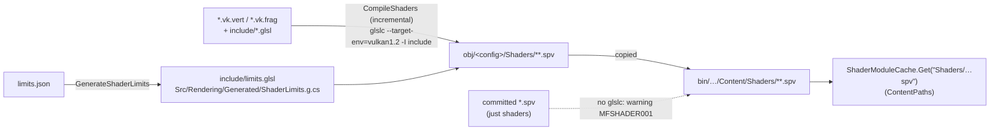

# Shaders

## Purpose

Inventory of every GLSL file in [`MainframeEngine/Content/Shaders`](../../MainframeEngine/Content/Shaders),
which C# class loads it, its interface (inputs, sets, bindings, push constants), and how shaders are
built, shared and kept in sync with C#.

## Workflow

Shaders compile as part of `dotnet build` ([ADR 0007](../../memory/decisions/0007-build-time-shaders-and-shared-limits.md)).

- Vulkan shaders use the `*.vk.vert` / `*.vk.frag` naming; entry point `main`. The targets live in
  [`build/Shaders.targets`](../../build/Shaders.targets), imported by `MainframeEngine.csproj`.
- `glslc` is `$(Glslc)`, else `$(VULKAN_SDK)/bin/glslc`, else `glslc` on `PATH`. Without it the build
  warns and copies the committed `.spv` files; `-p:CompileShaders=false` forces that (CI does: its
  runners have no glslc and build with `-warnaserror`).
- Shader sources, includes and `shaders.lock` are not copied to the output; only `.spv` files are.
- **After editing a shader** run `just shaders` (recompiles the committed `.spv` with the same flags
  and rewrites `shaders.lock`) and commit the `.spv` files with the lock. `just shaders-check` (and CI)
  fail when a source, an include or a `.spv` no longer matches the lock.
- C# loads modules through `IVulkanContext.Shaders` (`ShaderModuleCache`): one module per file, shared
  by every pipeline. Pipelines go through `IVulkanContext.Pipelines` (the persisted pipeline cache).

## Shared includes

`#extension GL_GOOGLE_include_directive : require`, then `#include "x.glsl"` (resolved through `-I include`).

| Include | Contents | Override macros |
|---|---|---|
| `limits.glsl` | **Generated** from `limits.json` — `MAX_DIR_LIGHTS`, `MAX_POINT_LIGHTS`, `MAX_SPOT_LIGHTS`, `MAX_SHADOW_DIR/SPOT/POINT`, `MAX_SHADOW_CASCADES`, `MAX_SHADOW_ATLAS_MAPS` | — |
| `common.glsl` | `PI`, `srgbToLinear`, `linearToSrgb`; includes `limits.glsl` | — |
| `frame.glsl` | Set 0 binding 0 `FrameData` (camera, viewport, near/far, time, exposure), `linearizeDepth` | — |
| `shadows.glsl` | Shadow set (`ShadowUBO`, cascade array, atlas, point cubes; all comparison samplers), receiver bias, PCF kernels, `dirShadow/spotShadow/pointShadow`, `shadowCascadeTint` (includes `frame.glsl`) | `SHADOW_SET` (default 1) |
| `lights.glsl` | Lights UBO, Blinn-Phong per light, `shadeLightsBlinnPhong(base, N, Ngeo, worldPos, specular, shininess)` (`Ngeo`: geometric normal for the shadow normal offset) and `shadeLights` (0.3, 32); `counts.w = 1` skips shadow maps (offscreen views) (needs `shadows.glsl` first) | `LIGHTS_SET`/`LIGHTS_BINDING` (default 0/1) |
| `material.glsl` | `StandardMaterial3D` set 2 (`MATERIAL_SET`; the cutout shadow casters use 1) (parameters UBO, one sampler, albedo/normal/emission images), `materialUv/Albedo/Emission`, `materialNormal` (derivative tangent frame) | — |
| `sky.glsl` | Sky push constants (`SkyParams`), `skyRay(ndc)` | — |

## Descriptor frequency model

| Set | Frequency | Contents | Owner |
|---|---|---|---|
| 0 | per frame | b0 `FrameData` (368 B), b1 lights UBO (1200 B) | `FrameContext` (`IVulkanContext.Frame`) |
| 1 | per frame | shadows (`shadows.glsl`) | `ShadowSystem` or the renderer's fallback |
| 2 | per material | `StandardMaterial3D` (`material.glsl`); other drawers' textures (sky, Spine) | `MaterialGpu`, the drawer |
| binding 1 (vertex input) | per instance | mesh instances: model matrix + object id (`MeshInstanceData`) | `MeshRenderer` instance buffer |
| push | per draw | 128-byte vertex+fragment range: model matrix (+ extras) for non-batched drawers | the drawer |

`FrameContext.Begin(camera, lights)` writes set 0 once per frame; renderer-owned drawers (sky, grid,
Spine) call `EnsureCamera`/`EnsureLights` with the camera they were given, which write only if nothing
has this frame. Pipeline layouts made with `FrameContext.CreatePipelineLayout` share set 0 (and set 1
when they take shadows) and the push range, so they are compatible. Every frame *view* (main view, offscreen
`SubViewport`s) has its own set 0 copy (`FrameContext.SetView`). Meshes follow the model through the
[mesh renderer](materials-and-meshes.md#descriptor-sets).

## In use

| Shader | Loaded by | Inputs | Sets / bindings | Push constants |
|---|---|---|---|---|
| `Mesh/Mesh.vk.vert` | `MeshRenderer` (all mesh pipelines) | 0 `vec3 pos`, 1 `vec3 normal`, 2 `vec2 uv`; instance 3–6 model rows, 7 `uint objectId` | s0 frame | — |
| `Mesh/Mesh.vk.frag` | `MeshRenderer` (`MeshLit`) | world pos, normal, uv, id | s0 frame + lights · s1 shadows · s2 material | — ; specialization 0 `kAlphaMode` |
| `Mesh/MeshId.vk.frag` | `MeshRenderer` (`MeshObjectId`) | same | s2 material (cutout) | — ; specialization 0 `kAlphaMode`; writes `uint` |
| `Mesh/MeshOutline.vk.vert` | `MeshRenderer` (`MeshOutline`) | same as `Mesh.vk.vert` | s0 frame · s2 b0 material (`flags.w` = outline width bits; the binding is visible to the vertex stage) | — |
| `Shadows/Shadow2DInstanced.vk.vert`, `ShadowPointInstanced.vk.vert` | `ShadowSystem` (instanced casters) | 0 `vec3`; instance 1–4 model rows | s0 b0 `LightVP` (dynamic offset) | point: `lightPosRange` at offset 64 |
| `Spine/SpineLit.vk.vert` | `SpineRenderer` | 0 `vec3`, 1 `vec2`, 2 `vec4` | s0 frame | `mat4 model; vec4 worldNormal` |
| `Spine/SpineLit.vk.frag` | same | uv, tint, world pos, normal | s0 frame + lights · s1 shadows · s2 b0 `sampler2D` | — ; specialization 0 `kPremultipliedTexture` |
| `Shadows/Shadow2D.vk.vert/.frag` | `ShadowSystem` | 0 `vec3` | s0 b0 `LightVP{mat4}` (dynamic offset) | `mat4 model` (64 B). The frag shader is empty (depth only). |
| `Shadows/ShadowPoint.vk.vert/.frag` | `ShadowSystem` | 0 `vec3` | s0 b0 `LightVP{mat4}` (dynamic offset) | `mat4 model; vec4 lightPosRange` (80 B). The frag shader writes linear `gl_FragDepth`. |
| `Sky/Sky.vk.vert` | `SkyEnvironment` | `gl_VertexIndex` | — | — |
| `Sky/Sky.Procedural.vk.frag` | same | NDC xy | s0 frame | `SkyParams` (96 B) |
| `Sky/Sky.Panoramic.vk.frag` | same | NDC xy | s0 frame, s1 b0 `sampler2D` (sRGB) | `SkyParams` |
| `Sky/Sky.Cubemap.vk.frag` | same | NDC xy | s0 frame, s1 b0 `samplerCube` (sRGB) | `SkyParams` |
| `SceneGrid/SceneGrid.vk.vert/.frag` | `SceneGrid` | 0 `vec3`, 1 `vec4`, 2 `vec3` (other end of the line; the vertex shader clips the line) | s0 frame | — |
| `Post/Fullscreen.vk.vert` | tonemap pass | `gl_VertexIndex` | — | — |
| `Post/Tonemap.vk.frag` | `VulkanRenderer` | `gl_FragCoord` | s0 b0 `sampler2D` HDR scene | `float exposure; uint encodeSrgb` (8 B) |
| `Post/TonemapPost.vk.frag` | `VulkanRenderer` (non-default `PostProcessSettings`, ADR 0124) | `gl_FragCoord` | s0 b0 `sampler2D` HDR scene, b1 `sampler2D[7]` glow levels | exposure, encodeSrgb, tonemapper, glow mode/enabled/intensity, white, whiteTonemapped, 7 weights (60 B) |
| `Post/GlowBlur.vk.frag` | `GlowEffect` (ADR 0124) | `gl_FragCoord` | s0 b0 `sampler2D` source (scene, temp or previous level) | dstSize, flags (horizontal, first), strength, exposure, threshold, scale, bloom, luminanceCap (36 B) |
| `Gizmos/ScreenGizmo.vk.vert/.frag` | `ScreenGizmosRenderer` ([Developer overlay](dev-overlay.md#screen-gizmos)) | 0 `vec2` (pixels), 1 `vec4` (sRGB, straight alpha) | — | `vec2 scale; vec2 translate`; specialization 0 `kLinearizeColors` |

The legacy OpenGL shaders and the unused `Quad.vk.*`/`Spine.vk.*` were deleted in M3, and `Shapes/Shapes.vk.*`
with `ShapeBase` (replaced by the mesh shaders).

## Constants that must match C#

Light and shadow limits come from [`limits.json`](../../MainframeEngine/Content/Shaders/limits.json)
(edit only there): `LightEnvironment.MaxDirectional/MaxPoint/MaxSpot` and
`ShadowSystem.MaxShadowDir/MaxShadowSpot/MaxShadowPoint/MaxCascades` are defined from the generated `ShaderLimits`;
`ShaderLimitsTests` fails if the generated files drift or a shader re-`#define`s a limit.

The UBO and push layouts (`LightsUBO` 1200 B, `FrameData` 368 B, `SkyParams` 96 B, `ShadowUBO`
1680 B) must match the C# writers byte for byte. See [Lighting](lighting.md#lights-ubo),
[Sky](sky.md) and [Shadow system](shadow-system.md#shadowubo).

## Known issues

- `.spv` files are committed as the no-SDK fallback, so a shader change touches both the source and
  the binary (enforced by `shaders.lock`).

## Related docs

[Build & platforms](build-and-platforms.md) · [GPU resources](gpu-resources.md) ·
[Color pipeline](color-pipeline.md) · [Vulkan renderer](vulkan-renderer.md)
