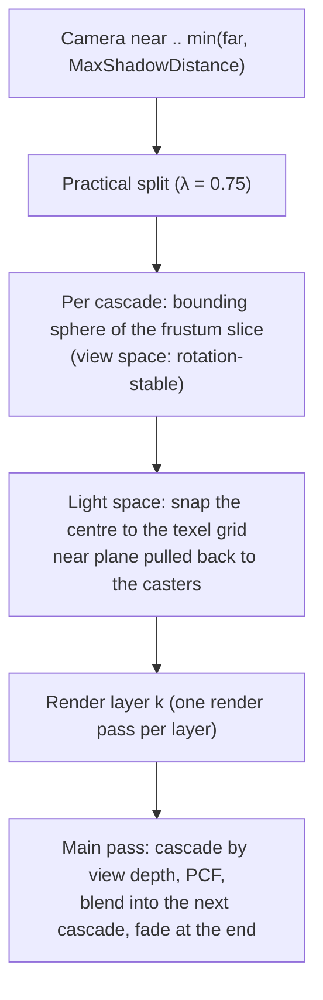
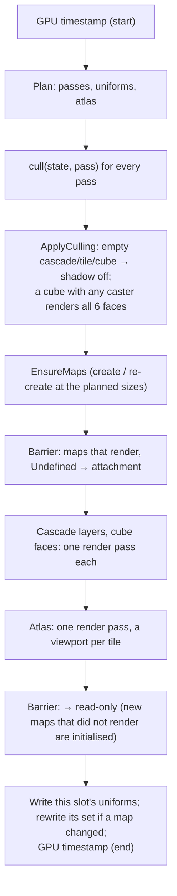

# Shadow System

## Purpose

`ShadowSystem` renders the depth maps of every shadowed light during the shadow pre-pass and exposes the shadow
descriptor set (set 1 of every lit scene pipeline: meshes, Spine) that the main pass samples:

- **Cascaded shadow maps** for the primary directional light: up to 4 cascades fitted to the camera, texel-snapped so
  they never shimmer, blended at their seams and faded out at the shadow distance.
- **One shadow atlas** for spot lights and the other directional lights, with a tile per light.
- **Cube maps** for point lights.
- **PCF** everywhere (hard, 3×3 or Poisson 16; a 20-tap disc for cubes), with receiver depth and normal-offset bias.
- **Per-light settings** (`CastsShadows`, `ShadowResolution`, biases, cascade settings), exported on the light nodes.
- **Per-pass caster culling**; passes nothing casts into are skipped. Cutout materials cast alpha-tested shadows.
- **Shadow quality (G8e.2, [ADR 0167](../../memory/decisions/0167-shadow-quality-staggered-pcss-contact-far.md))**, opt-in
  per sun: **staggered cascades** (cascade 0 every frame, the others every 2 or 4 frames), **coarse casters** in the far
  cascades, **PCSS** from the light's angular size, **screen-space contact shadows** and a **far shadow** past the
  cascades, rendered once. See [Shadow quality](#shadow-quality-g8e2).

The frame's CPU work (which light gets which map, cascade fitting, atlas packing, the shader uniforms) is
`ShadowPlanner`, which holds no GPU state. It is unit-tested and benchmarked on its own, and it does not allocate.
Maps are `GpuImage`s from the GPU allocator, created when a light first needs them, re-created when their size
changes, and released after 120 frames without a light that needs them. `Dispose` defers everything to the deletion queue (see [GPU resources](gpu-resources.md)).

Decisions: [ADR 0070 cascades](../../memory/decisions/0070-cascaded-shadow-maps-sphere-fit-and-snapping.md),
[0071 atlas](../../memory/decisions/0071-shadow-atlas-and-six-shadow-samplers.md),
[0072 filtering and bias](../../memory/decisions/0072-pcf-and-receiver-bias.md),
[0073 culling](../../memory/decisions/0073-per-pass-caster-culling.md),
[0074 cutout casters](../../memory/decisions/0074-alpha-tested-shadow-casters.md),
[0167 shadow quality](../../memory/decisions/0167-shadow-quality-staggered-pcss-contact-far.md).

## Key types

| Type | File | Role |
|---|---|---|
| `ShadowSystem` | [ShadowSystem.cs](../../MainframeEngine/Src/Rendering/Shadows/ShadowSystem.cs) | GPU side: maps, render pass, pipelines, light-matrix ring, shadow set per frame slot, recording, timing |
| `ShadowPlanner` (internal) | [ShadowPlanner.cs](../../MainframeEngine/Src/Rendering/Shadows/ShadowPlanner.cs) | CPU side: light → map assignment, passes, uniforms, atlas packing, culling results |
| `ShadowMath` | [ShadowMath.cs](../../MainframeEngine/Src/Rendering/Shadows/ShadowMath.cs) | Splits, slice bounding sphere, texel snapping, light matrices, texel sizes, receiver offset |
| `ShadowAtlasAllocator`, `ShadowAtlasTile` | [ShadowAtlasAllocator.cs](../../MainframeEngine/Src/Rendering/Shadows/ShadowAtlasAllocator.cs) | Quadtree (buddy) allocator for power-of-two tiles |
| `ShadowPass`, `ShadowPassKind`, `ShadowCasterCull`, `ShadowCasterDraw` | [ShadowPass.cs](../../MainframeEngine/Src/Rendering/Shadows/ShadowPass.cs) | One sub-pass (matrix, frustum, viewport) and the caster callbacks |
| `ShadowUniforms` (internal), `ShadowFilter` | [ShadowUniforms.cs](../../MainframeEngine/Src/Rendering/Shadows/ShadowUniforms.cs) | The std140 shadow UBO; the filter modes |
| `ShadowFallback` (internal) | [ShadowFallback.cs](../../MainframeEngine/Src/Rendering/Shadows/ShadowFallback.cs) | The "no shadows" set when there is no `ShadowSystem` |
| `ShadowCacheMode`, `ShadowCasterLod`, `ShadowCacheSchedule` | [ShadowCaching.cs](../../MainframeEngine/Src/Rendering/Shadows/ShadowCaching.cs) | Staggered cascades, the caster LOD of an instance, the schedule (pure functions) |
| `ContactShadows` (internal), `ContactShadowSettings` | [ContactShadows.cs](../../MainframeEngine/Src/Rendering/Post/ContactShadows.cs) | The `AfterPrepass` contact-shadow effect and what it reads from the sun |

## Which light gets which map

`ShadowPlanner.Plan(lights, camera, casterBounds)` runs once per frame. Lights are taken in `LightEnvironment` order,
the same order as the lights UBO, up to its limits.

| Light | Map | Size |
|---|---|---|
| First directional light with `CastsShadows` (the *primary*) | Cascades: layers of a 2D array (`CascadeCount` of 4) | `ShadowResolution` (default 2048) per layer, 128–4096 |
| Other shadowed directional lights (up to 3) | One atlas tile each, covering the whole shadow distance | `ShadowResolution / 2` (a 2048 sun costs a 1024 tile) |
| Shadowed spot lights (all 8) | One atlas tile each | `ShadowResolution` (default 1024) |
| First 4 shadowed point lights | A cube map each (six faces) | `ShadowResolution` (default 512) per face, 64–2048 |

Resolutions are rounded to the nearest power of two (`Light.ShadowResolutionPow2`). Shadowed point lights past the
fourth light without shadows.

| Limit (from `limits.json`) | Value |
|---|---|
| `MaxShadowDir` (`MAX_SHADOW_DIR`) | 4: the primary + 3 atlas tiles |
| `MaxShadowSpot` (`MAX_SHADOW_SPOT`) | **8**: every spot light (was 7 before M4, see [Samplers](#descriptor-set)) |
| `MaxShadowPoint` (`MAX_SHADOW_POINT`) | 4 |
| `MaxCascades` (`MAX_SHADOW_CASCADES`) | 4 |
| `MAX_SHADOW_ATLAS_MAPS` | 11 = 3 + 8 |
| `MaxShadowPasses` | 40 = 4 cascades + the far shadow + 11 tiles + 4 × 6 faces |

## Cascades



- **Splits:** `split_i = λ·n·(f/n)^(i/N) + (1−λ)·(n + (f−n)·i/N)` (`ShadowMath.ComputeSplits`) between the camera near
  plane and `min(far, MaxShadowDistance)` (default 100). `CascadeSplitLambda` (default 0.75) blends the logarithmic
  and the uniform scheme.
- **Fit:** `ShadowMath.SliceSphere` finds the smallest sphere around the slice's eight corners: its centre is on the
  view axis, where the near and far corners are equidistant, and it is clamped to the far plane. It is computed in
  view space, so rotating or moving the camera moves the sphere rigidly and never resizes it. The radius is rounded
  up to 1/16 unit.
- **Snap:** `ShadowMath.SphereLightMatrix` projects the centre into light space (`LightRotation(direction)`, which
  depends only on the light) and rounds x, y and depth down to the texel size `2h / resolution`. The orthographic
  window is `±h`, with `h = r·resolution / (resolution − 2)`: one texel of margin, so the snap (up to one texel)
  never uncovers the sphere. The texel grid is fixed in the world: camera moves below a texel leave the matrix unchanged, and
  larger ones shift it by whole texels. `StableCascades = false` turns snapping off, for comparison only.
- **Near plane:** the light-space near plane is pulled back towards the light by `ShadowMath.CasterPullback`: up to
  the front of the union of the casters' bounds (`MeshViewDraws.CasterBounds`). It is at least 10 units, because
  Spine and other unbounded casters have no bounds, and at most 1000 units, for depth precision. It is rounded up to
  whole units.
- **Sampling** (`sampleCascades` in `shadows.slang`):
  - The view depth (`-(frame.view · p).z`) selects the cascade.
  - Over the last `CascadeBlend` (default 0.1) of a cascade, the result blends into the next cascade with
    `smoothstep`.
  - The last cascade fades to lit over its band, which ends at the shadow distance.
  - A cascade without casters is disabled (`cascadeEnabled`) and samples as lit.
- **Debug view:** `ShadowSystem.DebugCascades` tints the main view red, green, blue and yellow by cascade.

## Shadow quality (G8e.2)

Five features of the primary directional light ([ADR 0167](../../memory/decisions/0167-shadow-quality-staggered-pcss-contact-far.md)),
all off by default, so existing scenes and goldens do not change. The Forest turns them all on.

| `DirectionalLight3D` | Default | Forest | What it does |
|---|---|---|---|
| `ShadowCacheMode` | `Off` | `Staggered` | [Staggered cascades](#staggered-cascades) |
| `ShadowCoarseCascades` | 0 | 2 | the last N cascades draw [coarse casters](#coarse-casters) |
| `LightAngularDistance` | 0 | 0.5° | Godot's `light_angular_distance`: [PCSS](#pcss) on `High` |
| `ContactShadows`, `ContactShadowLength` | false, 0.5 m | true, 0.4 m | [contact shadows](#contact-shadows) on `High` |
| `FarShadowEnabled`, `FarShadowDistance` | false, 0 (every caster's bounds) | true, 0 | the [far shadow](#far-shadow) |

### Staggered cascades

`ShadowCacheMode.Staggered`: cascade 0 renders every frame, cascade 1 on even frames, and with four cascades cascades 2
and 3 on alternate odd frames (60 / 30 / 15 / 15 Hz at 60 fps; with three, cascade 2 on odd frames), so at most two
cascade passes render per frame (`ShadowCacheSchedule.IsDue`). Between its renders a cascade keeps its layer, its
matrix, its depth range and whether it had casters (`ShadowPlanner`'s cache), and the shaders sample it with that matrix.

- **Growth.** A cached cascade's sphere is grown by the camera's travel and turn over its interval at 60 Hz
  (`ShadowCacheSchedule.Margin`): `ShadowSystem.CacheMaxSpeed` (10 m/s: 0.33 m for cascade 1, 0.67 m for 2 and 3) plus
  `CacheMaxTurnRate` (60°/s) × the sphere centre's distance ahead of the camera (turning swings a far slice's sphere:
  5.6 m for a sphere 80 m ahead over 4 frames); never cascade 0. The margin is a constant per cascade, so the texel grid
  stays put between renders (no shimmer).
- **Early re-render.** A cascade renders before it is due when the current slice's sphere leaves the one it rendered
  (a faster camera, a cut, a teleport), and every cascade re-renders when the light turns, the resolution, cascade count,
  splits or layers change, or after `ShadowSystem.InvalidateShadowCache()`.
- **GPU.** Cascade layers get one barrier each: only the layers that render are discarded (`Undefined`) and written; the
  others stay in `DEPTH_STENCIL_READ_ONLY_OPTIMAL`.
- **Stale casters.** A moving caster lags in a cached cascade by up to its interval (67 ms for cascades 2–3: wind sway
  at 30 m and more is not visible).

### Coarse casters

`GeometryInstance3D.ShadowCasterLod` says which passes an instance casts into: `All` (default), `Fine` (only the fine
passes: the nearer cascades, atlas tiles, cubes) or `Coarse` (the coarse passes **from any distance**, its visibility
range ignored for them, and the fine passes while in range, so near cascades still get far trees' long shadows and no
tree is drawn twice). The coarse passes are the light's last `ShadowCoarseCascades` cascades and the
far shadow (`ShadowPass.Coarse`). `MeshRenderer.Prepare` collects out-of-range `Coarse` instances as casters too, and
`CullShadowCasters` skips the items whose pass mask does not match the pass.

`TreeScatter.ShadowCoarseLod` (default −1, off) maps it onto the tree levels: that level is `Coarse`, the finer ones
`Fine` (up to `ShadowMaxLod`), the coarser ones cast nothing. The Forest uses level 1: its far cascades and far shadow
draw every tree at level 1 and none at level 0. (Ez Tree's level 2 casts nearly opaque canopy shadows: with it the
floor of R5 went black under the 21° sun.) This is the hook G8e.5's impostor casters will use: an
impostor caster is a `Coarse` instance.

### PCSS

`ShadowFilter.Pcss` (the default and `High`'s filter) is `Poisson16` plus percentage-closer soft shadows on the primary
light's cascades when its `LightAngularDistance` is above 0 (`filterCascadePcss` in `shadows.slang`):

1. **Blocker search:** five 2 × 2 gathers (20 depths: the centre and four points near the rim of `MaxPenumbraTexels`, 8
   texels) through the cascade array's point sampler (binding 5): the mean depth of the texels nearer the light than the
   receiver. None: lit; all 20: the umbra. Both skip the filter (most of a forest floor is one or the other). A first
   version with 16 point taps and no umbra exit cost about 3 ms more in the Forest.
2. **Penumbra:** `(d_receiver − d_blocker) · depthRange · tan(angle / 2)` in texels of the cascade
   (`ShadowMath.PcssPenumbraTexels` mirrors it; `cascadeDepthRange` holds each cascade's world depth span).
3. **Filter:** the 16-tap Poisson comparison disc at that radius, clamped to [`FilterRadius`, 8 texels].

Leaf shadows 20 m below the canopy blur into dapples while trunk bases stay sharp (`shadow-pcss`: a plank 6.5 m up casts
a penumbra about 3 times as wide as a 1 m wall's). **TAA:** when the main view is jittered (`frame.jitter` ≠ 0, which only
TAA asks for), the pattern rotates per pixel and frame by interleaved gradient noise (`shadowRotation`) and the filter
drops to 12 taps, which TAA converges; otherwise the pattern stays fixed (no crawl, ADR 0072), and a wide penumbra shows the
16 taps as soft steps. Atlas maps (spots, secondary suns) and cubes keep the Poisson filter.

### Contact shadows

An `AfterPrepass` post effect (`ContactShadows`, `PostEffectOrder.ContactShadows`, after SSAO) when the root world's
primary light has `ContactShadows` and the shadow system allows them (`ShadowSystem.ContactShadows`, true on `High`):

- **March:** one full-resolution pass (`Post/ContactShadows.vk.frag`) rebuilds each prepass pixel's view position and
  steps 12 times towards the light over `ContactShadowLength`, against the prepass depth: occluded when a step lies
  behind the stored depth by more than a bias (1 cm + 0.2 % of the depth) and less than the thickness (0.2 m + 1 %).
  Contact shadows fade out from 42 m to 60 m and at the screen's edges. With TAA each ray's start is jittered by
  interleaved gradient noise per frame; without, it starts half a step out (static noise would dither the edges).
- **Output:** `R16G16_SFLOAT` (r = shadow, g = the pixel's view depth) from the post target pool, bound at **set 0,
  binding 6** (`FrameContext.ContactShadowBinding`, `contact_shadows.slang`) like SSAO's binding 5: latched at the frame
  set's first bind, white 1×1 without the effect and in offscreen views.
- **Shading:** `dirShadow` multiplies the cascaded term by `contactShadow(worldPos)` when the shadow UBO's `contact.x` is
  set. It projects the point with the (jittered) view-projection and uses the contact shadow only where its view depth
  matches g, so transparent surfaces, water and whatever the prepass did not draw are not darkened by what lies behind.
- **SSAO (lane S):** a separate target for now; G8e.1 folds it into the AO target's G channel and retires binding 6.

### Far shadow

`FarShadowEnabled` adds a layer to the cascade array (layer 4, `ShadowSystem.FarShadowLayer`, at the cascade resolution;
only while a light has one, so other scenes keep four layers) holding an orthographic map along the light over every
caster's bounds (`FarShadowDistance` 0) or a box of ±`FarShadowDistance` around the camera on a quarter-distance grid
(`ShadowMath.BoxLightMatrix`). It is a coarse pass (`ShadowPassKind.FarShadow`), so it draws the terrain, `All` casters
and the `Coarse` ones (the trees' level 2), and it renders **once**: again only when the light turns by more than 0.1°,
the covered box outgrows the one rendered (it is grown by 2 %), the resolution changes or the cache is invalidated.
`sampleCascades` uses it past the last cascade and blends into it over the last cascade's band instead of fading to lit,
with a 2.5-texel Poisson disc. A far shadow without casters is off (and not re-rendered). It costs no binding: it is a
layer of the cascade array, so it also renders in its own render pass, which keeps the atlas's single pass intact.

## Atlas

- **Allocation:** `ShadowAtlasAllocator` is a quadtree (buddy) over power-of-two tiles of at least 64². Tiles are
  placed largest first in Z order, which never fragments: any set whose area fits is placed at full size.
- **Overflow:** when the requests do not fit, the largest tiles are halved first, so every light keeps a shadow.
  Requests are dropped only when every tile is at the minimum size.
- **Size:** the atlas grows to the smallest power of two that holds every tile, up to `MaxAtlasSize` (default 4096).
  It never shrinks while it has tiles.
- **Packing:** the atlas is re-packed only when the requests (lights or sizes) change (`AtlasPackCount`), so tiles
  stay put otherwise.
- **Rendering:** the whole atlas renders in **one render pass**. It is cleared and stored once, and each tile is a
  viewport and scissor. On tile-based GPUs (MoltenVK), a render pass per tile would load and store the whole atlas
  each time.
- **Sampling:** each map's `rect` (offset, size in UV) maps its `[0, 1]` coordinates into the atlas. Every PCF tap is
  clamped half a texel inside the tile, so it never reads a neighbour.
- **Secondary directional lights:** their tile covers `[near, min(far, MaxShadowDistance)]` with one sphere fit,
  texel-snapped like a cascade, and fades to lit over the last tenth of that distance (`params.y = −distance`). They
  have no cascades.

## Point lights

Each shadowed point light renders a cube: six 90° faces with near 0.05 and far `Range`. `ShadowPoint.vk.frag` writes
`length(p − light) / range` as depth, so the raster depth bias is 0 in point passes. Cubes are created at the light's
resolution and re-created when it changes. Unused slots bind a 1×1 placeholder.

## `RenderShadows`

```csharp
// Render server form: planning, culling, recording. Static lambdas + explicit state: no allocations.
public void RenderShadows<TState>(LightEnvironment lights, ICamera? camera, in Aabb casterBounds, TState state,
    ShadowCasterCull<TState> cull,   // (state, in ShadowPass) → bool: has casters (write per-pass instances here)
    ShadowCasterDraw<TState> draw)   // (state, cb, in ShadowPass): record the pass's casters

// Tree-less forms (no camera fit, no culling): the per-object pipelines are passed to the callbacks.
public void RenderShadows<TState>(LightEnvironment lights, TState state, ShadowDraw2D<TState> draw2D, ShadowDrawPoint<TState> drawPoint)
public void RenderShadows(LightEnvironment lights, Action<…> draw2D, Action<…> drawPoint)
```

It is called from `RenderServer.RenderShadows` after `Engine.OnShadowPass`, with the command buffer open and no render
pass active. Call it at most once per frame.



Before each pass's callback runs, the system:

- writes the pass's light view-projection into its ring slot and binds it (dynamic offset);
- sets the viewport and scissor: the whole map, or the tile;
- sets the depth bias: `DepthBiasConstant` 1.25 and `DepthBiasSlope` 1.75, or 0 for cube faces.

The render server's callbacks:

- `MeshRenderer.CullShadowCasters` and `DrawShadowCasters` handle the batched meshes (see
  [Culling](#caster-culling)).
- Non-batched visuals (Spine) have no bounds: when any is visible and casting, every pass renders and they draw into
  each pass with the per-object pipelines (`GetShadow2DPipeline(stride)` / `GetShadowPointPipeline(stride)`).

### Light view-projection ring

Each sub-pass needs its own light matrix that survives until the GPU executes it. The matrices live in a host-mapped
dynamic-offset uniform ring:

- `MaxFramesInFlight × MaxShadowPasses` slots, each padded to `max(256, minUniformBufferOffsetAlignment)` bytes
  (`UniformRing`).
- Set 0 of every caster pipeline layout is that ring's `UniformBufferDynamic` descriptor.
- Pass *i* writes its matrix at `Offset(frameSlot, i)`, so frame N+1 never overwrites frame N's matrices.

This is what fixed GitHub issue #2 in M1: every pass used to execute with the last matrix written. The
`multi-light` and `shadow-lights` render tests check that every pass's ring slot holds its own planned matrix.

### Caster culling

`MeshRenderer.Prepare` collects one caster item per shadow-casting surface: cull mode, mirrored, cutout material,
mesh, surface and world bounds. Casters are sorted `[cull][mirrored][cutout material][mesh][surface]`, and their
bounds are merged into `CasterBounds`.

For each pass, `CullShadowCasters` works in two steps:

1. It tests each caster against the light's sphere when the light has a range, then against the pass frustum
   (`Frustum` from the light view-projection).
2. It writes the survivors' instance data, in sort order, to the frame's instance buffer, as runs of equal draw
   state.

`DrawShadowCasters` records one instanced draw per run. A pass without casters returns false and is skipped.

Counters: `MeshDrawStats.ShadowDrawCalls`, `ShadowInstances` and `ShadowCulled`; `ShadowSystem.PlannedPasses` and
`RenderedPasses`.

### Pipelines

| Pipeline | Layout | Shaders |
|---|---|---|
| per-object 2D / point, stride 12 or 32 | set 0 light VP; push `mat4 model` (+ `vec4 lightPosRange` for point, V+F) | `Shadow2D`, `ShadowPoint` |
| instanced 2D / point (`GetInstancedCasterPipeline(point, cull, mirrored)`) | same layouts; positions at binding 0, model rows at binding 1 | `Shadow2DInstanced`, `ShadowPointInstanced` |
| instanced cutout (`…, cutout: true`) | + set 1 the mesh material set (`CutoutLayout(point)`) | `Shadow2DCutoutInstanced` + `ShadowCutout`, `ShadowPointCutoutInstanced` + `ShadowPointCutout` |

Rasterisation details:

- **Winding:** geometry is counter-clockwise. The shadow passes use an unflipped viewport, so front faces (facing
  the light) arrive clockwise: `FrontFace = Clockwise`, back faces culled. Mirrored instances use counter-clockwise,
  and double-sided materials cull nothing.
- **Dynamic state:** depth bias, viewport and scissor.
- **Render pass:** every pipeline is built against the single depth-only render pass (clear, store). Cascades,
  atlas and cubes all use it.

## Descriptor set

| Binding | Type | Contents |
|---|---|---|
| 0 | UniformBuffer | `ShadowUBO` (`ShadowUniforms`, std140, 1840 B; one buffer per frame slot) |
| 1 | SampledImage | cascade array (`Texture2DArray<float>`: the cascades, then the far shadow) |
| 2 | CombinedImageSampler, immutable comparison sampler | atlas (`sampler2DShadow`) |
| 3 | CombinedImageSampler × 4, immutable comparison sampler | point cubes (`samplerCubeShadow`) |
| 4 | Sampler, immutable comparison sampler | the cascade array's comparison taps |
| 5 | Sampler, immutable nearest sampler | the cascade array's raw depth (PCSS's blocker search) |

**Six images, seven samplers.** The cascade array is a separate image since ADR 0167, so PCSS's point sampler costs a
sampler, not an image. The `MaxShadowSpot = 7` hack (M4) is long gone, and every spot light casts. The fragment stage of
the lit pipelines declares 15 sampled images and 13 samplers (terrain splat: 16 and 14) of MoltenVK's 16: set 0 five
(sky radiance, irradiance, BRDF LUT, SSAO, contact shadows), set 1 six, the material four (terrain five).
`ImageBasedLightingTests.FragmentStageStaysWithinTheBindingBudget` pins it. The next set-0 image (G8e.1's probes) needs
the irradiance cube moved to SH L2 in the lights UBO, or the contact shadows folded into the AO target. The comparison sampler is linear, so each tap is a
2×2 hardware PCF where the depth format filters, with `CompareOp.Less` and clamp-to-edge. It is baked into the
layout because MoltenVK reports `mutableComparisonSamplers = false`.

Each frame slot has its own set:

- **Rewriting:** a slot's set is rewritten when a map is re-created. The rewrite happens at that slot's next
  `RenderShadows` or `GetMainSet`, when the slot's previous frame has completed.
- **Old maps:** they are freed through the deletion queue.
- **Frames without `RenderShadows`:** `GetMainSet` clears that slot's uniforms, so no light samples a stale map.

### `ShadowUBO`

| Offset | Field | Contents |
|---|---|---|
| 0 | `ShadowMap2D cascades[4]` | `mat4 viewProj`, `vec4 rect`, `vec4 params` (texel world size, perspective flag, depth bias, normal bias) |
| 384 | `ShadowMap2D atlasMaps[11]` | the same for atlas tiles: `rect` = tile in atlas UV; spots: texel size per unit distance |
| 1440 | `vec4 cascadeSplits` | view depth where each cascade ends |
| 1456 | `vec4 cascadeEnabled` | 1 when the cascade rendered |
| 1472 | `vec4 csm` | count, blend band, shadow distance, debug tint |
| 1488 | `vec4 filterParams` | filter mode, radius (texels), 1/cascade size, 1/atlas size |
| 1504 | `ivec4 dirCodes[1]` | per directional light: 0 none, 1 cascades, k + 2 atlas map k |
| 1520 | `ivec4 spotCodes[2]` | per spot light: 0 none, k + 1 atlas map k |
| 1552 | `ivec4 pointCodes[4]` | per point light: 0 none, c + 1 cube c |
| 1616 | `vec4 pointParams[4]` | per cube: 2 / size, depth bias, normal bias |
| 1680 | `ShadowMap2D farMap` | the far shadow's matrix, rect, params (ADR 0167) |
| 1776 | `vec4 farParams` | 1 when the far shadow is on, its filter radius (texels), 1 / size |
| 1792 | `vec4 cascadeDepthRange` | world depth span of each cascade (PCSS) |
| 1808 | `vec4 pcss` | tan(angular radius) (0 = off), largest penumbra and search radius (texels) |
| 1824 | `vec4 contact` | x = 1: the primary light takes the contact shadows (set 0, binding 6) |

The codes index the shadow arrays by light index (the lights UBO order). An all-zero UBO, as in the fallback or a
frame without shadows, means no light has a shadow. `ShadowPlannerTests.UniformLayoutMatchesTheShaderBlock` pins
the offsets; they were checked with `spirv-reflect` on `Mesh.vk.frag`.

## Sampling and filtering

`lights.slang` asks `dirShadow`, `spotShadow` and `pointShadow` (in `shadows.slang`) for each light's term, passing the
geometric normal. Normal-mapped normals would make the offset noisy.

**Receiver offset** (`shadowReceiver`, mirrored by `ShadowMath.ReceiverPosition`): before projecting, the surface
point moves:

- towards the light by `ShadowBias` texels (default 0.5);
- along the normal by `ShadowNormalBias` texels (default 1.5) × sin(angle to the light).

Here a texel is its world size at that point:

- cascades and secondary directional lights: `2h / size` (h ≈ the sphere radius, see [Cascades](#cascades));
- spots: `2·tan(outer) / size × distance`;
- cubes: `2 / size × distance`.

The offset removes acne at any angle without moving shadows away from their casters, so there is no peter-panning.
The raster slope-scaled bias adds a little more for 2D maps.

| `ShadowSystem.Filter` | 2D maps | Cubes |
|---|---|---|
| `Hard` | 1 comparison tap (bilinear 2×2) | 1 tap |
| `Pcf3x3` | 3 × 3 taps, `FilterRadius / 1.5` texels apart | 20-tap disc |
| `Poisson16` | 16-tap Poisson disc, radius `FilterRadius` (default 1.5) texels | 20-tap disc, radius `FilterRadius` texels at that distance |
| `Pcss` (default) | `Poisson16`; on the primary light's cascades with an angular size, [PCSS](#pcss) | 20-tap disc |

Poisson taps are **not** rotated per pixel without TAA: screen-space noise would move with the camera and make edges
crawl. Each tap's bilinear comparison already smooths the steps. With TAA, PCSS rotates them ([PCSS](#pcss)).

## Without a `ShadowSystem`

Shadows are optional:

- **Switching them off:** `RenderServer.ShadowsEnabled = false`.
- **What lit pipelines bind:** the renderer's `ShadowFallback` set instead. It has the same layout (built by
  `CreateMainSetLayout`), 1×1 placeholder maps cleared to far depth (array, 2D, cube) and an all-zero UBO.
- **Set indices:** they stay the same, so Spine's texture set is always set 2. The `spine-no-shadows` render test
  covers this.
- **Offscreen views:** a `SubViewport` of another world binds the real set, but its lights UBO has `counts.w = 1`,
  which skips every shadow lookup.

## Settings, debug and statistics

| `ShadowSystem` member | Default | Notes |
|---|---|---|
| `Filter`, `FilterRadius` | Poisson 16, 1.5 | radius clamped to [0.5, 8] texels |
| `DebugCascades` | false | cascade tint |
| `StableCascades` | true | texel snapping |
| `MaxAtlasSize` | 4096 | power of two, ≥ 512 |
| `ContactShadows` | true | lights may use contact shadows (`High`) |
| `CacheMaxSpeed`, `CacheMaxTurnRate` | 10, 60 | camera speed (m/s) and turn rate (°/s) a staggered cascade's margin allows for |
| `InvalidateShadowCache()` | — | re-render the cached cascades and the far shadow (camera cuts, static edits) |
| `RenderedCascades`, `CachedCascades`, `FarShadowRendered` | — | the last frame's staggered schedule |
| `CascadeLimit` | 4 | caps each directional light's `CascadeCount` (1–4) |
| `ResolutionLimit` | 8192 | caps every map side (cascade layer, atlas tile, cube face); power of two |
| `DepthBiasConstant`, `DepthBiasSlope` | 1.25, 1.75 | raster bias of 2D maps |
| `PlannedPasses`, `RenderedPasses`, `Passes`, `PassRendered(i)` | — | the last frame's passes |
| `LastCpuMilliseconds`, `LastGpuMilliseconds` | — | CPU time of `RenderShadows`; GPU time between two timestamps (read when the frame slot comes round) |
| `CascadeResolution`, `AtlasSize`, `AtlasPackCount`, `MapMemoryBytes` | — | resources |

The dev overlay's **Shadows** panel ([Developer overlay](dev-overlay.md)) shows:

- the settings above, the pass, draw and instance counts, the CPU and GPU times;
- a **Maps** section that shows the cascade layers and the atlas as grey images (`engine://dev-shadow-*`, registered
  with the internal `UiServer.RegisterTexture(name, source, UiTextureConversion.DepthToGray)` overload; the source reports the layout,
  here `DEPTH_STENCIL_READ_ONLY_OPTIMAL`, and `ShadowSystem.MapsGeneration` as the image generation).

### Quality levels

`RenderServer.ShadowQuality` (from `project.mfproj` `rendering.shadows`, applied by `GameHost`) sets a project-wide
budget with `ShadowQualitySettings.For(level)` → `ShadowSystem.Apply` ([ADR 0095](../../memory/decisions/0095-shadow-quality-levels.md)).
The limits cap the per-light settings below; they never raise them.

| Level | `MaxAtlasSize` | `Filter` (`FilterRadius`) | `CascadeLimit` | `ResolutionLimit` | `ContactShadows` |
|---|---|---|---|---|---|
| `High` (default) | 4096 | `Pcss` (1.5) | 4 | 8192 (none) | yes |
| `Medium` | 2048 | `Pcf3x3` (1.5) | 3 | 2048 | no |
| `Low` | 1024 | `Hard` (1) | 2 | 1024 | no |
| `Off` | — no `ShadowSystem`: `ShadowsEnabled = false`, lit pipelines bind the fallback set | | | |

`High` is exactly a new shadow system's defaults, so it changes nothing. The levels other than `Off` can change at
any time (the planner re-packs the atlas and re-creates maps whose size changed); `Off` must be chosen before visuals
create GPU resources, like `ShadowsEnabled`.

Per-light settings live on `Light`, exported on `Light3D` and saved in scenes when they differ from the defaults:

| Setting | Lights | Default | Range |
|---|---|---|---|
| `CastsShadows` | all | true | |
| `ShadowResolution` | all | 2048 / 1024 / 512 | 64–8192 |
| `ShadowBias` | all | 0.5 texels | 0–16 |
| `ShadowNormalBias` | all | 1.5 texels | 0–16 |
| `ShadowCascades` (`CascadeCount`) | directional | 4 | 1–4 |
| `ShadowSplitLambda` (`CascadeSplitLambda`) | directional | 0.75 | 0–1 |
| `ShadowMaxDistance` (`MaxShadowDistance`) | directional | 100 | |
| `ShadowCascadeBlend` (`CascadeBlend`) | directional | 0.1 | 0–0.5 |
| `ShadowCacheMode` (`CacheMode`) | directional | `Off` | `Off`, `Staggered` |
| `ShadowCoarseCascades` (`CoarseCascades`) | directional | 0 | 0–3 |
| `LightAngularDistance` (`AngularDistance`) | directional | 0° | 0–90 (the editor offers 0–10) |
| `ContactShadows`, `ContactShadowLength` | directional | false, 0.5 m | 0.01–10 m |
| `FarShadowEnabled`, `FarShadowDistance` | directional | false, 0 | ≥ 0 |

## Performance

Measured on an Apple M5 (MoltenVK), Release, validation off, averaged over 600 frames (ranges over several runs on
a machine shared with other work). Frames are capped at the 120 Hz display (8.33 ms) with or without shadows, so
the shadow pass is timed directly. CPU is `RenderShadows` (planning, culling callbacks, recording); GPU is between
the two timestamps:

| Scene | Passes | Shadow CPU | Shadow GPU |
|---|---|---|---|
| Showcase scene (2 directional, 2 spot, 1 point, Spine) | 13 | 0.014–0.026 ms | 0.96–1.0 ms |
| `shadow-lights` (sun, 3 spots, 2 points) | 19 | 0.02–0.05 ms | 1.1–1.4 ms |
| `csm` (sun over 68 posts) | 4 | 0.013–0.034 ms | 1.0–1.14 ms |
| 10 000 instances, one sun | 4 | 0.48–0.85 ms (culling 4 × 10k casters + instance writes) | 1.17 ms |

Planning alone ([baseline.json](../../Tests/MainframeEngine.Benchmarks/baseline.json), `ShadowSetupBenchmarks`), 0 B:

| Benchmark | Time |
|---|---|
| `PlanSunCascades` | 0.52 µs |
| `PlanEveryLightType` (2 suns, 3 spots, 2 points) | 1.37 µs |
| `PackAtlasElevenTiles` | 0.25 µs |

The showcase scene ran at the display's 120 fps in Release when this was measured.

**G8e.2 in the Forest** (`just forest-bench`, 1920 × 1080, busy machine; [forest.md → Performance](forest.md#performance)):
4 × 1024² to 140 m staggered with coarse level-1 trees, PCSS, contact shadows and the far shadow: shadow pass 3.7–4.0 ms
GPU p50 against 2.1 ms for the old 2 × 1024² to 60 m, frame p50 14.1–15.4 ms against 15.4 ms (the prepass the contact
shadows turn on pays for PCSS). Every cascade every frame: 15 ms; 2048² staggered: +4–6 ms. The far shadow renders once
(one hitch at load).

**Memory:** maps exist only for lights that need them. The showcase scene used 86 MiB:

| Map | Size |
|---|---|
| Cascades (4 × 2048², D32) | 64 MiB |
| Atlas (2048²) | 16 MiB |
| One 512 cube | 6 MiB |

Before M4, 116 MiB was allocated whatever the lights.

## Testing

- **Unit tests** ([Tests/…/Rendering/Shadows](../../Tests/MainframeEngine.Tests/Rendering/Shadows/)):
  - split schemes;
  - sphere fit: containment, optimality and orientation independence;
  - snapping: sub-texel moves keep the matrix, larger moves shift whole texels, unsnapped matrices slide;
  - caster pull-back, spot, cube and texel-size math, receiver bias;
  - atlas packing, freeing, merging, overflow and fuzzing;
  - planner light assignment, culling effects, re-packing, per-light resolution;
  - the uniform layout;
  - allocation-free planning and packing.
  - Light settings round-trip through scenes in [LightShadowSettingsTests](../../Tests/MainframeEngine.Tests/Lighting/LightShadowSettingsTests.cs).
  - G8e.2 ([ShadowQualityTests](../../Tests/MainframeEngine.Tests/Rendering/Shadows/ShadowQualityTests.cs)): the schedule
    (never more than two cascades a frame, intervals 1/2/4/4), travel and turn margins, the cache (reuse, early re-render
    on a teleport, light turns, invalidation, disabled cascades stay disabled, turning within the rate keeps the
    schedule), coarse passes, the far shadow (renders once, re-renders on a 0.1° turn or larger bounds, covers the valley,
    off without casters, `FarShadowDistance`), PCSS and contact uniforms per quality, the penumbra math, the contact
    effect's stage and enable rule, settings defaults and clamping, 0 B planning; `TreeScatter.ShadowCoarseLod`.
- **Render tests** ([ShadowTests.cs](../../Tests/MainframeEngine.RenderTests/ShadowTests.cs), MoltenVK goldens):

  | Test | What it checks |
  |---|---|
  | `csm` | Long floor with receding posts; the debug frame must show all four cascade tints. |
  | `shadow-pcf` | The Poisson penumbra is measurably wider than the hard edge. |
  | `shadow-lights` | Sun, 3 spots and 2 points all casting; every pass rendered with its own matrix, disjoint atlas tiles, memory below the old 116 MiB. Closes #2 visually. |
  | `shadow-lights` allocation gate | 0 B over 240 frames. |
  | `shadow-cutout` | The fence's holes let light through, compared with an opaque fence. It also exercises the point cutout pipeline. |
  | `shadow-shimmer` | A one-pixel, sub-texel camera move must give the same frame shifted by one pixel (snapped: max Δ ≤ 3). The unsnapped run must change > 1 % of the pixels, which proves the test detects shimmering. |
  | `shadow-pcss` | ([ShadowQualityTests.cs](../../Tests/MainframeEngine.RenderTests/ShadowQualityTests.cs)) A plank 6.5 m up and a 1 m wall: with a 1.5° sun the plank's penumbra is > 2× the wall's (measured 3.3× on MoltenVK, 2.75× on lavapipe) and > 2× its own without PCSS; without, the two match. |
  | `contact-shadows` | Pebbles that cast no shadow-map shadow get contact shadows next to them (> 300 darker pixels); nothing gets lighter. |
  | `shadow-staggered` | Self-checks the schedule every frame (≤ 2 cascades rendered, the rest reused). A still camera: four consecutive staggered frames are identical and within 0.5 % of every-frame cascades; walking at 8 m/s: within 1 %. `--count 4` (every G8e.2 feature, TAA rotation via `--jitter`): 0 B over 240 frames. |
  | `far-shadow` | A ridge 225 m away shadows the plain past the 40 m cascades through an invisible `Coarse` stand-in; the far shadow renders exactly once. |

  The existing `multi-light` test checks the ring per pass; `instances` checks ≤ 2 shadow draws per pass.
- `--no-shadows` (host option) turns every light's shadows off; perf runs report `ShadowCpuMs`/`ShadowGpuMs`.

## Invariants

- `ShadowUniforms` and `ShadowUBO` must match byte for byte (`UniformLayoutMatchesTheShaderBlock`).
- Every dynamic index into the shadow block or a sampler array is clamped in `shadows.slang`. the compiler may evaluate
  both sides of `?:`, `&&` and `||`, and Metal does not clamp out-of-range components or array layers.
- `RenderShadows` runs at most once per frame (it throws otherwise).

## Known issues

- The cascades' near-plane pull-back uses the union of every caster's bounds. One tall caster far from a cascade
  pulls its near plane back (at most 1000 units), which costs depth precision.
- Cascade layers that did not render this frame keep stale contents. They are not sampled (disabled), but the debug
  viewer shows them.
- Spine and other non-batched visuals have no bounds: they are drawn into every pass and keep every pass alive.
- Offscreen views (`SubViewport`) of other worlds have no shadows, except one view with `SubViewport.Shadows` while the
  main world has no visuals (the editor): `RenderServer.RenderShadows` then plans and draws the maps for that view's
  world and camera instead.
- Point lights past the fourth shadowed one, and atlas tiles that do not fit at the minimum size, light without a
  shadow (no warning).
- PCSS reads the stored depth with the raster slope bias: at a caster's steep side faces the blockers look nearer the
  receiver, so that edge's penumbra is narrower (the plank in `shadow-pcss`: 9 px on one side, 17 on the other). Without
  TAA a wide penumbra shows its 16 taps as soft steps. Secondary directional lights (atlas) have no PCSS.
- Contact shadows use a separate set-0 binding until G8e.1 merges them into the AO target; they need the depth prepass
  (the effect turns it on) and a perspective camera.
- The far shadow has the cascades' resolution (no `FarShadowResolution` yet) and sees the casters as they were when it
  rendered: moving casters and terrain edits need `InvalidateShadowCache()`.
- A cached cascade draws moving casters where they were up to 4 frames ago.
- Lavapipe goldens for the new scenes are recorded by CI (G8e.2's were recorded in Docker, ADR 0167).

## Related docs

[Lighting](lighting.md) · [Shaders](shaders.md) · [Materials & meshes](materials-and-meshes.md) ·
[GPU resources](gpu-resources.md) · [Coordinate conventions](coordinate-conventions.md)
