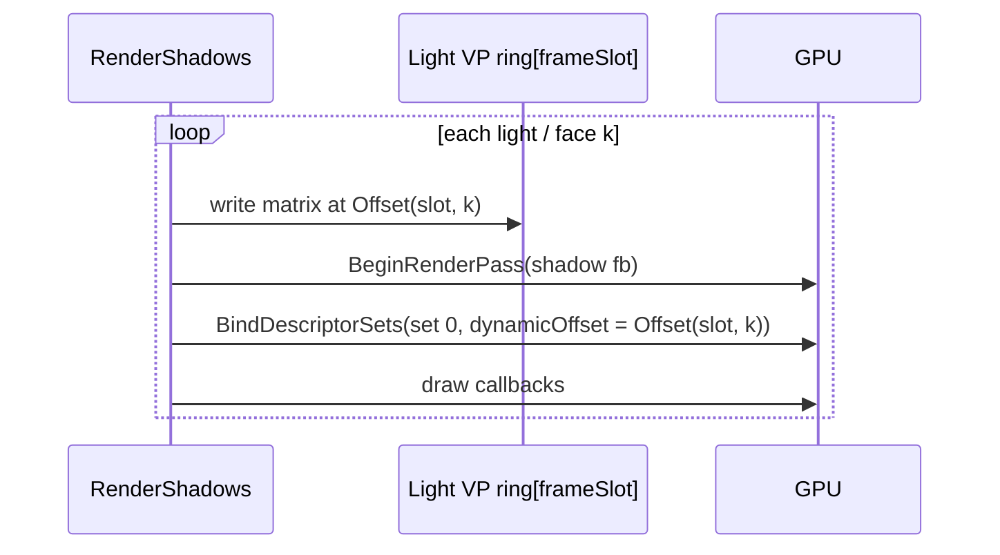
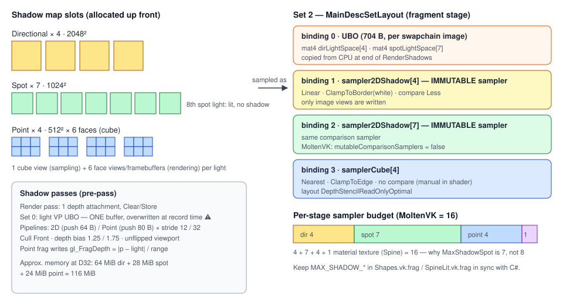
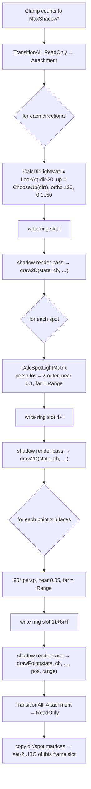

# Shadow System

## Purpose

`ShadowSystem` renders depth maps for directional, spot and point lights during the shadow pre-pass,
and exposes a descriptor set (set 2) that lit shaders sample in the main pass.

File: [Rendering/Shadows/ShadowSystem.cs](../../MainframeEngine/Src/Rendering/Shadows/ShadowSystem.cs)
(`public sealed unsafe class ShadowSystem : IDisposable`, ctor `ShadowSystem(IVulkanContext)`).

## Limits & resources

| Constant | Value | Notes |
|---|---|---|
| `MaxShadowDir` | 4 (= `LightEnvironment.MaxDirectional`) | 2048² 2D map each |
| `MaxShadowSpot` | **7** | 1024² 2D map each. One less than `MaxSpot = 8` because of MoltenVK's 16 samplers per stage: 4 + 7 + 4 + 1 material texture. The 8th spot light lights the scene but casts no shadow. |
| `MaxShadowPoint` | 4 | 512² × 6-face cube each |
| `MaxShadowPasses` | 4 + 7 + 4 × 6 = **35** | shadow sub-passes per frame (one light-VP ring slot each) |
| `ShadowMatricesUboSize` | (4 + 7) × 64 = 704 B | light-space matrices for the main pass |

All slots are allocated up front (one `vkAllocateMemory` per image, roughly 116 MiB at D32), whether
or not lights exist.

| Map type | Image | Views | Framebuffers |
|---|---|---|---|
| `Map2D` (dir, spot) | 2D depth, `DepthStencilAttachment \| Sampled` | 1 × 2D | 1 |
| `MapCube` (point) | 6 layers, `CubeCompatible` | 1 × Cube (sample) + 6 × 2D (render) | 6 |

### Shadow render pass

A single depth attachment: Clear/Store, Undefined → `DepthStencilAttachmentOptimal`. No color
attachment. External dependency `FragmentShader/ShaderRead` → `EarlyFragmentTests/DepthWrite`.

### Depth format

`ChooseDepthFormat` picks the first of `D32Sfloat`, `D32SfloatS8Uint`, `D24UnormS8Uint`, `D16Unorm`
whose optimal-tiling features include **`DepthStencilAttachment | SampledImage`**, preferring one with
**`SampledImageFilterLinear`** (needed for the linear comparison sampler's 2×2 hardware PCF). Without
linear filtering it falls back to a nearest comparison sampler and logs a warning; with no samplable
depth format it throws.

### Light view-projection ring (per-pass matrices)

Each sub-pass needs its own light matrix that survives until the GPU executes it. The matrices live in
a host-mapped **dynamic-offset uniform ring**: `MaxFramesInFlight × MaxShadowPasses` slots, each padded
to `max(256, minUniformBufferOffsetAlignment)` bytes (`UniformRing`, 2 × 35 × 256 B = 17.5 KiB). Set 0
of both shadow pipeline layouts is a single `UniformBufferDynamic` descriptor (range 64 B); each pass
writes its matrix at `Offset(frameSlot, pass)` and binds the set with that dynamic offset:



Pass indices: directional `i` → `i`, spot `i` → `4 + i`, point `i` face `f` → `11 + 6i + f`
(`PassIndexDir/Spot/Point`). Because the ring is per frame slot, frame N+1 never overwrites frame N's
matrices either. Call `RenderShadows` **at most once per frame**. This fixed GitHub issue #2 (every
sub-pass used to execute with the last matrix written into one shared UBO); the `multi-light` render
test (directional + spot + point) checks the ring contents after recording and compares a golden.

### Pipelines

| Pipeline | Layout | Push constants | Shaders |
|---|---|---|---|
| `_pipe2D_S32`, `_pipe2D_S12` | `Shadow2DLayout` (set 0 = light VP, dynamic UBO) | 64 B `mat4 model` (vertex) | `Shadow2D.vk.*` |
| `_pipePoint_S32`, `_pipePoint_S12` | `ShadowPointLayout` (set 0 = light VP, dynamic UBO) | 80 B `mat4 model + vec4 lightPosRange` (vertex + fragment) | `ShadowPoint.vk.*` |

`S12`/`S32` is the vertex stride: Spine and `Quad` use 12 (positions only for Spine), `Box3d` uses 32.
Only location 0 (`vec3`) is read. Use the accessors `GetShadow2DPipeline(stride)` and
`GetShadowPointPipeline(stride)`.

**Culling is explicit:** geometry is authored counter-clockwise. The main pass flips Y with a
negative-height viewport, which keeps CCW = front; the shadow passes use a standard viewport, which
mirrors the winding, so geometric front faces (facing the light) arrive clockwise. The shadow pipelines
therefore use `FrontFace = Clockwise` and `CullMode = Back`: back faces are culled and the static depth
bias (constant 1.25, slope 1.75) handles acne. (Before M1 this was `CCW + cull Front` — identical
rasterisation, mislabelled as "Peter Pan" front-face culling.) Single-sided casters (Spine sprites,
`Quad`) cast only from their front side. Depth `Less`, dynamic viewport and scissor.

### Samplers (immutable)

| Sampler | Filter | Address | Compare |
|---|---|---|---|
| `_sampler2DShadow` | Linear (Nearest if the depth format can't filter) | ClampToBorder, opaque white | `Less` (hardware compare) |
| `_samplerCube` | Nearest | ClampToEdge | none (manual compare in shader) |

The 2D comparison sampler is baked into the descriptor set layout as an **immutable sampler**, because
MoltenVK reports `mutableComparisonSamplers = false`. Only image views are written for bindings 1 and 2.

## Main-pass descriptor set (set 2)



| Binding | Type | Count | Contents |
|---|---|---|---|
| 0 | UniformBuffer | 1 | `mat4 dirLightSpace[4]; mat4 spotLightSpace[7];` (one buffer per frame slot) |
| 1 | CombinedImageSampler (immutable) | 4 | directional maps |
| 2 | CombinedImageSampler (immutable) | 7 | spot maps |
| 3 | CombinedImageSampler | 4 | point cube maps + `_samplerCube` |

Consumers bind `MainDescSetLayout` as set 2 and call `GetMainSet()`, which returns the set for
`IVulkanContext.FrameSlot` (one set per frame slot; the image views are shared, only the matrices UBO
differs). `InitializeShadowMapLayouts()` transitions every map to `DepthStencilReadOnlyOptimal` once at
startup, so the descriptors are valid on the first frame. The maps themselves are shared by both frame
slots: the layout barriers in `RenderShadows` (`FragmentShader/ShaderRead` →
`EarlyFragmentTests/DepthWrite`) order a frame's writes after the previous frame's sampling on the
same queue.

### Without a `ShadowSystem`

Shadows are optional. When `Node.Initialize` gets no shadow system, lit pipelines (Shapes, SpineLit)
still declare **the same set indices** and bind the renderer's `ShadowFallback` as set 2: the same
layout (built by the shared `CreateMainSetLayout`), 1×1 depth maps (2D and cube) cleared to 1.0, and
light-space matrices that map every position to depth 2 — outside the [0, 1] range the shaders treat as
lit — so every shadow term is 1. It is static (one set for every frame slot), created on first use and
destroyed with the device. Spine's texture set is therefore always set 3 (before M1 it moved to set 2
without shadows and no longer matched `SpineLit.vk.frag`). Covered by the `spine-no-shadows` render
test.

## `RenderShadows`

```csharp
// Per-frame form: static lambdas + explicit state, no closure allocations.
public void RenderShadows<TState>(LightEnvironment lights, TState state,
    ShadowDraw2D<TState> draw2D,        // (state, cb, pipe32, pipe12, layout)
    ShadowDrawPoint<TState> drawPoint)  // (state, cb, pipe32, pipe12, layout, lightPos, lightRange)

// Convenience form; allocates if the lambdas capture.
public void RenderShadows(LightEnvironment lights,
    Action<CommandBuffer, Pipeline, Pipeline, PipelineLayout> draw2D,
    Action<CommandBuffer, Pipeline, Pipeline, PipelineLayout, Vector3, float> drawPoint)
```

It is called from `Engine.OnShadowPass`, while the command buffer is open and no render pass is active.
`drawPoint` receives the point-light pipelines (`_pipePoint_S32/S12`) and `ShadowPointLayout`.



Every sub-pass clears depth to 1, sets an **unflipped** viewport, and binds the light VP set with
its own dynamic offset. Directional and spot lights use `ChooseUp` (world up, or +Z when the light is
within ~8° of vertical, where `CreateLookAt` would degenerate). Nodes
generally ignore the pipeline and layout arguments and fetch the right pipeline through the accessors
(see `Box3d.DrawShadow2D`).

## Sampling in the main pass

| Light | Technique |
|---|---|
| Directional / spot | `ls = M · world; ls /= w; uv = ls.xy·0.5+0.5`. Outside [0,1]³ counts as lit. `texture(sampler2DShadow, vec3(uv, depth − 0.001))`: one hardware compare tap (bilinear PCF where supported), no shader kernel. |
| Point | `current = length(world − lightPos) / range`, `closest = texture(cube, fragToLight).r`, shadowed if `current − 0.015 > closest`. One hard sample. `ShadowPoint.vk.frag` writes linear `gl_FragDepth`, so the pipeline's depth bias does not apply. |

Only the first `min(count, MAX_SHADOW_*)` lights of each type sample a map; the rest use shadow = 1.

## Invariants

- C# constants and the `MAX_SHADOW_*` defines in `Shapes.vk.frag` and `SpineLit.vk.frag` must match.
  Recompile the `.spv` files after editing.
- Keep the total sampler count per stage ≤ 16 for MoltenVK.
- Shadow casters must pick the pipeline that matches their vertex stride.

## Known issues

- **Fixed ±20 orthographic box at the world origin**; it does not follow the camera (cascades: M4,
  [Shadows v2](future/shadows-v2.md)).
- One hard tap per sample (no PCF kernel), single-sided casters cast from their front side only.
- All 15 maps are allocated up front (~116 MiB at D32) whatever the light count (atlas: M4).

## Related docs

[Lighting](lighting.md) · [Shaders](shaders.md) · [Coordinate conventions](coordinate-conventions.md) ·
[Future: shadows v2](future/shadows-v2.md)
