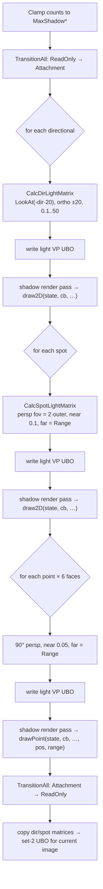

# Shadow System

## Purpose

`ShadowSystem` renders depth maps for directional, spot and point lights during the shadow pre-pass,
and exposes a descriptor set (set 2) that lit shaders sample in the main pass.

File: [Rendering/Shadows/ShadowSystem.cs](../../MainframeEngine/Src/Rendering/Shadows/ShadowSystem.cs)
(`public sealed unsafe class ShadowSystem : IDisposable`, ctor `ShadowSystem(IVulkanContext)`).

## Limits & resources

| Constant | Value | Notes |
|---|---|---|
| `MaxShadowDir` | 4 (= `LightEnvironment.MaxDirectional`) | 2048² 2D map each |
| `MaxShadowSpot` | **7** | 1024² 2D map each. One less than `MaxSpot = 8` because of MoltenVK's 16 samplers per stage: 4 + 7 + 4 + 1 material texture. The 8th spot light lights the scene but casts no shadow. |
| `MaxShadowPoint` | 4 | 512² × 6-face cube each |
| `ShadowMatricesUboSize` | (4 + 7) × 64 = 704 B | light-space matrices for the main pass |

All slots are allocated up front (one `vkAllocateMemory` per image, roughly 116 MiB at D32), whether
or not lights exist.

| Map type | Image | Views | Framebuffers |
|---|---|---|---|
| `Map2D` (dir, spot) | 2D depth, `DepthStencilAttachment \| Sampled` | 1 × 2D | 1 |
| `MapCube` (point) | 6 layers, `CubeCompatible` | 1 × Cube (sample) + 6 × 2D (render) | 6 |

### Shadow render pass

A single depth attachment: Clear/Store, Undefined → `DepthStencilAttachmentOptimal`. No color
attachment. External dependency `FragmentShader/ShaderRead` → `EarlyFragmentTests/DepthWrite`.

### Pipelines

| Pipeline | Layout | Push constants | Shaders |
|---|---|---|---|
| `_pipe2D_S32`, `_pipe2D_S12` | `Shadow2DLayout` (set 0 = light VP UBO) | 64 B `mat4 model` (vertex) | `Shadow2D.vk.*` |
| `_pipePoint_S32`, `_pipePoint_S12` | `ShadowPointLayout` (set 0 = light VP UBO) | 80 B `mat4 model + vec4 lightPosRange` (vertex + fragment) | `ShadowPoint.vk.*` |

`S12`/`S32` is the vertex stride: Spine uses 12 (positions only), and `Box3d`/`Quad` use 32. Only
location 0 (`vec3`) is read. Raster state: `CullMode = Front` ("Peter Pan"), CCW, static depth bias
(constant 1.25, slope 1.75), depth `Less`, dynamic viewport and scissor. Use the accessors
`GetShadow2DPipeline(stride)` and `GetShadowPointPipeline(stride)`.

### Samplers (immutable)

| Sampler | Filter | Address | Compare |
|---|---|---|---|
| `_sampler2DShadow` | Linear | ClampToBorder, opaque white | `Less` (hardware compare) |
| `_samplerCube` | Nearest | ClampToEdge | none (manual compare in shader) |

The 2D comparison sampler is baked into the descriptor set layout as an **immutable sampler**, because
MoltenVK reports `mutableComparisonSamplers = false`. Only image views are written for bindings 1 and 2.

## Main-pass descriptor set (set 2)


| Binding | Type | Count | Contents |
|---|---|---|---|
| 0 | UniformBuffer | 1 | `mat4 dirLightSpace[4]; mat4 spotLightSpace[7];` (per swapchain image) |
| 1 | CombinedImageSampler (immutable) | 4 | directional maps |
| 2 | CombinedImageSampler (immutable) | 7 | spot maps |
| 3 | CombinedImageSampler | 4 | point cube maps + `_samplerCube` |

Consumers bind `MainDescSetLayout` as set 2 and call `GetMainSet()` (which uses `CurrentImageIndex`).
`InitializeShadowMapLayouts()` transitions every map to `DepthStencilReadOnlyOptimal` once at
startup, so the descriptors are valid on the first frame.

## `RenderShadows`

```csharp
// Per-frame form: static lambdas + explicit state, no closure allocations.
public void RenderShadows<TState>(LightEnvironment lights, TState state,
    ShadowDraw2D<TState> draw2D,        // (state, cb, pipe32, pipe12, layout)
    ShadowDrawPoint<TState> drawPoint)  // (state, cb, pipe32, pipe12, layout, lightPos, lightRange)

// Convenience form; allocates if the lambdas capture.
public void RenderShadows(LightEnvironment lights,
    Action<CommandBuffer, Pipeline, Pipeline, PipelineLayout> draw2D,
    Action<CommandBuffer, Pipeline, Pipeline, PipelineLayout, Vector3, float> drawPoint)
```

It is called from `Engine.OnShadowPass`, while the command buffer is open and no render pass is active.
`drawPoint` receives the point-light pipelines (`_pipePoint_S32/S12`) and `ShadowPointLayout`.



Every sub-pass clears depth to 1, sets an **unflipped** viewport, and binds the light VP set. Nodes
generally ignore the pipeline and layout arguments and fetch the right pipeline through the accessors
(see `Box3d.DrawShadow2D`).

## Sampling in the main pass

| Light | Technique |
|---|---|
| Directional / spot | `ls = M · world; ls /= w; uv = ls.xy·0.5+0.5`. Outside [0,1]³ counts as lit. `texture(sampler2DShadow, vec3(uv, depth − 0.001))`: one hardware compare tap (bilinear PCF where supported), no shader kernel. |
| Point | `current = length(world − lightPos) / range`, `closest = texture(cube, fragToLight).r`, shadowed if `current − 0.015 > closest`. One hard sample. `ShadowPoint.vk.frag` writes linear `gl_FragDepth`, so the pipeline's depth bias does not apply. |

Only the first `min(count, MAX_SHADOW_*)` lights of each type sample a map; the rest use shadow = 1.

## Invariants

- C# constants and the `MAX_SHADOW_*` defines in `Shapes.vk.frag` and `SpineLit.vk.frag` must match.
  Recompile the `.spv` files after editing.
- Keep the total sampler count per stage ≤ 16 for MoltenVK.
- Shadow casters must pick the pipeline that matches their vertex stride.

## Known issues

- **Only one shadow-casting light works.** A single host-mapped VP UBO is overwritten at **record time**
  ([ShadowSystem.cs:148, 159, 182](../../MainframeEngine/Src/Rendering/Shadows/ShadowSystem.cs)), so
  every sub-pass executes with the last matrix written. Any point light (6 faces) is therefore wrong,
  and the buffer is also shared across frames in flight. Planned fix: push constant or per-pass dynamic
  offsets ([renderer stabilization](future/renderer-stabilization.md)).
- **Point callbacks receive the 2D pipelines** (`RenderShadowPass2D` passes `_pipe2D_*`).
- **Directional up vector is always `UnitY`**, which degenerates for a straight-down light. `ChooseUp`
  exists but is only used for spot lights.
- **Fixed ±20 orthographic box at the world origin**; it does not follow the camera.
- **Shadow-pass culling is probably inverted** *(inferred)*: the main pass flips the viewport, the shadow
  pass does not, and both use CCW front faces.
- `FindDepthFormat` does not verify that the format can be sampled or linearly filtered.
- Per-frame allocations: a `cubeFaces` array and per-face closures (the Sandbox's lambdas allocate too;
  `TODO` at `Game.cs:162`).
- Comments refer to `IGame.OnShadowPass` and claim "Quad stride 12" (lines 12, 62-63, 123).

## Related docs

[Lighting](lighting.md) · [Shaders](shaders.md) · [Coordinate conventions](coordinate-conventions.md) ·
[Future: shadows v2](future/shadows-v2.md)
