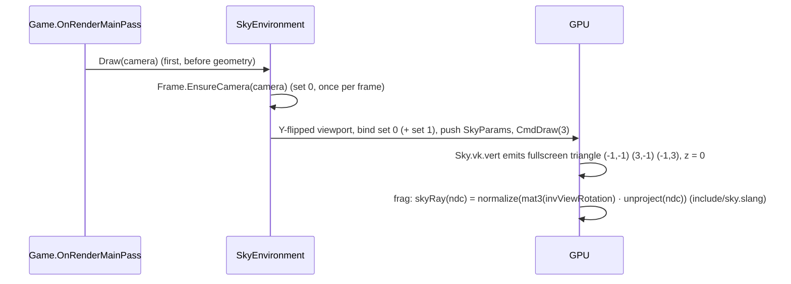

# Sky

## Purpose

Draws the background as a fullscreen triangle before any geometry. There are four types: procedural
gradient + sun, equirectangular panorama, cubemap, or a physical atmosphere ([below](#physical-sky-adr-0154)). In
scenes the sky is a `WorldEnvironment` node holding a `Sky` resource (`Mode`, `Panorama`, `CubemapFaces` and the
procedural/sun/physical parameters below); the render server builds the matching `SkyEnvironment` on first use,
rebuilds it when the mode or images change, records its offscreen work (`Prepare`: the physical sky's LUTs) at the start
of `RenderOffscreen`, and draws it first in the main pass. See
[Scene graph & nodes](scene-graph-and-nodes.md#servers-and-render-nodes).

## Key types

| Type | File | Constructor |
|---|---|---|
| `SkyEnvironment` | [Sky/SkyEnvironment.cs](../../MainframeEngine/Src/Rendering/Sky/SkyEnvironment.cs) | `protected`; `public class : IDisposable` |
| `SkyProcedural` | [Sky/SkyProcedural.cs](../../MainframeEngine/Src/Rendering/Sky/SkyProcedural.cs) | `(IRenderer)` |
| `SkyPanoramic` | [Sky/SkyPanoramic.cs](../../MainframeEngine/Src/Rendering/Sky/SkyPanoramic.cs) | `(IRenderer, string? panoramicPath)` |
| `SkyCubemap` | [Sky/SkyCubemap.cs](../../MainframeEngine/Src/Rendering/Sky/SkyCubemap.cs) | `(IRenderer, string[] facePaths)`, in +X −X +Y −Y +Z −Z order |
| `SkyPhysical` | [Sky/SkyPhysical.cs](../../MainframeEngine/Src/Rendering/Sky/SkyPhysical.cs) | `(IRenderer)`; `SunIntensity` 1, white `SunColor` |
| `SkyEnvironmentType` | [Sky/SkyEnvironmentType.cs](../../MainframeEngine/Src/Rendering/Sky/SkyEnvironmentType.cs) | `Procedural`, `Panoramic`, `Cubemap`, `Physical` |
| `PhysicalSkySettings` | [Sky/PhysicalSkySettings.cs](../../MainframeEngine/Src/Rendering/Sky/PhysicalSkySettings.cs) | record struct; `SkyEnvironment.Physical`, `Sky.PhysicalSettings` |
| `PhysicalSkyLuts`, `AtmosphereModel` | [Sky/](../../MainframeEngine/Src/Rendering/Sky/) | internal: the LUT passes; the CPU model (sun-disc colour, tests) |

### Procedural parameters

| Property | Default |
|---|---|
| `SkyColor`, `HorizonColor`, `GroundColor` | gradient stops, sRGB: (0.18, 0.48, 0.87), (0.70, 0.85, 1.00), `SkyEnvironment.DefaultGroundColor` (0.42, 0.39, 0.35) |
| `SunDirection`, `SunColor` | normalize(0.3, 1, 0.5); (1.00, 0.95, 0.85) |
| `SunIntensity` | 20 |
| `SunAngularRadius` | 0.53° |
| `HorizonSharpness` | 6 |

## GPU resources

| Resource | Detail |
|---|---|
| Set 0 | The per-frame shared set (`FrameContext`): camera (`invProjection`, `invViewRotation`); `Draw(camera)` calls `EnsureCamera` |
| Set 1, binding 0 | `CombinedImageSampler` (Panoramic/Cubemap only), one shared set |
| Push constants | `SkyParams` (96 B, below) |
| Texture | `GpuTexture`, `R8G8B8A8Srgb` (decoded to linear by the sampler), 1 mip. Panoramic: 2D image. Cubemap: 6 layers, `CubeCompatible`, Cube view. Uploaded by the upload queue at the start of the next frame (no queue wait). |
| Sampler | Linear, ClampToEdge |
| Pipeline | No vertex input, no cull, **depth test/write off**, no blend, dynamic viewport and scissor, HDR scene pass; layout from `FrameContext.CreatePipelineLayout` |

### `SkyParams` (push constants, 96 B)

| Offset | Field |
|---|---|
| 0 | `vec4 skyColor` |
| 16 | `vec4 horizonColor` |
| 32 | `vec4 groundColor` |
| 48 | `vec4 sunDirection` |
| 64 | `vec4 sunColorIntensity` (rgb colour, a intensity) |
| 80 | `vec4 sun` (x = cos of angular radius, y = horizon sharpness) |

Colours are authored in sRGB and decoded to linear in the shader; the sun (`SunColor × SunIntensity`,
20 by default) is an HDR value that the tonemap rolls off instead of clipping
([Color pipeline](color-pipeline.md)).

The ground default is calibrated for exposure + ACES (like the ambient default): it displays as a muted earth
tone of about (95, 86, 74) at the default exposure. The pre-M3 default (0.15, 0.14, 0.13) fell into the
tonemap's toe and displayed as (15, 13, 11), a black void below the horizon. A unit test pins the displayed
range and that `Sky` (the scene resource) uses the same default.

## How it draws

| Fragment shader | Technique |
|---|---|
| `Sky.Procedural.vk.frag` | Linear colours. Above horizon: `mix(horizon, sky, clamp(y·sharpness))`. Below: `mix(horizon, ground, clamp(−y·sharpness))` (inverted before M3: the ground colour sat at the horizon). Sun disc: `smoothstep` on `dot(dir, sunDir)` × color × intensity. |
| `Sky.Panoramic.vk.frag` | `u = atan(z, x)/2π + 0.5`, `v = 0.5 − asin(y)/π` |
| `Sky.Cubemap.vk.frag` | `texture(samplerCube, dir)` |
| `Sky.Physical.vk.frag` | the sky-view LUT at (`dir.y`, azimuth from the sun) × the sun's illuminance × π, plus the sun disc (below) |

## Physical sky (ADR 0154)

`Sky.Mode = Physical` (`SkyPhysical`) is a Hillaire 2020 atmosphere ("A Scalable and Production Ready Sky and Atmosphere
Rendering Technique", the model behind Unreal's SkyAtmosphere): Earth's 6360 km planet and 100 km atmosphere, Rayleigh
(8 km scale height), Mie (1.2 km) and an ozone layer (a 15 km tent at 25 km), in fragment passes (no compute).

### Parameters

Godot's `PhysicalSkyMaterial` names, on the `Sky` resource ("Physical" group) and in `PhysicalSkySettings`. The defaults
are Earth's: each coefficient scales Hillaire's Earth value by its ratio to Godot's default.

| Property | Default | Effect |
|---|---|---|
| `RayleighCoefficient` | 2 | Rayleigh scattering × value / 2 |
| `RayleighColor` | (0.3, 0.405, 0.6) | per channel, × colour / default |
| `MieCoefficient` | 0.005 | Mie scattering and extinction × value / 0.005 |
| `MieEccentricity` | 0.8 | the Cornette–Shanks phase's `g` (clamped to ±0.999) |
| `MieColor` | (0.69, 0.729, 0.812) | per channel, × colour / default |
| `Turbidity` | 10 | Mie density × value / 10 |
| `SunDiskScale` | 1 | the disc's angular radius is `SunAngularRadius × SunDiskScale` |
| `GroundColor` | the procedural default | shared with the procedural sky: the ground albedo (sRGB) below the horizon and in multiple scattering |
| `EnergyMultiplier` | 1 | multiplies the sky and the disc |
| `AltitudeMeters` | 300 | the camera's height above sea level (at least 1 m; the scene's Y is not added) |

**The sun** is the world's first `DirectionalLight3D` (towards its +Z axis, Godot's rule for sky shaders), with the light's
colour × `Energy` as the sun's illuminance; without one, `Sky.SunDirection` and `Sky.SunColor` at energy 1. The
procedural sky still uses only `Sky.Sun*` (unchanged). The light's own colour stays authored (forest-showcase open
question 9): making it follow the atmosphere's transmittance (`AtmosphereModel.SunTransmittance` already computes it) is
left for a day-night cycle.

**Units.** The engine's lights carry no 1/π (a white Lambert surface facing a sun of energy E has radiance E), so the
sky is the physical radiance per unit illuminance × π (`AtmosphereModel.RadianceScale`): it keeps the real ratio of
sky to sunlit ground. With the default exposure (1.3), a midday sky next to a `DirectionalLight3D` of energy 2 shows a
blue zenith of about (62, 100, 152) and a paler, brighter horizon over a sunlit mid-grey floor. The sun disc is
`illuminance × transmittance(camera → sun) × 2000` (`SunDiscRadiance`): far below the physical ≈ 46 000 so it never
overflows the half-float targets, and still white after the tonemap.

### LUTs and passes

| LUT | Size, format | Rendered | Content |
|---|---|---|---|
| Transmittance | 256 × 64 `R16G16B16A16_SFLOAT` | when the atmosphere changes | `exp(−optical depth)` to the top, per (radius, zenith cosine), Bruneton's parameterization |
| Multiple scattering | 32 × 32 | with the transmittance | Hillaire's `Ψ = L₂ / (1 − f_ms)` per (sun zenith cosine, altitude), 64 directions looped per texel |
| Sky view | 192 × 108 | when the atmosphere, altitude or **sun elevation** changes | in-scattered radiance per view (zenith, azimuth from the sun), latitude-warped around the horizon; single scattering with the planet's shadow + `Ψ`, and the lit ground below the horizon |

Each LUT is a `RenderTarget` drawn with `Post/Fullscreen.vk.vert` and its fragment shader
(`Sky/AtmosphereTransmittance`, `AtmosphereMultiScattering`, `AtmosphereSkyView`; shared code in
`include/atmosphere.slang`), one render pass each, ended through `RenderTarget.End` and its barrier. `PhysicalSkyLuts`
compares the parameters with what it last rendered, so a still sun costs nothing per frame and a moving one one sky-view
pass (≈ 0.03 ms). Sun azimuth changes need no pass (the LUT is relative to the sun). `SkyEnvironment.Prepare(cb)` records
this with no render pass active; the render server calls it for the root world and for every sub-viewport world that
renders, at the start of `RenderOffscreen`. `Draw` draws nothing until the LUTs exist.

### Drawing the sky into another pass (sky captures)

`Sky.Physical.vk.frag` depends only on `skyRay(ndc)` (set 0's `invProjection`/`invViewRotation`), set 1 binding 0 (the
sky-view LUT, linear clamp) and `SkyParams`, never on the target's size, so a capture (an IBL cube face with a per-face
camera) draws it like the other types. The internal hooks: `SkyEnvironment.FragmentShaderPath` (with
`Sky/Sky.vk.vert`), `ResourceSetLayout` (set 1, or a null handle for the procedural sky), `CanDraw`, and
`BindResources(cb, layout)`, which binds set 1 and pushes `SkyParams` for a layout of set 0 + set 1 with the frame's push
range; call `Prepare` first in the frame. `SkyParams` for the physical sky: `skyColor.xy` = view radius and planet radius
(km), `horizonColor.rgb` = the sky scale (π × the sun's illuminance × `EnergyMultiplier`), `sunDirection.xyz`,
`sunColorIntensity.rgb` = the disc's radiance, `sun.x` = cos of the disc's radius.

## Invariants

- Draw the sky **first** in the main pass. It does not write depth.
- A physical sky's `Prepare` runs before any pass that draws it, outside a render pass (the render server does it).
- The sky needs an `IVulkanContext`. With any other renderer, the constructor and `Dispose` silently
  do nothing.

## Testing

The `sky-grid` render scene draws only the procedural sky and the grid; the test recomputes every pixel's sky
colour on the CPU (`SkyGridReference`: `skyRay`, gradient, sun, exposure, ACES, sRGB encode) and requires all
pixels more than 2 px from a projected grid line to match within ±3 — above the horizon, in the
horizon-to-ground gradient and in the plain ground — on every driver ([Testing](testing.md#render-tests)).
This would catch a wrong ray, NaN/Inf, a uniform/push-constant layout mismatch or an encoding difference.

The physical sky (ADR 0154): `PhysicalSkyAtNoonAndSunsetMatchesGoldens` renders `sky-physical` (a floor, a box and a
`DirectionalLight3D` of energy 2 as the sun) at noon and at sunset; besides the goldens it checks a blue zenith with a
paler, brighter horizon at noon and an orange horizon under a darker sky at sunset, and the scene self-checks that the
atmosphere LUTs rendered once and the sky view once for a still sun. `sky-physical --count 2` (a sun that moves every
frame, with auto exposure, glow and FXAA) is an allocation gate (0 B). Unit tests (`SkyAndPostSettingsTests`) cover the
Godot defaults and their scaling, `AtmosphereModel`'s zenith transmittance against Earth's optical depths, a red sunset
transmittance, a blue single-scattered zenith and an orange sunset glow, normalized phase functions, and the `Sky`
exports' round trip.

## Known issues

- Cubemap faces must be square and equal-sized (checked); a Panoramic or Cubemap sky without paths throws.
- The panorama is sampled without mips (the longitude seam would select the smallest mip).
- Physical sky: no clouds; the camera's scene height does not change the atmosphere (`AltitudeMeters` is fixed); the
  sky-view LUT's horizon row blends sky and ground in a thin band (Hillaire's parameterization); a sunset light keeps its
  authored colour.

## Related docs

[Cameras & input](cameras-and-input.md) · [Coordinate conventions](coordinate-conventions.md) ·
[Color pipeline](color-pipeline.md) · [GPU resources](gpu-resources.md)
