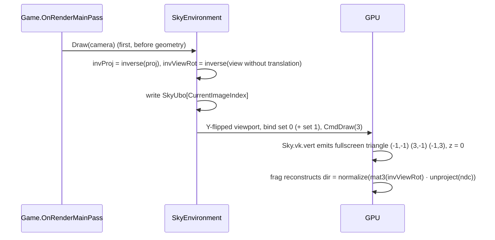

# Sky

## Purpose

Draws the background as a fullscreen triangle before any geometry. There are three types: procedural
gradient + sun, equirectangular panorama, or cubemap.

## Key types

| Type | File | Constructor |
|---|---|---|
| `SkyEnvironment` | [Sky/SkyEnvironment.cs](../../MainframeEngine/Src/Rendering/Sky/SkyEnvironment.cs) | `protected`; `public class : IDisposable` |
| `SkyProcedural` | [Sky/SkyProcedural.cs](../../MainframeEngine/Src/Rendering/Sky/SkyProcedural.cs) | `(IRenderer)` |
| `SkyPanoramic` | [Sky/SkyPanoramic.cs](../../MainframeEngine/Src/Rendering/Sky/SkyPanoramic.cs) | `(IRenderer, string? panoramicPath)` |
| `SkyCubemap` | [Sky/SkyCubemap.cs](../../MainframeEngine/Src/Rendering/Sky/SkyCubemap.cs) | `(IRenderer, string[] facePaths)`, in +X −X +Y −Y +Z −Z order |
| `SkyEnvironmentType` | [Sky/SkyEnvironmentType.cs](../../MainframeEngine/Src/Rendering/Sky/SkyEnvironmentType.cs) | `Procedural`, `Panoramic`, `Cubemap` |

### Procedural parameters

| Property | Default |
|---|---|
| `SkyColor`, `HorizonColor`, `GroundColor` | gradient stops |
| `SunDirection`, `SunColor` | — |
| `SunIntensity` | 20 |
| `SunAngularRadius` | 0.53° |
| `HorizonSharpness` | 6 |

## GPU resources

| Resource | Detail |
|---|---|
| Set 0, binding 0 | `SkyUbo` per swapchain image, host-mapped, fragment stage |
| Set 1, binding 0 | `CombinedImageSampler` (Panoramic/Cubemap only), one shared set |
| Texture | `R8G8B8A8Srgb`, 1 mip. Panoramic: 2D image. Cubemap: 6 layers, `CubeCompatible`, Cube view. Uploaded with three one-time submits, each followed by `QueueWaitIdle`. |
| Sampler | Linear, ClampToEdge |
| Pipeline | No vertex input, no cull, **depth test/write off**, no blend, dynamic viewport and scissor, main render pass, no push constants |

### `SkyUbo` (std140, 224 B)

| Offset | Field |
|---|---|
| 0 | `mat4 invProj` |
| 64 | `mat4 invViewRot` |
| 128 | `vec4 skyColor` |
| 144 | `vec4 horizonColor` |
| 160 | `vec4 groundColor` |
| 176 | `vec4 sunDirection` |
| 192 | `vec4 sunColorIntensity` |
| 208 | `float sunSize` (cos of radius) |
| 212 | `float horizonSharpness` |
| 216 | padding ×2 |

## How it draws

| Fragment shader | Technique |
|---|---|
| `Sky.Procedural.vk.frag` | Above horizon: `mix(horizon, sky, clamp(y·sharpness))`. Below: `mix(ground, horizon, clamp(−y·sharpness))`. Sun disc: `smoothstep` on `dot(dir, sunDir)` × color × intensity. |
| `Sky.Panoramic.vk.frag` | `u = atan(z, x)/2π + 0.5`, `v = 0.5 − asin(y)/π` |
| `Sky.Cubemap.vk.frag` | `texture(samplerCube, dir)` |

## Invariants

- Draw the sky **first** in the main pass. It does not write depth.
- The sky needs an `IVulkanContext`. With any other renderer, the constructor and `Dispose` silently
  do nothing.

## Known issues

- A Panoramic sky with a `null` path still sets `HasTexture`, so the set 1 write uses null view and
  sampler handles.
- Cubemap faces are assumed to all match `faces[0]` dimensions; this is not checked.
- The comment claims "Total: 240 bytes" ([SkyEnvironment.cs:55](../../MainframeEngine/Src/Rendering/Sky/SkyEnvironment.cs)); the struct is 224 B. This is harmless because the code uses `sizeof`.
- sRGB textures are sampled (linearized) and then written to a UNORM swapchain, so the sky renders
  darker than the source image.

## Related docs

[Cameras & input](cameras-and-input.md) · [Coordinate conventions](coordinate-conventions.md) ·
[Future: color pipeline](future/color-pipeline.md)
