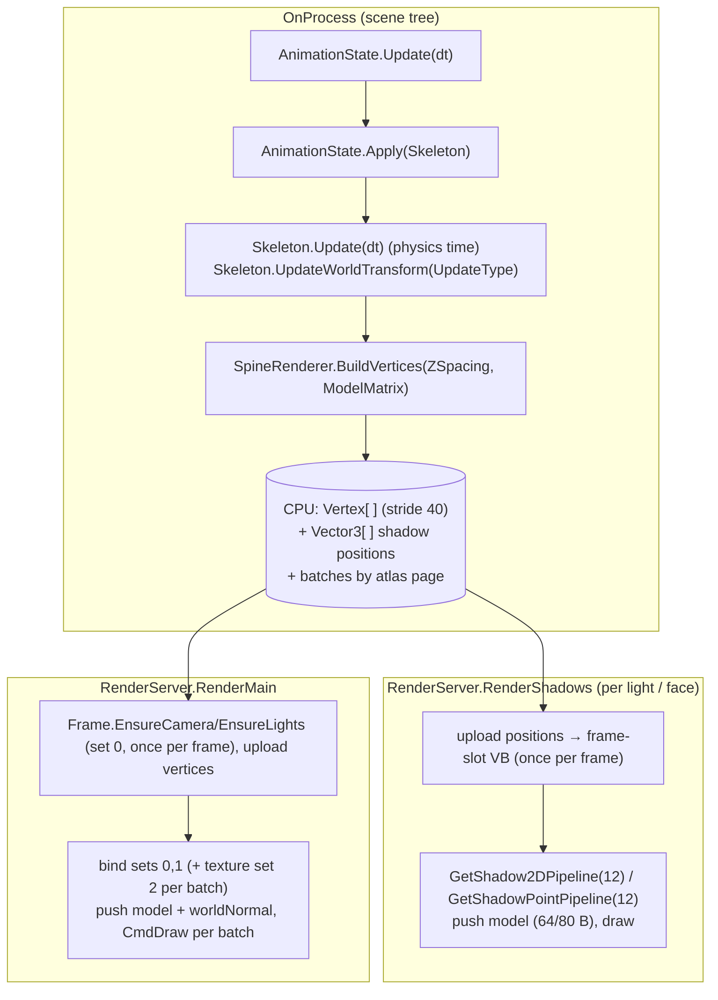

# Spine Integration

## Purpose

Renders Spine skeletal animations as lit, shadow-casting geometry in the 3D scene. Use `SpineNode`;
`SpineRenderer` and `SpineTextureLoader` are implementation details.

## Key types

| Type | File | Role |
|---|---|---|
| `SpineNode : VisualInstance3D` | [Nodes/SpineNode.cs](../../MainframeEngine/Src/Nodes/SpineNode.cs) | Loads the atlas and skeleton, drives animation in `OnProcess`, forwards draw calls (the design's `SpineSprite3D`) |
| `SpineFolder` | same file | `readonly struct`: folder → `Name`, first `*.atlas`, first `*.json` (throws if missing) |
| `SpineRenderer` (internal) | [Rendering/Spine/SpineRenderer.cs](../../MainframeEngine/Src/Rendering/Spine/SpineRenderer.cs) | Builds vertices, owns the pipeline, buffers and descriptor sets |
| `SpineTextureLoader` | [Rendering/Spine/SpineTextureLoader.cs](../../MainframeEngine/Src/Rendering/Spine/SpineTextureLoader.cs) | Decodes atlas pages to RGBA (StbImageSharp); `page.rendererObject = page index` |
| Spine runtime | `Plugins/Spine/spine-csharp` | Vendored git submodule. Do not modify. |

## Usage

```csharp
// In a scene (or a .mscene file: "type": "SpineNode", "props": { "Folder": ..., "Animation": "walk" }):
var boy = new SpineNode { Folder = "Content/Models/Spine/SpineBoy", Animation = "walk", Scale = new Vector3(0.1f) };
Root.AddChild(boy);   // the render server creates its renderer; it animates in OnProcess, draws and casts shadows
boy.SetAnimation("run");
```

The skeleton data (atlas, JSON) loads on the CPU on first use (`Skeleton`, entering the tree, the first
process); the GPU renderer is created through the `RenderServer` when the node enters a tree, with the
server's `ShadowSystem`. Tree-less code uses
`new SpineNode(renderer, folder)` (loads immediately, no shadows), then `Advance(gameTime)` and
`Draw(camera, lights)` inside the main pass.

## Per-frame data flow



### Vertex building

- Walks `Skeleton.DrawOrder`. A `RegionAttachment` produces 6 vertices (two triangles, not indexed).
  A `MeshAttachment` produces one vertex per triangle index.
- Each slot is pushed `ZSpacing` (default 0.01) further along z to avoid z-fighting.
- Tint = skeleton RGBA × slot RGBA, straight (never × alpha) and sRGB-authored; premultiplication happens
  once, in the fragment shader.
- A new batch starts whenever the atlas page changes.
- The CPU arrays start at 8192 vertices and **grow** (doubling) when a pose needs more; GPU vertex
  buffers grow the same way per frame slot. Steady-state poses never allocate.
- Order per update (Spine's documented order): `AnimationState.Update` → `Apply` → `Skeleton.Update`
  → `UpdateWorldTransform`, so the drawn pose is this frame's.

| CPU vertex (40 B) | Offset |
|---|---|
| `vec3 Position` | 0 |
| `vec2 Uv` | 12 |
| `vec4 Color` | 20 |
| `float TextureIndex` (written, unused) | 36 |

### Descriptor sets

| Set | With `ShadowSystem` | Without `ShadowSystem` |
|---|---|---|
| 0 | the per-frame shared set (`FrameContext`): camera + lights UBO | same |
| 1 | `ShadowSystem.MainDescSetLayout` | renderer's "no shadows" fallback (same layout, everything lit) |
| 2 | `sampler2D uTexture`, one static set per atlas page | same |

Push constant (128-byte vertex+fragment range, 80 B used): `mat4 model` + `vec4 worldNormal`. The normal is
`normalize(TransformNormal(+Z, model))`, so the whole skeleton shares one normal.

Pipeline: `SpineLit.vk.{vert,frag}`, no culling, CCW, **premultiplied** blend (`One/OneMinusSrcAlpha`),
depth test and write `Less`. The fragment shader discards alpha < 0.01. Pages are `GpuTexture`s with a
Linear/ClampToEdge sampler: straight-alpha atlases `R8G8B8A8_SRGB`, premultiplied (`pma: true`, e.g.
SpineBoy) `R8G8B8A8_UNORM`, which the shader un-premultiplies, decodes and re-premultiplies
(specialization constant `kPremultipliedTexture`) — see [Color pipeline](color-pipeline.md#spine-premultiplied-alpha).
Vertex buffers are per-frame-slot `GpuBuffer`s that grow by doubling; `Dispose` defers to the deletion queue.

## Invariants

- `Folder` cannot change once the skeleton is loaded. A `ShadowSystem` is optional
  (`RenderServer.ShadowsEnabled = false`, or the tree-less constructor): without one the node binds the
  renderer's fallback at set 1 and casts no shadows (`DrawShadow*` are no-ops). `Animation` (exported) is the
  animation set when the skeleton loads; before loading, `SetAnimation` just sets it.
- `SpineScale` (default `SpineNode.DefaultSpineScale = 0.02`) applies immediately and keeps `FlipX`. It scales
  the drawn vertices (x/y of the model matrix passed to `BuildVertices`; `ZSpacing` stays in node units), not the
  skeleton: the skeleton keeps unit scale and only carries the flip signs, so bone world positions are in skeleton
  units. Spine's IK solver uses absolute epsilons (e.g. a parent determinant ≤ 0.0001), and a skeleton scaled below
  ~0.01 solved a crumpled pose; the `spine-small-scale` render test guards this. `SetAnimation` replaces track 0 now; `QueueAnimation` appends after the current one.
- Atlas pixel arrays are released after the GPU upload (`SpineTextureLoader.ReleasePixelData`); only the
  page sizes stay.
- Draw Spine after opaque geometry (tree order / `RenderPriority`). It alpha-blends but also writes depth.

## Known issues

- Clipping attachments, per-slot blend modes and two-color tint are ignored.
- Only `atlas.Pages[0].pma` is honoured.
- Single-sided: a sprite casts a shadow only from its front side (shadow pipelines cull back faces).

## Related docs

[Scene graph & nodes](scene-graph-and-nodes.md) · [Lighting](lighting.md) · [Shadow system](shadow-system.md) ·
[Color pipeline](color-pipeline.md)
