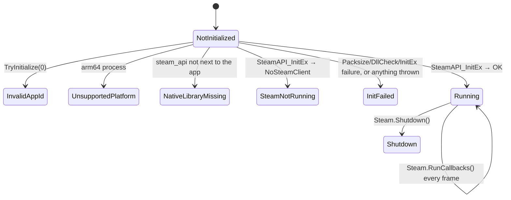

# Steamworks

## Purpose

Optional Steam integration: identity, friends, lobbies, rich presence, overlay and achievements. All of it goes
through an engine-owned `Steam` service, which starts only when Steam can really run. Otherwise every wrapper is a
quiet no-op, and the game never fails because Steam is missing (CLAUDE.md: "only activate if Steam is running").

> **Status:** the service, guards, lobby fixes and achievements persistence shipped in M5. **Steam does not run on any
> platform yet:** no `steam_api` native library ships (see [Natives](#natives)), and on Apple Silicon Steamworks.NET
> cannot load at all. The `Engine` hook (calling `TryInitialize`/`RunCallbacks`/`Shutdown`) is added later.

## Lifecycle



```csharp
Steam.TryInitialize(appId, writeDevAppIdFile: isDevBuild); // never throws; returns Steam.Valid
// every frame, main thread:
Steam.RunCallbacks();                                       // no-op unless Running
// at exit:
Steam.Shutdown();
```

- **`Steam.TryInitialize(uint appId, bool writeDevAppIdFile = false)`** checks, in order:
  1. The app id is not 0.
  2. The process architecture is supported.
  3. The dev app id file, if `writeDevAppIdFile` is set.
  4. The native library loads (`NativeLibrary.TryLoad` with Steamworks.NET's own import name).
  5. `Packsize.Test()` and `DllCheck.Test()` pass.
  6. `SteamAPI.InitEx()` succeeds.

  On success it registers the persistent callbacks and calls `SteamUserStats.RequestCurrentStats()`. Every failure
  ends in a `SteamStatus` plus a `Steam.StatusMessage`, logged at info level. As a last resort, any exception becomes
  `InitFailed`.
- **`Steam.RunCallbacks()`** must be pumped once per frame on the main thread. Lobby results and `await`
  continuations of the lobby calls run inside it.
- **Dev app id.** `writeDevAppIdFile: true` writes `steam_appid.txt` next to the executable, only when it is missing
  or different, and sets `SteamAppId` for the process. A build started from an IDE or with `dotnet run` then
  initializes. **Never enable it in shipped builds:** it bypasses Steam's "launched through Steam" check.
  `SteamAPI.RestartAppIfNecessary` is not called.

### Why nothing mentions Steamworks types

Steamworks.NET 2024.8.0 ships **x86/x86-64-only managed assemblies** (`lib/` and every `runtimes/*/lib/` copy is PE32+
AMD64), so in an arm64 process the runtime refuses to load them (`FileLoadException`). If the JIT compiles any method
that references a Steamworks.NET type, it loads that assembly, even when the branch never runs. The code is therefore
split:

| Layer | Files | Rule |
|---|---|---|
| Public facade | `Steam`, `SteamLobby`, `SteamLobbyInfo`, `SteamAchievements`, `SteamOverlay`, `SteamRichPresence`, `SteamFriend` | No Steamworks type in any signature, field or method body. Every member checks `Steam.Valid` first. |
| Native layer | [`Native/SteamApi.cs`](../../MainframeEngine/Src/Steamworks/Native/SteamApi.cs), [`Native/SteamLobbyApi.cs`](../../MainframeEngine/Src/Steamworks/Native/SteamLobbyApi.cs) (internal) | Only code that touches Steamworks.NET. Members are `[MethodImpl(NoInlining)]` with primitive signatures. Callback handlers live in a nested class. |

The unit tests run this path on Apple Silicon: every wrapper is called and must return a default without throwing.

## Key types

| Type | Surface |
|---|---|
| `Steam` | `TryInitialize`, `RunCallbacks`, `Shutdown`, `Status`, `StatusMessage`, `Valid`, `AppId`, `IsPlatformSupported`, `NativeLibraryFileName`, `SteamId`, `Username`, `Branch`, `GetLaunchCommandLine(flag)`, `GetFriends()`, `GetFriendUsername`, `HasDLC` |
| `SteamStatus` | `NotInitialized`, `Running`, `UnsupportedPlatform`, `InvalidAppId`, `NativeLibraryMissing`, `SteamNotRunning`, `InitFailed`, `Shutdown` |
| `SteamLobby` | `CreateLobbyAsync`, `JoinLobbyAsync`, `LeaveLobby`, `GetLobbyListAsync(friendsOnly)`, `Current`, `Timeout` (15 s), events `OnLobbyUpdated`, `OnLobbyJoined`, `OnMemberChanged(lobby, user, joined)` |
| `SteamLobbyInfo` | Live lobby metadata: `HostId`, `LobbyName`, `AppVersion`, `Country`, `IsAdvertising`, `PlayerCount`, `MaxPlayers`, `OwnerId`, `GetPlayers()` |
| `SteamAchievements` | `IsUnlocked`, `Unlock` and `Clear` (both call `StoreStats`), `StoreStats` |
| `SteamRichPresence` | `Set*`, `Clear`, `GetFriendConnect`, `GetFriendGroupSize`, `OnJoinRequested(connect)` |
| `SteamOverlay` | `IsEnabled`, `OpenWeb`, `OpenStore`, `InviteFriendToGame(connect)`, `InviteFriendToRemotePlay` |
| `SteamFriend` | `readonly struct (SteamId, Username)` |

Without Steam:

- async lobby calls return `null` or an empty list;
- getters return `0`, `""` or empty;
- setters and overlay calls do nothing;
- argument validation still throws, because that is a caller bug.

## Lobbies

```mermaid
sequenceDiagram
    participant Game
    participant L as SteamLobby
    participant API as SteamLobbyApi
    participant SM as SteamMatchmaking
    Game->>L: CreateLobbyAsync(name, max, appVersion?, friendsOnly, ct)
    L->>API: CreateLobbyAsync
    API->>SM: CreateLobby → SteamAPICall_t, bound to CallResult<LobbyCreated_t>
    SM-->>API: result (inside Steam.RunCallbacks)
    alt OK
        API-->>L: lobby id
        L->>L: Current = lobby; set HostId/LobbyName/AppVersion?/Country; rich presence connect + group
    else failure / I/O failure / Timeout elapsed
        API-->>L: 0 (logged)
        L-->>Game: null
    end
    Note over Game,SM: overlay invite accepted (GameLobbyJoinRequested_t) → LeaveLobby + JoinLobbyAsync(invite's lobby)
```

`JoinLobbyAsync` binds `CallResult<LobbyEnter_t>` to the `JoinLobby` handle. It succeeds only for
`k_EChatRoomEnterResponseSuccess`; then it sets `Current` and raises `OnLobbyJoined`. `GetLobbyListAsync(false)` uses
`CallResult<LobbyMatchList_t>` with a result-count filter of 60. The friends-only path reads the lobbies of immediate
friends who are playing this app id. Timeouts log and return null or empty. A `CancellationToken` cancels the wait
with `OperationCanceledException`.

## Natives

| Platform | Steamworks.NET managed (NuGet 2024.8.0) | `steam_api` native |
|---|---|---|
| win-x64 | ✅ `runtimes/win-x64/lib` (imports `steam_api64`) | ❌ not shipped (`steam_api64.dll`) |
| linux-x64 | ✅ `runtimes/linux-x64/lib` (imports `steam_api`) | ❌ not shipped (`libsteam_api.so`) |
| osx-x64 | ✅ `runtimes/osx-x64/lib` (imports `steam_api`) | ❌ not shipped (`libsteam_api.dylib`) |
| osx-arm64 (and any arm64 process) | ❌ x86-64-only assembly cannot load → `UnsupportedPlatform` | n/a |

The NuGet package ships **no native libraries**. They come from the Steamworks SDK (`redistributable_bin`), which
needs a Steamworks partner login, so they are not in the repo.

**Enabling Steam on a machine:** copy the SDK file into `MainframeEngine/runtimes/<rid>/native/`. The engine csproj
copies every file there next to the app (see [Networking → Platform](networking.md#platform)), and
`TryInitialize` finds it. Check Valve's SDK licence before committing redistributables.

**Apple Silicon** needs either an x64 .NET runtime under Rosetta, or a Steamworks.NET build with AnyCPU or arm64
assemblies. Upgrading the package is a dependency decision and must be discussed first.

## Known issues / not done

- **Engine hook (M2):** set `EngineOptions.SteamAppId` and the engine registers a `SteamServer` (an
  `IFrameServer`): `TryInitialize` at startup, `RunCallbacks` once per frame after the scene tree's process step,
  `Shutdown` with the other servers. Inert when Steam cannot start. Dev builds that need `writeDevAppIdFile`
  register `new SteamServer(appId, writeDevAppIdFile: true)` themselves.
- **Avatars** (`SteamUtils.GetImageRGBA` → Vulkan texture, ImGui `TextureId`) are not implemented. The old
  commented-out Unity `SteamAvatar` and `SteamRemotePlay` files were deleted.
- **Transport.** `SteamSocketsTransport` is a stub; lobbies carry no transport address yet. The planned connect
  strings are `"enet:ip:port"` or `"steam:<id>"`; see [Steamworks integration](future/steamworks-integration.md).
- **Member updates.** `OnLobbyUpdated` reports lobby-level metadata updates only; member data updates are ignored.
- **Lobby continuations** run inside `RunCallbacks` on the main thread. A continuation after a timeout runs on a
  thread-pool thread.
- **README.** The README still advertises a "Full Steamworks.NET wrapper" and Remote Play.

## Related docs

[Networking](networking.md) · [Build & platforms](build-and-platforms.md#platform-matrix) ·
[Future: Steamworks integration](future/steamworks-integration.md)
