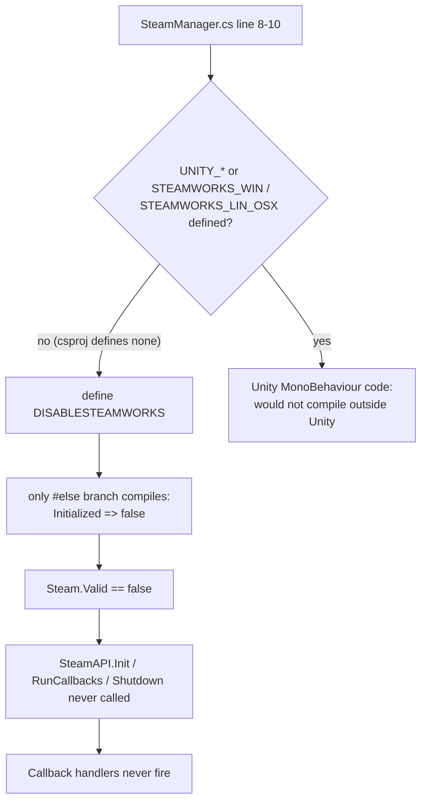
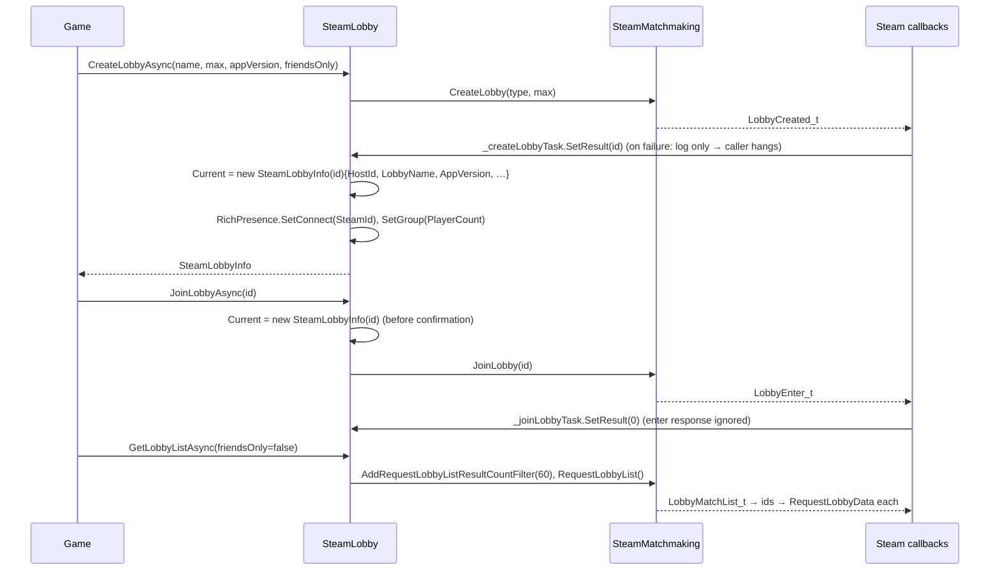

# Steamworks

## Purpose

Static wrappers over Steamworks.NET for identity, friends, lobbies, rich presence, overlay and
achievements. The code was ported from a Unity project in 2024 and has barely changed since.

> **Status: inert.** `Steam.Valid` is always `false` and Steam callbacks never run. No engine or Sandbox
> code calls these wrappers.

## Why it is inert

Also:
- No `steam_api` native library ships for any platform, and there is no `steam_appid.txt`.
- Steamworks.NET 2024.8.0 has no `osx-arm64` assets.

## Key types

| Type | File | Surface |
|---|---|---|
| `SteamManager` | [Steamworks/SteamManager.cs](../../MainframeEngine/Src/Steamworks/SteamManager.cs) | Unity `SteamManager` v1.0.12 leftover. Compiles to `Initialized => false`. |
| `Steam` | [Steamworks/Steam.cs](../../MainframeEngine/Src/Steamworks/Steam.cs) | `Valid`, `AppId`, `SteamId`, `Username`, `Branch`, `GetLaunchCommandLine(flag)`, `GetFriends()`, `GetFriendUsername`, `HasDLC` |
| `SteamLobby` | [Steamworks/SteamLobby.cs](../../MainframeEngine/Src/Steamworks/SteamLobby.cs) | `CreateLobbyAsync`, `JoinLobbyAsync`, `LeaveLobby`, `GetLobbyListAsync(friendsOnly)`, `OnLobbyUpdated`, `Current`, `MaxLobbies = 60` |
| `SteamLobbyInfo` | [Steamworks/SteamLobbyInfo.cs](../../MainframeEngine/Src/Steamworks/SteamLobbyInfo.cs) | Live (uncached) lobby metadata properties: `HostId`, `LobbyName`, `AppVersion`, `Country`, `IsAdvertising`, `PlayerCount`… |
| `SteamFriend` | [Steamworks/SteamFriend.cs](../../MainframeEngine/Src/Steamworks/SteamFriend.cs) | `readonly struct (SteamId, Username)`. Avatar is a TODO. |
| `SteamRichPresence` | [Steamworks/SteamRichPresence.cs](../../MainframeEngine/Src/Steamworks/SteamRichPresence.cs) | `SetStatus/Connect/Display/Group`, `Clear`, `OnJoinRequested` |
| `SteamOverlay` | [Steamworks/SteamOverlay.cs](../../MainframeEngine/Src/Steamworks/SteamOverlay.cs) | `OpenWeb`, `OpenStore`, `InviteFriendToGame(connect)`, `InviteFriendToRemotePlay` |
| `SteamAchievements` | [Steamworks/SteamAchievements.cs](../../MainframeEngine/Src/Steamworks/SteamAchievements.cs) | `IsUnlocked`, `Unlock`, `Clear` |
| `SteamAvatar` | [Steamworks/SteamAvatar.cs](../../MainframeEngine/Src/Steamworks/SteamAvatar.cs) | **entirely commented out** (Unity `Sprite` code) |
| `SteamRemotePlay` | [Steamworks/SteamRemotePlay.cs](../../MainframeEngine/Src/Steamworks/SteamRemotePlay.cs) | **entirely commented out** ("probably wont use") |

## Lobby flow (as written)

`SteamLobby`'s static constructor registers global `Callback<T>` handlers for `LobbyCreated_t`,
`GameLobbyJoinRequested_t`, `LobbyEnter_t`, `LobbyMatchList_t` and `LobbyDataUpdate_t`. Each async call
then awaits a `TaskCompletionSource` that one of those handlers completes.

The friends-only list path walks immediate friends whose `GetFriendGamePlayed` matches `Steam.AppId`
and has a lobby. Nothing connects a lobby to a transport: the lobby stores no address, and there is no
`SteamNetworkingSockets` transport.

## Known issues

- **Never initializes** (see above).
- **Invite accept joins the wrong lobby:** it joins `Current` instead of `callback.m_steamIDLobby`, and
  `Current` is usually null for an invitee ([SteamLobby.cs:105](../../MainframeEngine/Src/Steamworks/SteamLobby.cs)).
- **A failed create hangs the awaiting caller:** the handler logs but never completes the TCS ([:78](../../MainframeEngine/Src/Steamworks/SteamLobby.cs)).
- `SetResult` rather than `TrySetResult` ([:83, :111](../../MainframeEngine/Src/Steamworks/SteamLobby.cs)): a second `LobbyEnter_t` (which the creator also receives) throws.
- `appVersion` is optional but required in practice (`?? throw`, an `Application.version` leftover) ([:63](../../MainframeEngine/Src/Steamworks/SteamLobby.cs)).
- `LeaveLobby` does not null-check `Current`.
- `SteamLobbyInfo.HostId` uses `ulong.Parse` on a possibly empty string. `ToString()` reflects over all live properties.
- Unguarded by `Valid`: `Steam.Branch`, `Steam.GetFriends()`, `GetLobbyListAsync`, `SteamLobbyInfo` properties. Without `steam_api` these likely throw `DllNotFoundException` *(inferred)*.
- `SteamAchievements.Unlock` never calls `StoreStats()`, so unlocks are not persisted.
- `Callback<T>` is used where `CallResult<T>` fits request/response calls. There are no timeouts or cancellation.
- README advertises "Full Steamworks.NET wrapper" and "Remote Play Together support".

## Related docs

[Networking](networking.md) · [Build & platforms](build-and-platforms.md#platform-matrix) ·
[Future: Steamworks integration](future/steamworks-integration.md)
