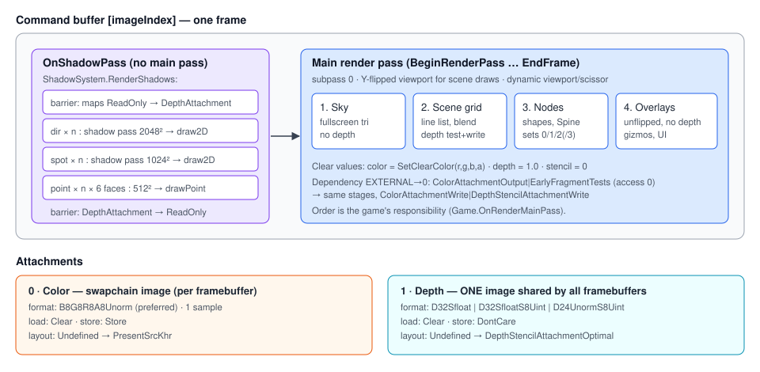

# Vulkan Renderer

## Purpose

`VulkanRenderer` owns the Vulkan instance, device, swapchain, main render pass, command buffers and
frame synchronization. Everything else draws by recording into `IVulkanContext.CurrentCommandBuffer`
between `BeginFrame()` and `EndFrame()`.

## Key types

| Type | File | Visibility |
|---|---|---|
| `IRenderer` | [Rendering/IRenderer.cs](../../MainframeEngine/Src/Rendering/IRenderer.cs) | public |
| `IVulkanContext` | [Rendering/Vulkan/IVulkanContext.cs](../../MainframeEngine/Src/Rendering/Vulkan/IVulkanContext.cs) | public |
| `VulkanRenderer` | [Rendering/Vulkan/VulkanRenderer.cs](../../MainframeEngine/Src/Rendering/Vulkan/VulkanRenderer.cs) | internal, implements both |
| `VulkanLoaderBootstrap` | [Rendering/Vulkan/VulkanLoaderBootstrap.cs](../../MainframeEngine/Src/Rendering/Vulkan/VulkanLoaderBootstrap.cs) | internal — see [Build & platforms](build-and-platforms.md#macos-vulkan-loader-bootstrap) |
| `VulkanImGuiController` | [Rendering/Vulkan/VulkanImGuiController.cs](../../MainframeEngine/Src/Rendering/Vulkan/VulkanImGuiController.cs) | internal — see [ImGui & debug tools](imgui-and-debug-tools.md) |
| `UniformRing` | [Rendering/Vulkan/UniformRing.cs](../../MainframeEngine/Src/Rendering/Vulkan/UniformRing.cs) | internal — dynamic-offset UBO ring math (shadow light matrices) |
| `VkHelpers`, `VulkanResultExtensions.Check` | [VkHelpers.cs](../../MainframeEngine/Src/Rendering/Vulkan/VkHelpers.cs), [VulkanException.cs](../../MainframeEngine/Src/Rendering/Vulkan/VulkanException.cs) | internal — checked resource creation; `result.Check("what")` throws `VulkanException` |
| `ShadowFallback` | [Shadows/ShadowFallback.cs](../../MainframeEngine/Src/Rendering/Shadows/ShadowFallback.cs) | internal — "no shadows" set 2, owned by the renderer (see [Shadow system](shadow-system.md#without-a-shadowsystem)) |

### `IRenderer`

`Backend`, `VSync {get;set;}`, `OnResize(size)`, `BeginFrame()`, `EndFrame()`,
`SetClearColor(r,g,b,a=1)`, `Clear()`, `EnableDepthTest()`, `DisableDepthTest()`,
`RequestCapture()`, `TryTakeCapture(out capture)`.
In Vulkan, `Clear` and the depth toggles are **no-ops**: clearing is the render pass `LoadOp`, and depth
state is baked into each pipeline.

### `IVulkanContext`

`Vk`, `Device`, `PhysicalDevice`, `RenderPass` (main), `CommandPool`, `GraphicsQueue`,
`FrameStarted`, **`FrameSlot`**, **`const MaxFramesInFlight = 2`**, `CurrentCommandBuffer` (`default`
outside a frame), `SwapchainExtent` (pixels), `SwapchainImageCount`, `CurrentImageIndex`,
`CurrentFramebuffer`, `BeginRenderPass()`, `Validation`.

Always guard the cast: `if (Renderer is IVulkanContext vk) { ... }`.

## Initialization

| Step | Detail |
|---|---|
| Instance | API 1.2, window-required extensions (SDL), `VK_EXT_debug_utils` if validating, `VK_KHR_portability_enumeration` + flag when available (macOS). Layer `VK_LAYER_KHRONOS_validation` (dropped with a warning if missing). Validation is requested when `EngineOptions.EnableValidation` is set — **on by default in Debug builds, off in Release**. |
| Debug messenger | Warning/Error × General/Performance/Validation → static `[UnmanagedCallersOnly]` function pointer (no delegate to keep alive) → `VulkanValidationLog` (`IVulkanContext.Validation`: counts + first 64 messages, rooted by a `GCHandle` passed as user data) and `Log.Warning`/`Log.Error`. Verbose/info are not subscribed (they would allocate a string per message). |
| Physical device | First device with graphics + present queue families. No feature or extension scoring. |
| Logical device | One queue per unique family. Extensions: `VK_KHR_swapchain` (+ `VK_KHR_portability_subset` if advertised). Features: **`shaderSampledImageArrayDynamicIndexing`** when supported (the lit shaders index their shadow sampler arrays with a loop counter; a warning is logged otherwise). |
| Swapchain | Prefers `B8G8R8A8Unorm` / `SrgbNonlinear`. VSync (initially `EngineOptions.VSync`) → FIFO; else Mailbox → Immediate → FIFO. `minImageCount + 1`. Extent from the surface, or `Engine.FramebufferSize` (pixels) when the surface leaves it to the app. Usage `ColorAttachment`, plus `TransferSrc` when `EngineOptions.EnableFrameCapture` is set and supported (frame capture, see [Testing](testing.md#frame-capture)). |
| Depth | One image shared by all framebuffers: first of `D32Sfloat`, `D32SfloatS8Uint`, `D24UnormS8Uint`. |
| Command buffers | One primary per **frame slot** (2), allocated once from a `ResetCommandBuffer` pool on the graphics family, recorded with `OneTimeSubmit`. |
| Sync | Per frame slot: `imageAvailable[2]`, `inFlight[2]` (created signalled). Per swapchain image: `renderFinished[imageCount]` (a present may still wait on one until that image is re-acquired). |

Every Vulkan call that returns a `Result` in init, per-frame and recreation paths is checked
(`.Check("vkXxx (what)")` → `VulkanException`).

## Main render pass

| # | Attachment | Load / Store | Initial → Final layout |
|---|---|---|---|
| 0 | color, swapchain format | Clear / Store | Undefined → PresentSrcKhr |
| 1 | depth | Clear / DontCare | Undefined → DepthStencilAttachmentOptimal |

One subpass. One external dependency: src `ColorAttachmentOutput | LateFragmentTests`, access
`DepthStencilAttachmentWrite` → dst `ColorAttachmentOutput | EarlyFragmentTests`, access
`ColorAttachmentWrite | DepthStencilAttachmentWrite`. The depth image is shared by both frames in
flight, so this frame's depth clear waits for the previous frame's depth writes (write-after-write);
the colour attachment waits on the acquire semaphore at `ColorAttachmentOutput`. Clear values are the
`SetClearColor` color and depth 1.0.

## Frame synchronization

**`BeginFrame()`**
1. If a resize/VSync change is pending → `RecreateSwapchain()`; if that fails (window has no area)
   return with `FrameStarted = false`.
2. Wait `inFlight[slot]` — after this the slot's command buffer and every per-frame resource keyed by
   `FrameSlot` are idle.
3. `AcquireNextImage(imageAvailable[slot])`. On `ErrorOutOfDateKhr`: recreate and return with
   `FrameStarted = false` (the fence stays signalled: it is only reset right before a submit).
4. Reset and begin `commandBuffers[slot]` (`OneTimeSubmit`). `FrameStarted = true`.

**`EndFrame()`**
1. `CmdEndRenderPass`, optional capture copy, `EndCommandBuffer`.
2. Reset `inFlight[slot]`. Submit, waiting `imageAvailable[slot]` at `ColorAttachmentOutput` and
   signalling `renderFinished[image]`.
3. Present, waiting on `renderFinished[image]`. Read back a requested capture (waits that fence)
   **before** any recreation, then on OutOfDate, Suboptimal or a pending resize: recreate.
4. `slot = (slot + 1) % MaxFramesInFlight`.

### Per-frame-slot resources

Subsystems key uniform buffers, dynamic vertex/index buffers and the descriptor sets that point at
them by **`IVulkanContext.FrameSlot`** and allocate `IVulkanContext.MaxFramesInFlight` (2) copies:
Shapes (VP + lights UBOs), Spine (VP + lights UBOs, main and shadow vertex buffers), Sky, scene grid,
ImGui (vertex/index buffers), the shadow system (matrices UBO, set 2, light-VP ring). The slot's
fence is waited in `BeginFrame`, so the CPU never writes data the GPU is still reading, and nothing
depends on the driver-chosen swapchain image count. Static resources (textures, Spine texture sets,
the shadow fallback set) have a single copy.

## Swapchain recreation

Triggered by OutOfDate/Suboptimal, `OnResize`, or setting `VSync` (present mode).

1. If `Engine.FramebufferSize` or the surface's current extent is 0×0 (minimised), return `false` and
   keep the request pending — no busy wait; the engine stops rendering and blocks on window events
   (see [Engine lifecycle](engine-lifecycle.md#minimise)).
2. `DeviceWaitIdle`.
3. Destroy depth, framebuffers and image views; create the new swapchain with **`OldSwapchain`** = the
   current one, then destroy the old one.
4. If the surface format changed, rebuild the render pass (pipelines built against the old pass must be
   recreated by their owners; a warning is logged — this does not happen on the supported platforms).
5. Recreate image views, depth and framebuffers. If the **image count changed**, recreate
   `renderFinished[]`.

Command buffers, fences, `imageAvailable[]` and every subsystem's per-frame-slot arrays are
independent of the swapchain and are not touched. The render tests resize the window and toggle VSync
mid-run (`SwapchainRecreationOnResizeAndVSyncToggleIsClean`) with the validation gate on.

## Disposal

`Dispose()` is idempotent and tolerates partially initialised state: `DeviceWaitIdle` → shadow
fallback → capture buffer → swapchain → semaphores and fences → command pool → render pass → device →
debug messenger (only if it was created) → surface → instance → `Vk.Dispose()` → validation handle.
The game must dispose its own GPU objects (shadow system, sky, grid, nodes) **before** `base.OnClose()`
disposes the renderer.

## Known issues

- Physical device selection does not prefer discrete GPUs or check swapchain support.
- Every upload in the engine is a one-time submit followed by `QueueWaitIdle` (load time only; M3 adds
  an upload queue).
- `EndFrame` ends the render pass without checking that one was begun (the engine always begins it).
- A surface-format change on recreation rebuilds the render pass but not other subsystems' pipelines.

## Related docs

[Engine lifecycle](engine-lifecycle.md) · [Coordinate conventions](coordinate-conventions.md) ·
[Shadow system](shadow-system.md) · [Future: GPU resource management](future/gpu-resource-management.md)
