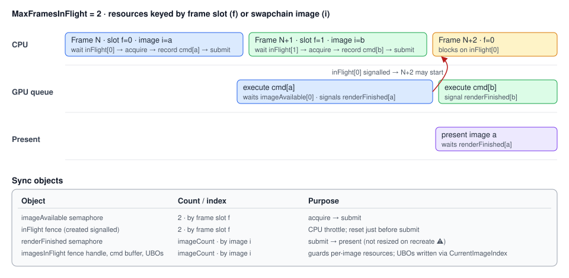

# Vulkan Renderer

## Purpose

`VulkanRenderer` owns the Vulkan instance, device, swapchain, the HDR scene target and the tonemap /
overlay passes, command buffers, frame synchronization, and the shared GPU services (allocator, upload
and deletion queues, pipeline and shader-module caches, the per-frame descriptor set). Everything else
draws by recording into `IVulkanContext.CurrentCommandBuffer` between `BeginFrame()` and `EndFrame()`.

## Key types

| Type | File | Visibility |
|---|---|---|
| `IRenderer` | [Rendering/IRenderer.cs](../../MainframeEngine/Src/Rendering/IRenderer.cs) | public |
| `IVulkanContext` | [Rendering/Vulkan/IVulkanContext.cs](../../MainframeEngine/Src/Rendering/Vulkan/IVulkanContext.cs) | public |
| `VulkanRenderer` | [VulkanRenderer.cs](../../MainframeEngine/Src/Rendering/Vulkan/VulkanRenderer.cs), [VulkanRenderer.Presentation.cs](../../MainframeEngine/Src/Rendering/Vulkan/VulkanRenderer.Presentation.cs) | internal, implements both; the partial holds the [colour pipeline](color-pipeline.md) passes |
| `FrameContext`, `FrameData` | [Rendering/Vulkan/FrameContext.cs](../../MainframeEngine/Src/Rendering/Vulkan/FrameContext.cs) | public — per-frame shared set 0 (camera + lights) |
| `RenderTarget` | [Rendering/Vulkan/RenderTarget.cs](../../MainframeEngine/Src/Rendering/Vulkan/RenderTarget.cs) | public — offscreen colour/depth targets (the scene target is one) |
| `GpuAllocator`, `UploadQueue`, `DeletionQueue`, `GpuBuffer`/`GpuImage`/`GpuTexture`, `PipelineCache`, `ShaderModuleCache` | see [GPU resources](gpu-resources.md) | public |
| `VulkanLoaderBootstrap` | [Rendering/Vulkan/VulkanLoaderBootstrap.cs](../../MainframeEngine/Src/Rendering/Vulkan/VulkanLoaderBootstrap.cs) | internal — see [Build & platforms](build-and-platforms.md#macos-vulkan-loader-bootstrap) |
| `VulkanImGuiController` | [Rendering/Vulkan/VulkanImGuiController.cs](../../MainframeEngine/Src/Rendering/Vulkan/VulkanImGuiController.cs) | internal — see [ImGui & debug tools](imgui-and-debug-tools.md) |
| `UniformRing` | [Rendering/Vulkan/UniformRing.cs](../../MainframeEngine/Src/Rendering/Vulkan/UniformRing.cs) | internal — dynamic-offset UBO ring math (shadow light matrices) |
| `VkHelpers`, `VulkanResultExtensions.Check` | [VkHelpers.cs](../../MainframeEngine/Src/Rendering/Vulkan/VkHelpers.cs), [VulkanException.cs](../../MainframeEngine/Src/Rendering/Vulkan/VulkanException.cs) | internal — depth barriers; `result.Check("what")` throws `VulkanException` |
| `PipelineBuilder` | [PipelineBuilder.cs](../../MainframeEngine/Src/Rendering/Vulkan/PipelineBuilder.cs) | internal — pipelines, layouts, descriptor sets with the engine's conventions |
| `ShadowFallback` | [Shadows/ShadowFallback.cs](../../MainframeEngine/Src/Rendering/Shadows/ShadowFallback.cs) | internal — "no shadows" set 2, owned by the renderer (see [Shadow system](shadow-system.md#without-a-shadowsystem)) |

### `IRenderer`

`Backend`, `VSync {get;set;}`, `OnResize(size)`, `BeginFrame()`, `EndFrame()`,
`SetClearColor(r,g,b,a=1)`, `Clear()`, `EnableDepthTest()`, `DisableDepthTest()`,
`RequestCapture()`, `TryTakeCapture(out capture)`.
In Vulkan, `Clear` and the depth toggles are **no-ops**: clearing is the render pass `LoadOp`, and depth
state is baked into each pipeline.

### `IVulkanContext`

`Vk`, `Device`, `PhysicalDevice`, `RenderPass` (the **HDR scene pass**), `CommandPool`, `GraphicsQueue`,
`FrameStarted`, **`FrameSlot`**, **`const MaxFramesInFlight = 2`**, `FrameNumber`, `CurrentCommandBuffer`
(`default` outside a frame), `SwapchainExtent` (pixels; the scene target has the same size),
`SwapchainImageCount`, `CurrentImageIndex`, `CurrentFramebuffer` (the scene target's), `BeginRenderPass()`,
`Validation`, and since M3: `SceneTarget`, `OverlayRenderPass`, `OverlayEncodesSrgb`, `BeginOverlayPass()`,
`Exposure` (+ `const DefaultExposure = 1.3`), `Frame` (`FrameContext`), `Allocator`, `Uploads`,
`Deletions`, `Pipelines`, `Shaders`.

Always guard the cast: `if (Renderer is IVulkanContext vk) { ... }`.

## Initialization

| Step | Detail |
|---|---|
| Instance | API 1.2, window-required extensions (SDL), `VK_EXT_debug_utils` if validating, `VK_KHR_portability_enumeration` + flag when available (macOS). Layer `VK_LAYER_KHRONOS_validation` (dropped with a warning if missing). Validation is requested when `EngineOptions.EnableValidation` is set — **on by default in Debug builds, off in Release**. |
| Debug messenger | Warning/Error × General/Performance/Validation → static `[UnmanagedCallersOnly]` function pointer (no delegate to keep alive) → `VulkanValidationLog` (`IVulkanContext.Validation`: counts + first 64 messages, rooted by a `GCHandle` passed as user data) and `Log.Warning`/`Log.Error`. Verbose/info are not subscribed (they would allocate a string per message). |
| Physical device | First device with graphics + present queue families. No feature or extension scoring. |
| Logical device | One queue per unique family. Extensions: `VK_KHR_swapchain` (+ `VK_KHR_portability_subset` if advertised; + `VK_KHR_swapchain_mutable_format`/`VK_KHR_image_format_list` only when the sRGB+UNORM-view swapchain is requested). Features: **`shaderSampledImageArrayDynamicIndexing`** when supported (the lit shaders index their shadow sampler arrays with a loop counter; a warning is logged otherwise). |
| Swapchain | `ChooseSurfaceFormat`: an 8-bit UNORM format in `SrgbNonlinear` (the tonemap shader encodes sRGB), else sRGB formats — see [Color pipeline](color-pipeline.md#swapchain). VSync (initially `EngineOptions.VSync`) → FIFO; else Mailbox → Immediate → FIFO. `minImageCount + 1`. Extent from the surface, or `Engine.FramebufferSize` (pixels) when the surface leaves it to the app. Usage `ColorAttachment`, plus `TransferSrc` when `EngineOptions.EnableFrameCapture` is set and supported (frame capture, see [Testing](testing.md#frame-capture)). |
| Scene target | `RenderTarget` with `R16G16B16A16Sfloat` colour (sampled) + depth (first of `D32Sfloat`, `D32SfloatS8Uint`, `D24UnormS8Uint`), swapchain-sized, shared by both frames in flight (render-pass dependencies order the reuse). |
| Command buffers | One primary per **frame slot** (2), allocated once from a `ResetCommandBuffer` pool on the graphics family, recorded with `OneTimeSubmit`. |
| Sync | Per frame slot: `imageAvailable[2]`, `inFlight[2]` (created signalled). Per swapchain image: `renderFinished[imageCount]` (a present may still wait on one until that image is re-acquired). |

Every Vulkan call that returns a `Result` in init, per-frame and recreation paths is checked
(`.Check("vkXxx (what)")` → `VulkanException`).

## Render passes

| Pass | Target | Attachments | Pipelines built against it |
|---|---|---|---|
| Shadow passes | shadow maps | depth | `ShadowSystem` |
| **Scene** (`RenderPass`) | `SceneTarget` | 0 `R16G16B16A16_SFLOAT` Clear/Store → `SHADER_READ_ONLY`; 1 depth Clear/DontCare | sky, grid, shapes, Spine, meshes |
| Present | swapchain image | colour DontCare/Store, `UNDEFINED → PRESENT_SRC` (or `→ COLOR_ATTACHMENT` when a separate overlay pass follows) | tonemap |
| Overlay (`OverlayRenderPass`) | same pass as Present by default; a separate Load pass on a UNORM view in the `SrgbWithUnormOverlay` mode | | ImGui |

The scene pass's incoming dependency orders this frame's writes after the previous frame's tonemap read
and depth writes; its outgoing one makes the colour visible to the tonemap's fragment shader. The
swapchain passes wait on the acquire semaphore at `COLOR_ATTACHMENT_OUTPUT` and end with an outgoing
dependency to `TRANSFER`, so a frame-capture copy recorded afterwards is chained to the colour writes
and the `PRESENT_SRC` transition. Clear values: `SetClearColor` (sRGB, converted to linear) and depth 1.
Order within a frame and the colour handling are described in [Color pipeline](color-pipeline.md).

## Frame synchronization

**`BeginFrame()`**
1. If a resize/VSync change is pending → `RecreateSwapchain()`; if that fails (window has no area)
   return with `FrameStarted = false`.
2. Wait `inFlight[slot]` — after this the slot's command buffer and every per-frame resource keyed by
   `FrameSlot` are idle; the deletion queue destroys what that slot's last frame held and the staging
   ring reclaims its space.
3. `AcquireNextImage(imageAvailable[slot])`. On `ErrorOutOfDateKhr`: recreate and return with
   `FrameStarted = false` (the fence stays signalled: it is only reset right before a submit).
4. Reset and begin `commandBuffers[slot]` (`OneTimeSubmit`). `FrameStarted = true`, `FrameNumber++`.
5. Record the upload queue's pending copies, transitions and clears (before any pass reads them).

**`EndFrame()`**
1. Finish the pass sequence (tonemap if `BeginOverlayPass` was not called), end the pass, optional
   capture copy, `EndCommandBuffer`.
2. Reset `inFlight[slot]`. Submit, waiting `imageAvailable[slot]` at `ColorAttachmentOutput` and
   signalling `renderFinished[image]`.
3. Present, waiting on `renderFinished[image]`. Read back a requested capture (waits that fence)
   **before** any recreation, then on OutOfDate, Suboptimal or a pending resize: recreate.
4. `slot = (slot + 1) % MaxFramesInFlight`.

### Per-frame-slot resources

Subsystems key uniform buffers, dynamic vertex/index buffers and the descriptor sets that point at
them by **`IVulkanContext.FrameSlot`** and allocate `IVulkanContext.MaxFramesInFlight` (2) copies:
the `FrameContext` (set 0: camera + lights, written once per frame for every scene pipeline), Shapes
(VP + lights UBOs), Spine (main and shadow vertex buffers), ImGui (vertex/index buffers), the shadow
system (matrices UBO, set 1/2, light-VP ring). All are `GpuBuffer`s in persistently mapped
`Dynamic` memory. The slot's
fence is waited in `BeginFrame`, so the CPU never writes data the GPU is still reading, and nothing
depends on the driver-chosen swapchain image count. Static resources (textures, Spine texture sets,
the shadow fallback set) have a single copy.

## Swapchain recreation

Triggered by OutOfDate/Suboptimal, `OnResize`, or setting `VSync` (present mode).

1. If `Engine.FramebufferSize` or the surface's current extent is 0×0 (minimised), return `false` and
   keep the request pending — no busy wait; the engine stops rendering and blocks on window events
   (see [Engine lifecycle](engine-lifecycle.md#minimise)).
2. `DeviceWaitIdle`.
3. Destroy the swapchain framebuffers and views; create the new swapchain with **`OldSwapchain`** =
   the current one, then destroy the old one.
4. If the surface format changed, throw `VulkanException`: the tonemap and ImGui pipelines are built
   against the swapchain passes. `ChooseSurfaceFormat` is deterministic per surface, so this does not
   happen on the supported platforms. (Scene pipelines no longer depend on the swapchain format.)
5. Recreate views and framebuffers; **resize the scene target** (its render pass is kept, so scene
   pipelines stay valid) and rewrite the tonemap descriptor. If the **image count changed**, recreate
   `renderFinished[]`. Collect the deletion queue (the device is idle).

Command buffers, fences, `imageAvailable[]` and every subsystem's per-frame-slot arrays are
independent of the swapchain and are not touched. The render tests resize the window and toggle VSync
mid-run (`SwapchainRecreationOnResizeAndVSyncToggleIsClean`) with the validation gate on.

## Disposal

`Dispose()` is idempotent and tolerates partially initialised state: `DeviceWaitIdle` → shadow
fallback, capture buffer, frame context → presentation (scene target, tonemap, passes, views) →
swapchain → flush the deletion queue → upload queue → allocator (frees every block) → shader modules →
pipeline cache (**saves the file**) → semaphores and fences → command pool → device → debug messenger
(only if it was created) → surface → instance → `Vk.Dispose()` → validation handle. The game must
dispose its own GPU objects (shadow system, sky, grid, nodes) **before** `base.OnClose()` disposes the
renderer; renderer-owned objects defer to the deletion queue, so their `Dispose` never waits.

## Known issues

- Physical device selection does not prefer discrete GPUs or check swapchain support.
- Node-side shapes still upload with `QueueWaitIdle` and allocate their own memory (materials rewrite).
- `EndFrame` ends the render pass without checking that one was begun (the engine always begins it).
- A surface-format change on recreation is fatal (no pipeline-recreation callbacks for the swapchain passes yet).

## Related docs

[Engine lifecycle](engine-lifecycle.md) · [Coordinate conventions](coordinate-conventions.md) ·
[Shadow system](shadow-system.md) · [GPU resources](gpu-resources.md) · [Color pipeline](color-pipeline.md)
