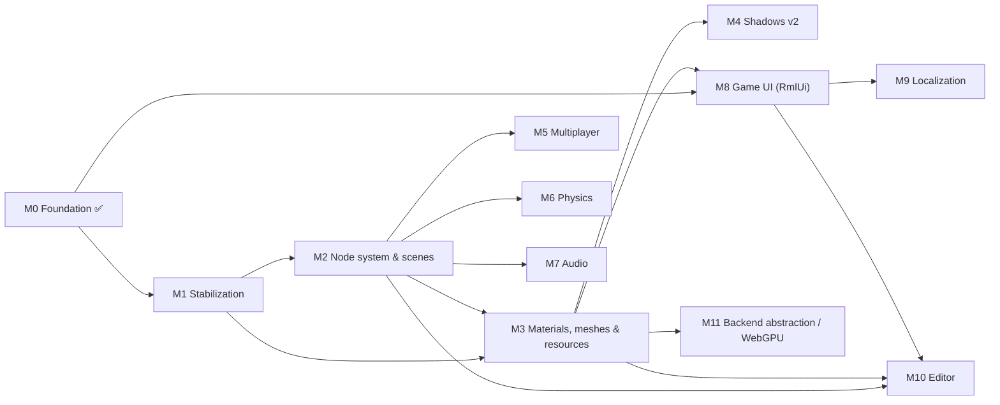

# Milestones

Roadmap for Mainframe Engine. Each row links to a design doc: completed features link to the
current-state doc, and future features link to a proposal in [`design/future/`](design/future/).

**Legend:** ✅ done · 🚧 in progress · ⬜ planned

| Milestone | Theme | Status |
|---|---|---|
| [M0](#m0--foundation-) | Vulkan renderer, lighting, shadows, sky, Spine, tooling, SDL windowing | ✅ |
| [M1](#m1--stabilization) | Fix correctness bugs blocking everything else | ⬜ |
| [M2](#m2--node-system--scenes) | Godot-style node tree, scene tree, scene files | ⬜ |
| [M3](#m3--materials-meshes--resources) | Materials, model loading, GPU memory, color, build pipeline | ⬜ |
| [M4](#m4--shadows-v2) | Cascades, PCF, atlas | ⬜ |
| [M5](#m5--multiplayer) | Message protocol, replication, Steam | ⬜ |
| [M6](#m6--physics) | Jitter2 (3D) + Box2D.NET (2D) physics nodes | ⬜ |
| [M7](#m7--audio) | SoundFlow audio nodes, buses, 3D panning | ⬜ |
| [M8](#m8--game-ui-rmlui) | RmlUi HTML/CSS game UI (also the editor's UI) | ⬜ |
| [M9](#m9--localization) | GetText.NET translations for code, UI and scenes | ⬜ |
| [M10](#m10--editor) | `MainframeEngine.Editor`, built on the game UI | ⬜ |
| [M11](#m11--backend-abstraction--webgpu) | Backend-neutral render API, WebGPU | ⬜ |

---

## M0 — Foundation ✅

The engine runs on Windows, Linux and macOS (MoltenVK, including Apple Silicon at 120 fps in the
Sandbox). It renders a lit, shadowed 3D scene with a sky, a reference grid, an animated Spine character
and an ImGui debug overlay. Networking and Steam exist only as scaffolds. The last M0 item moves
windowing and input from GLFW to SDL2 (via Silk.NET 2.22), so later input, gamepad and Steam work builds on it.

| Feature | Status | Design doc |
|---|---|---|
| `Engine` base class, game loop, `GameTime`, FPS limiter, VSync | ✅ | [Engine lifecycle](design/engine-lifecycle.md) |
| Vulkan 1.2 renderer (swapchain, 2 frames in flight, resize) | ✅ | [Vulkan renderer](design/vulkan-renderer.md) |
| macOS / MoltenVK support (`VulkanLoaderBootstrap`, portability) | ✅ | [Build & platforms](design/build-and-platforms.md) |
| Node types: `Node3D`, `Box3d`, `Quad` (lit, flat color) | ✅ | [Scene graph & nodes](design/scene-graph-and-nodes.md) |
| Directional / point / spot lights, Blinn-Phong | ✅ | [Lighting](design/lighting.md) |
| Shadow maps (dir 2D, spot 2D, point cube) | ✅ ¹ | [Shadow system](design/shadow-system.md) |
| Procedural / panoramic / cubemap sky | ✅ | [Sky](design/sky.md) |
| Spine skeletal animation, lit + shadow-casting | ✅ | [Spine](design/spine.md) |
| 2D/3D cameras, fly camera controls | ✅ | [Cameras & input](design/cameras-and-input.md) |
| Scene grid 2D/3D | ✅ | [Scene grid](design/scene-grid.md) |
| ImGui Vulkan backend, `Log`, axis and light gizmos | ✅ | [ImGui & debug tools](design/imgui-and-debug-tools.md) |
| Shader set + SPIR-V | ✅ | [Shaders](design/shaders.md) |
| ENet client/server + pooled buffers (scaffold) | ✅ ² | [Networking](design/networking.md) |
| Steamworks wrappers (scaffold, inert) | ✅ ² | [Steamworks](design/steamworks.md) |
| Switch windowing and input from GLFW to SDL (macOS loader handoff via `SDL_Vulkan_LoadLibrary`) | ✅ | [Build & platforms: SDL2](design/build-and-platforms.md#windowing-sdl2) |

¹ Correct only with a single shadow-casting directional/spot light (fixed in M1).
² Scaffold only; completed in M5.

## M1 — Stabilization

Fix the correctness bugs found while documenting M0, so every later milestone builds on a renderer
that is correct with multiple lights, any swapchain size, and validation enabled. Also bring the README
and CLAUDE.md back in line with the code.

| Feature | Status | Design doc |
|---|---|---|
| Per-pass shadow light matrix (dynamic-offset ring) | ⬜ | [Renderer stabilization §1](design/future/renderer-stabilization.md#1-per-pass-light-matrix) |
| Per-frame-slot resources; swapchain image-count robustness | ⬜ | [Renderer stabilization §2](design/future/renderer-stabilization.md#2-swapchain-count-robust-resources) |
| Remove the double depth remap | ⬜ | [Renderer stabilization §3](design/future/renderer-stabilization.md#3-depth-convention) |
| Depth hazard dependency, dynamic-indexing feature | ⬜ | [Renderer stabilization §4](design/future/renderer-stabilization.md#4-synchronization--features) |
| Spine without `ShadowSystem` (dummy set) | ⬜ | [Renderer stabilization §5](design/future/renderer-stabilization.md#5-spine-without-shadows) |
| Exit code, validation in Debug only, ImGui frame pairing and HiDPI | ⬜ | [Renderer stabilization §6](design/future/renderer-stabilization.md#6-small-fixes) |
| `SpineNode` scale, animation order, `SetAnimation` | ⬜ | [Renderer stabilization §6](design/future/renderer-stabilization.md#6-small-fixes) |
| CLAUDE.md sync with the code (README synced 2026-10-05) | ⬜ | [Renderer stabilization §6](design/future/renderer-stabilization.md#6-small-fixes) |

## M2 — Node system & scenes

Adopt a Godot-style node system. Everything in a game becomes a node in an engine-owned `SceneTree`:
- lifecycle callbacks, signals, groups and node paths;
- lights, cameras, the sky, physics, audio and UI as node types;
- servers behind the nodes instead of the static `Node.Initialize`.

Scenes and resources are saved as text files with stable UIDs. This is the foundation for the
editor and for replication.

| Feature | Status | Design doc |
|---|---|---|
| Node tree: children, owner, unique names, `NodePath`, `GetNode<T>`, groups | ⬜ | [Node system](design/future/node-system.md) |
| `SceneTree`: lifecycle (enter/ready/process/physics/exit), pause, deferred calls, `QueueFree` | ⬜ | [Node system](design/future/node-system.md#lifecycle) |
| `[Signal]` events + serializable connections | ⬜ | [Node system](design/future/node-system.md#signals) |
| `Node2D`/`Node3D` with cached global transforms; lights, cameras, sky as nodes | ⬜ | [Node system](design/future/node-system.md#node-catalog) |
| Servers (`RenderServer`, …) replace static `Node.Initialize`; `NodeId` registry | ⬜ | [Node system](design/future/node-system.md#servers) |
| `[Export]` + source-generated type registry | ⬜ | [Scene serialization](design/future/scene-serialization.md#property-model) |
| `.mscene` / `.mres` files, `PackedScene`, nested instances, UIDs + `AssetDatabase` | ⬜ | [Scene serialization](design/future/scene-serialization.md) |

## M3 — Materials, meshes & resources

Make the renderer scale beyond a handful of objects and support real content: shared pipelines,
textured materials, model loading, pooled GPU memory, non-blocking uploads, a linear/HDR color
pipeline, and shaders compiled as part of the build.

| Feature | Status | Design doc |
|---|---|---|
| Pipeline cache + per-frame shared descriptor sets | ⬜ | [Materials & meshes](design/future/materials-and-meshes.md) |
| `Material`, `Mesh`, `MeshNode`, textures | ⬜ | [Materials & meshes](design/future/materials-and-meshes.md) |
| Model loading via Assimp | ⬜ | [Materials & meshes](design/future/materials-and-meshes.md) |
| GPU allocator, upload queue, deferred deletion | ⬜ | [GPU resource management](design/future/gpu-resource-management.md) |
| Linear lighting, HDR target, tonemapping, sRGB, Spine PMA | ⬜ | [Color pipeline](design/future/color-pipeline.md) |
| Build-time shader compilation, includes, `ContentPaths` | ⬜ | [Asset & shader pipeline](design/future/asset-and-shader-pipeline.md) |

## M4 — Shadows v2

Production-quality shadows: cascades for the sun, soft filtering, and an atlas that cuts memory and
the sampler count.

| Feature | Status | Design doc |
|---|---|---|
| Cascaded shadow maps for the primary directional light | ⬜ | [Shadows v2](design/future/shadows-v2.md) |
| PCF for 2D and cube maps; normal-offset bias | ⬜ | [Shadows v2](design/future/shadows-v2.md) |
| Spot / secondary-directional shadow atlas | ⬜ | [Shadows v2](design/future/shadows-v2.md) |
| Per-light `CastsShadows`, resolution; allocation-free pass | ⬜ | [Shadows v2](design/future/shadows-v2.md) |

## M5 — Multiplayer

Turn the networking and Steam scaffolds into a working multiplayer stack: a typed message protocol,
node replication, a transport abstraction (ENet / Steam sockets), working lobbies, and Apple Silicon
support.

| Feature | Status | Design doc |
|---|---|---|
| Message header, registry, dispatch, public events | ⬜ | [Networking & replication](design/future/networking-replication.md) |
| Spawn/despawn, snapshots, interpolation, RPCs | ⬜ | [Networking & replication](design/future/networking-replication.md) |
| `ITransport` (ENet, Steam Networking Sockets) | ⬜ | [Networking & replication](design/future/networking-replication.md) |
| ENet osx-arm64 native | ⬜ | [Networking & replication](design/future/networking-replication.md#osx-arm64) |
| Steam init / callback pump / native packaging | ⬜ | [Steamworks integration](design/future/steamworks-integration.md) |
| Lobby fixes, avatars as textures, achievements persistence | ⬜ | [Steamworks integration](design/future/steamworks-integration.md) |

## M6 — Physics

Godot-style physics nodes on two pure-C# engines:
- **Jitter2** for 3D;
- **Box2D.NET** (a Box2D v3 port) for 2D, because Jitter2 is 3D-only.

Both run on a fixed timestep with interpolated rendering, collision layers, signals and queries.

| Feature | Status | Design doc |
|---|---|---|
| `PhysicsServer3D` (Jitter2 2.9) + `PhysicsServer2D` (Box2D.NET 3.1) per world | ⬜ | [Physics](design/future/physics.md#servers) |
| Body nodes (static, rigid, character, area) + `CollisionShape` children + shape resources | ⬜ | [Physics](design/future/physics.md#node-model) |
| Fixed step, `OnPhysicsProcess`, interpolation | ⬜ | [Physics](design/future/physics.md#fixed-timestep-and-interpolation) |
| Layers/masks, contact and area signals, raycast/shape-cast queries | ⬜ | [Physics](design/future/physics.md#contacts-areas-and-signals) |
| `CharacterBody.MoveAndSlide`, debug draw | ⬜ | [Physics](design/future/physics.md#characterbody-moveandslide) |

## M7 — Audio

Audio nodes on **SoundFlow** (MIT, miniaudio, ships natives including osx-arm64):
- a bus mixer;
- in-memory and streamed sounds;
- positional audio through SoundFlow's `SurroundPlayer` panner, with engine-side attenuation and
  listener orientation.

| Feature | Status | Design doc |
|---|---|---|
| `AudioServer`: device, bus tree, batched command queue | ⬜ | [Audio](design/future/audio.md#architecture) |
| `AudioPlayer` / `AudioPlayer2D` / `AudioPlayer3D` / `AudioListener3D` | ⬜ | [Audio](design/future/audio.md#nodes) |
| `AudioStream` resources (memory vs stream), OGG decision | ⬜ | [Audio](design/future/audio.md#streams-and-resources) |
| Positional audio via `SurroundPlayer` + attenuation curves + smoothing | ⬜ | [Audio](design/future/audio.md#spatialization) |
| Voice pool, polyphony, pause handling | ⬜ | [Audio](design/future/audio.md#voice-management) |

## M8 — Game UI (RmlUi)

HTML/CSS-style UI using **RmlUi 6.3**, through an engine-owned native binding and a Vulkan render
interface on the engine's device. This same stack is the editor's UI.

| Feature | Status | Design doc |
|---|---|---|
| Native C ABI shim (RmlUi 6.3 + FreeType) and CI builds per platform | ⬜ | [Game UI](design/future/game-ui.md#projects-and-natives) |
| `VulkanUiRenderer` v1 (basic render interface) | ⬜ | [Game UI](design/future/game-ui.md#render-interface-vulkan) |
| `UiServer`, `UiLayer`, `UiDocument`, data binding, element events | ⬜ | [Game UI](design/future/game-ui.md#contexts-layers-and-documents) |
| Input routing, IME, clipboard, gamepad navigation | ⬜ | [Game UI](design/future/game-ui.md#input-routing) |
| Hot reload, debugger, shared widget library | ⬜ | [Game UI](design/future/game-ui.md#development-tools) |
| v2: UI pass with stencil clip masks, layers and filters | ⬜ | [Game UI](design/future/game-ui.md#where-ui-renders-in-the-frame) |

## M9 — Localization

Translations with **GetText.NET**, using the gettext workflow (`.pot` → `.po` → `.mo`). Strings are
extracted from C#, RML documents and scene files, and the language can be switched at runtime.

| Feature | Status | Design doc |
|---|---|---|
| `Tr` API, catalog management, runtime locale switching | ⬜ | [Localization](design/future/localization.md#runtime-api) |
| Extraction (C# extractor + `mf-l10n` for RML and scenes), `msgfmt` build step | ⬜ | [Localization](design/future/localization.md#workflow) |
| RmlUi `TranslateString` hook, per-locale fonts | ⬜ | [Localization](design/future/localization.md#rmlui-integration) |
| Pseudo-locale for testing | ⬜ | [Localization](design/future/localization.md#pseudo-localization) |

## M10 — Editor

A Godot-style editor in a separate `MainframeEngine.Editor` project. It depends only on the engine
core, and its UI is built entirely with the M8 game UI stack (RmlUi).

| Feature | Status | Design doc |
|---|---|---|
| E1 Shell: editor csproj, `EditorApp`, RmlUi layout, Output panel, open/save scenes | ⬜ | [Editor](design/future/editor.md#phases) |
| E2 Scene tree + inspector (`[Export]`) + undo/redo | ⬜ | [Editor](design/future/editor.md#inspector) |
| E3 Viewport: render target in RmlUi, editor camera, ID picking, gizmos | ⬜ | [Editor](design/future/editor.md#viewport) |
| E4 Projects: game assembly load and reload, file system panel, out-of-process play | ⬜ | [Editor](design/future/editor.md#game-project-and-code-reload) |
| E5 Polish: signals tab, multi-select, 2D editing, custom inspectors | ⬜ | [Editor](design/future/editor.md#phases) |

## M11 — Backend abstraction / WebGPU

Hide Vulkan behind a backend-neutral GPU API, so nodes no longer record raw `Vk` commands, then add
the WebGPU backend the README promises.

| Feature | Status | Design doc |
|---|---|---|
| `IGpuDevice` / encoder API; port all subsystems | ⬜ | [Rendering backend abstraction](design/future/rendering-backend-abstraction.md) |
| Shader cross-compilation (SPIR-V → WGSL) | ⬜ | [Rendering backend abstraction](design/future/rendering-backend-abstraction.md) |
| WebGPU backend selected by `EngineOptions.RenderingBackend` | ⬜ | [Rendering backend abstraction](design/future/rendering-backend-abstraction.md) |

---

*Updating this file:* flip a row to 🚧 when work starts and to ✅ when it merges. When a proposal ships,
move its content into the matching current-state doc in `design/` and repoint the row's link there.
