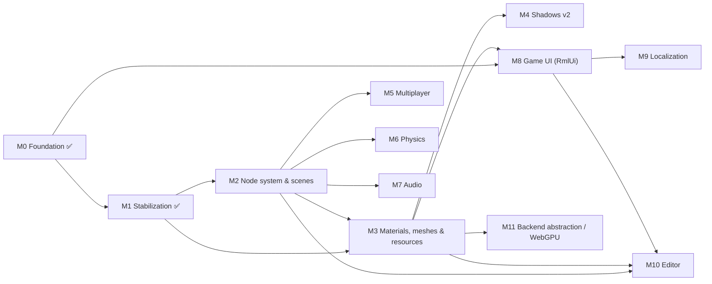

# Milestones

Roadmap for Mainframe Engine. Each row links to a design doc: completed features link to the
current-state doc, and future features link to a proposal in [`design/future/`](design/future/).

**Legend:** ✅ done · 🚧 in progress · ⬜ planned

| Milestone | Theme | Status |
|---|---|---|
| [M0](#m0--foundation-) | Vulkan renderer, lighting, shadows, sky, Spine, tooling, SDL windowing | ✅ |
| [M1](#m1--stabilization-) | Fix correctness bugs blocking everything else | ✅ |
| [M2](#m2--node-system--scenes-) | Godot-style node tree, scene tree, scene files | ✅ |
| [M3](#m3--materials-meshes--resources) | Materials, model loading, GPU memory, color, build pipeline | ✅ |
| [M4](#m4--shadows-v2-) | Cascades, PCF, atlas | ✅ |
| [M5](#m5--multiplayer-) | Message protocol, replication, Steam | ✅ |
| [M6](#m6--physics-) | Jitter2 (3D) + Box2D.NET (2D) physics nodes | ✅ |
| [M7](#m7--audio-) | SoundFlow audio nodes, buses, 3D panning | ✅ |
| [M8](#m8--game-ui-rmlui-) | RmlUi HTML/CSS game UI (also the editor's UI) | ✅ |
| [M9](#m9--localization-) | GetText.NET translations for code, UI and scenes | ✅ |
| [M10](#m10--editor) | `MainframeEngine.Editor`, built on the game UI | 🚧 E1–E3 + E4 engine side ✅ |
| [M11](#m11--backend-abstraction--webgpu) | Backend-neutral render API, WebGPU | ⬜ |

---

## M0 — Foundation ✅

The engine runs on Windows, Linux and macOS (MoltenVK, including Apple Silicon at 120 fps in the
Sandbox). It renders a lit, shadowed 3D scene with a sky, a reference grid, an animated Spine character
and an ImGui debug overlay. Networking and Steam exist only as scaffolds. The last M0 item moves
windowing and input from GLFW to SDL2 (via Silk.NET 2.22), so later input, gamepad and Steam work builds on it.

| Feature | Status | Design doc |
|---|---|---|
| `Engine` base class, game loop, `GameTime`, FPS limiter, VSync | ✅ | [Engine lifecycle](design/engine-lifecycle.md) |
| Vulkan 1.2 renderer (swapchain, 2 frames in flight, resize) | ✅ | [Vulkan renderer](design/vulkan-renderer.md) |
| macOS / MoltenVK support (`VulkanLoaderBootstrap`, portability) | ✅ | [Build & platforms](design/build-and-platforms.md) |
| Node types: `Node3D`, `Box3d`, `Quad` (lit, flat color) | ✅ | [Scene graph & nodes](design/scene-graph-and-nodes.md) |
| Directional / point / spot lights, Blinn-Phong | ✅ | [Lighting](design/lighting.md) |
| Shadow maps (dir 2D, spot 2D, point cube) | ✅ ¹ | [Shadow system](design/shadow-system.md) |
| Procedural / panoramic / cubemap sky | ✅ | [Sky](design/sky.md) |
| Spine skeletal animation, lit + shadow-casting | ✅ | [Spine](design/spine.md) |
| 2D/3D cameras, fly camera controls | ✅ | [Cameras & input](design/cameras-and-input.md) |
| Scene grid 2D/3D | ✅ | [Scene grid](design/scene-grid.md) |
| ImGui Vulkan backend, `Log`, axis and light gizmos | ✅ | [ImGui & debug tools](design/imgui-and-debug-tools.md) |
| Shader set + SPIR-V | ✅ | [Shaders](design/shaders.md) |
| ENet client/server + pooled buffers (scaffold) | ✅ ² | [Networking](design/networking.md) |
| Steamworks wrappers (scaffold, inert) | ✅ ² | [Steamworks](design/steamworks.md) |
| Switch windowing and input from GLFW to SDL (macOS loader handoff via `SDL_Vulkan_LoadLibrary`) | ✅ | [Build & platforms: SDL2](design/build-and-platforms.md#windowing-sdl2) |

¹ Correct only with a single shadow-casting directional/spot light until M1 (per-pass light matrices).
² Scaffold only; completed in M5.

## M1 — Stabilization ✅

Fix the correctness bugs found while documenting M0, so every later milestone builds on a renderer
that is correct with multiple lights, any swapchain size, and validation enabled. Also bring the README
and CLAUDE.md back in line with the code.

| Feature | Status | Design doc |
|---|---|---|
| Per-pass shadow light matrix (dynamic-offset ring) | ✅ | [Shadow system: light VP ring](design/shadow-system.md#light-view-projection-ring-per-pass-matrices) |
| Per-frame-slot resources; swapchain image-count robustness | ✅ | [Vulkan renderer: per-frame-slot resources](design/vulkan-renderer.md#per-frame-slot-resources) |
| Remove the double depth remap | ✅ | [Coordinate conventions: depth](design/coordinate-conventions.md#depth) |
| Depth hazard dependency, dynamic-indexing feature, depth-format features, explicit cull mode | ✅ | [Vulkan renderer](design/vulkan-renderer.md#main-render-pass) · [Shadow system](design/shadow-system.md#pipelines) |
| Spine without `ShadowSystem` (dummy set) | ✅ | [Shadow system: without a ShadowSystem](design/shadow-system.md#without-a-shadowsystem) |
| Exit code, validation in Debug only, ImGui frame pairing and HiDPI, no busy-wait when minimised | ✅ | [Engine lifecycle](design/engine-lifecycle.md) · [ImGui & debug tools](design/imgui-and-debug-tools.md) |
| `SpineNode` scale, animation order, `SetAnimation`, vertex growth, pixel release | ✅ | [Spine](design/spine.md) |
| CLAUDE.md sync with the code (README synced 2026-10-05) | ✅ | [CLAUDE.md](../CLAUDE.md) |

## M2 — Node system & scenes ✅

Adopt a Godot-style node system. Everything in a game becomes a node in an engine-owned `SceneTree`:
- lifecycle callbacks, signals, groups and node paths;
- lights, cameras, the sky, physics, audio and UI as node types;
- servers behind the nodes instead of the static `Node.Initialize`.

Scenes and resources are saved as text files with stable UIDs. This is the foundation for the
editor and for replication. Physics, audio and UI nodes arrive with their milestones (M6–M8) on the server
registration pattern M2 defines; `Box3d`/`Quad` give way to `MeshInstance3D` in M3.

| Feature | Status | Design doc |
|---|---|---|
| Node tree: children, owner, unique names, `NodePath`, `GetNode<T>`, groups | ✅ | [Scene graph & nodes](design/scene-graph-and-nodes.md#the-tree) |
| `SceneTree`: lifecycle (enter/ready/process/physics/exit), pause, deferred calls, `QueueFree` | ✅ | [Scene graph & nodes](design/scene-graph-and-nodes.md#lifecycle) |
| `[Signal]` events + serializable connections | ✅ | [Scene graph & nodes](design/scene-graph-and-nodes.md#signals) |
| `Node2D`/`Node3D` with cached global transforms; lights, cameras, sky as nodes | ✅ | [Scene graph & nodes](design/scene-graph-and-nodes.md#transforms) |
| Servers (`RenderServer`, …) replace static `Node.Initialize`; `NodeId` registry | ✅ | [Scene graph & nodes](design/scene-graph-and-nodes.md#servers-and-render-nodes) |
| Input events routed through the tree (`OnInput` / `OnUnhandledInput`) | ✅ | [Scene graph & nodes](design/scene-graph-and-nodes.md#input) |
| `[Export]` + source-generated type registry (`MainframeEngine.Generators`) | ✅ | [Scene serialization](design/scene-serialization.md#property-model) |
| `.mscene` / `.mres` files, `PackedScene`, nested instances, UIDs + `AssetDatabase` | ✅ | [Scene serialization](design/scene-serialization.md) |
| Sandbox scene loaded from `Content/Scenes/Sandbox.mscene` | ✅ | [Sandbox](design/sandbox.md) |

## M3 — Materials, meshes & resources

Make the renderer scale beyond a handful of objects and support real content: shared pipelines,
textured materials, model loading, pooled GPU memory, non-blocking uploads, a linear/HDR color
pipeline, and shaders compiled as part of the build.

| Feature | Status | Design doc |
|---|---|---|
| Pipeline cache + per-frame shared descriptor sets | ✅ persisted `VkPipelineCache`, shader modules, set 0/1 (`FrameContext`, per view), state-hash `PipelineStateCache` for mesh pipelines | [GPU resources](design/gpu-resources.md#pipeline-cache), [Materials & meshes](design/materials-and-meshes.md#pipelines-pipelinestatecache) |
| `Material`, `Mesh`, `MeshInstance3D`, `Sprite3D`, textures (sRGB/UNORM per usage, GPU mips, `.meta` settings); `Box3d`/`Quad` removed | ✅ | [Materials & meshes](design/materials-and-meshes.md) |
| Instanced, sorted batches (opaque by state, transparent back to front), frustum culling, instanced shadow casters, draw stats | ✅ | [Materials & meshes](design/materials-and-meshes.md#frame) |
| Model loading via Assimp (glTF/FBX/OBJ → `PackedScene`), import settings, import cache | ✅ | [Asset pipeline](design/asset-pipeline.md) |
| Object-ID picking (`PickAsync`), `SubViewport` offscreen views (ImGui texture) | ✅ | [Materials & meshes](design/materials-and-meshes.md#picking-object-ids) |
| GPU allocator, upload queue, deferred deletion | ✅ | [GPU resources](design/gpu-resources.md) |
| Linear lighting, HDR target, tonemapping, sRGB, Spine PMA | ✅ | [Color pipeline](design/color-pipeline.md) |
| Build-time shader compilation, includes, `ContentPaths` | ✅ | [Shaders](design/shaders.md), [Build & platforms](design/build-and-platforms.md#shaders) |

## M4 — Shadows v2 ✅

Production-quality shadows: cascades for the sun, soft filtering, and an atlas that cuts memory and
the sampler count.

| Feature | Status | Design doc |
|---|---|---|
| Cascaded shadow maps for the primary directional light | ✅ 4 cascades, practical split, sphere fit, texel snapping, blend, debug tint | [Shadow system](design/shadow-system.md#cascades) |
| PCF for 2D and cube maps; normal-offset bias | ✅ hard / 3×3 / Poisson 16, 20-tap cube disc, receiver + slope bias | [Shadow system](design/shadow-system.md#sampling-and-filtering) |
| Spot / secondary-directional shadow atlas | ✅ quadtree tiles, 6 shadow samplers (was 15), every spot casts | [Shadow system](design/shadow-system.md#atlas) |
| Per-light `CastsShadows`, resolution; allocation-free pass | ✅ exported on light nodes; per-pass caster culling; cutout casters | [Shadow system](design/shadow-system.md#settings-debug-and-statistics) |

## M5 — Multiplayer ✅

Turn the networking and Steam scaffolds into a working multiplayer stack: a typed message protocol,
server-authoritative node replication, a transport abstraction (ENet / Steam sockets), working lobbies, and Apple
Silicon support. The Sandbox has a `--server` / `--client <host>` demo.

| Feature | Status | Design doc |
|---|---|---|
| Message header, registry, dispatch, public events | ✅ | [Networking](design/networking.md#wire-format) |
| Spawn/despawn (by scene UID), `[Replicated]` delta snapshots, interpolation, RPCs, authority | ✅ | [Networking: replication](design/networking.md#replication) |
| Connection lifecycle (handshake, fingerprints, timeouts, kick), bandwidth stats | ✅ | [Networking: replication](design/networking.md#handshake-timeouts-and-leaving) |
| `ITransport` (ENet, loopback, simulated bad network; Steam Networking Sockets stubbed ³) | ✅ | [Networking](design/networking.md#layers) |
| ENet osx-arm64 native | ✅ | [Natives](design/natives.md) |
| Steam init / callback pump; native packaging ³ | ✅ | [Steamworks](design/steamworks.md#engine-hook) |
| Lobby fixes, lobby → transport handoff, achievements persistence; avatars as textures ³ | ✅ | [Steamworks](design/steamworks.md#lobby--transport-handoff) |

³ Steam natives cannot ship (the Steamworks SDK needs a partner login, and Steamworks.NET 2024.8.0 is x86-64 only),
so Steam never starts: `SteamSocketsTransport` and avatar textures are designed but not implemented, and the lobby
handoff falls back to ENet. See [ADR 0044](../memory/decisions/0044-steam-features-without-natives.md).

## M6 — Physics ✅

Godot-style physics nodes on two pure-C# engines:
- **Jitter2** for 3D;
- **Box2D.NET** (a Box2D v3 port) for 2D, because Jitter2 is 3D-only.

Both run on a fixed timestep with interpolated rendering, collision layers, signals and queries. Shipped with a
custom `MoveAndSlide`, collision-shape debug drawing (`DebugLines`), allocation-free 3D steps and physics render tests;
editor gizmos follow with M10.

| Feature | Status | Design doc |
|---|---|---|
| `PhysicsServer3D` (Jitter2 2.9) + `PhysicsServer2D` (Box2D.NET 3.1) per world | ✅ | [Physics](design/physics.md#servers-and-spaces) |
| Body nodes (static, rigid, character, area) + `CollisionShape` children + shape resources | ✅ | [Physics](design/physics.md#node-model) |
| Fixed step, `OnPhysicsProcess`, interpolation | ✅ | [Physics](design/physics.md#fixed-timestep-and-interpolation) |
| Layers/masks, contact and area signals, raycast/shape-cast queries | ✅ | [Physics](design/physics.md#contacts-areas-and-signals) |
| `CharacterBody.MoveAndSlide`, debug draw | ✅ | [Physics](design/physics.md#characterbody-moveandslide) |

## M7 — Audio ✅

Audio nodes on **SoundFlow** 1.4.1 (MIT, miniaudio natives for every desktop platform including osx-arm64):
- an `AudioServer` with a bus mixer and pooled voices, fed by a batched lock-free command queue;
- in-memory and streamed sounds (WAV, OGG via NVorbis, MP3, FLAC);
- positional audio with engine-side attenuation curves, listener orientation, smoothing and optional doppler (the
  engine pans itself: SoundFlow's `SurroundPlayer` turned out unusable, see the ADR);
- a silent null device when no audio device exists, so startup never fails.

| Feature | Status | Design doc |
|---|---|---|
| `AudioServer`: device (null-device fallback), bus tree, batched command queue | ✅ | [Audio](design/audio.md#architecture) |
| `AudioPlayer` / `AudioPlayer2D` / `AudioPlayer3D` / `AudioListener3D` | ✅ | [Audio](design/audio.md#nodes) |
| `AudioStream` resources (memory vs stream), OGG via NVorbis | ✅ | [Audio](design/audio.md#streams-and-resources) |
| Positional audio: listener-space projection, attenuation curves, pan smoothing (engine panner, [ADR 0031](../memory/decisions/0031-positional-audio-engine-panner.md)) | ✅ | [Audio](design/audio.md#spatialization) |
| Voice pool, polyphony, stealing, pause handling | ✅ | [Audio](design/audio.md#voices) |
| Editor preview, range gizmos, Audio bus panel | ⬜ (M10) | [Editor](design/future/editor.md) |

## M8 — Game UI (RmlUi) ✅

HTML/CSS-style UI using **RmlUi 6.3**, through an engine-owned native binding and a Vulkan render
interface on the engine's device. This same stack is the editor's UI. Documents render into an offscreen
premultiplied sRGB layer composited after the tonemap (below ImGui), with clip masks, layers, filters and
gradients; the UI sees input before the scene tree.

| Feature | Status | Design doc |
|---|---|---|
| Native C ABI shim (RmlUi 6.3 + FreeType) and CI builds per platform | ✅ | [Native libraries](design/natives.md) |
| Managed binding: `LibraryImport`, SafeHandles, `[UnmanagedCallersOnly]` callbacks, ABI check | ✅ | [Game UI](design/game-ui.md#managed-binding-mainframeengineuirml) |
| `VulkanUiRenderer`: geometry arena, textures (`engine://`), scissor, transforms | ✅ | [Game UI](design/game-ui.md#rendering-vulkanuirenderer) |
| Clip masks (stencil), layers, filters, gradients | ✅ | [Game UI](design/game-ui.md#rendering-vulkanuirenderer) |
| `UiServer`, `UiLayer`, `UiDocument`, data binding, element events | ✅ | [Game UI](design/game-ui.md#uiserver-uilayer-uidocument) |
| Input routing, IME placement, clipboard, gamepad navigation | ✅ | [Game UI](design/game-ui.md#input-routing) |
| Hot reload, debugger (F8), shared widget library, bundled fonts | ✅ | [Game UI](design/game-ui.md#development-tools) |
| Sandbox HUD; ImGui as the F12 developer overlay | ✅ | [Game UI](design/game-ui.md#sandbox), [Sandbox](design/sandbox.md) |
| Inline IME composition (shim ABI 1.1 `TextInputContext`) | ⬜ | [Game UI](design/game-ui.md#known-issues) |

## M9 — Localization ✅

Translations with **GetText.NET**, using the gettext workflow (`.pot` → `.po` → `.mo`). Strings are
extracted from C#, RML documents and scene files, and the language can be switched at runtime.

| Feature | Status | Design doc |
|---|---|---|
| `Tr` API, catalog management, runtime locale switching | ✅ | [Localization](design/localization.md#runtime-api) |
| Extraction (C# extractor + `mf-l10n` for RML and scenes), `.mo` build step (in-house, `msgfmt`-identical) | ✅ | [Localization](design/localization.md#workflow) |
| `[Export(Translatable)]` scene strings, re-translation on locale change | ✅ | [Localization](design/localization.md#scene-strings) |
| RmlUi `TranslateString` hook, `no-tr`, translated attributes, per-locale fonts, live re-translation (`UiServer`) | ✅ | [Localization](design/localization.md#game-ui-rmlui) |
| Pseudo-locale for testing | ✅ | [Localization](design/localization.md#pseudo-localization) |

## M10 — Editor

A Godot-style editor in a separate `MainframeEngine.Editor` project. It depends only on the engine
core, and its UI is built entirely with the M8 game UI stack (RmlUi).

| Feature | Status | Design doc |
|---|---|---|
| E1 Shell: editor csproj, `EditorApp`, RmlUi layout, Output panel, open/save scenes | ✅ | [Editor](design/editor.md) |
| E2 Scene tree + inspector (`[Export]`) + undo/redo | ✅ | [Editor](design/editor.md#inspector) |
| E3 Viewport: render target in RmlUi, editor camera, ID picking, gizmos | ✅ | [Editor](design/editor.md#viewport) |
| E4 engine side: `project.mfproj` + `ProjectSettings`, `GameHost`, input actions, autoloads, `ILogSink` routing, editor link (play/stop/pause/reload, log streaming), collectible game-assembly load/unload/reload, `mfgame` template + CI smoke | ✅ | [Projects & GameHost](design/project-and-gamehost.md) |
| E4 editor side: open/new project, file system panel, Play/Stop buttons, Output panel over the link, reload UI | ⬜ | [Editor](design/future/editor.md#game-project-and-code-reload) |
| E5 Polish: signals tab, multi-select, 2D editing, custom inspectors | ⬜ | [Editor](design/future/editor.md#phases) |

## M11 — Backend abstraction / WebGPU

Hide Vulkan behind a backend-neutral GPU API, so nodes no longer record raw `Vk` commands, then add
the WebGPU backend the README promises.

| Feature | Status | Design doc |
|---|---|---|
| `IGpuDevice` / encoder API; port all subsystems | ⬜ | [Rendering backend abstraction](design/future/rendering-backend-abstraction.md) |
| Shader cross-compilation (SPIR-V → WGSL) | ⬜ | [Rendering backend abstraction](design/future/rendering-backend-abstraction.md) |
| WebGPU backend selected by `EngineOptions.RenderingBackend` | ⬜ | [Rendering backend abstraction](design/future/rendering-backend-abstraction.md) |

---

*Updating this file:* flip a row to 🚧 when work starts and to ✅ when it merges. When a proposal ships,
move its content into the matching current-state doc in `design/` and repoint the row's link there.
