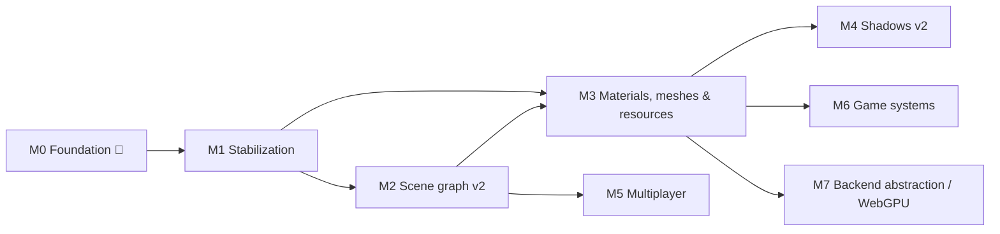

# Milestones

Roadmap for Mainframe Engine. Each row links to a design doc: completed features link to the
current-state doc, and future features link to a proposal in [`design/future/`](design/future/).

**Legend:** ✅ done · 🚧 in progress · ⬜ planned

| Milestone | Theme | Status |
|---|---|---|
| [M0](#m0--foundation-) | Vulkan renderer, lighting, shadows, sky, Spine, tooling, SDL windowing | 🚧 |
| [M1](#m1--stabilization) | Fix correctness bugs blocking everything else | ⬜ |
| [M2](#m2--scene-graph-v2) | Real hierarchy, engine-owned scene | ⬜ |
| [M3](#m3--materials-meshes--resources) | Materials, model loading, GPU memory, color, build pipeline | ⬜ |
| [M4](#m4--shadows-v2) | Cascades, PCF, atlas | ⬜ |
| [M5](#m5--multiplayer) | Message protocol, replication, Steam | ⬜ |
| [M6](#m6--game-systems) | Audio, physics, game UI | ⬜ |
| [M7](#m7--backend-abstraction--webgpu) | Backend-neutral render API, WebGPU | ⬜ |

---

## M0 — Foundation 🚧

The engine runs on Windows, Linux and macOS (MoltenVK, including Apple Silicon at 120 fps in the
Sandbox). It renders a lit, shadowed 3D scene with a sky, a reference grid, an animated Spine character
and an ImGui debug overlay. Networking and Steam exist only as scaffolds. The last M0 item moves
windowing and input from GLFW to SDL, so later input, gamepad and Steam work builds on it.

| Feature | Status | Design doc |
|---|---|---|
| `Engine` base class, game loop, `GameTime`, FPS limiter, VSync | ✅ | [Engine lifecycle](design/engine-lifecycle.md) |
| Vulkan 1.2 renderer (swapchain, 2 frames in flight, resize) | ✅ | [Vulkan renderer](design/vulkan-renderer.md) |
| macOS / MoltenVK support (`VulkanLoaderBootstrap`, portability) | ✅ | [Build & platforms](design/build-and-platforms.md) |
| Node types: `Node3D`, `Box3d`, `Quad` (lit, flat color) | ✅ | [Scene graph & nodes](design/scene-graph-and-nodes.md) |
| Directional / point / spot lights, Blinn-Phong | ✅ | [Lighting](design/lighting.md) |
| Shadow maps (dir 2D, spot 2D, point cube) | ✅ ¹ | [Shadow system](design/shadow-system.md) |
| Procedural / panoramic / cubemap sky | ✅ | [Sky](design/sky.md) |
| Spine skeletal animation, lit + shadow-casting | ✅ | [Spine](design/spine.md) |
| 2D/3D cameras, fly camera controls | ✅ | [Cameras & input](design/cameras-and-input.md) |
| Scene grid 2D/3D | ✅ | [Scene grid](design/scene-grid.md) |
| ImGui Vulkan backend, `Log`, axis and light gizmos | ✅ | [ImGui & debug tools](design/imgui-and-debug-tools.md) |
| Shader set + SPIR-V | ✅ | [Shaders](design/shaders.md) |
| ENet client/server + pooled buffers (scaffold) | ✅ ² | [Networking](design/networking.md) |
| Steamworks wrappers (scaffold, inert) | ✅ ² | [Steamworks](design/steamworks.md) |
| Switch windowing and input from GLFW to SDL (macOS loader handoff via `SDL_Vulkan_LoadLibrary`) | ⬜ | [SDL windowing](design/future/sdl-windowing.md) |

¹ Correct only with a single shadow-casting directional/spot light (fixed in M1).
² Scaffold only; completed in M5.

## M1 — Stabilization

Fix the correctness bugs found while documenting M0, so every later milestone builds on a renderer
that is correct with multiple lights, any swapchain size, and validation enabled. Also bring the README
and CLAUDE.md back in line with the code.

| Feature | Status | Design doc |
|---|---|---|
| Per-pass shadow light matrix (dynamic-offset ring) | ⬜ | [Renderer stabilization §1](design/future/renderer-stabilization.md#1-per-pass-light-matrix) |
| Per-frame-slot resources; swapchain image-count robustness | ⬜ | [Renderer stabilization §2](design/future/renderer-stabilization.md#2-swapchain-count-robust-resources) |
| Remove the double depth remap | ⬜ | [Renderer stabilization §3](design/future/renderer-stabilization.md#3-depth-convention) |
| Depth hazard dependency, dynamic-indexing feature | ⬜ | [Renderer stabilization §4](design/future/renderer-stabilization.md#4-synchronization--features) |
| Spine without `ShadowSystem` (dummy set) | ⬜ | [Renderer stabilization §5](design/future/renderer-stabilization.md#5-spine-without-shadows) |
| Exit code, validation in Debug only, ImGui frame pairing and HiDPI | ⬜ | [Renderer stabilization §6](design/future/renderer-stabilization.md#6-small-fixes) |
| `SpineNode` scale, animation order, `SetAnimation` | ⬜ | [Renderer stabilization §6](design/future/renderer-stabilization.md#6-small-fixes) |
| README / CLAUDE.md sync with the code | ⬜ | [Renderer stabilization §6](design/future/renderer-stabilization.md#6-small-fixes) |

## M2 — Scene graph v2

Replace the game-owned flat node list with an engine-owned `Scene`: a parent/child hierarchy, cached
world transforms, injected services instead of the static `Node.Initialize`, and a `NodeId` registry
that networking will need.

| Feature | Status | Design doc |
|---|---|---|
| Children, reparenting, cached local/world TRS (quaternions) | ⬜ | [Scene graph v2](design/future/scene-graph-v2.md) |
| Engine-owned `Scene` with update / shadow / draw traversal | ⬜ | [Scene graph v2](design/future/scene-graph-v2.md) |
| `EngineServices` injection (remove static `Node.Initialize`) | ⬜ | [Scene graph v2](design/future/scene-graph-v2.md) |
| `NodeId → Node` registry | ⬜ | [Scene graph v2](design/future/scene-graph-v2.md) |

## M3 — Materials, meshes & resources

Make the renderer scale beyond a handful of objects and support real content: shared pipelines,
textured materials, model loading, pooled GPU memory, non-blocking uploads, a linear/HDR color
pipeline, and shaders compiled as part of the build.

| Feature | Status | Design doc |
|---|---|---|
| Pipeline cache + per-frame shared descriptor sets | ⬜ | [Materials & meshes](design/future/materials-and-meshes.md) |
| `Material`, `Mesh`, `MeshNode`, textures | ⬜ | [Materials & meshes](design/future/materials-and-meshes.md) |
| Model loading via Assimp | ⬜ | [Materials & meshes](design/future/materials-and-meshes.md) |
| GPU allocator, upload queue, deferred deletion | ⬜ | [GPU resource management](design/future/gpu-resource-management.md) |
| Linear lighting, HDR target, tonemapping, sRGB, Spine PMA | ⬜ | [Color pipeline](design/future/color-pipeline.md) |
| Build-time shader compilation, includes, `ContentPaths` | ⬜ | [Asset & shader pipeline](design/future/asset-and-shader-pipeline.md) |

## M4 — Shadows v2

Production-quality shadows: cascades for the sun, soft filtering, and an atlas that cuts memory and
the sampler count.

| Feature | Status | Design doc |
|---|---|---|
| Cascaded shadow maps for the primary directional light | ⬜ | [Shadows v2](design/future/shadows-v2.md) |
| PCF for 2D and cube maps; normal-offset bias | ⬜ | [Shadows v2](design/future/shadows-v2.md) |
| Spot / secondary-directional shadow atlas | ⬜ | [Shadows v2](design/future/shadows-v2.md) |
| Per-light `CastsShadows`, resolution; allocation-free pass | ⬜ | [Shadows v2](design/future/shadows-v2.md) |

## M5 — Multiplayer

Turn the networking and Steam scaffolds into a working multiplayer stack: a typed message protocol,
node replication, a transport abstraction (ENet / Steam sockets), working lobbies, and Apple Silicon
support.

| Feature | Status | Design doc |
|---|---|---|
| Message header, registry, dispatch, public events | ⬜ | [Networking & replication](design/future/networking-replication.md) |
| Spawn/despawn, snapshots, interpolation, RPCs | ⬜ | [Networking & replication](design/future/networking-replication.md) |
| `ITransport` (ENet, Steam Networking Sockets) | ⬜ | [Networking & replication](design/future/networking-replication.md) |
| ENet osx-arm64 native | ⬜ | [Networking & replication](design/future/networking-replication.md#osx-arm64) |
| Steam init / callback pump / native packaging | ⬜ | [Steamworks integration](design/future/steamworks-integration.md) |
| Lobby fixes, avatars as textures, achievements persistence | ⬜ | [Steamworks integration](design/future/steamworks-integration.md) |

## M6 — Game systems

The systems a shippable game needs beyond rendering. Each one requires a dependency decision (an ADR in
`memory/decisions/`) before any package is added.

| Feature | Status | Design doc |
|---|---|---|
| Audio: 2D/3D sources, streaming, buses | ⬜ | [Audio](design/future/audio.md) |
| Physics: rigid bodies, fixed step, queries, debug draw | ⬜ | [Physics](design/future/physics.md) |
| Game UI + localization | ⬜ | [Game UI](design/future/game-ui.md) |

## M7 — Backend abstraction / WebGPU

Hide Vulkan behind a backend-neutral GPU API, so nodes no longer record raw `Vk` commands, then add
the WebGPU backend the README promises.

| Feature | Status | Design doc |
|---|---|---|
| `IGpuDevice` / encoder API; port all subsystems | ⬜ | [Rendering backend abstraction](design/future/rendering-backend-abstraction.md) |
| Shader cross-compilation (SPIR-V → WGSL) | ⬜ | [Rendering backend abstraction](design/future/rendering-backend-abstraction.md) |
| WebGPU backend selected by `EngineOptions.RenderingBackend` | ⬜ | [Rendering backend abstraction](design/future/rendering-backend-abstraction.md) |

---

*Updating this file:* flip a row to 🚧 when work starts and to ✅ when it merges. When a proposal ships,
move its content into the matching current-state doc in `design/` and repoint the row's link there.
